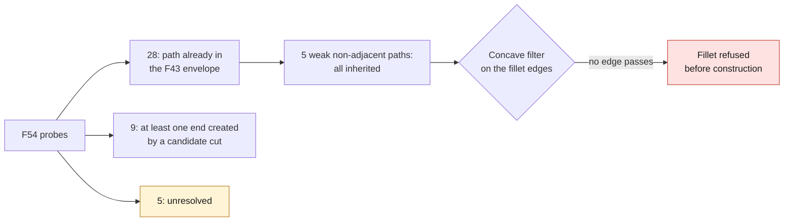

# Origin of the thin walls — scan 935 reference, September 7, 2026

## Result obtained

The native OCCT audit compares **the same rays** on the 4V F53 and on
the F43 envelope before the internal cuts. It does not compare two
different samplings. Inputs are checked by SHA-256; each F53 interval
is first reproduced with a tolerance of `1e-5` scan units. Inheritance
then requires both end points to match those of the envelope to within
`1e-4` and the segment to be classified inside the solid.

| Origin of the F54 probes | Count |
|---|---:|
| Path already present in the F43 envelope | 28 |
| At least one end point created by a cut of the candidate | 9 |
| Unresolved in the previous audit; still unresolved | 5 |

The **five weak paths between non-adjacent faces**, spread over four
B-Spline pairs, are all inherited from the envelope. They lie in
three transition bands between `core` and `fin` profiles, and not simply
between the two nominal planes of a fin. Changing the port diameters
would therefore not correct these four zones.

This does not show that the raw scan has these defects: F43 is already a
section-based reconstruction of the scan-derived stock, with earlier repairs.
The result identifies the stage at which the defect exists, not its physical
cause on an original Porsche cylinder head.

## Localization and correction attempt

`localize_wall_repair_patches.py` produces a private folder for the four
pairs: face indices tied to the exact STEP, intersection coordinates,
areas, boxes, neighborhood and proposed CAD operation. No index is
reused after a modification without redoing the matching.

A second program, `trial_local_transition_fillet.py`, examines the weakest pair
and the two edges that connect it to their common neighbor. The
principle is to add a fillet **only on a concave junction**, which
can locally thicken the wall on the air-passage side, without a global offset.
The trial is bounded to two CPUs, 4 GiB of address space and 300 seconds.

Over 36 directions around each edge, at two probing radii, the
inner fractions are 0.472/0.472 and 0.417/0.389 respectively. No
edge satisfies the concave filter. **The fillet operation is therefore refused
before construction**: no corrected STEP and no thickening claimed.
This discrete test is a precautionary filter, not an analytical proof of the
full concavity of the edges.

The next proposed operation is a local reconstruction of the transition
band: identify the scan anchor curves to keep and the adjustable
junctions on the air-passage side, then build the constrained patch
with `BRepFill_Filling`, replace/sew the faces and redo the integrity,
deviation, thickness and flow-section checks. This proposal
is not yet a verified operator. The curves allowed to move have not
yet been identified; no blind modification is made.

Keeping the two bounding surfaces exactly also keeps the length
of the measured path. Adding material already inside the solid cannot
increase that length. A correction will therefore have to move **a
local boundary**, keep the global master outline and measure that
displacement explicitly. Its effect on cooling remains to be computed.

## Image and traceability

`render_wall_origin.py` produces a view of the F53 STEP tessellation and a
section overlaying the two geometries. The candidate's 160,856 triangles are
displayed without decimation. The section is tessellated with a deflection of 0.15
scan units; the red segment of **0.753** comes from the exact OCCT
intersection, not from the figure. It is neither an Omniverse render nor a thermal field.

Private artifacts on Kali, under `/tmp/917-f50/out/`:

- `m64-wall-origin-20260907.json`: full point audit.
- `m64-wall-repair-patches-20260907.json`: local intervention package.
- `m64-local-transition-fillet-20260907/report.json`: rejection by the concave filter.
- `m64-wall-origin-render-20260907/935-reference-wall-origin-diagnostic.png`: image.

Digests:

- F53 STEP: `700baea66bc72cdb6aee529e21b167270ebde11db94b06f8e1e55ee08bdd9bf2`.
- F43 envelope: `00c26d32820b23b3589beb7b26d34bc3eb176a89000b9374ffdbe334278b41ef`.
- Origin audit: `b89fece8c3a5ee49d8ae6641054dc3cb17d7fddb47da1a99096b588c3c7bbec9`.
- Local package: `64f7efd3dc581644dfafec615617ec06963267871f4d5c925504418773ee5e57`.
- Image: `d63d4f86923d3b27449c421dd2f3d56ec86801e51acd87195fb0466605518fd3`.

Five classification unit tests pass. They test the inheritance decision,
the cuts, the ambiguous cases and invalid intervals; they
prove no mechanical performance. The programs compile in
Python and the audit/visualization actually ran with OCCT on Kali.
A second run of the audit finds the same 28/9/5 classifications
and the five inherited non-adjacent paths. The OCCT classifiers are
reused between probes to avoid reloading the solid for each test.

## Unchanged scope

This geometry is a **scan-derived 935 research reference**, not an
M64 cylinder head with validated interfaces. Absolute scale not certified, thickness
check not exhaustive, thermal/strength and full LPBF not validated.
No manufacturing, installation or start-up is authorized. No
scan, STEP, STL or private coordinates are added to the repository.
