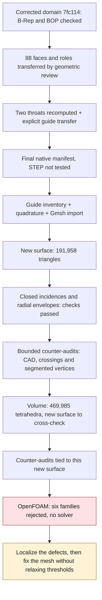

# M64 — remeshing the native domain with segmented continuity

## Current result

Follow-up: [localization of the rejections, HXT trial and targeted native merge](M64_LOCALISATION_ET_HXT_20260908.md).
This new correction does not retroactively change the results of the mesh
described here and does not constitute a physical validation.

The corrected gas domain **`7fc114c1…` now has a new volume mesh of 469,985
tetrahedra**, computed with Gmsh 4.15.2 in 42.018 s. Its eleven integrity
guards pass after read-back, but **OpenFOAM rejects its quality on six
families of checks**. Upstream, 1,343 elements have an SICN below 0.1, five
of them below 10⁻⁶. No CFD solver has been launched.

A first surface-only pass had produced 191,958 triangles, 95,979 nodes and
88 CAD faces in 8.365 s. The volume pass generated **another surface**, with
191,956 triangles. The counter-audits of the first surface are therefore not
transferred to the second.

The edge incidences form a closed surface: no open boundary, over-incident
edge, duplicate triangle or inconsistent orientation detected.
The check of the radial envelopes of the eight guide–stem portions passes.
**This does not yet prove the absence of all intersections or the complete
conformity of the triangles to the CAD.** The counter-audits of crossings, of
face 38 and of the segmented vertices/edges of the first surface are complete
within their bounded scope, described below.
The crossing, face 38 and segmented-vertex checks were repeated on the
surface of the volume pass. Conservation of its boundary before/after 3D is
independently confirmed. The review authorized only conversion and
`checkMesh`; it did not authorize a solver, and the quality result is now
rejected.

The [aggregate receipt](../../twins/m64-cylinder-head/evidence/segmented-native-remesh-20260908.json)
keeps the exact digests of the inputs, programs and results.
The geometries, coordinates and detailed reports remain private.

## A new package, not the results of the old domain

The [native correction](M64_CORRECTIONS_NATIVES_20260908.md) replaced an edge
carrying three tangent breaks with four segments that keep those breaks. It
neither smoothed the port nor redrew the cylinder head.
Package `7fc114c1…` contains one solid, 88 faces, 195 edges and 120 vertices.
Its exact B-Rep and the five BOP modes used pass.
The target remains a four-valve twin-turbo M64 cylinder head; **700 PS at the
crankshaft is an objective, not a result achieved or simulated here**.

The 88 faces are re-exported from this candidate. Their roles are transferred
through the independent matching of surfaces and contours, not by simply
reusing face numbers. The preparatory manifest keeps the missing local checks
at `null`; only the final manifest, tied to the new evidence, is admitted by
the native profile.

The two intake throats were **actually recomputed**: each has a valid local
solid, BOP with no defect detected, positive end sections, no overlap with the
other seat and geometric exclusion of the trunk. The original predicate is
satisfied for both; no C0 exception or threshold relaxation is used.

The communication of the annular guide extensions is evidence **explicitly
inherited** from their intersection with the original intake negative,
preserved by the equivalence of surfaces and contours. It is not a new
intersection computed on the final gas. The two `fixture_stem_seals`
closures remain idealized bench seals, with no qualification of leakage or of
a real seal.

The [earlier Netgen cross-check](M64_NETGEN_CONTRECONTROLE_20260908.md)
concerns `3f20f4c5…` only. Its six families of OpenFOAM rejections remain
rejected; none of its partial acceptances is attributed to the new candidate.

## Import and preliminary checks

The native Gmsh import, run separately before meshing, preserves the
120 vertices, 195 edges, 88 faces and one volume. The matching of the
88 face descriptors is bijective; the relative deviation of the global area
is about 1.11×10⁻¹⁵. No adjustment, change of scale or implicit repair
treatment is applied.

The volume check compares consistent integrations:

| Integration of the new domain | Volume in scan units³ |
| --- | ---: |
| OCCT adaptive | 995,964.587087459 |
| OCCT non-adaptive | 995,961.7063198228 |
| Observed Gmsh import | 995,961.706319823 |

The relative import tolerance remains **10⁻⁶**. The deviation between
integrators is kept in the receipts, not presented as a deformation of the
CAD. The old non-adaptive reference of `3f20f4c5…` is not reused.
These volumes are not certified mm³: the scan scale remains an unverified
assumption.

The independent native inventory examines the 88 faces and 33 cylindrical
surfaces. For the guide–stem sources concerned, it covers 14 fragments: eight
selected annular portions and six out-of-band stem portions, kept in the
inventory with explicit exclusion.
This receipt is not a mesh acceptance. The preflight verifies 90 input files
and recovers the eight portions through the actual Gmsh matching, before any
test of their triangles.

## Chain of evidence and next lock

The `--segmented-native-only` mode of the
[mesher](../../twins/m64-cylinder-head/source/flowbench-intake/mesh_gas_domain.py)
admits only the new verified package and inventory. It refuses the old C0
opinion and the old mesh receipts. The register does not contain the digest
of its own inventory: the evidence dependencies remain acyclic. The old path
and its guards are kept.

The pass uses `--face38-size 0.15 --guide-size 0.20 --stop-after-surface`.
These local sizes are numerical settings in scan units, not manufacturing
tolerances nor guarantees of effective size.
The program measures the envelopes of the triangles actually produced,
without turning a size setting into a conformity result.

## Counter-audits of the first surface

The three results below are tied exclusively to surface `53753e6c…`, not to
surface `006ffd46…` of the volume pass.

The crossing filter examines 992,211 candidate pairs and confirms no
through-crossing, in 26.447 s. Coplanar cases, shared-vertex cases and
contacts on boundaries are not classified by this method: this zero is **not
an exhaustive proof of non-intersection**.

On face 38, the 523 triangles are probed at their barycenter and at the
three edge midpoints; the 525 nodes are also examined. No zero area, negative
UV area or opposite normal is detected at the probes.
The maximum measured distance from the probes to the CAD face is
2.767×10⁻⁴ scan unit, and the triangulated area is 0.733% larger.
However, the minimum dot product of the normals is **0.01446**: a large
orientation deviation remains at some probes. The quality of this face must
therefore not be described as globally established.
Probing each triangle does not bound the error over its entire facet.
This check finishes in 2.876 s, with no change of geometry or threshold.

The break audit recovers the three new vertices and their two endpoints: five
distinct anchors, matched uniquely with a measured distance of zero. Four
chains of 12, 2, 2 and 2 segments exactly partition the 18 edges shared by
the two adjacent native faces, with no omission or double count. The order of
the native parameters is preserved. These faces are distinct from face 38
analyzed above.
This incidence check finishes in 0.990 s; it demonstrates neither the native
1D classification of the Gmsh elements nor the continuous fidelity of each
chord to the CAD curve. It is not a CFD validation.

## Volume obtained and OpenFOAM quality rejected

The new volume file `7774e94e…` contains a single connected tetrahedral
domain. No tetrahedron with negative or zero direct volume, no non-positive
Gmsh Jacobian, and no missing or extra boundary triangle is detected. The
connectivity, tags and element counts are preserved after MSH 2.2 read-back.

Its discretized volume shows a relative deviation of about **0.1012%** from
the adaptive integration of the CAD, within the pre-existing coarse 1% guard.
This discretization guard must not be confused with the CAD import tolerance
of 10⁻⁶. The minimum SICN after read-back is 2.5073×10⁻⁷: the five elements
below 10⁻⁶ remain on record. The eleven passed guards are integrity guards,
not a CFD acceptance.

The second surface, `006ffd46…`, has 191,956 triangles and 95,978 nodes. Its
new crossing check examines 992,198 candidate pairs and confirms no
through-crossing, with the same methodological exclusions. The repeated audit
of its 523 face-38 triangles finds the same numerical metrics as on the first
surface, notably the large deviation of the normals. These two new receipts
are tied to the exact file of the second pass. The audit of the segmented
vertices is also repeated on this surface and passes within its incidence
scope, with no additional proof of continuous chord fidelity.

The before/after-3D counter-audit confirms exactly **95,978 nodes and 191,956
oriented triangles, with their physical groups and face tags**. The
identifiers of 191,472 triangles were reassigned and 484 are kept: this
permutation is not a modification of the coordinates or of the geometric
connectivity. The bijection also compares the ASCII values, without rounding
the coordinates.
The review tied to volume `7774e94e…` authorizes only conversion and
`checkMesh`. It explicitly refuses any CFD solver authorization.

The OpenFOAM check of the same volume file is complete. The four commands
`gmshToFoam`, `transformPoints`, `createPatch` and `checkMesh` each return
code 0, but the log reports **six failed checks** and does not contain
`Mesh OK`. The supervisor therefore finishes with code 2; a zero command code
does not turn this rejection into a success.

| Rejected family | Count | Recorded detail |
| --- | ---: | --- |
| High aspect ratio cells | 130 | Maximum: 23,937.1304 |
| Highly skewed faces (*skewness*) | 73 | Maximum: 346.4805 |
| Small determinant cells | 4,579 | Determinant < 0.001 |
| Concave cells | 23 | Test by face planes |
| Low interpolation weight faces | 1,146 | Weight < 0.05 |
| Low volume ratio faces | 540 | Ratio < 0.01 |

The 238,212 faces with non-orthogonality above 70° are a separate warning:
the corresponding check remains marked `OK` in this log; it is not a seventh
rejected family. Five edges that are too small are also flagged. These
measurements do not constitute a demonstrated global improvement over the old
meshes.

The conversion applies the factor of 0.001 m per scan unit once, under an
uncertified assumption. The type change of the wall group does not modify its
geometry; the original inputs remain unchanged. No solver is run.

## Verification and limits

The three targeted suites pass: **37 tests, zero failures and zero skips**.
They verify in particular mixing of domains/digests, reuse of an old receipt,
missing guards and unjustified STEP assertions. The `make check` of this new
batch finishes with code 0: 2,315 cases in the main suite, 108 of them
skipped, in 177.282 s. The complementary targets also finish. The complete
log has the digest
`402e7a2df743be78765233354a5f0af2a058b3635db2b3f79fdd6e63fc8dd296`.
These software successes are not a physical validation.

The computation uses Kali; no new Vast rental or spending in this batch. The
generation and OpenFOAM check containers are terminated and their absence was
checked by the compute operator. No account balance is published.

The defects were then exported on an isolated copy of the case: ten VTK files
and ten native label sets, in 18 s. The six rejection lines remain identical
and the geometry files of the original and of the copy are unchanged. The VTK
files serve visual localization in `float` precision; the native labels, not
these views, are authoritative for identifying the cells and faces. No solver
is run.

The next action is to **relate these defects to the functional surfaces**,
then modify the local or volume mesh according to that analysis.
Each new artifact will have to keep its own boundary checks and pass the
OpenFOAM criteria again. This authorizes neither an arbitrary modification of
the part's envelope nor a relaxation of the thresholds.

**The volume exists; no CFD computation, thermal/mechanical validation or
LPBF qualification is established by this pass.**
STEP was not tested for this native candidate. Engine fit, interfaces and
manufacturing authorization remain not validated.
