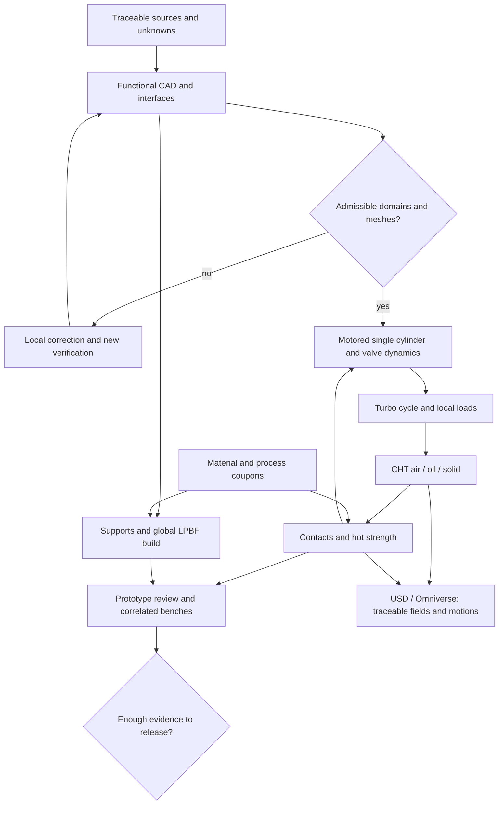

# M64 turbo: research, decisions and test preparation

Follow-up executed: [Qwen/Vast CAD proposal pilot and native checks](M64_CAD_AGENT_PILOT_20260912.md).

Next comparison executed: [cadrille and CAD-Recode on the same crop of the scan](M64_CAD_SPECIALISTS_20260912.md).
Both reconstructions produce a valid solid, but omit bores and deviate from
the scan; neither is integrated into the master model.

**Recommended decision:** continue the four-valve cylinder head with the Porsche envelope kept, compare forced air alone and targeted oil, then select geometry, material and process together. The preparation brings together four documented reviews, a tested dispatcher and a queue of 24 research missions. **No new CAD, engine simulation or print is produced by these document readers.** The Vast execution is recorded separately in the [research log](../research/M64_RESEARCH_VAST_RUN_20260912.md).

The newly expressed target is **700hp**. The repository keeps its historical reference **700 PS at the crankshaft = 514.849 kW**. The provisional interpretation as 700 mechanical hp gives **521.990 kW**, i.e. +1.387%. Both conventions are kept; this is not a power obtained. Maximum engine speed, fuel, exact variant, duration at full load and correction standard are not confirmed. The repository's 3.6 L / 6,500 rpm scenarios remain assumptions, not new measurements.

## Scientific dossier and scope

| Subject | Deliverable and immediate use |
|---|---|
| CAD, drafting, scan, LLMs and checkers | [Review of ten publications](../research/M64_CAD_LLM_REVIEW_20260912.md): editable local reconstruction, preservation of interfaces, dimension checks and cost of agents |
| CFD, thermal, operation and twins | [Review of ten publications](../research/M64_CFD_TWINS_REVIEW_20260912.md): moving cases, CHT, uncertainties, learned operators and limits of generalization |
| LPBF process, oil and durability | [Review of nine publications](../research/M64_LPBF_OIL_REVIEW_20260912.md): local melt pool, global distortion, galleries, cleanliness and deposits |
| Materials and heat transfer | [Materials complement](../research/M64_MATERIAL_REVIEW_20260912.md): three articles analyzed, one 2026 lead not accessible, datasheets and tests to obtain |
| Delegated work | [24 JSON missions](../research/m64-research-missions-20260912.json), executed in batches of at most four; [18 citation checks passed, six reports refused](../research/M64_RESEARCH_VAST_RUN_20260912.md) |

This is a **targeted review**, mainly 2023–2026, closed on September 12, 2026, complemented by the useful foundations and datasheets. It is not an exhaustive reading of all the world's articles. Each appendix distinguishes full text, sections, abstract, catalog record and preprint; published gains are not gains measured on the M64. The earlier publications already covered in the [Neural Concept review](M64_NEURAL_CONCEPT_20260912.md) are reused, not presented as a new discovery.

## What actually changes in the strategy

- **CAD:** try cadrille or CAD-Recode on a documented subzone, against a deterministic fit. A program's success and its visual resemblance guarantee neither dimensions nor tolerances. The LLM loop decides bounded operations; the CAD kernel measures and accepts or refuses.
- **CFD/AI:** DoMINO/GINO serve to select variants after relevant data have been acquired. A good integrated result can hide a significant local error: the temperatures at the bridges and contacts remain mandatory outputs. Capped cases, rejected meshes and out-of-domain results are not training truths.
- **Material:** keep CP1 for conduction, HT1 for hot strength, AlSi10Mg as the control; A20X remains a conditional alternative. Compare the real heat-treatment states and their hot curves, not only the room-temperature values of the brochures.
- **Manufacturing:** distinguish the local melt pool from the distortion of the whole part. Multiple lasers call for overlap/gas trials; they do not automatically qualify the part. Do not add ExaCA/ExaConstit without data to exploit their outputs.

These decisions are engineering recommendations drawn from the appendices, not a statement that all the software building blocks are already integrated.

## Air and oil: three variants, one envelope

The Porsche precedent does not demonstrate a mathematical impossibility of an air-cooled four-valve head. Swindon documents an air-cooled M64 kit; the turbo power and the LPBF process sought are not qualified by its mere existence. The Porsche 935/78 already used **water-cooled** four-valve cylinder heads on air-cooled cylinders, according to Porsche. The Singer DLS Turbo Road also has water-cooled cylinder heads. The precise claim of a Porsche failure in the 1960s is not retained without a matching primary source.[^1][^2][^3]

| Proposed variant | Intervention | Trade-off to compute |
|---|---|---|
| A — air | Reference fins and shrouds; controlled air distribution | Real fan flow, recirculation, bridge temperature, absorbed power |
| B — air + accessible oil | Pocket or jet aimed at the hot zones, cleaning access and drainable return | Flow available without penalizing lubrication, heat exchange, oil retention, sealing |
| C — air + LPBF galleries | A few short parallel branches, accessible manifolds, sections manufacturable depending on orientation | Residual wall, flow imbalance, roughness, pressure, depowdering and hot deposits |

Oil carries heat to a heat exchanger; it does not make it disappear. The three variants will be compared with **the same auxiliary power budget and the fan/pump curves actually available**, then under identical boundary conditions to isolate the effect of geometry. The external surfaces and interfaces remain locked; a change is admitted only with a quantified benefit and evidence of compatibility. No substitute oval contour.

The computation must include the exhaust and spark plug bridges, the seat/guide–body–fin paths, the thermal contacts and the heating of the air between cylinder heads. In the first batch, avoid microchannels and very tortuous internal networks: their accessibility and their hydraulic sensitivity must be demonstrated. A closed gallery without powder evacuation is refused.

### Elementary cross-computation, explicitly hypothetical

\[
\dot Q_{oil}=\dot m\int_{T_e}^{T_s}c_p(T)\,dT,
\qquad P_{pump}=\frac{\Delta p\,\dot V}{\eta}.
\]

With **illustrative assumptions**, 5 kW extracted per cylinder head, constant Cp of 2,000 J/(kg·K), oil temperature rise of 25 K and density of 850 kg/m³: 0.1 kg/s is needed, i.e. **7.06 L/min per cylinder head**, or **42.35 L/min for six**. At a total pressure loss of 2 bar and an efficiency of 0.6, the corresponding pump power would be **235 W**, excluding other consumers. These numbers are neither the computed M64 thermal need, nor the capacity of its pump, nor an installation instruction. They make visible the need to verify the full circuit and the heat exchanger before drawing galleries.

Likewise, 700 mechanical hp at 6,500 rpm would imply **766.9 N·m** and **26.77 bar of brake mean effective pressure** for a 3.6 L four-stroke. The latter is **not** the peak cylinder pressure. The [existing engine balances](M64_700CH_ENGINE_RESEARCH.md) and the [Cantera cycle](M64_700PS_VARIABLE_THERMO_20260908.md) remain the starting controls; no local load can be inferred from power alone.

## Operational plan with entry gates

| Batch | Work prepared | Outputs required before the next one |
|---|---|---|
| G0 — contract | Identify variant, frames, units; inventory of scan/photos/dimensions with uncertainties | Table of interfaces and unknown zones; no missing dimension invented; authority of the [M64 contract](../../twins/m64-cylinder-head/interface-contract.json) unchanged |
| G1 — CAD/drafting | Functional surfaces, chamber, four ports/seats/guides, spark plug, camshaft carrier, oil, fasteners and machining | Editable source + STEP, section, drawings with functional datums, bill of materials, deviations from the scan, thicknesses after machining, tool/powder/support access |
| V1 — valvetrain | Piston, four valves, springs, retainers, collets, actuation and contacts | Cold/hot clearances over 720°, accelerations/forces, maximum spring compression, bounce/float, seat/guide holding; an imposed lift alone is not enough |
| F1 — flow | Flow bench at defined lifts, then moving motored cycle | Flow/Cd, total pressure, flow structures, conservation under remeshing, valve closure, periodicity; compare 2V/4V under the same conditions |
| C1 — turbo cycle | Documented fuel and mechanism, intake/back pressure, ignition and scenarios | p(angle), work, residuals, heat release and fluxes; peak pressure and knock remain unestablished without a suitable model and correlation |
| H1 — heating | Conduction/CHT and variants A/B/C, hot air, cold/hot oil, transients and hot soak | Gas/solid/air/oil balances, local temperatures and gradients, flows/pressure, auxiliary power, film temperatures; sensitivity to contacts and roughness |
| S1 — strength | Hot material, stud preloads, insert interference fits, pressure and thermal fields | Force/moment equilibrium, deformation/sealing, plasticity, relaxation/creep, fatigue per data; maps of the critical points, not only p95 |
| P1/P2 — printing | Correct the coupon, then layer activation, supports, clamping, cooling, treatment, cutting and machining | No artificial limiter active on the domain declared valid; distortion, residual stresses, accessibility, cleaning and final thicknesses; identifiable machine recipe |
| E1 — physical tests | Coupons, gallery/seat sector, prototype and instrumented load ramp-up | Flow–pressure curves, CT/NDT depending on sensitivity, deformation, sealing, temperatures, cylinder pressure, teardown and professional review |

The seats, guides, valves, springs and fasteners are assembly parts with their own materials/processes; they do not automatically become elements printed in one piece with the body. The targeted power step remains conditional on the temperature, pressure, vibration, lubrication and leak limits defined before testing. A ramp on the bench must not progress simply because the engine is still running.

### Verification and cross-computations

Each case will receive an error budget before execution. For the first control cases, **proposed** targets, not release standards, are a conservation residual below 1% and a variation of the useful quantities below 5% under refinement. Three consistent space/time levels, observed order where relevant and cycle statistics will be kept. The historical F50 criteria are not transferred automatically to the M64 body.

The conduction cross-computation can be analytical then FEM; the independent cycle balance must check energy and work; the structural problem must have an analytical control or a second solver on an identical subproblem. Two solvers sharing a wrong load can agree. A model trained on the first solver is not an independent physical method. A symbolic proof of an equation does not prove that the real part meets the assumptions.

Omniverse will receive geometries, units, motion, temperatures and stresses **coming from the solvers**, with digests and frames. The labels will distinguish prescribed animation, numerical solution, learned model and physical data. A render or a USD material property is not a strength computation.

## Real starting point: do not repeat identical failures

The [q10/q20 batch of September 12](M64_QUADRATURE_EXECUTION_20260912.md) ran two coupons to 40 µs. The energy removed by the limiter still represents **9.8133% / 8.8675%** of the absorbed laser energy; both maximum temperatures are censored at 3,300 K. This pair therefore does not prove physical convergence. It is distinct from the September 8 coupon at 109.55 µs. Correct/calibrate source, properties and physical conditions; raising the cap alone is not a demonstrated correction.

The hybrid gas volume and its bridge to a tetrahedral optimizer remain refused. The CAD/mesh priority is the boundary zone and its blends, not another repeat of HXT or a displacement of points on an incompatible submesh. The solid, external air and oil domains cannot be inferred from this intake gas alone.

The [existing jobs 2–3–4](M64_JOBS_234_20260912.md) remain the preparation basis. Their package can be generated locally but does not admit the full jobs for execution. Older notes diverge between MOOSE/MALAMUTE and Adamantine: a **single common distortion control case** will decide the path retained after verifying functions and cost, without integrating two new full chains simultaneously.

## Delegation of research and budget

The pilot is finished: 105,307 tokens processed on Qwen/Vast, instance destroyed,
displayed credit decrease of 0.224 USD (final invoice not confirmed).
The [results and limits of the batch](../research/M64_RESEARCH_VAST_RUN_20260912.md)
constitute neither a physical validation nor a measurement of OpenAI savings.

The reference dossier is **GitHub**: `docs/research/`. The agents' raw reports remain private until citations, rights, sensitive information and contradictions are checked. No GitHub or OpenBao token is given to the Vast agents; publication happens from the authorized workstation. The [manifest](../research/m64-research-missions-20260912.json) is consumed by an [implemented and tested dispatcher](../../twins/m64-cylinder-head/source/run_research_readers.py). It executes independent reading missions on a supplied corpus, not autonomous browsers roaming the whole Web.

The initial credit reread through the OpenBao wrapper on September 12 is **38.2751 USD**, empty instance inventory. The campaign cap retained remains 38 USD, not 38 USD per agent. Proposed allocation, not a billing mechanism: **8 USD maximum for research**, **20 USD for the first CAE pilots**, **6 USD reserve**, **4 USD unallocated**; reduce these amounts if other tasks consume the account. An existing stricter limiter is not bypassed.

The Flash Next image by digest `6b3b1790dd3140c27a5b5f85181dccef06c8d96c02f3003bb3c9b267b8758e34` was reread in GHCR: `linux/amd64` variant present. Its documented profile requires two 96 GB Blackwell cards, at least 128 GB of RAM and 300 GB of disk, for about 189 GB of weights. This establishes neither its loading cost on a current offer nor the economic gain of 24 readers. A smaller public model can be compared for document extraction, without being presented as Flash Next nor as its validated equivalent.

**Research profile retained:** public Qwen3-Coder-30B-A3B-Instruct-FP8, on an L40S, with the vLLM image and the weights revision pinned. It avoids transferring an HF secret. The [bounded profile](../../deploy/vast/research/README.md) exposes `research-offers`, `launch-research` and `reconcile-research`; it does not modify the older profiles. The collector assembled 42 private sources, nine of them catalog records without technical text: the access level and the SHAs are kept. Neither the success of the offline tests nor the allocation of a machine establishes that the model answers; see the log for the state actually reached.

Flash Next is not presented as used: the wrapper does not yet expose its dedicated route and its launcher requires a token even with a cache. The [verified local HF access](../../deploy/openbao/HUGGINGFACE.md) does not establish a safe transfer to this remote workload. The old launch with a public API is not used.

Before any creation: narrow launch recipe, pinned image and weights revision, SSH pair and association verified, loopback/tunnel API, memory budget and storage/transfer cost, wall-clock cap and verified external destruction. First trial of **four missions**, then the remaining twenty only if the outputs are usable. A mission reports at most 800 words, with source, date, section, limits and application to the M64. The tokens actually consumed are measured; no OpenAI savings percentage is invented.

## Short sequence and definition of "done"

1. **Research prepared:** keep the reviews, the private corpus and the mission queue; use the LLM pilot only after its real checks; freeze the assumptions and references of the next small CAD correction.
2. **First bounded work batch:** four reader agents, one checked CAD subzone and one coupon diagnostic. Each attempt produces a traceable success or refusal; the number of attempts is limited, with no automatic paid rerun.
3. **After admission:** flow bench, motored cycle then combustion/CHT, contacts/strength and global LPBF build. The time is estimated after a pilot on the real case; no full computation duration is guaranteed before these measurements.
4. **Industrial closure:** editable dossier and drawings, printing/treatment/machining routing, qualified material/process, inspected parts and correlated physical tests with professional review. Computing resources alone do not replace these elements.

With the scan alone, the visible regions can be reconstructed and the unknowns bracketed for the studies. The invisible interfaces, the real holding, the internal cleanliness and the qualification of the batch cannot be certified by multiplying photos or agents. The current status remains **research and test preparation, engine manufacturing not authorized**.

## Manufacturer and historical sources

[^1]: Porsche, [Porsche Heritage Moments: the variants of the 935](https://newsroom.porsche.com/en/2026/history/porsche-heritage-moments-935-norbert-singer-timo-bernhard-42018.html), **March 30, 2026**, section 935/78. Historical manufacturer source consulted, not an M64 comparative test.
[^2]: Swindon Powertrain, [M64 24V Cylinder Head Kit](https://swindonpowertrain.com/wp-content/uploads/2025/10/M64-24V-Cylinder-Head-Kit-Product-Sheet-0923.pdf), manufacturer datasheet; scope and date detailed in the LPBF/oil review.
[^3]: Singer Vehicle Design, [DLS Turbo Services — Road](https://singervehicledesign.com/singer-in-the-world/featured-restoration-3/), Engine section, consulted on September 12, 2026. 710 HP SAE net announced with water-cooled cylinder heads; does not validate our air/oil architecture.
