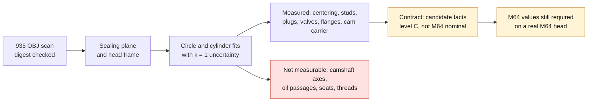

# M64 — interfaces measured on the 935 cylinder-head scan (level C)

September 14, 2026. Source: Wolfe Classics OBJ scan of a **935 billet cylinder head**
([record](../../catalog/sources/src-wolfe-classics-935-billet-cylinder-head-scan.json)),
SHA-256 `4623d5d3b73fe3d03ca988a47543a8dd1be7834d3040e6f7efd1e1e95c766486`, verified
before reading. This is **not** an M64. All values have the status
`measured_on_935_scan_evidence_C` and enter the
[contract](../../twins/m64-cylinder-head/interface-contract.json) as candidate
facts, never as nominal M64 values.

The raw scan and all geometric derivatives (meshes, sections, renders) stay
local, outside Git, in accordance with the owner's instruction. The repository
contains only numbers, methods and scripts:

- [`measure_interfaces.py`](../../twins/m64-cylinder-head/source/scan935/measure_interfaces.py) (scan path as argument);
- [`fit_primitives.py`](../../twins/m64-cylinder-head/source/scan935/fit_primitives.py) (plane, circle, cylinder; numpy only);
- [JSON results](../../twins/m64-cylinder-head/evidence/scan935-interfaces-20260914.json);
- [synthetic tests](../../tests/test_m64_scan935_fit_primitives.py).

## Method

1. Read the OBJ, check the digest, vertex normals. Provisional A/B/C frame
   taken from `twins/reference-935-cylinder-head/source/scan_frame.py`.
2. Sealing plane: RANSAC (threshold 0.15; hypotheses within 5° of C), then
   least squares on the inliers of the flat outer ring.
3. **Head frame**: z = normal of the sealing plane, oriented toward the
   cylinder (head material at z < 0); origin = axis of the centering circle
   on that plane; x = A projected; y = z × x.
4. Circles: RANSAC then geometric Gauss-Newton. Cylinders: RANSAC on
   subsamples, then Gauss-Newton (axis, point, radius) on the vertices whose
   normal is perpendicular to the axis. An unknown axis is initialized with the
   smallest eigen-direction of the local normals.
5. Uncertainty k = 1: √(bootstrap σ² + (sensitivity range / 2)²). The
   sensitivity is evaluated over 3 windows, thresholds or balls. It **excludes**
   the OBJ scale and the scanner's own error.

The region seeds (where to search) are written in the JSON. They come
from a section-based exploration, kept only locally.

## Scale

| Check | Scan (u) | Documented reference | Ratio |
|---|---:|---|---:|
| Inner edge of the counterbore bottom | 94.28 ± 0.09 | bore 95 (bottom of the Swindon range 95–102.7) | 0.992 |
| Same edge | 94.28 | M64 bore 100 (P3) | 0.943 |
| Chamber lip | 91.19 ± 0.21 | 95 | 0.960 |
| Ø13 bore at the bottom of the valve pockets | 13.15 / 13.09 (± 0.4 / 0.2) | 993 2V guide bore 13.000–13.018 (WM993 p.154) | ≈ 1.01 |

**Conclusion: the OBJ units are consistent with millimeters, to within a few
percent.** They remain **uncalibrated**: no known physical dimension
of this part makes it possible to fix the factor. The cross-checks rely on
other engines (M64, 993 2V, Swindon range). The repository contains no
930/935 bore source; the value of 95 comes only from the Swindon range.
The Ø94.3 is therefore compatible with a bore of about 95, and less so with 100.
This agrees with a 935 cylinder head, not an M64.

## Measurement table (OBJ units ≈ mm)

| Interface | Quantity | Value | u (k=1) | Quality / region |
|---|---|---:|---:|---|
| Sealing plane | apparent flatness RMS / p95 / peak-to-valley | 0.047 / 0.105 / 0.30 | normal ± 0.19° | 25,120 inliers (85 %), ring r 58.5–75; offset between 4 sectors ≤ 0.005 |
| Cylinder centering | Ø of centering wall | 113.42 | 0.02 | 3,066 pts, 360° coverage, p95 0.13 |
| | depth (plane → counterbore bottom) | 2.21 | 0.02 | bottom parallel to within 0.04°; 11,288 pts |
| | Ø inner edge of the bottom | 94.28 | 0.09 | 1,097 pts, p95 0.19 |
| | Ø chamber lip (z −2.7 to −5) | 91.19 | 0.21 | inliers 24 %: band mixed with the fillet |
| | tilt of the centering axis | 5.9° | unreliable | wall 1.2 u high, angle unconstrained; **do not use** |
| Cylinder-head studs | count | 4 | — | closed holes; no others in the footprint |
| | positions (x, y) at the plane | (−43.38; 42.87) (43.16; 42.99) (43.20; −42.77) (−42.87; −42.84) | 0.06–0.08 | cylinders of 1,800 to 2,200 pts, p95 ≤ 0.23 |
| | spacing sides / diagonals | 85.71 · 85.75 · 86.07 · 86.54 / 121.52 · 121.78 | 0.1 | pattern centroid 0.07 from the centering axis |
| | hole Ø | 10.47 · 10.56 · 10.71 · 10.88 | ≤ 0.02 | axes 0.5–1.3° from the normal |
| Spark plugs (twin ignition) | count | 2 | — | symmetric in x (±20.3 at the plane) |
| | apparent smooth bore Ø | 11.23 · 11.37 | 0.07 · 0.01 | thread not resolved |
| | axis angle / sealing plane | 61.7 · 60.3° | 3.7 · 0.1° | plug 1 is sensitive to the ball size |
| Valves | number of axes | 2 (2-valve head) | — | upper B side = 1, lower B side = 2 |
| | angle to the normal | 26.6 · 29.2° | 1.0 · 1.4° | bore axis compared with the line through the centers of 21–22 circles |
| | included angle | 55.7° | 1.4° | |
| | axis spacing at the plane | 33.0 | 1.0 | extrapolation of about 85 u |
| | Ø tappet / spring bore | 39.26 · 39.15 | 0.14 · 0.03 | 5,800–7,100 pts, p95 0.24 |
| | apparent throat Ø (z −25 to −5) | 45.8 · 38.8 (plateau 45.7 · 38.3) | 1.0 · 2.1 | median of 10–11 slices; the uncertainty includes the exit chamfer |
| | Ø13 at the bottom of the pocket | 13.15 · 13.09 | 0.4 · 0.2 | 2 to 4 slices; guide or boss, undecided |
| Lower B flange (Ø40) | plane | normal at 89.47° from z | 0.2° | 15,590 pts, RMS 0.057 |
| | port Ø 6 u below the face | 39.99 | 0.5 | 360° coverage |
| | fasteners | 4 (2 studs Ø7.04/7.68 and 2 holes Ø7.06/6.92) | Ø ± 0.01 | square 46.2–46.9; diagonals 65.8 / 66.1 (± 0.3) |
| Upper B flange | plane | normal at 89.35° from z | 0.2° | 12,026 pts, RMS 0.049 |
| | fasteners | 2 studs Ø6.34 / 6.75 visible | — | spacing 66.13 ± 0.3; the other two positions do not appear |
| | port outline | **not measurable** | — | non-circular or open outline |
| Cam carrier | seating face: height above the sealing plane | 86.46 | 0.1 | parallelism 0.59°; 25,848 pts, RMS 0.042 |
| | closed fastening holes | 7 (Ø7.0 to 8.3) | 0.3 | non-exhaustive list, positions in the JSON |

The intake or exhaust side is not assigned: the scan does not indicate it.
Side 1 carries the larger throat (≈ 45.7) and side 2 the square flange with 4
fasteners and a Ø40 port.

## Not measurable on this scan

- **Camshaft axes**: the cylinder head carries no bearing. The camshafts
  are in a separate housing, absent from the scan. Only the seating face and its
  holes are measured.
- **Oil passages** (supply and return): no passage identifiable
  without ambiguity; open internal surfaces, no section or tomography.
- **Seats**: seating face, angle, width and insert pocket cannot be separated
  on an open surface, without a valve.
- **Threads** (spark plug, studs): not resolved. The diameters are apparent
  smooth bores.
- **Gasket**: the documented gasket groove is on the cylinder side (T1), hence outside
  this part.
- **Metrological flatness**: the p95 value of 0.105 includes scan noise.

## Comparison with M64 references and deviations

| Quantity | 935 scan | Reference | Deviation / reading |
|---|---:|---|---|
| Bore (counterbore edge) | 94.3 | M64 100 (P3); Swindon 95–102.7 | −5.7 % relative to 100: not transferable to an M64 |
| Centering | 113.4 | no M64 dimension | the 145 surface (T1) is a repair dimension, not a centering |
| Studs | 4, 86 square | M64: designations BM 8×20 / 8×50 (P1), without coordinates | holes Ø10.5–10.9; pattern not comparable for lack of a reference |
| Valves | 2 per cylinder, throat Ø 45.7 / 38.3 | Swindon 4V: 40 / 33; 993 2V: heads 49 / 42.5 | 2-valve architecture, like the production 993; neither M64 axes nor angles documented |
| Ø13 pocket | 13.1 | 993 guide bore: 13.000–13.018 | consistent to about 1 %, to be confirmed (feature not identified) |
| Spark plug | 2 per cylinder, Ø11.2–11.4, about 61° to the plane | M64: M14 × 1.25 (M1), one plug | smooth Ø below the M14 minor diameter (≈ 12.6): actual tapping not determined |

## Still to be measured on a real M64 cylinder head

The measurements in the table of the [G0 report](M64_G0_INTERFACE_CONTRACT_20260914.md)
remain fully required (CMM, 20 °C, A/B/C datum system). The 935 scan
only makes it possible to prepare the inspection plan:

1. Ø and depth of the centering, axis relative to plane A (the scan gives an
   order of magnitude of 113 × 2.2 for a 935).
2. Stud positions and diameters, and spacing between cylinders (the scan
   covers only one cylinder).
3. Valve axes, angles and spacing; seat and guide pockets
   (interference fits).
4. Axis, angle and depth of the M14 × 1.25 spark plug.
5. Flange planes, stud pattern and port outlines at the face.
6. Cam-carrier seating plane, M8 holes and bearing axis (on the housing).
7. Oil passages (borescope or tomography).

Reproduction: `python twins/m64-cylinder-head/source/scan935/measure_interfaces.py
<local scan path> --output <json>` (Python 3.12.3, numpy 2.2.6;
RANSAC seed 935).
