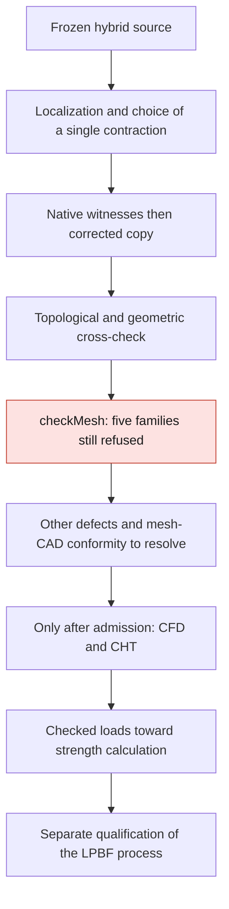

# M64 — controlled correction of a very small edge in the gas mesh

A local contraction is **run and cross-checked** on a copy of the latest
hybrid domain. The worst aspect ratio drops from 54,610 to 15,882. The domain
nevertheless remains refused on five quality families:
**no CFD, thermal, mechanical or manufacturing admission**.

This is a discretization correction, not a new cylinder head shape or an
efficiency gain. The master CAD is not modified. This mesh candidate remains
distinct from the previous reference as long as its conformity to the CAD and
the remaining defects are not resolved.

## Computation actually run

Base: the result of the [57 merged groups](M64_HYBRID_PAIR_CORRECTION_20260909.md#supplement--57-groups-of-threefour-tetrahedra),
private report `865b2e82…`. Among the 23 edges incident to the five points
flagged by OpenFOAM, two are below the numerical displacement budget `1e-7` in
the mesh frame. The four possible directions pass the initial local check;
they overlap and **are not applied as a batch**.

A single discretization point is contracted to an existing vertex:
`1177 → 65`, OpenFOAM identifiers of this source only. Loaded distance:
`2.4139292929076296e-8` mesh unit. The earlier scaling
`0.001 m/scan unit` remains an uncertified hypothesis; no second scaling is
applied.

The junction concerns a seat cylinder and a spline surface of the port, not a
presumed straight line or plane. The numerical budget is neither a
manufacturer tolerance nor an acquired CAD precision: `1e-7` mesh unit would
correspond to `1e-4` scan unit, i.e. twenty times the recorded native curve
tolerance of `5e-6`. Even a better mesh does not lift this reservation.

The [C++ program](../../twins/m64-cylinder-head/source/flowbench-intake/contract_edge/contractTetEdge.C)
explicitly rebuilds the faces of the surviving neighbors with
`polyTopoChange`. Merely triggering `allowCellCollapse` in
[Foundation 14's edgeCollapser](https://github.com/OpenFOAM/OpenFOAM-14/blob/7b05503f98a85be88af930df48623b4d152bfc35/src/polyTopoChange/polyTopoChange/edgeCollapser.C)
is not enough to stitch back the triangles that became coincident.

Existing Kali, linux/amd64 image `a233511b…`, OpenFOAM Foundation 14
`7b05503f98a8`: **17.908 s, cleanup included**. Ceiling 4 CPUs, 4 GiB,
270 s active/300 s total; network disabled, source mounted read-only.
Inputs unchanged, exit 0, no OOM or timeout; container deleted and absence
checked separately. **No new Vast rental for this pilot.**

## Native results

`checkMesh -allTopology -allGeometry -writeSets` is run on the real saved
file, at precision 17. Its process exit 0 is not acceptance: the log ends
with `Failed 5 mesh checks.`.

| Check | Before | After |
|---|---:|---:|
| Cells | 785,474 | 785,472 |
| Points | 223,155 | 223,154 |
| Faces | 1,688,427 | 1,688,422 |
| Cells with high aspect ratio | 10 | 9 |
| Maximum aspect ratio | 54,610.283 | 15,881.968 |
| Cells with low determinant | 1,963 | 1,961 |
| Faces with low interpolation weight | 1,230 | 1,229 |
| Faces with low volume ratio | 137 | 135 |
| Non-orthogonal faces > 70° — warning | 3,448 | 3,447 |
| Faces too skewed | 18 | 18 |
| Points on very small edges — not an edge count | 5 | 4 |

The 67,200 hexahedra, 384 pyramids and 309 polyhedra are not transformed.
The 717,581 tetrahedra become 717,579. One connected region and the three
patches `walls`, `receiver_outlet`, `inlet` are found.

Comparing the nine sets after identifier mapping finds **no new defective
entity**. It distinguishes deletions from real reclassifications: one image of
a low-volume-ratio face and one non-orthogonal image leave their sets. The
change from five to four points on small edges is a point alias, not the
disappearance of the defect on the four remaining points.

## Cross-check and limits

The separate auditor re-reads both meshes and reproduces the six mapping
tables, without taking the C++ program's statements as proof. It finds two
removed tetrahedra, three removed degenerate faces and two re-stitched face
pairs. The five surviving local tetrahedra are strictly positive in rational
arithmetic on the loaded numbers. All retained coordinates remain
bit-for-bit identical.

The boundary **is not declared identical**: its piecewise affine map is
checked, including the triangles flattened into segments actually present in
the candidate boundary. The bidirectional distance bound between these two
discrete boundaries is `1e-7` mesh unit. This is not a bound between the mesh
and the CAD.

The local volume delta is non-zero and matches exactly the oriented volume
delta of the affected boundary; the rational values are kept in the receipt.
No global absence of geometric intersections or continuous conformity to the
CAD is established by this operation.

The [public invariant tests](../../twins/m64-cylinder-head/source/flowbench-intake/test_contract_edge_invariants.py)
pass. Before the real case, four witnesses are run with the compiled binary:
a contraction from three to two tetrahedra with exactly preserved volume, then
three refusals without writing (excessive distance, nonexistent point, pair
that is not an edge). The pure suite also includes the cleanup and cross-check
tests. The digests and results are linked in the
[evidence register](../../twins/m64-cylinder-head/evidence/geometry-checkpoint-20260908.json),
key `gas_short_edge_contraction`.

Verification summary: **53 targeted pure tests passed**, four native witnesses
passed and a full `make check`, exit 0. Some optional native tests of the
repository are skipped for lack of their runtimes; they are not counted as
passed. The OpenFOAM pilot described here, however, was actually run.

Reproducing the program in the initialized Foundation 14 environment:

```sh
cd twins/m64-cylinder-head/source/flowbench-intake/contract_edge
wmake
m64ContractTetEdge -case /chemin/vers/copie-independante 1177 65 1e-7
checkMesh -case /chemin/vers/copie-independante -allTopology -allGeometry -writeSets
```

The identifiers above apply only to the source pinned in the register. The
utility overwrites **the copy** by default and writes six tables in
`contractionMaps`. Do not run it on the master, on a case with solver fields
to keep, or on another mesh generation. The private geometries are not
published; the public pure tests are run from the parent folder with
`python3 -B -m unittest -v test_contract_edge_invariants`.

## Next steps and place of the photographed stack



OpenFOAM, Elmer, PhysicsNeMo and Ditto/MQTT keep the distinct roles of the
[multiphysics plan](M64_MULTIPHYSICS_EXECUTION.md#clarification-of-september-9-computation-ai-and-bench-kept-separate).
The new photo brings no bench measurement or qualified physical model. No
telemetry service, new AI training or thermomechanical computation is
presented as run in this pilot.
