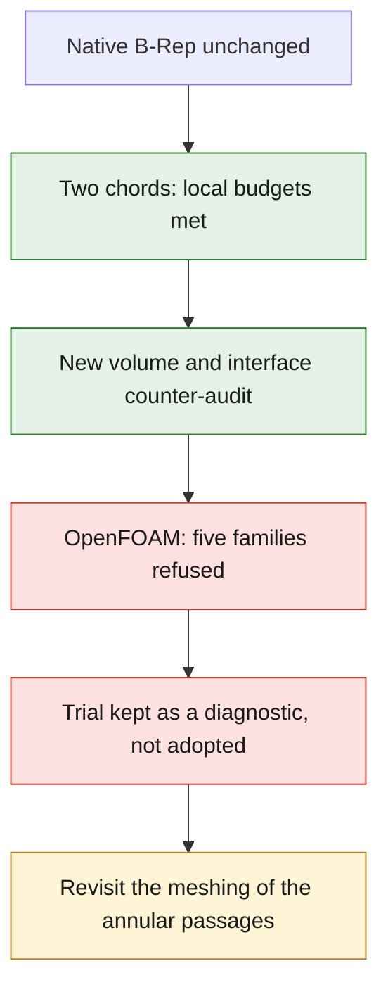

# M64 — one-chord remesh of the two short edges

**Trial actually run, not adopted: five OpenFOAM quality families are still
refused.** The CAD is unchanged and no CFD solver is launched. The new mesh
has 401,854 tetrahedra; reducing the two short edges to one chord does not
solve the mesh's global problem.

This follow-up to the [approximation bounds](M64_NATIVE_EDGE_APPROXIMATION_20260908.md)
concerns the gas domain of the intake bench, not a complete metal cylinder
head. Reference derived from the 935 scan; M64 scale and interfaces not
certified. The [evidence capsule](../../twins/m64-cylinder-head/evidence/native-short-edge-trial-20260908.json)
identifies sources, new meshes, counter-audits and private logs.

## A bounded numerical change, not a new shape

The B-Rep `fab1338a…` and its 86 faces remain bit-identical. On the two
native edges 98/99 only, the trial imposes two nodes with
[`setTransfiniteCurve`](https://gmsh.info/doc/texinfo/gmsh.html#index-gmsh_002fmodel_002fmesh_002fsetTransfiniteCurve).
The endpoints/C0 are neither moved nor merged; no passage is closed. Entities
are matched on their endpoints, adjacent faces and native supports, not on an
assumed equality of their numbers.

**New budgets, declared before this trial**: local Hausdorff ≤ `2e−5` scan
unit; replaced ribbon / seat face area ≤ `1e−6`; additional radial sag / seat
radius ≤ `1e−8`. These are neither manufacturing tolerances nor a
reinterpretation of the native tolerance `5e−6`. The guide–stem clearance
criterion remains separately fixed at `0.0075`.

The bounds on the chords actually produced are `1.5249863943e−5` and
`8.825649684e−6` unit, rounded outward. The total ribbon is bounded by
`4.12468119e−9` unit². The native tangents are not exactly represented by
these segments. No flow-rate error bound follows from this.

Surface Frontal-Delaunay 6, volume Delaunay 1 and guide size 0.20 are
unchanged. The direct comparison is with the 401,961-tetrahedron reference,
**not** with the four MeshAdapt faces of the previous trial. Eleven unit tests
pass, including refusal of ambiguous matching, of a truncated list and of
misclassification. They do not replace the native run.

## Checks actually obtained

The Gmsh 4.15.2 mesher finishes in 35.885 s: one region, 186,364 boundary
triangles, zero negative or null Jacobians; the eleven internal checks pass.
The minimum SICN read back is `1.0457070e−5`, with 515 tetrahedra below 0.1
versus 491 in the reference. This SICN threshold is diagnostic only.

The counter-audit recovers the **8 chains, 9 anchors and 32 segments** of the
new mesh. The pre/post-3D surfaces and the oriented boundary of the
tetrahedra coincide. The roles of the 86 faces and the three boundary groups
are re-verified. The eight guide–stem fragments pass the whole-facet check;
minimum conservative radial margin `0.00955030653` unit. This proves neither
the global absence of self-intersections nor continuous conformity of all the
seat/port facets.

The OpenFOAM conversion restarts from a fresh case: conversion, single
application of the `0.001 m/unit` assumption, patches and
`checkMesh -allTopology -allGeometry`. Native exit code 0 is not a success:
the log says `Failed 5 mesh checks`, and the supervisor correctly returns 2.
No OpenFOAM threshold is modified.

| Native defect | Tetrahedral reference | One chord 98/99 |
|---|---:|---:|
| High aspect ratio | 3 | 1 |
| Excessive skewness | 10 | 11 |
| Low determinant | 5,442 | 5,733 |
| Low interpolation weight | 519 | 535 |
| Low volume ratio | 149 | 141 |
| Non-orthogonal faces > 70° | 262,008 | 259,035 |

Maximum skewness reaches 20.5224; maximum aspect ratio 1,162.74.
The counts do not prove that the faulty cells are the same between meshes.
**Decision: trial not adopted**; references and earlier trials are kept.
The partial improvement does not justify launching the CFD. The next method
will have to address the junction and the resolution of the annular passages,
with a fresh check of their boundaries; a raw polyhedral conversion does not
constitute a demonstrated correction.

## Resources and limits

Kali x86: four CPUs, 4 GiB, container network cut off and read-only roots.
Meshing: 37 s supervised wall time, limit 300 s; OpenFOAM check: 9 s. Both
containers are removed, absence verified. No new Vast rental in this batch.
Authorized budget: 44 USD maximum, no top-up; this ceiling is not a
measurement of the remaining balance.
Neither strength, nor heat dissipation, nor printing, nor 700 PS is validated
by this mesh diagnostic.

The documentation checkpoint passes `make check`: 2,431 tests in the main
suite, 108 of them skipped, in 178.292 s; the other Makefile targets also
finish with exit code 0. This software check does not replace the native
OpenFOAM criteria refused above.
