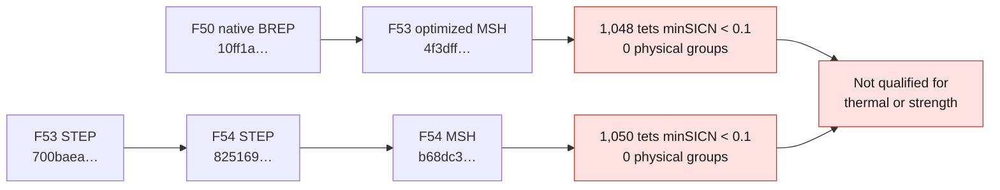

# Audit of the available solid volumes — September 7, 2026

## Verdict

Two tetrahedral volumes of the actual reference geometry exist, but
**neither is qualified to validate the thermal behavior or the strength of the
cylinder head**. No volume found among the F53/F54 candidates inspected comes
directly from the exact F53 STEP `700baea…`. A volume mesh is therefore not
missing in the computing sense; it is its quality, its demonstrated link to
the selected CAD and its physical boundaries that remain insufficient.

These are not the old computations on a disk or on a thermal tutorial.
The files audited are the private meshes of the 4V reconstruction, with
their thousands of surfaces. Their lineage from the scan certifies neither the
M64 interfaces nor the absolute scale.

## Checks actually run on Kali

The tool [audit_solid_mesh.py](../../twins/m64-cylinder-head/audit_solid_mesh.py) reads
only the MSH addressed by SHA-256, under Gmsh **4.12.1**. It recomputes the
signed volumes with `det(b-a, c-a, d-a)/6`, checks the connectivity of the tetrahedra's
boundary against all the stored surface triangles, looks for faces
shared by more than two tetrahedra and inventories the physical groups.
The MSH digests are re-verified after the audit.

Execution per candidate: container without network, limit 2 CPUs / 4 GiB, maximum
timeout 300 seconds, geometry mounted read-only. No remeshing,
CAD change, physics solver or Vast spending. Both audits ended
with the **expected code 2: failure of the project quality threshold**.

| Check | F53 optimized | F54 merge of coplanar/co-surface faces |
|---|---:|---:|
| Linear tetrahedra | 1,906,364 | 1,894,579 |
| Nodes | 369,536 | 367,329 |
| Volume entities | 1 | 1 |
| Surface entities | 4,929 | 4,454 |
| Inverted / zero-volume tetrahedra | 0 / 0 | 0 / 0 |
| Minimum minSICN | 0.00002480245 | 0.00000181255 |
| Tetrahedra with minSICN < 0.1 | **1,048** | **1,050** |
| Boundary triangles = stored triangles | 253,078 = 253,078 | 252,416 = 252,416 |
| Missing / extra / duplicate triangles | 0 / 0 / 0 | 0 / 0 / 0 |
| Non-manifold internal faces detected | 0 | 0 |
| Surface / volume physical groups | **0 / 0** | **0 / 0** |

`minSICN` is the signed inverse condition number quality described by
[Gmsh](https://gmsh.info/doc/texinfo/gmsh.html#index-gmsh_002fmodel_002fmesh_002fgetElementQualities).
The **0.1 threshold is the project's existing threshold**, not a general standard nor a
proof of convergence. The absence of inversion does not neutralize very bad
elements. The exact agreement of triangles concerns the **discrete connectivity**,
not the distance to the CAD surface, the absence of geometric overlap of the
cells or the resolution of physical gradients.

Redacted reports:
[F53](../../twins/m64-cylinder-head/evidence/f53-solid-mesh-audit-20260907.json),
[F54](../../twins/m64-cylinder-head/evidence/f54-solid-mesh-audit-20260907.json).
No mesh, node or coordinate is published.

## Lineage: do not confuse the F53 number with the F53 STEP

The file digests and their build reports were re-read
on Kali. The observed chain is:

| Candidate | Geometry actually passed to the mesher | Evidence chain |
|---|---|---|
| F53 optimized `4f3dff…` | F50 native BREP `10ff1a…` | BREP → F50 MSH `d1e8dc…` → F53 interior optimization; its report states the boundary nodes unchanged at each step |
| F54 `b68dc3…` | F54 STEP `825169…` | F53 STEP `700baea…` → merge of the same domains, 4,929 → 4,454 faces → F54 MSH |

The old field `native_BREP_sha256` in the F54 mesh report actually carries
the digest of the F54 **STEP**, as the source file confirms. Its format must not
be inferred from the name of this field. The old parameters suffixed `_mm`
remain conventions of the candidate, not a metrological certification.

The F53 p-curve reconstruction nearly preserves the integrals and the 3D
footprint; the F54 merge does too. These small differences, however, constitute
neither file identity, nor a verified correspondence of face numbers, nor
local proof that the mesh conforms to the selected STEP.

An additional volume check on the exact STEP, with
`BRepGProp.VolumeProperties_s` / OCP 7.9.3.1 without relying on triangulation,
gives **1,246,030.353585284 scan units³**. The sums of the tetrahedra
volumes are respectively **1,246,526.705216762** and
**1,246,539.5537188756**, i.e. **+0.039835 %** and **+0.040866 %**. These aggregates
define no acceptance threshold and do not detect all local differences.
The integration method is documented by
[Open CASCADE](https://occt3d.com/dev/doc/refman/html/class_b_rep_g_prop.html).

The full digests and those of the private reports are kept in
[the provenance record](../../twins/m64-cylinder-head/evidence/solid-mesh-provenance-20260907.json).

## Boundaries and the next truly usable mesh

The **4,929 Gmsh entities of F53 are not proof** of correspondence with
the 4,929 OCCT faces of the exact STEP. No verified association is present
in the MSH and no physical group in it names the chamber, ports, contacts or
cooling. The face provenance proposals established in
[the thermal audit](M64_THERMAL_FACE_PROPOSALS.md) are neither validated BCs nor
labels transferable by simple entity number.

The best **diagnostic** candidate is F53 optimized: a less bad quality minimum,
fewer elements below the threshold and no additional face merge.
It is not promoted to an accepted computation mesh.

The next mesh production step must therefore:

1. Freeze the digest of the selected corrected CAD and resolve the ambiguities of
   the contacts/boundaries. If the blends change, invalidate the old
   correspondences; do not silently recycle the F53 groups.
2. Mesh this exact solid, with an explicit CAD → meshed surfaces
   correspondence, then keep distinct physical groups. Re-check
   the local differences to the CAD, the thin zones and the discrete closure.
3. Pass the quality checks and the convergence studies before
   using the loads and the hot material properties. The scale, the
   M64 interfaces and the operating conditions remain inputs to be
   justified, not corrections that the mesh can invent.

Unit tests: **12 passed** (analytic tetrahedron, inversion, degeneracy,
invalid connectivity, complete/incomplete/duplicate/non-manifold boundary,
internal face, non-finite quality and positivity/quality-threshold distinction).
This audit runs no CHT, no stresses, no fatigue and no LPBF qualification.
