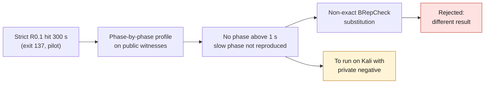

# M64 — strict check profile and volume reconciliation (09/14/2026)

Follow-up of the [CAD agent pilot](M64_CAD_AGENT_PILOT_20260912.md): R0.1 in
`strict-approximation-v1` hit the 300 s limit (exit 137) after the BRep was
written, while `default` passed in ~5.5 s.



## Short conclusion

**The slow phase is not reproduced without the private geometry.** On the
public witnesses, no phase of the check exceeds 1 s of computation. No faster
option is proposed. The only candidate substitution (non-exact BRepCheck) is
**rejected**: it does not return the same result.
Nothing is promoted. The master contour and `build_local_port_junction_fillet.py`
are unchanged.

## Machine and limits

Measurements on a **local WSL2 machine**: i7-1260P, 16 logical cores, 15 GiB,
OCP 7.9.3.1, Python 3.14.7 via `uv`. **This is not Kali**: no SSH, no
2 CPU / 4 GiB container. The times are not comparable to those of the pilot.
The private intake negative and the scan were unavailable.

## Tool

`twins/m64-cylinder-head/source/profile_strict_check.py` replays one by one
the phases that follow construction in `run()`. Each phase runs in a separate
subprocess, with an external timeout and `RLIMIT_CPU`, with no proxy in the
environment. Each subprocess re-reads the shape: `read_seconds` is measured
separately from `phase_seconds`. The output is JSON.

Phases: `read`, `brepcheck_exact` (identical to `CAD.valid`),
`brepcheck_default`, `tolerances` (BRep_Tool + ShapeAnalysis),
`bop_full` (identical to `ports.bop_check`), `bop_only_<option>` for each of
the 5 options, `bop_none`, `write_reread`, `bbox_optimal`,
`volume_adaptive_1e-11` (identical to `adaptive_volume`), `volume_adaptive_1e-9`
and `volume_gauss_default`.

An exceeded timeout or a missing phase gives `incomplete`, never `pass`.
The tangency sampling is not replayed: it requires the `maker.Generated`
history, absent from a re-read BRep.

To run on Kali with the private negative and strict candidate:

```sh
python3 twins/m64-cylinder-head/source/profile_strict_check.py \
  --shape source=/prive/negatif.brep \
  --shape strict=/prive/intake-junction-prototype.brep \
  --timeout 300 --scratch /prive/scratch --output /prive/profil.json
```

## Measurements (phase computation time, excluding re-read)

| Witness | Exact BRepCheck | Full BOP | of which SelfInter | Volume 1e-11 | Re-read + volume |
|---|---:|---:|---:|---:|---:|
| Analytic R0.1 default | 0.002 s | 0.006 s | 0.004 s | 0.007 s | 0.006 s |
| Analytic R0.1 strict | 0.002 s | 0.004 s | 0.004 s | 0.005 s | 0.006 s |
| NURBS R0.1 source | 0.014 s | 0.149 s | 0.141 s | 0.007 s | 0.008 s |
| NURBS R0.1 default | 0.030 s | 0.899 s | 0.837 s | 0.224 s | 0.229 s |
| NURBS R0.1 strict | 0.083 s | 0.861 s | 0.947 s | 0.150 s | 0.159 s |
| STEP v1 `closed` | 0.021 s | 0.858 s | 1.015 s | 0.056 s | 0.061 s |
| STEP v2 `closed` | 0.026 s | 0.888 s | 0.841 s | 0.063 s | 0.054 s |
| STEP v2 `simultaneous_100pct` | 0.020 s | 0.658 s | 0.644 s | 0.052 s | 0.060 s |

Re-reading STEP or BRep costs about 0.5 to 0.9 s per subprocess, including the
OCP import. The four other BOP options remain below 0.08 s. The fillet
construction time is 0.001 s on the analytic witness, 0.017 s in default and
0.027 s in strict on the NURBS witness.

On the NURBS witness, strict mode costs 2.8 times more in exact BRepCheck
(0.083 s against 0.030 s). The adaptive volume, on the other hand, is faster
(0.150 s against 0.224 s). It is plausible that these gaps grow with the
complexity of the real negative, but this is **not measured**. The candidate
phases to watch on Kali are `bop_only_SelfInterMode`, `brepcheck_exact` and
`volume_adaptive_1e-11`.

## Volume reconciliation

| Shape | Adaptive volume 1e-11 | Candidate − source | Re-read − memory | Default Gauss |
|---|---:|---:|---:|---:|
| Analytic source | 3926.990817 | 0 | 0 | 3926.990817 |
| Analytic default / strict | 3927.058537 | +0.067720 | 0 | 3927.058537 |
| NURBS source | 3926.990825 | 0 | 0 | **3934.283687** |
| NURBS default | 3927.058546 | +0.067721 | 0 | 3934.149045 |
| NURBS strict | 3927.058545 | +0.067720 | 0 | 3934.149039 |
| STEP v1/v2 `closed` (12 solids) | 45492.212291 | — | 7.3e-12 | 45492.212291 |
| STEP v2 `simultaneous_100pct` | 45492.212291 | — | 1.5e-11 | 45492.212292 |

Explanation of the gaps:

- **Fillet.** The candidate gains +0.0677 unit³. This sign is expected: the
  fillet is concave on a gas negative, so it adds material to the domain.
  Default and strict differ by 4.6e-7 on NURBS, and by 0 on the analytic
  witness, where strict mode has no effect.
- **Re-read.** The BRep re-read is exact (0) on the witnesses. On the STEPs,
  the gap is of the order of 1e-11, at the level of floating-point rounding.
- **Integration method.** The GProp volume without `eps` (fixed-order Gauss) is
  off by **+7.29 unit³ (0.19%)** as soon as a face is a B-spline. It is exact
  only on analytic surfaces. Never compare a Gauss value with an adaptive
  value: this is a possible cause of the pilot's "volume inconsistency",
  **not verified** on the private reports.
- **Orientation.** No solid has a negative volume; all orientations are
  FORWARD.
- **Multiple solids.** Each public STEP contains 12 disjoint solids (pairs of
  identical volumes). The volume of the compound is their sum.
  The single-solid check rejects them, as expected. `closed` additionally
  carries 20 `BOPAlgo_SelfIntersect` between solids; `simultaneous_100pct`
  has none.

## Fast substitution: rejected

Since nothing is slow, the only option tested is BRepCheck without the exact
method. On the NURBS default candidate, **exact = invalid** and **non-exact =
valid**. The overall verdict stays identical here, because the BOP already
rejects (`GeomAbs_C0` ×2, `InvalidCurveOnSurface` ×1). But the result is not
the same: the substitution **would weaken** the check. It is therefore not
proposed.

On the NURBS strict candidate, the BOP counts `GeomAbs_C0` ×5 and
`SelfIntersect` ×1. This witness is synthetic and outside the design: it is
not a judgment on the strict mode of the cylinder head.

## Tests

`tests/test_m64_strict_check_profile.py` contains 10 tests:

- fail-closed verdict on exceeded timeout or missing phase, including a real
  0.05 s timeout on a STEP;
- reconciliation calculations;
- identical verdict on the analytic, NURBS and STEP witnesses;
- non-equivalence of the non-exact BRepCheck, locked by a test;
- Gauss volume gap above 0.1%.

With the 5 existing tests of `test_local_port_junction_fillet.py`, **15 tests
pass** locally:

```sh
uv run --no-project --with cadquery --with pytest python -m unittest \
  tests.test_m64_strict_check_profile tests.test_local_port_junction_fillet -v
```
