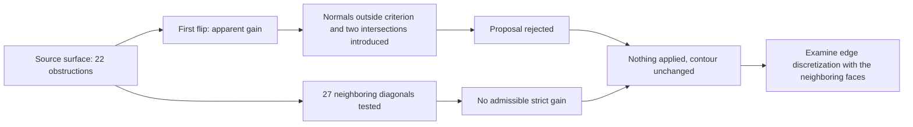

# M64 — diagonal flips and neighboring contacts

**No flip applied.** The first proposal improves some indicators, but fails the
local normal criterion and introduces two intersections with a neighboring
face. Examining the 27 neighboring interior diagonals finds no single strictly
improving flip that meets all the criteria.

This computation follows the [rejected isolated smoothing](M64_SURFACE_RELOCATION_20260909.md).
It concerns the same MeshAdapt surface `7af7f207…`, native face 37: 2,299
triangles, 22 obstructions at the SICN bound marker of 0.1. This marker is not
a universal CFD threshold. The coordinates remain those of the scan, with no
qualification of the scale or of the M64 interfaces.

## First proposal: apparent gain, geometric rejection

Two triangle connections are replaced **in memory only**, with the same four
vertices. The identifiers, coordinates, oriented connections and non-target
data remain identical.

| Indicator on face 37 | Source | Proposal not applied |
|---|---:|---:|
| Obstructions | 22 | 21 |
| Minimum bound | 0.0032268884 | 0.0032268884 |
| Minimum angle, degrees | 0.085767353 | 0.087457014 |

The new small facet has a negative exact dot product with each of the two old
normals. A separate mathematical cross-reading confirms this result. A shape
improvement therefore does not authorize this flip.

The intersection audit filters all surface elements by closed bounding boxes,
then checks **95 pairs**, including the two internal before/after pairs. All
candidates are triangles; no quadrilateral or orphan lower-dimensional element
remains to be resolved in this zone.

The admissible contacts are limited to the vertex or edge shared by their
identifiers. The computation uses exact fractions of the binary64 coordinates,
with no added geometric margin. It finds **zero non-conforming contacts for the
old triangles and two new non-conforming contacts with face 36**. The
additional witness points belong to neither of the two old triangles: the
contacts are introduced by the proposal.

This is a proof on these linear facets, not a measurement of physical contact,
a proof of continuous CAD coverage or an audit of all pairs of the mesh. No
CAD blend is redrawn.

## Deterministic enumeration around the 22 obstructions

The 22 triangles touch 46 unique edges: 19 boundary edges excluded, **27
interior edges tested once**. Each proposal keeps the vertices and replaces the
diagonal of two triangles of the same face.

The guards verify the oriented contour, the absence of an already used
diagonal, the four before/after normal products, then the three global
indicators: non-increasing counter, non-decreasing minimum bound and
non-decreasing minimum angle. At least one strict gain is required. The
quality comparisons are rational; the degrees and decimals are for display.

| Rejection reason | Number of proposals concerned |
|---|---:|
| Local normal outside the criterion | 14 |
| New diagonal already present | 4 |
| No strict gain in the three indicators | 8 |
| Minimum bound degraded | 3 |
| Minimum angle degraded | 4 |
| Counter worsened | 1 |

The reasons are **not exclusive**; their sum is not the number of trials. No
proposal passes. Sequences of several flips or with a neutral intermediate
step are not explored: no general impossibility of improving the mesh is
inferred from these 27 trials. The eight neutral proposals did not reach the
final topology checks; their UVs and contacts are not verified. They are
therefore not declared admissible for a future sequence.

## Practical consequence and evidence kept

The next avenue chosen is the discretization of the edges with a joint remesh
of the connected faces. The proposed perimeter is edge 82 and faces 30/37;
edge 93, face 36 and the 72 faces with quadrilaterals remain protected. A
64-node profile with a progression toward the small neighboring segment is a
numerical trial parameter, not a new part dimension. It remains to be produced
and checked. A simple subdivision of a long side can move the thin triangle
next to it; it is not enough on its own. The CAD curves and the Porsche
contour remain fixed.

The inspected Gmsh 4.15.2 code shows that `generate(1)` erases faces already
meshed. The future 1D generation must therefore precede the reinjection of the
reference mesh or use a separate temporary model. No 1D call is executed in
this batch.

The 21 distinct software tests pass: seven for the first diagnostic, four for
the enumeration and ten for the exact contacts. The general command
`make check` ends with code 0; some optional checks are reported as skipped by
their environment. This result verifies the repository, not the physical
performance of the cylinder head. The pure computations last respectively
2.292 s, 1.083 s and 0.867 s. A native UV query worker was prepared but **was
not executed**, for lack of a retained candidate. No new MSH/CAD export, no
CFD/thermal/LPBF computation and no new Vast spending in this batch.

The programs, tests and receipts are pinned in the
[evidence register](../../twins/m64-cylinder-head/evidence/geometry-checkpoint-20260908.json),
entry `gas_surface_diagonal_audit`. The geometric data and detailed
intersection witnesses remain private. The reference surface and the
diagnostic volume core remain unchanged; no manufacturing suitability or
engine power obtained is declared.
