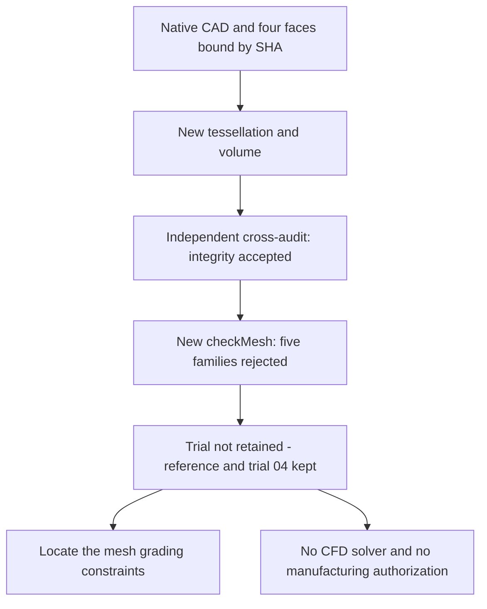

# M64 — local MeshAdapt remesh of four native faces

**Read-only complement:** [approximation bounds of the small edges](M64_NATIVE_EDGE_APPROXIMATION_20260908.md).
It distinguishes the native tolerance from the tessellation error; it changes
neither this mesh nor its OpenFOAM verdict.

## Result: five OpenFOAM rejections, trial not retained

A new mesh of the gas domain contains **401,861 tetrahedra and 186,426
boundary triangles**. The mesher's internal checks pass, but the SICN
indicator degrades: **574 tetrahedra under 0.1**, versus 491 in the reference.
This result is neither a demonstrated global improvement, nor a CFD, thermal,
mechanical or manufacturing acceptance. The integrity cross-audit passes, but
the new `checkMesh` rejects five quality families. **The MeshAdapt trial is
not adopted; the reference and agglomeration 04 are kept.**

The scope remains the virtual intake bench from a 935 reference scan, not a
complete metal cylinder head or measured M64 interfaces. The absolute scale
remains uncertified. This checkpoint complements, without rewriting it, the
[local agglomeration trial](M64_AGGLOMERATION_LOCALE_20260908.md). The
[evidence capsule](../../twins/m64-cylinder-head/evidence/surface-meshadapt-trial-20260908.json)
binds the private receipts and the results by their digests; no raw mesh is
published.

## Why change the tessellation, not the CAD

After agglomeration 04, the localization actually matches the identifiers
against the exported native sets, not only their counts. It finds 2,886
low-determinant cells, 2,082 of which touch an annular boundary; the three
excessive aspect ratios touch native face 37. The ten excessive-skewness faces
are spread over 28, 29 and 36. These indices are those of the native partition
bound to domain `fab1338a…`, not Gmsh tags that can be arbitrarily transferred
to another body.

The bounded union diagnostics found no admissible group among 92 candidates
around the aspect defects, 478 around the skewness defects and 38 groupings
around edges. These populations are not a proof of general impossibility. The
77 individually admissible pairs for the low determinant were **not applied**;
their collective compatibility and a resulting mesh are not demonstrated.

Native edges 98 and 99 belong to the C0 split, at the interface of faces 36
and 37: they are not free triangulation diagonals. The classification of the
nodes is established geometrically on the CAD; the kept MSH 2.2 does not
provide the raw Gmsh dimension/entity metadata of the nodes. No removal of
these edges and no CAD modification is performed.

## A single change of method

The private copy of the mesher, source `da53681e…`, derives from version
`04811670…` actually executed for the reference of 401,961 tetrahedra. The
B-Rep `fab1338a…`, the manifest `58b8be5a…` and the check helpers remain
unchanged. Four unique native associations are verified by face digest, role
and correspondence to the Gmsh tag:

| Native faces | Role kept | Requested surface algorithm |
| --- | --- | --- |
| 28, 29, 37 | Port wall | MeshAdapt 1 |
| 36 | Seat wall | MeshAdapt 1 |
| The 82 others | Manifest roles kept | Frontal-Delaunay 6 by default |

The [official Gmsh 4.15.2 API](https://gmsh.info/doc/texinfo/gmsh.html#index-gmsh_002fmodel_002fmesh_002fsetAlgorithm)
allows this per-surface setting. It does not guarantee identical triangles
between two runs: the new boundary must be checked separately. The sizes and
thresholds are unchanged: guides at 0.20 scan unit, native reference
`815716df…`, chord/facet bound 0.0075 and Delaunay volume 1. The real clearance
checks remain active before and after the volume mesh. No CAD repair
treatment, scale change or passage closure.

## Observed mesher result

| Measurement | Unqualified reference | New trial |
| --- | ---: | ---: |
| Tetrahedra | 401,961 | 401,861 |
| Boundary triangles | 186,370 | 186,426 |
| Minimum SICN after rereading | 1.29054 × 10⁻⁵ | 6.71132 × 10⁻⁶ |
| Tetrahedra with SICN below 0.1 | 491 | **574** |
| Non-positive Jacobians after rereading | 0 | 0 |

The SICN threshold of 0.1 is here a diagnostic indicator, not a CFD acceptance
criterion. The mesher's eleven internal guards pass, notably a connected
tetrahedral region, complete boundary and positive orientation. They replace
neither the independent cross-audit nor `checkMesh`. The MSH is bound to
`ba72d32a…`, the report to `e63d3693…` and the process to `e4956ddb…`. The
source and the native inputs are verified unchanged.

## Real cross-audit, then native diagnostic rejected

The independent receipt `c0ce7de8…` passes in **7.672 s**: the eight curves of
the native interface cover exactly 34/34 segments of the new mesh. The 93,213
surface nodes and 186,426 oriented triangles match exactly its real
tetrahedral boundary. The old criterion limited to the four C0 chains remains
rejected (18/34); this historical rejection is not erased. Neither global
self-intersections nor the continuous fidelity of all chords are proven by
this incidence audit.

Receipt `c46d8703…` separately checks the roles of the 86 faces and the
effective physical groups: 184,973 wall triangles, 1,191 outlet, 262 inlet, and
401,861 tetrahedra in an `air` volume. It authorizes only conversion and
`checkMesh`, not running the solver.

The OpenFOAM diagnostic **14-7b05503f98a8** starts again from the new MSH
`ba72d32a…`, in a fresh case. Conversion, a single application of the
assumption 0.001 m/scan unit and patch preparation run. The log `d1792d84…`
contains **`Failed 5 mesh checks`**, without `Mesh OK`. The native process
returns 0, but the supervisor correctly returns **2** for a quality rejection;
the sequence lasts **9 s**, with no solver.

| Native criterion | Tetrahedral reference | Agglomeration 04 | MeshAdapt |
| --- | ---: | ---: | ---: |
| Excessive aspect ratio | 3 | 3 | 2 |
| Excessive skewness | 10 | 10 | 10 |
| Low determinant | 5,442 | 2,886 | **5,517** |
| Low interpolation weight | 519 | 466 | **535** |
| Low volume ratio | 149 | 146 | 149 |
| Faces non-orthogonal by more than 70° | 262,008 | 259,686 | 262,110 |
| Families rejected | 5 | 5 | 5 |

MeshAdapt starts again from the CAD, **not** from the agglomerated mesh:
compare its direct effect with the tetrahedral reference. The maximum aspect
ratio drops to 1,162.02, but the maximum skewness rises to 13.5077. Equal
counts do not prove the identity of the new labels. No threshold is relaxed.

**Decision:** keep this rejection as evidence, do not launch the CFD and do
not chain the 77 marginal merges. Before another trial, determine the local
grading constraints between native curves and face interiors. The three
critical segments localized on agglomeration 04 belong to edges 98/99;
removing them without justification would change the geometry. No thermal,
strength, printing or engine performance improvement is demonstrated here.

## Resources

A real run of **37 s**, exit code 0, on Kali x86 with four CPUs and 4 GiB,
container network disabled and a wall-clock limit of 300 s. The mesher
container and the diagnostic container are removed, absence verified.
`make check` ends with code 0: **2,425 main tests, 108 skipped**, in 178.572 s,
then additional suites passed. This run uses the host's Python 3.10; the
missing optional dependencies remain reported as skipped. The 26 targeted
interface tests and the two OpenFOAM diagnostic tests pass separately. No
software success lifts the five quality rejections of the real mesh.

No new Vast machine rented: **0 USD of new Vast spending**, for an authorized
project budget of 44 USD. The coordinates, meshes and account details remain
private. No CFD solver was launched by this trial.
