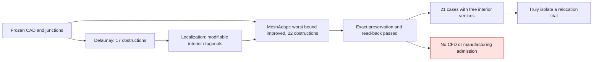

# M64 — Delaunay / MeshAdapt comparison on the port

**MeshAdapt greatly improves the worst triangle, but does not make the mesh
admissible: 22 triangles remain below the chosen benchmark, against 17 with
Delaunay.** Both trials keep the off-target junctions and the same CAD exactly.
No candidate is promoted into the volume mesh.

*Mesh quality indicators of the two trials on native face 37; they say nothing about engine performance.*

This batch continues the [isolated surface pilot](M64_GEOMETRY_CHECKPOINT_20260908.md).
It concerns native gas face 37, not the complete metal cylinder head.
Absolute scale and M64 interfaces remain uncertified. The values and digests
are in the [evidence register](../../twins/m64-cylinder-head/evidence/geometry-checkpoint-20260908.json),
entry `gas_surface_method_comparison`.

## What the localization established

The Delaunay file `81bac4db…` contains 17 triangles whose maximum SICN bound,
for a positive tetrahedron sharing that triangle, is below 0.1.
The selection uses the exact rational test `S² > 841 D²`, on the saved
binary64 coordinates. This is neither a universal CFD threshold nor the
measured quality of a new tetrahedron: no volume is generated.

All 17 touch a real boundary edge: single triangle incidence, node pair
identical to a 1D MSH segment and occurrence in a CAD wire.
Fifteen have three vertices classified 0D/1D; two have one 2D interior vertex.
One component of 14 comprises 13 triangles incident to node 1020, plus one ear
without that node. The diagonals of this fan are not protected 1D segments.
Fixed vertices therefore do not imply a unique triangulation or the
impossibility of inserting an interior vertex.

The current edges 98/99 are shared by faces 36 (`walls_seat`) and 37
(`walls_port`). Edges 104/105 are shared by 37 and 41; the repeated seam of 37
carries number 101 here. Numbers from old B-Reps are not transferable without
a verified link. Faces 36, 37 and 41 are not among the 72 structured
quadrangular faces.

The size floor of `0.005` is larger than some small segments, but this **is not
enough to explain the defect**. Reading Gmsh 4.15.2 shows that Delaunay and
MeshAdapt also use the lengths of the incident 1D segments to define their
local sizes. A blind lowering of the floor is therefore not retained as a
demonstrated fix.

## Trial actually run

A single numerical change: `setAlgorithm(2, target, 5)` becomes
`setAlgorithm(2, target, 1)`. The other changes to the worker are labels and
output names. Inputs, size parameters, tolerances, temporary visibility, exact
restoration of identifiers and guards remain unchanged. A single 2D
generation, no automatic fallback, no CAD repair operation or explicit call to
an optimizer.

| Indicator, face 37 only | Reference, algorithm 6 | Delaunay 5 | MeshAdapt 1 |
|---|---:|---:|---:|
| Triangles | 2,289 | 2,471 | 2,299 |
| Triangles with SICN bound < 0.1 | 18 | 17 | 22 |
| Minimum of this bound | 0.00002223 | 0.00003157 | 0.00322689 |
| Smallest angle, degrees | 0.000490 | 0.000696 | 0.085767 |
| Largest side / height ratio | 116,886 | 82,303 | 1,065 |

The minimum bound is about 102 times higher than Delaunay's, but the count
below the benchmark increases. These metrics demonstrate no gain in flow,
temperature, strength or engine power.

The MeshAdapt candidate `7af7f207…` has 85,300 nodes, 31,896 triangles and
71,152 quadrilaterals. The nine native guards and the fifteen read-back checks
pass. The 155 oriented boundary segments, three cycles, one component and
Euler −1 are preserved. All off-target elements keep their identifiers,
connectivities, classes and exact coordinates.
The two warnings concerning entities 364/face 28 and 368/face 29 remain
recorded. Neither continuous CAD coverage nor global absence of intersections
is proven by these checks.

## Where to act next

The second localization recomputes the 22 MeshAdapt cases: 17 have one 2D
interior vertex, four have two and one has none. Eighteen touch a boundary,
four are interior. One component contains 21 cases; the isolated case keeps
the triangle linking edges 82 and 93. These edges also touch face 30 and face
36 respectively, in addition to 37: re-splitting them would require reworking
the affected neighbors too, not just 36/37.

A separate avenue is moving the interior vertices, without changing the
connections. **Do not run `optimize("Relocate2D", dimTags=[(2,37)])` on the
complete model**: in Gmsh 4.15.2, `dimTags` is ignored and the loop visits all
faces. Visibility and `force=False` do not isolate this call. It first
requires a representation where only the target carries 2D elements, then an
exactly controlled reintegration. The objective of this optimizer differs from
our counter; its name does not guarantee non-regression. This trial was not
run in this batch.

## Resources and evidence

Kali x86, immutable Gmsh 4.15.2 image: four CPUs, 4 GiB, network off, inputs
and CAD read-only. Total limit 300 s, including 30 s for cleanup. MeshAdapt
takes 16.16 s of worker time, 16.86 s including cleanup; pure read-back
1.70 s. Exact container deleted and absence rechecked, with no OOM or timeout.
No new Vast cost; the instance list read back is empty. `make check` finishes
with exit code 0. The localization and variant tests are software tests,
separate from the physical calculations still to be done.

The chart is generated solely from the two pinned native reports and their
common reference, with no synthetic image of the part. It exposes neither scan
nor private coordinates. Its creation follows the visualization rules:
announced logarithmic scales, same reference and scope limits written in the
image.
