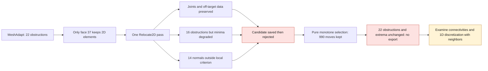

# M64 — isolated surface relocation, candidate rejected

**The native run reduces obstructions from 22 to 16, but degrades the worst
triangle and does not preserve the local orientation of 14 triangles according to the
check adopted. It is rejected.** No change to the CAD contour, no
volume mesh replaced, no CFD admission or manufacturing.

This batch extends the [Delaunay / MeshAdapt comparison](M64_SURFACE_METHOD_COMPARISON_20260909.md).
It concerns only native gas face 37. Positions are in
scan units, with no absolute scale nor certified M64 interfaces.
The digests of the scripts, inputs and receipts are in the
[evidence register](../../twins/m64-cylinder-head/evidence/geometry-checkpoint-20260908.json),
entry `gas_surface_isolated_relocation`.

## Isolation actually executed

The MeshAdapt file `7af7f207…` is reinjected onto the same pinned CAD,
with parameters rebuilt and checked without moving the coordinates.
All nodes are kept. Only the 100,749 2D elements of 155 other
faces are temporarily removed, through explicit lists of identifiers whose
membership is re-read before each call. Face 37 is then the only one
carrying triangles or quadrilaterals. The 0D/1D elements remain present.

A single `Relocate2D` pass, `niter=1`, is executed. No generation call,
global mesh clear, reclassification or renumbering.
The pre-check verifies the absence of periodic correspondences on 291
edges and 156 faces; the effects of automatic post-processing are
checked immediately after the optimization.

The data are captured **before** the removed elements are restored.
Only the interior vertices of 37 may move. The outer elements
are then reinjected with their original identifiers and ordered
connections, without reinjecting the nodes or the physical groups.

The 994 observed displacements concern only the target. The parameters
of the protected nodes remain exact. The 1,049 interior nodes of 37 are
checked by evaluating their native surface: maximum residual
`1.3241e-13`, below the source tolerance `1e-7`, in scan units.
This does not prove continuous coverage of the face by the triangles.

## Result and reason for rejection

| Indicator on the same 2,299 triangles | MeshAdapt source | After one pass |
|---|---:|---:|
| SICN upper bound below 0.1 | 22 | 16 |
| Minimum of this bound | 0.0032268884 | 0.0021005109 |
| Smallest angle, degrees | 0.085767353 | 0.046355451 |
| Largest side / height ratio | 1,064.805 | 1,237.641 |

The 0.1 marker tracks an obstruction to the quality of a tetrahedron sharing
a fixed triangle. It is neither the measured quality of a new tetrahedron nor
a universal CFD acceptance threshold. No volume is generated.

The nine native preservation guards pass. The pure cross-reading,
independent of the worker, passes **19 checks out of 20**: all
identifiers, classes, connections, groups, boundaries and off-target
coordinates are preserved. The twentieth check finds 14 non-positive dot products
of before/after normals, computed exactly on the binary64
coordinates. This means a local deviation of at least 90 degrees; it is not
formal proof of 14 inversions relative to the CAD or of global
intersections. This conservative check is nevertheless enough to reject the candidate.

The three non-regression criteria were fixed before the run: counter
non-increasing, bound minimum non-decreasing, angle minimum non-decreasing.
Only the first passes. The cross-reader compares the minima
through rational invariants, with no margin introduced after observation:
`D²/S²` for the bound, maximum of `cot²(angle)` at acute corners for the angle.
The decimal values in the table are for display only.

## Execution, checks and next steps

Kali x86, pinned Gmsh 4.15.2, four CPUs and 4 GiB, network off and
inputs read-only. Worker: 12.845 s; including cleanup:
13.511 s; cross-reading: 2.649 s. The normal exit 2 means quality
rejection, not a timeout or lack of memory. The exact container is
deleted and its absence is verified separately. No new Vast spending.

The 42 targeted tests of the worker, the cross-reader and the supervisor
pass, as well as 44 tests of the reused libraries. These are software
and synthetic tests, not strength or print tests.
The full `make check` verification ends with code 0. The native tests
skipped by this suite for lack of local dependencies remain skipped;
this success does not replace the native receipts described above.
The candidate file is saved before decision; its re-reading in the
worker uses the pure parser, not a new native import.

## Computed monotone selection, without export

A second computation, **pure and non-native**, tried each of the 994 proposals
once, by increasing identifier, at its exact proposed position. No
interpolation. After each proposal, the normals are compared with the
reference and the three indicators with the already accepted state, not only with
the initial state. The incident triangles are recomputed; the global balance
is also checked after each acceptance and at the end of the pass.

The computation accepts 990 proposals and rejects four on the normals
criterion. But it lands on **exactly the three initial indicators**:
22 obstructions, minimum bound `0.0032268884`, minimum angle `0.085767353°`.
The rational extrema are equal, not only their roundings. The twenty
checks of the final in-memory state pass. Eight synthetic tests of the
selector pass; the computation on the two real files takes 8.369 s.

The plan remains private and **not applied**: no new MSH or B-Rep is
written. There is no gain on the targeted objectives justifying a native
effector for this plan. This result does not exclude all other optimizations;
it closes this deterministic selection of the proposals from this single pass.

The next step must examine the connectivities and the discretization of the edges
with the neighboring faces concerned. Neither lowering the marker, nor blind
repetition of the same optimizer, nor modifying the CAD curves are
authorized by the present result.

