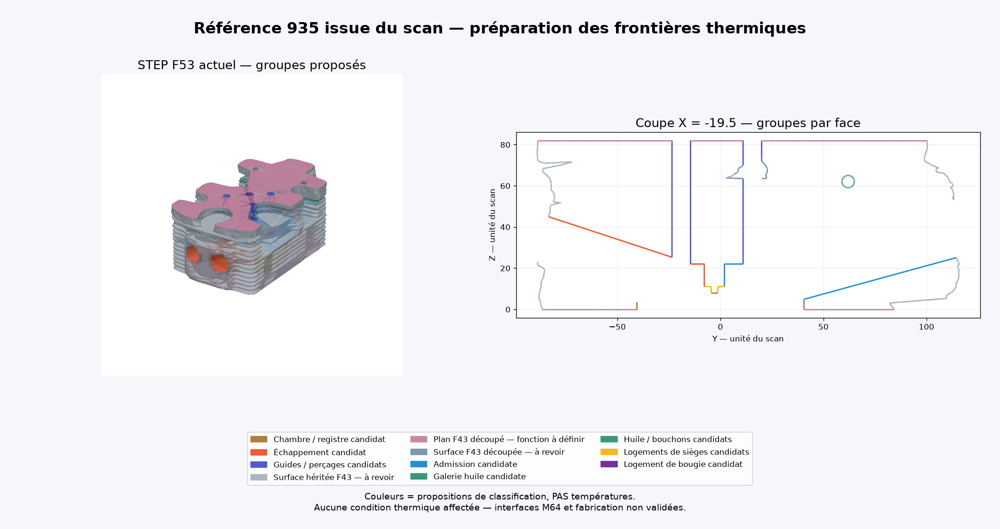

# Groupes candidats de surfaces pour la préparation CHT

7 septembre 2026. Il s'agit de **propositions de provenance géométrique** du
STEP F53, pas d'affectations physiques ni d'une validation du M64. Aucune
température, conductivité, précharge ou condition de convection n'est définie.

Provenance du scan : Wolfe Classics, source catalogue
`SRC-WOLFE-CLASSICS-935-BILLET-CYLINDER-HEAD-SCAN`. Réutilisation confirmée par
le propriétaire selon ce registre ; texte exact de licence non archivé.
Les données géométriques détaillées restent privées ; l'image est un rendu
diagnostique original de la reconstruction, pas une nouvelle mesure Porsche.

## Méthode exécutée

`propose_thermal_face_groups.py` vérifie les empreintes du STEP F53, des deux
inventaires, du contrat F47 et de son constructeur avant tout classement.

1. Une face F53 est rapprochée des faces F43 par type de surface, boîte
   englobante, centre et aire. Une correspondance unique devient une
   **candidate héritée**, pas automatiquement une ailette refroidie par air.
2. Les faces non appariées sont échantillonnées sur leur surface OCCT exacte :
   grille UV 5 × 5 limitée aux points intérieurs à la face découpée, plus tous
   ses sommets. Les coordonnées ne viennent pas du rendu triangulé.
3. Chaque échantillon est confronté aux supports **finis** des cylindres de
   construction F47 : paroi latérale ou disque de fermeture. Sont distingués
   chambres/registres, conduits, poches de sièges, guides, bougie et galerie
   d'huile. Un point sur la prolongation infinie du cylindre ne suffit pas.
4. Pour les surfaces restantes, les distances des mêmes échantillons aux
   faces F43 découpées sont évaluées après filtrage spatial. Un seul appariement
   admissible propose une surface héritée puis retaillée. Un plan horizontal
   demeure explicitement fonctionnellement indéterminé.

Tolérance géométrique : 10⁻⁴ unité du scan ; les signatures demandent aussi
l'accord relatif des aires à 10⁻⁷. Les distances point–face utilisent
[OCCT BRepExtrema_DistShapeShape](https://occt3d.com/dev/doc/refman/html/class_b_rep_extrema___dist_shape_shape.html).
Les contrôles sont échantillonnés : ils ne constituent pas une preuve
d'identité exhaustive des surfaces ni une preuve de leur usage thermique.

Les paramètres F47 sont ceux d'un ancien **candidat de recherche**, notamment
son alésage de 90 unités du scan. Leur usage ici sert uniquement à retrouver
ce qui a construit F53 : ils ne sont pas copiés dans le contrat moteur M64.
La hauteur de départ des conduits est explicitement liée à la constante du
constructeur historique, dont le hash est enregistré.

## Entrées et preuve de l'enveloppe

- STEP F53 : `700baea66bc72cdb6aee529e21b167270ebde11db94b06f8e1e55ee08bdd9bf2`.
- Inventaire F53 : `849ab37dad9df0e14c038d430dd2d39d72251f0a1db5ac7f99b65c85a8694423`.
- Enveloppe F43 rejouée sur Kali : `00c26d32820b23b3589beb7b26d34bc3eb176a89000b9374ffdbe334278b41ef`.
- Inventaire F43 : `898841ec21ee995521f783499477ece8836709c5a1b8cbc5bc231fe3d93ed977`.
- Contrat F47 : `cdf1c54c038994d12ba1e6d726746240a270e1d1683ffe5409db27bc4ea5693e`.
- Constructeur F47 : `9a418c5210b4e89c4fd5646a0533a4afd7a6ac7683363d6e23631151faf5d0fb`.

Le hash historique F43 `38f8ed…` n'est pas renommé : le rapport
`evidence/f43-scan-contour-patch/f43-scan-contour-patch-report.json` documente
le rejeu sous Gmsh 4.12.1 et son hash différent. Le rapprochement actuel porte
sur la géométrie effectivement présente, pas une égalité binaire supposée.

## Premier résultat, avant rapprochement des surfaces retaillées

| Groupe candidat | Faces |
| --- | ---: |
| Surface héritée par signature | 4 583 |
| Chambre / registre | 2 |
| Admission | 14 |
| Échappement | 14 |
| Logements de sièges | 12 |
| Guides / perçages ouverts | 4 |
| Bougie | 1 |
| Galerie et accès huile | 7 |
| Non résolu | 292 |

Les 292 faces non résolues représentent 30 652,86 unités², soit environ
21,2 % de l'aire. Deux grands plans représentent à eux seuls 27 489,87 unités².
Un faible nombre de faces ambiguës peut donc dominer le bilan thermique :
**un pourcentage de faces classées ne remplace pas une couverture par aire**.

Le premier calcul et son rendu sont conservés sous
`/tmp/917-f50/out/m64-thermal-face-proposals-20260907/` sur Kali.
Le second rapprochement utilise un répertoire distinct afin de conserver la
comparaison. Les sorties détaillées contiennent des indices et informations
de géométrie privée ; seules les images et agrégats peuvent rejoindre le dépôt.

## Résultat du rapprochement point–face complémentaire

Les 292 faces restantes ont chacune un seul appariement F43 compatible avec
tous les points testés : **290 surfaces retaillées** et **2 grands plans
horizontaux retaillés**. La deuxième passe est terminée, sous
`/tmp/917-f50/out/m64-thermal-face-proposals-20260907b/`.

Ainsi, les 4 929 faces ont une proposition de provenance géométrique :
4 875 héritées de F43, et 54 associées aux outils internes F47. Cela ne rend
pas la couverture des conditions physiques complète. Les 4 875 faces héritées
ne sont pas toutes des faces exposées à l'air ; les deux grands plans
représentent 19,0 % de l'aire totale et leurs contacts/appuis restent à définir.
Les rôles « chambre ou registre », « guide ou perçage ouvert » et « huile ou
bouchon » restent également ambigus physiquement. **Zéro condition aux limites
thermique définitive a été assignée.**

Image relue : 160 856 triangles, coupe à X = −19,5 unités du scan,
953 segments d'intersection. Les couleurs indiquent les groupes candidats,
jamais une température. L'empreinte de l'image et du fichier de propositions
figure dans `thermal-face-proposals-render-20260907.json` ; les agrégats sont
dans `thermal-face-proposals-20260907.json`.

## Contrôles et utilisation

Les huit tests ciblés couvrent les supports finis, disques de fermeture,
échantillons incompatibles, bord partagé ambigu et signatures d'aire. Les
douze tests de l'inventaire précédent couvrent notamment le hash, la version,
la couverture et les doublons. Les jobs Kali sont limités à **2 CPU, 4 Go,
300 secondes**, sans réseau dans le conteneur. Ils ne louent pas de machine.

Le rendu `render_thermal_face_proposals.py` conserve tous les triangles de la
tessellation OCCT avec l'indice de face d'origine. La coupe intersecte les
triangles avec le plan ; elle ne représente pas un maillage volumique ni un
résultat thermique. Une revue doit encore séparer sièges et gaz, guides et
perçages ouverts, contacts mécaniques et extérieur réellement exposé au flux
d'air. La sémantique M64 définitive reste ouverte.
