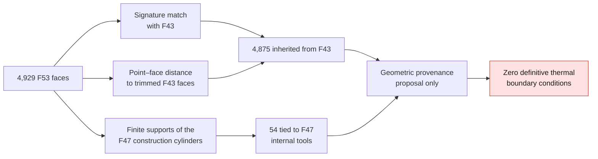
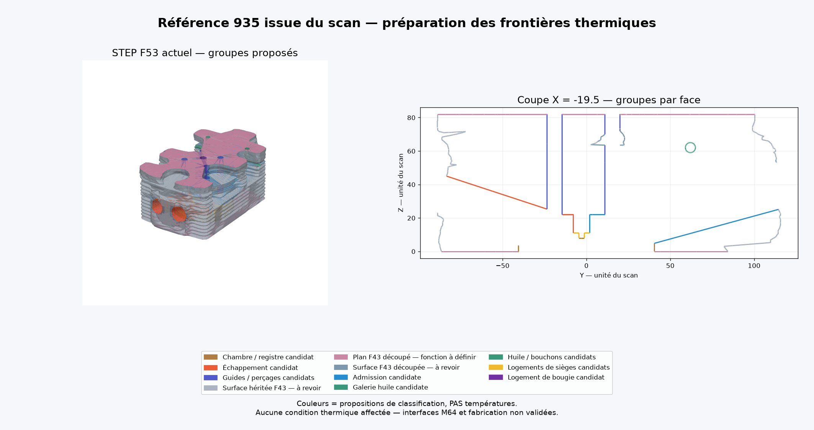

# Candidate surface groups for CHT preparation

September 7, 2026. These are **geometric provenance proposals** for the
F53 STEP, not physical assignments and not a validation of the M64. No
temperature, conductivity, preload or convection condition is defined.

Scan provenance: Wolfe Classics, catalogue source
`SRC-WOLFE-CLASSICS-935-BILLET-CYLINDER-HEAD-SCAN`. Reuse confirmed by
the owner according to this register; exact license text not archived.
Detailed geometric data remain private; the image is an original
diagnostic render of the reconstruction, not a new Porsche measurement.

```mermaid
flowchart LR
    A["4,929 F53 faces"] --> B["Signature match<br/>with F43"]
    A --> C["Finite supports of the<br/>F47 construction cylinders"]
    A --> D["Point–face distance<br/>to trimmed F43 faces"]
    B --> E["4,875 inherited from F43"]
    D --> E
    C --> F["54 tied to F47<br/>internal tools"]
    E --> G["Geometric provenance<br/>proposal only"]
    F --> G
    G --> H["Zero definitive thermal<br/>boundary conditions"]
    classDef stop fill:#fde2e1,stroke:#c0392b,color:#1a1a1a;
    class H stop
```

## Method executed

`propose_thermal_face_groups.py` checks the digests of the F53 STEP, of the two
inventories, of the F47 contract and of its builder before any classification.

1. An F53 face is matched against F43 faces by surface type, bounding
   box, center and area. A unique match becomes an
   **inherited candidate**, not automatically an air-cooled fin.
2. Unmatched faces are sampled on their exact OCCT surface:
   a 5 × 5 UV grid restricted to points inside the trimmed face, plus all
   its vertices. The coordinates do not come from the triangulated render.
3. Each sample is tested against the **finite** supports of the F47
   construction cylinders: side wall or closing disk. Chambers/registers,
   ports, seat pockets, guides, spark plug and oil gallery are
   distinguished. A point on the infinite extension of the cylinder is not enough.
4. For the remaining surfaces, the distances from the same samples to the
   trimmed F43 faces are evaluated after spatial filtering. A single admissible
   match proposes an inherited, then re-trimmed surface. A horizontal plane
   explicitly remains functionally undetermined.

Geometric tolerance: 10⁻⁴ scan units; the signatures also require
relative agreement of areas to within 10⁻⁷. Point–face distances use
[OCCT BRepExtrema_DistShapeShape](https://occt3d.com/dev/doc/refman/html/class_b_rep_extrema___dist_shape_shape.html).
The checks are sampled: they are neither an exhaustive proof of
surface identity nor a proof of their thermal role.

The F47 parameters are those of an earlier **research candidate**, notably
its bore of 90 scan units. They are used here only to recover
what built F53: they are not copied into the M64 engine contract.
The starting height of the ports is explicitly tied to the constant of the
historical builder, whose hash is recorded.

## Inputs and evidence for the envelope

- F53 STEP: `700baea66bc72cdb6aee529e21b167270ebde11db94b06f8e1e55ee08bdd9bf2`.
- F53 inventory: `849ab37dad9df0e14c038d430dd2d39d72251f0a1db5ac7f99b65c85a8694423`.
- F43 envelope replayed on Kali: `00c26d32820b23b3589beb7b26d34bc3eb176a89000b9374ffdbe334278b41ef`.
- F43 inventory: `898841ec21ee995521f783499477ece8836709c5a1b8cbc5bc231fe3d93ed977`.
- F47 contract: `cdf1c54c038994d12ba1e6d726746240a270e1d1683ffe5409db27bc4ea5693e`.
- F47 builder: `9a418c5210b4e89c4fd5646a0533a4afd7a6ac7683363d6e23631151faf5d0fb`.

The historical F43 hash `38f8ed…` is not renamed: the report
`evidence/f43-scan-contour-patch/f43-scan-contour-patch-report.json` documents
the replay under Gmsh 4.12.1 and its different hash. The current matching is
based on the geometry actually present, not on an assumed binary equality.

## First result, before matching the re-trimmed surfaces

| Candidate group | Faces |
| --- | ---: |
| Surface inherited by signature | 4,583 |
| Chamber / register | 2 |
| Intake | 14 |
| Exhaust | 14 |
| Seat pockets | 12 |
| Guides / open drillings | 4 |
| Spark plug | 1 |
| Oil gallery and access | 7 |
| Unresolved | 292 |

The 292 unresolved faces represent 30,652.86 units², about
21.2 % of the area. Two large planes alone represent 27,489.87 units².
A small number of ambiguous faces can therefore dominate the thermal balance:
**a percentage of classified faces does not replace coverage by area**.

The first computation and its render are kept under
`/tmp/917-f50/out/m64-thermal-face-proposals-20260907/` on Kali.
The second matching uses a separate directory in order to keep the
comparison. The detailed outputs contain indices and private geometry
information; only images and aggregates may enter the repository.

## Result of the complementary point–face matching

The 292 remaining faces each have a single F43 match compatible with
all tested points: **290 re-trimmed surfaces** and **2 large re-trimmed
horizontal planes**. The second pass is complete, under
`/tmp/917-f50/out/m64-thermal-face-proposals-20260907b/`.

Thus all 4,929 faces have a geometric provenance proposal:
4,875 inherited from F43, and 54 associated with the F47 internal tools. This does not make
the coverage of physical conditions complete. The 4,875 inherited faces
are not all air-exposed faces; the two large planes
represent 19.0 % of the total area and their contacts/supports remain to be defined.
The roles "chamber or register", "guide or open drilling" and "oil or
plug" also remain physically ambiguous. **Zero definitive thermal boundary
conditions have been assigned.**

Image reviewed: 160,856 triangles, section at X = −19.5 scan units,
953 intersection segments. The colors indicate candidate groups,
never a temperature. The digest of the image and of the proposals file
is in `thermal-face-proposals-render-20260907.json`; the aggregates are
in `thermal-face-proposals-20260907.json`.

## Checks and use

The eight targeted tests cover finite supports, closing disks,
incompatible samples, an ambiguous shared edge and area signatures. The
twelve tests of the previous inventory cover in particular the hash, the version,
coverage and duplicates. The Kali jobs are limited to **2 CPUs, 4 GB,
300 seconds**, with no network in the container. They do not rent a machine.

The render `render_thermal_face_proposals.py` keeps all triangles of the
OCCT tessellation with the index of the originating face. The section intersects the
triangles with the plane; it represents neither a volume mesh nor a
thermal result. A review must still separate seats and gas, guides and
open drillings, mechanical contacts and the exterior actually exposed to the
airflow. The definitive M64 semantics remain open.
