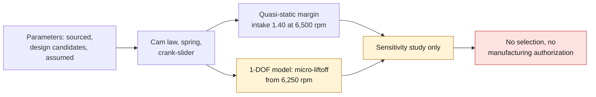

# M64 V1 — four-valve valvetrain: kinematics and simplified dynamics

**Status: sensitivity study, not qualification.** No M64 cam data,
no weighing, no test-bench correlation. Every unsourced parameter is marked
`assumed` with a justification in
[valvetrain-v1-parameters.json](../../twins/m64-cylinder-head/evidence/valvetrain-v1/valvetrain-v1-parameters.json).
The engine speeds below are consequences of these assumptions, not properties of the M64.

Code: [valvetrain.py](../../twins/m64-cylinder-head/source/valvetrain/valvetrain.py),
[run_study.py](../../twins/m64-cylinder-head/source/valvetrain/run_study.py);
results and SHA-256 digests:
[valvetrain-v1-results.json](../../twins/m64-cylinder-head/evidence/valvetrain-v1/valvetrain-v1-results.json);
tests: [test_m64_valvetrain_v1.py](../../tests/test_m64_valvetrain_v1.py) (17, unittest).

## Assumptions and provenance

| Data | Intake / exhaust value | Status |
|---|---|---|
| Stroke | 76.4 mm | `sourced_reference` (P3) |
| Head Ø | 40 / 33 mm | `sourced_reference` (Swindon S2, benchmark not retained) |
| Max lift | 11.5 / 9.6 mm | `repository_design_candidate` (module V2) |
| Valve axis inclination | 8° | `repository_design_candidate` |
| Connecting rod | 127 mm | `assumed` |
| Main duration + 2 × 40° ramp | 240 / 236° crank | `assumed` |
| Lift centers | 105° after / 108° before overlap TDC | `assumed` |
| Cold clearance; hot Δ | 0.10; −0.03 / 0.15; −0.05 mm | `assumed` |
| Equivalent mass (valve + retainer + actuator + spring/3) | 110 / 102 g | `assumed` |
| Spring: wire 3.8, mean Ø 22, 5 active coils, installed L 40 mm, preload 300 / 280 N | k = 38.8 N/mm (computed) | `assumed` |
| Cam / seat contact stiffnesses, damping ζ | 15 / 50 kN/mm, 0.05 | `assumed` |
| Piston clearance at TDC, valve closed | 6.0 / 6.5 mm | `assumed` |
| Target engine speed | 6,500 rpm | `assumed` (repository scenario) |

## Equations

- **Cam law** (crank angle φ, u = (φ − φc)/(Δ/2)):
  C(φ) = h_r·R(φ) + A·(1 − u²)³(1 + c u²), c ∈ [0, 3) to keep monotone flanks.
  R is a step smoothed by 10t³ − 15t⁴ + 6t⁵ on each ramp. The law is
  C²: continuous acceleration, bounded jerk but discontinuous at the junctions.
  A = L_max + cold_clearance − h_r, so the cold valve lift is exactly L_max.
- **Valve**: x = max(C − clearance, 0); v = C′ω, a = C″ω², j = C‴ω³, with ω in crank rad/s.
- **Spring**: k = G d⁴ / (8 D³ n_a), solid length L_s = (n_a + 2) d.
  Shear stress τ = 8 F D K_w / (π d³) (Wahl factor), surge frequency f = ½ √(k / m_active).
- **Margin**: M(N) = min over a < 0 of (F₀ + k x) / (−m a). M ∝ 1/N², hence
  N_float = N_ref √(M_ref) and N_lim = N_ref √(M_ref / 1.25).
- **Piston–valve**: clearance(φ) = d₀ + s(φ) − x(φ) cos α, with the exact crank-slider
  s = r(1 − cos φ) + l − √(l² − r² sin² φ). A cam advance/retard of ±10° is swept.
- **1-DOF**: m ẍ = −k(x + x₀) − c ẋ + ⟨k_c(y − x) + c_c(ẏ − ẋ)⟩⁺ + ⟨k_s(−x) − c_s ẋ⟩⁺.
  Both contacts (cam and seat) are unilateral; fixed-step RK4 integration
  (7,200 steps per cycle), third cycle retained, hot clearance.

## Results (default parameters)

| Indicator | Intake | Exhaust |
|---|---|---|
| Max accel. + / − at 6,500 | 7,840 / −4,500 m/s² | 6,780 / −3,900 m/s² |
| Max inertia force at 6,500 | 865 N | 694 N |
| Spring margin at 6,500 | **1.40** | **1.53** |
| Quasi-static valve float (M = 1) | **≈ 7,680 rpm** | ≈ 8,030 rpm |
| Limit at M = 1.25 | ≈ 6,870 rpm | ≈ 7,190 rpm |
| 1-DOF: micro-liftoff > 0.05 mm | from 6,250 | from 6,250 |
| 1-DOF: outright float > 0.5 mm | 8,000 | 8,250 |
| Reserve to coil bind | 1.9 mm (OK ≥ 1.0) | 3.8 mm |
| τ at max lift | **962 MPa** (high) | 842 MPa |
| Spring surge | 562 Hz | 562 Hz |
| Seating velocity on ramp, cold / hot | 0.51 / 0.45 m/s | 0.55 / 0.51 m/s |
| Min piston clearance (±10° sweep, cold/hot) | 4.3 mm (advance +10°) | 5.6 mm (retard −10°) |

Cam advance reduces the piston clearance at the intake and retard reduces it at
the exhaust. No interference appears with the assumed d₀; this result
depends entirely on this undesigned d₀.

**Sensitivity of quasi-static valve float (±20 %, intake):**

- main duration: −20 % / +10 %;
- wire diameter: −16 % / +8 %, but wire +20 % makes the coil-bind check fail;
- valve mass: +6 % / −5 %;
- preload: −4.5 % / +4.3 %;
- lift: +6 % / −4 %, and lift +20 % makes the coil-bind check fail;
- actuator mass: ±2 %;
- coefficient c: ≤ 2 %.

The 1-DOF model shows a micro-liftoff near 6,250 rpm, before the
quasi-static valve float. It comes from the vibration of the cam contact excited by
the jerk. Its amplitude depends on the assumed stiffnesses and damping.

## What remains unestablished

- Actual cam profile, lift, timing, clearance and actuation type (hydraulic or mechanical) of the M64 4V.
- Weighed masses, spring stiffness and curve, dual spring, guide/seal friction.
- Stiffnesses of the kinematic chain, shaft and rocker bending, hydraulic dynamics.
- Actual geometry of the piston, valve pockets and chamber. The clearance is reduced to a single axial point.
- Computed hot expansions. The clearance Δ is only a parameter.
- Spring surge modeled as a continuum. Only its frequency is given;
  the dynamics is not coupled to the train.
- Test-bench correlation: none. Nothing here counts as a selection or a manufacturing authorization.

## Cross-computations in the tests

- Analytical derivatives cross-checked by trapezoidal integration.
- C² continuity and monotone flanks.
- Stiffness and solid length recomputed by hand.
- Margin in 1/N² and valve float recovered by bisection.
- Crank-slider at the limits (TDC, BDC, expansion in r/l).
- Piston clearance computed by hand at one point.
- Harmonic limit case and energy conservation of the RK4.
- Tracking of the kinematics at low speed, liftoff with a weak spring.
- Provenance check and digest verification.

## G0 — 993 workshop manual, group 15 (added 2026-09-14)

Register: [993-workshop-manual-group15-cylinder-head.json](../../catalog/manual/page-checked/993-workshop-manual-group15-cylinder-head.json),
each value re-read on the page image (`page_checked`). **Applicability: 993 Carrera
2-valve; original references, not dimensions of the targeted 4-valve.**

| Data | Value | PDF page |
|---|---|---|
| Timing at 1 mm lift, zero clearance | IO 1° BTDC, IC 60° ABDC, EO 45° BBDC, EC 6° ATDC (manual: AO/AF/EO/EF) | 16 |
| Table 15 05 M64/05/06 (printed) | 1° / 240° / 225° / **2°** — EC conflict 6° vs 2° unresolved | 175 |
| Clearance | hydraulic; lifter travel 0.2–1.85 (intake) / 0.6–2.25 mm (exhaust) | 16, 151 |
| Intake / exhaust valves | Ø 49 ±0.1 / 42.5 ±0.1; stem 7.970 −0.012 (exhaust tapered 7.950→7.970); L 110.1 / 109; 45° | 155 |
| Guides | bore 8.00–8.015; interference 0.06–0.08; outer Ø 13.060 (head bore 13.000–13.018); protrusion 16.5 −0.3; max rock 0.80 | 152–154 |
| Springs | dual; installed length A 36.7 +0.3 / 35.7 +0.3 (RS: 37.2 / 35.8) | 148, 157 |
| Cylinder head | nuts 20 Nm + 90° ±2°; studs M8×22 protrusion 23 −0.5 | 148, 150 |

Absent from the manual: seat angle/width, spring free length and forces, max
lift, camshaft clearances, flatness/resurfacing, cylinder centering, any M64/60 data.
The set `stock_993_manual_parameters()` replaces only the lift centers (119.5° / 610.5°)
and the clearance (0, hydraulic); the defaults remain unchanged. It is not used by `run_study.py`.
