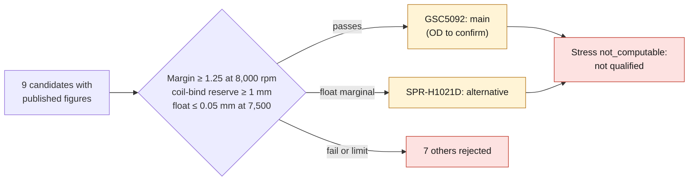

# M64 4V — valve spring selection from supplier data sheets

**Status: screening on public catalogs, not qualification.** Nothing was ordered, no supplier contacted.
The spring figures are copied from the product pages (accessed 2026-09-14). The rest follows the V1 model
([M64_V1_VALVETRAIN_20260914.md](M64_V1_VALVETRAIN_20260914.md)): cam, masses, stiffnesses and clearances are **assumed** there.

Data: [spring_candidates.json](../../twins/m64-cylinder-head/source/valvetrain/spring_candidates.json);
script: [spring_selection.py](../../twins/m64-cylinder-head/source/valvetrain/spring_selection.py);
results: [spring-selection-results.json](../../twins/m64-cylinder-head/evidence/valvetrain-v1/spring-selection-results.json);
tests: [test_m64_spring_selection.py](../../tests/test_m64_spring_selection.py) (11, unittest).

## Method

- Stiffness k = (F_open − F_seat) / lift, if both points are published; otherwise the published rate is used.
  At Supertech, "Rate: X mm" reads as lbf/mm: (204 − 76)/10 = 12.8 on SPR-HM1007BE.
- Each spring is installed at the height of its data sheet. The pocket height is an unsourced parameter.
- Lifts 11.5 / 9.6 mm. Spring mass 45 g and retainer 13 g **assumed**: neither is published.
- Criteria: margin ≥ 1.25 at 8,000 rpm; coil-bind reserve ≥ 1 mm at max lift;
  1-DOF float or bounce ≤ 0.05 mm at 7,500 (hot clearance).
  Two non-blocking checks: OD ≤ 30 mm (pocket **assumed**) and lift ≤ published max lift.
- **Stress: `not_computable` for all.** No supplier publishes the wire diameter.
  No material limit is therefore applied or sourced.

## Table (intake / exhaust)

| # | Ref. | Type | OD | Installed H | Seat | Published open | k N/mm | Margin 8,000 | rpm at M = 1.25 | Float 7,500 mm | Coil reserve mm (+20% lift) | Pub. max lift | Price | Verdict |
|---|---|---|---|---|---|---|---|---|---|---|---|---|---|---|
| 1 | GSC Power-Division GSC5092 (991/992 GT3) | conical | n.p. | 40.0 | 113 lbf (503 N) | 265 lbf @ 13 mm | 52.0 | **1.36 / 1.56** | 8,350 | **0.042 / 0.035** | 4.3 / 6.2 (2.0) | 14.25 | 1,155 USD/24 | **passes** (OD to confirm) |
| 2 | PAC-1276X | beehive | 32.8 | 45.7 | 150 lbf | 420 lbf @ 16.8 | 71.6 | 1.84 / 2.10 | 9,710 | 0.014 / 0.009 | 7.0 / 8.9 | 16.5 | 305 USD/16 | OD > 30, drag spring too tall |
| 3 | Ferrea S10122 (996 Turbo) | dual | 28.0 | 33.5 | 98 lbf | 220 lbf @ 9 mm | 60.3 | 1.38 / 1.56 | 8,410 | 0.059 / 0.051 | 2.0 / 3.9 (−0.3) | **11.2 < 11.5** | 728 USD/24 | lift outside data sheet, float |
| 4 | Supertech SPR-H1021D (Honda K) | dual | 30.0 | 40.4 | 95 lbf | 261 lbf @ 12 mm | 61.5 | 1.38 / 1.55 | 8,410 | 0.063 / 0.055 | 6.2 / 8.1 (3.9) | 15.3 | 606 USD/16 | marginal float |
| 5 | Supertech SPR-TS1015 (2JZ) | dual | 27.5 | 33.6 | 91 lbf | n.p. (published rate) | 53.8 | 1.25 / 1.42 | 8,015 | 0.070 / 0.062 | 1.4 / 3.3 (−0.9) | 12.9 | 367 USD | borderline |
| 6 | Supertech SPR-HM1007BE (S54) | beehive | 28.0 | 36.0 | 76 lbf | 204 lbf @ 10 mm | 56.9 | 1.21 / 1.34 | 7,860 | 0.102 / 0.088 | 1.7 / 3.6 | 14.0 | 1,060 USD/24 | fails |
| 7 | Supertech SPR-2521/2 (S54) | dual | 26.4 | 41.0 | 82 lbf | 186 lbf @ 10 mm | 46.3 | 1.10 / 1.25 | 7,510 | 0.088 / 0.078 | 5.0 / 6.9 | 14.5 | 944 USD/24 | fails |
| 8 | Kelford KVS264 int. (G16E) | beehive | n.p. | 35.0 | 100 lbf | 198 lbf @ 12 mm | 36.3 | 1.08 / 1.24 | 7,430 | 0.058 / 0.050 | 1.5 / 3.4 | n.p. | 504 GBP | fails |
| 9 | Brian Crower BC1310 (2JZ) | dual | 27.6 | 33.7 | 82 lbf | 180 lbf @ 10.2 mm | 42.9 | 1.06 / 1.20 | 7,360 | 0.120 / 0.078 | 3.6 / 5.5 | 11.94 | 18 USD/pc | fails |

n.p. = not published. The URLs are in the JSON.

Excluded for lack of an accessible data sheet with figures: Ferrea KT4034 (page 403), Kelford KVS02-BT (no open force),
PAC-1204X/1205X (403), Kibblewhite 911/964 2V, Cat Cams, Schrick, Del West, Manley, Swindon, Protomotive.
No Porsche 964/993 2V kit publishes a data sheet with figures. The original set 105 901 51, designed for
hydraulic lifters in 2V, is not a 4V candidate.

## Recommendation

**Main: GSC Power-Division GSC5092.** This is the conical spring of the 991/992 GT3: same high-speed 4V
flat-six family, rated speed 11,000 rpm, titanium retainer and seat supplied. It is the only candidate
that passes the three hard criteria, on both sides: margin 1.36 at 8,000, float 0.042 mm at 7,500,
coil-bind reserve 4.3 mm (2.0 mm even with +20% lift), published max lift 14.25 mm.
Caveat: the outer diameter is not published.

**Alternative: Supertech SPR-H1021D** (Honda K dual spring, Ti Gr5 retainer). Margin 1.38 and a large coil-bind
reserve (6.2 mm). OD 30.0 mm published, so just at the assumed maximum OD. Float 0.063 mm
at 7,500: just above the threshold, a deviation that is within the noise of the assumed stiffnesses of the 1-DOF model.

The Ferrea S10122 (996 Turbo) has good forces, but its data sheet caps lift at 11.2 mm, below the targeted 11.5 mm.

## Still to be confirmed

1. **Actual pocket**: counterbore diameter, installed height, center distance between the two springs on the same side. None of this
   is designed; the 30 mm OD check is an assumption.
2. **Masses**: titanium spring and retainer not published; 45 g + 13 g are assumed. Weighings are needed.
3. **Data sheet request to suppliers** (not sent): GSC5092 OD, wire diameter, free length,
   material and fatigue limit. Without them, no stress; without them, no surge frequency.
4. **Spring bench measurement**: force-length curve, actual solid height and scatter across the lot.
   The Ferrea already shows an 11% deviation between its published rate and the one derived from its two points.
5. Actual cam profile, drivetrain stiffnesses and damping. The speeds above depend directly on them.
