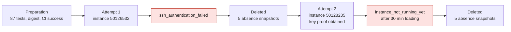

# M64 — Vast attempt of September 7, 2026

*Sequence of the two paid attempts as recorded below; neither reached a computation.*

## Authority and budget

The user reports **20 USD remaining** and authorizes continuing. This amount
is the working ceiling, not a balance verified through the API. No top-up.
A single paid instance created during this attempt.

## Preparation

- GET HTTP 429 fix and SimReady cadence: 87 unit tests passed.
- Installed wrapper identical to the tested wrapper; access through the
  existing OpenBao.
- Approved private key verified and public key registered by the wrapper.
- Immutable GHCR image verified:
  `ghcr.io/cluster2600/3dprinting993-simready-local-ai@sha256:5a69a6805a275ef708e264600cb933663159a2846b069eafe0459c28e5f69699`.
- CI of this image: run `33730827271`, conclusion `success`.
- Two requests targeting the Washington offer `48366367` were refused before
  creation: the offer was absent from the eligible search at launch time.

## Instance actually created

| Field | Provider observation |
|---|---|
| Offer / instance | `47185008` / `50126532` |
| Region | Thailand |
| GPU | RTX PRO 6000 WS, 97,887 MB advertised |
| CPU / RAM | 64 effective CPUs / 128,726 MB |
| Allocated disk | 500 GB |
| Advertised hourly rate, storage included | 1.470888889 USD/h |
| Inbound / outbound transfer | 0.002604167 / 0.00390625 USD/GB |
| Label | `3dprinting993-simready-local-ai-cd13434ab2b657259f64` |

A local targeted-deletion safeguard at 45 minutes was launched. It was stopped
after confirmation of early deletion. This safeguard depends on access to the
provider; it is not a billing guarantee.

## Result: failure before the computations

The instance went from `loading` to `running`, but the SSH check failed with
`ssh_authentication_failed`. The `/workspace/READY` file was not verified. No
cylinder head transfer, Omniverse render, PhysicsNeMo training or cylinder head
thermal/mechanical computation is demonstrated by this attempt.

The controller deleted the instance automatically: provider acknowledgement
received, then **five consecutive absence snapshots**. A final independent
`openbao-vastai instances` read returns `[]`.

The amount actually charged is not available in this wrapper's results: it is
neither invented nor treated as zero. No new blind paid rental after this
failure. The SSH diagnosis continues offline.

The diagnosis reproduced a host/port pairing defect: proxy and direct
connection could be mixed when the proxy port was absent. Fixed in the
repository and in the installed wrapper, identical by `cmp`; **90 wrapper
tests passed**. Lacking raw endpoint metadata, this defect is not established
as the cause of the `50126532` failure. No new paid attempt after this fix.

## Repository check

`make check` was run: the checks passed up to the F46 preparation manifest,
which became stale because of the wrapper's hash change. This manifest was
regenerated with its generator: only the wrapper's size and SHA-256 changed,
with no new physical authority. The interrupted target and all remaining
`check` targets were then replayed successfully. The final wrapper suite was
rerun separately: 90 tests passed.

## Second attempt: key proof obtained, loading too long

After adding and testing the real verification of the local key pair and of the
key listed for the instance, a second paid creation was run with
`openbao-vastai launch-simready-heavy 49836870`. The previous paragraphs
describe only the first attempt; they are not a count for the whole day.

- Instance `50128235`, label
  `3dprinting993-simready-local-ai-58a4ab46c6b7f8badea7`.
- Same digest, GPU/CPU/RAM, disk and advertised rate as above.
- Local public/private pair verified; approved key already listed for this
  instance by the provider. No new attachment needed.
- Advertised proxy endpoint: `ssh9.vast.ai:18234`; no complete direct pair
  advertised during loading. This does not prove a connection.
- The image kept downloading and then extracting its layers, but the instance
  was still `loading` when the check bounded to 30 minutes expired.
- Terminal error: `instance_not_running_yet`, **not**
  `ssh_authentication_failed`. No successful SSH test, READY marker, Omniverse
  service or GPU cylinder head computation is demonstrated.
- Deletion acknowledged, five consecutive absence snapshots in the
  controller's receipt; an independent read returns `[]`. The local safeguard
  specific to this instance was then stopped.

The wrapper installed for this attempt had SHA-256
`0dd2916aed0de577396d8b53da3cf2a2eb66a29abafdf1b5704643140370c804`.
The later fix for a direct port supplied as a string was not in this
already-launched process; it can neither explain nor resolve this overly long
loading. It is tested offline, separately.

The real download bandwidth and the final invoice are not available in these
receipts. No exact balance or zero cost is claimed. The next host choice must
take the image loading into account, not only the GPU. The
[Vast documentation consulted today](https://docs.vast.ai/guides/instances/manage-instances)
states that `Loading` can last several hours for a large image and is not
billed. It would therefore be wrong to multiply the 30 minutes in this state by
the GPU rate to announce an invoice. This is not a verification of the account
statement or of any transfers.

The target remains the **M64 turbo 964/993**. The old 917 results and the
research geometries from the 935 scan do not validate its interfaces.
`simulation_validated=false`, `manufacturing_authorized=false`.
