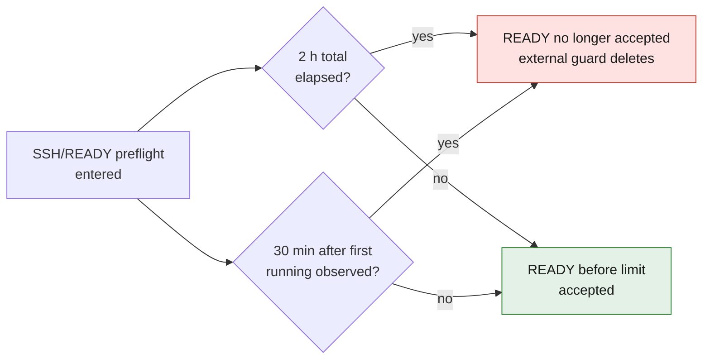

# M64 — Vast loading preflight, September 7, 2026

*The two non-renewable preflight limits described below; the first one reached applies.*

## What the data lets us know

The approved `heavy-offers` command, queried read-only, already exposes the
inbound bandwidth `inet_down_mbps`, the advertised space `disk_space_gb`, the
transfer costs and the rate including the requested storage. The official
schema also contains `disk_bw` and `disk_name`, masked until then by
`safe_offer`: the proposed patch exposes `disk_read_bw_mb_s` and `disk_model`.
It changes neither the queries, nor the eligibility criteria, nor the ranking
of the offers. `disk_bw` is a disk **read** bandwidth, not a measurement of
decompression or concurrent writing.
[Vast offers schema](https://docs.vast.ai/api-reference/search/search-offers).

The consulted schema does not provide proof that the exact GHCR digest is
present in the host's cache. The current query does not even include any image
digest. The offer's space proves neither the effective quota of our future
container nor the working space available to the Docker daemon. Cache, real
bandwidth from GHCR, decompressed size and startup duration remain unknown
before rental.

## Image actually read back

The GHCR manifest of digest `5a69a6805a275ef708e264600cb933663159a2846b069eafe0459c28e5f69699`
was read back with `docker buildx imagetools inspect --raw`:

- 54 compressed layers, **34,624,357,174 bytes** in total;
- largest layer: **4,706,752,993 bytes**;
- the Dockerfile embeds the Qwen VLM in five shards and two isolated
  PyTorch/CUDA environments (PhysicsNeMo and vLLM).

The layer split already exists; the image is not a simple SSH runtime. The CPU
tests and the digest check did not measure a cold start of this image on the
Vast host concerned.

At a constant bandwidth equal to the advertised one, the transfer alone
theoretically takes `8 × bytes / (Mbps × 10^6)` seconds. Examples observed
during this reading:

| Offer | Advertised bandwidth | Theoretical transfer alone | Cost of a single transfer, decimal GB |
| --- | ---: | ---: | ---: |
| 47185008 | 642.5 Mbps | 7.19 min | 0.090 USD |
| 49094462 | 4,489.4 Mbps | 1.03 min | 0.361 USD |
| 37117681 | 723.2 Mbps | 6.38 min | 0.676 USD |

These calculations are scenarios, not ETAs or invoices: they exclude network
sharing, GHCR rate limiting, retries, checks, decompression and service
startup. No offer was rented for this audit.

## Fixing the clocks, without an unlimited budget

Vast states that loading can take several hours with a large image and that
the `Loading` state is not billed as compute. The stop of 50128235 at 30
minutes, still loading, is therefore not a new authentication error. The
breakdown of charges remains to be checked on the invoice.
[Vast instance management](https://docs.vast.ai/guides/instances/manage-instances).

The preflight now has two non-renewable limits:

1. **2 hours in total**, from entry into the SSH/READY preflight;
2. **30 minutes after the first `running` observation**, even if the instance
   then goes back to `loading`.

The first limit reached applies. No READY received after the limit is
accepted. Terminal authentication, host key and service errors, as well as
deletion on failure, are unchanged. GET 429 retries remain bounded to three
delays of 20/40/60 seconds; the deadlines are rechecked after the call. A call
already in progress can exceed the limit instant by its network delay: this
controller is not, on its own, a strict destruction clock.

Before rental, **an external guard at 2 hours from creation** must therefore
bound the real duration and then verify deletion. At 2.50 USD/h maximum, this
represents at most 5 USD of conservative hourly rate before transfers and
deletion margin. A target envelope below 6 USD requires reserving less than
1 USD for these costs; this is not a guarantee if transfers are repeated
without measurement. The authorized ceiling remains **20 USD**, with no
top-up or new automatic rental on failure.

The simulated-clock tests cover an authorized 35-minute loading, both
expirations, a return to loading without reset, a late READY and the bounded
429s. They prove neither a GPU computation nor a cylinder head.
