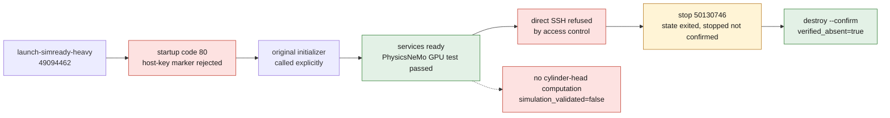

# Vast: access restored and runtime ready — September 7, 2026

Observation at 06:55 UTC, concerning only instance **50130746**.
Launch performed by the approved wrapper
`/Users/maxime/.local/bin/openbao-vastai`, command
`launch-simready-heavy 49094462`, with a unique attempt identifier.
No new top-up authorized; user cap kept: 20 USD.



## Actual launcher result

The supervised process ended with code **0**. Its receipt confirms:

- image and offer contract verified;
- local SSH key pair consistent and approved key listed by the provider;
- SSH BatchMode connection succeeded, with strict host-key checking;
- instance `running`, availability marker and Content Agents services ready;
- PhysicsNeMo GPU execution test passed.

Hardware: 64 effective CPUs, 257,582 MB RAM and RTX PRO 6000 WS.
`nvidia-smi` identified an RTX PRO 6000 Blackwell Workstation Edition,
97,887 MiB and driver 595.84. Advertised offer rate with 500 GB of
storage: **1.85185185185 USD/h**, excluding transfer. This is not an invoice.
A separate guard targets deletion of this exact attempt at
**08:28:46 UTC**; API delays may overrun that deadline.

## Cause of the last blockage: initialization, not authentication

SSH authentication was already working. Application startup failed
with code **80** and `simready runtime host-key marker rejected`.
In this container, `/usr/sbin/sshd` was an ordinary binary, not the expected
link to our initializer. The `sshd -T` call therefore did not create the
required application marker. Who made this replacement is not established.

The original initializer `/usr/local/bin/simready-sshd-runtime-wrapper -T`
was called explicitly, then the original onstart script was rerun.
The fingerprints of the existing public host keys stayed identical;
no new public key and no listener restart were needed. The services then
reached the ready state.

The source fix replaces the indirect call with a call to the initializer.
A functional test reproduces code 80 with the old path, then checks that the
new path succeeds and that no reinitialization happens if the marker
exists. **7 `test_simready_local_ai.py` tests pass.**

## Traceability and limits

Image actually executed, predating this source fix:

```text
ghcr.io/cluster2600/3dprinting993-simready-local-ai@sha256:5a69a6805a275ef708e264600cb933663159a2846b069eafe0459c28e5f69699
```

The fix is not included in this digest: the runtime was unblocked by the
initializer already shipped in the image. The PhysicsNeMo test proves the
imports and a GPU tensor computation, not the training of a physics model nor
a cylinder-head computation. The receipt keeps `simulation_validated=false` and
`manufacturing_authorized=false`. No thermal, strength, fatigue, printing or
M64 compatibility validation is inferred from this success.

Do not confuse this incident with the earlier instance **50128235**,
deleted while it was still loading its image: its expiry was not an SSH
authentication failure.

## Rest of the run: access limit and requested stop

An agent's access control refused a direct SSH command and asked for an
approved OpenBao path. No workaround was attempted after this refusal.
Inspection of the existing wrappers confirms that they expose launch and
availability checks, but not the transfer or processing of an M64 asset.
`property_assignment_intent=run` in the receipt is an intent, not evidence
that properties were assigned to the cylinder head.

A stop request was therefore sent with `openbao-vastai stop 50130746`
so as not to leave compute running without usable work. The provider's next
reading shows **`exited`**, not yet `stopped`; that reading alone does not
attest that GPU billing was suspended. The deletion guard for the exact
attempt stays active. The independent CAD work on Kali can continue; no other
rental was launched.

The bounded stop check then ended in error: the `stopped` state was not
confirmed. The exact instance was therefore deleted with
`openbao-vastai destroy 50130746 --confirm`. The wrapper confirmed
`destroyed=true` and `verified_absent=true`. The container and its working
disk are deleted; no cylinder-head computation result had been produced on it.
The source and the locally recorded evidence are kept.
