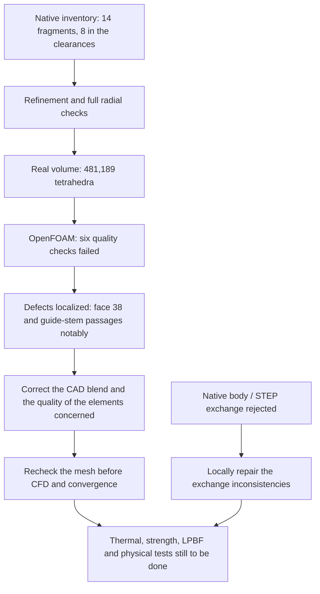

# M64 — first meshed intake volume, OpenFOAM quality rejected

The [rework of the C0 representation](M64_CORRECTIONS_NATIVES_20260908.md)
then produces another native candidate. It does not modify the historical mesh
nor its six OpenFOAM rejections documented below.

## Result

The native gas domain `gas-domain-05` now produces **481,189 tetrahedra**. The
intersection defect that interrupted the boundary recovery was lifted by
refining the eight cylindrical guide–stem portions. The CAD, its diameters and
its tolerances were not changed.

**OpenFOAM nevertheless rejects this mesh on six quality checks. No flow
solver was launched.** This batch validates neither the thermal behavior, nor
the strength, nor the printing of the cylinder head.

The target remains an M64 twin-turbo, four valves, **700 PS at the crankshaft
as a goal**, not as a power obtained. The envelope still comes from the
reconstructed 935 reference; `1 scan unit = 1 mm` is an uncalibrated
assumption. The air volume with a bench receiver must not be confused with the
hollowed metal body `33375e12…`.

## Correction demonstrated on the real mesh

The [native inventory](../../twins/m64-cylinder-head/evidence/native-gas-guide-eightface-inventory-20260908.json)
examines 88 faces, 33 of them cylinders. Fourteen fragments come from the
guide/stem surfaces concerned: eight bound the annular clearance, six extend
the stems outside the guide. These six remain present in the CAD and in the
inventory; they are neither plugged nor removed.

Each guide has two portions of 12 and 23 units. The radial margin is verified
over **the whole of each guide**, including between subdivisions: worst
envelope error of the guide + worst error of the stem, brought to the same
frame, at most 0.0075 for a nominal clearance of 0.015 unit. The minimum is
taken over the whole projected facet, not only on its edges.

| Numerical check | Intake 1 | Intake 2 |
| --- | ---: | ---: |
| Conservative sum of envelope errors | 0.00487646 | 0.00509289 |
| Lower bound on remaining radial clearance, scan units | 0.01012354 | 0.00990711 |

The bounds are recomputed before and after 3D generation. The local field
targets `h = 0.20` on the eight cylinders, combined with the `h = 0.15` of face
38; the target size is not a guaranteed bound on chord length.

The preparatory surface counts 191,968 triangles and 95,984 nodes. The
crossing sweep finds no strict crossing, versus 56 in the last four-face
trial. Any positive results are confirmed in rational arithmetic; **zero
results is not an exhaustive proof of absence**, notably for coplanarities and
edge contacts.

The surface saves `2b0d0480…` and `5c3cfbed…` have different digests. They
were therefore examined separately. The private image
`comparaison-coupe-guide-tige.png` shows a real old/new section, in the same
plane and at the same scale; it is not a thermal map.

An independent parser then compares surface `5c3cfbed…` with the boundary of
the final volume `98c6628b…`: the same 191,968 oriented triangles, the same
labels, the same 95,984 boundary nodes and **no ASCII coordinate difference**.
The crossing diagnostic therefore carries over to this exact final boundary,
without widening its scope or its guarantees.

## Volume and OpenFOAM check

The [execution receipt](../../twins/m64-cylinder-head/evidence/native-gas-eightface-volume-20260908.json)
binds the sources, inputs, meshes, checks and logs. Gmsh 4.15.2 finishes the
generation in 48.28 s. Eleven integrity checks pass: single region, positive
volumes, complete oriented boundary, preservation of groups and connectivity
after rereading, among others. **1,409 tetrahedra have a minSICN below 0.1,
eight of them below 10⁻⁶.**

Exit 2 of the generator keeps the status "diagnostic mesh integrity passed,
native C0 defect unresolved". It does not mean a tetrahedralization failure
here, but does not authorize CFD.

An independent review of the volume file `98c6628b…` confirms the 88 boundary
assignments: inlet 258 triangles, outlet 1,191, walls 190,519. It authorizes
only conversion and checking. The
[diagnostic program](../../twins/m64-cylinder-head/source/flowbench-intake/check_openfoam_mesh.py)
contains **no solver step**. The same receipt is refused by the CFD program,
which a regression test verifies.

OpenFOAM Foundation 14 runs `gmshToFoam`, a single unit conversion at
0.001 m/unit, `createPatch` and `checkMesh -allTopology -allGeometry`. The
three groups are kept. The four commands return 0, but the log explicitly
says **"Failed 6 mesh checks"**: the wrapper program correctly rejects the
case, with exit 2.

| Failed check | Number detected |
| --- | ---: |
| Cells with a high aspect ratio | 139 |
| Highly distorted faces (*skewness*) | 53 |
| Cells with a small OpenFOAM quality determinant | 4,243 |
| Cells concave according to the planes of their faces | 25 |
| Faces with a low interpolation weight | 1,200 |
| Faces with a low neighboring volume ratio | 532 |

The OpenFOAM quality determinant is not the geometric Jacobian of the Gmsh
tetrahedra. Positive volumes are therefore not enough. The log also reports
240,289 faces beyond 70° of non-orthogonality, although this particular check
is announced `OK` by its internal criteria. No threshold was lowered.

A second `checkMesh`, on an unchanged copy, exports the defective sets with
`-writeSets -writeSurfaces -noFunctionObjects` and reproduces the six
rejections. The correspondence of the boundary points and triangles is
verified topologically, without arbitrary attribution to the nearest surface.
Face 38 directly touches **69 of the 139** highly elongated cells and **17 of
the 25** concave cells; 36 of the 53 distorted faces touch this region,
directly or through their adjacent tetrahedra. The small determinants also
concern the guide–stem passages. These contact counts can overlap; they are
not disjoint regions. The entities without verifiable contact remain
unattributed.

## Metal body: STEP defect localized, not repaired

The [STEP audit](../../twins/m64-cylinder-head/evidence/ported-body-step-context-20260908.json)
identifies 23 `UnorientableShape` faces after import. Eight edges also carry
`InvalidCurveOnSurface` and `InvalidSameParameterFlag`, attached to STEP faces
407/408. These eight errors are not enough to explain the 21 other rejected
faces.

The 23 native candidate faces with the same index remain valid in the local
check. Their comparison by type and nine support points is a correspondence
diagnostic, not a proof of full equivalence. The maximum edge tolerances go
from 5×10⁻⁶ in the native to about 10⁻⁷–3.85×10⁻⁷ after exchange. Direct checks
of contour orientation detect no error: flipping all the faces would therefore
be unjustified. The parametric curves and the exchange of tolerances must be
examined locally, checking the gaps, with no global enlargement.

A first Mac diagnostic reached its 90 s CPU limit before its first result. It
is kept as incomplete. The STEP diagnostic alone on Kali ends in 18.40 s, then
the local comparison in 0.32 s. No *healing*, re-export or geometry change is
applied in this batch.

## Executable next steps

The coming corrections must distinguish interior element defects from
boundary/C0 CAD defects. A volume optimization will not necessarily repair a
defective boundary. The global thickness checks, engine interfaces, hot
retention of the guides, material and process also remain open; see the
[body batch](M64_CORPS_ADMISSION_MAILLAGE_20260908.md).

## Resources and evidence

Bounded computations on Kali, without network in the containers: meshing and
OpenFOAM limited to 4 CPUs/4 GiB; STEP to 2 CPUs/4 GiB. All containers of these
runs were deleted after retrieval, with no OOM observed. **No new Vast
spending.** The instance check returns an empty list during this batch. The
balance data remain private.

The software tests, the geometric observations and the physical results are
documented separately. A passed software test does not qualify a cylinder
head. The meshes, scans and derived images remain private; GitHub keeps the
code, the diagrams, the aggregated results and their digests.

### Repository verification

The final `make check` ends with code 0: main suite of 2,291 cases, 108 of them
skipped, with no failure; the additional targets also complete. SHA-256
digest of the full private log:
`e8a60574ef85cc8c27b2eddea1b3c8fcb26d61c7b0b8967af64446d932bf29f1`. This result
concerns the software and the evidence contracts, not the mechanical or
thermal qualification of the part. The Mermaid diagram is provided as source;
no check of its rendering is claimed in this batch.

**No authorization for functional printing or engine starting.**
