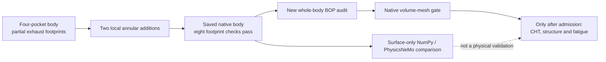

# M64 — whole-body spring support and GPU audit, 27 September 2026

## Actual geometry advance

The preceding [four-pocket prototype](M64_COMPLETE_HEAD_INTEGRATION_20260927.md)
did not fully support its two exhaust spring-seat footprints. Two local annular
pads now complete those footprints in a **new private whole-body candidate**.
This is an actual native Boolean construction, not an illustration or an LLM
claim. It remains a body prototype, not a complete or fabrication-approved head.

| Check on the saved candidate | Result |
|---|---|
| Native exact BRepCheck / saved reread | valid, one solid, one shell, 4,918 faces |
| Four washer footprints, at floor and 0.001 unit below | all eight complete; no missing faces |
| Previous exhaust missing footprint areas | 25.637847 and 30.564152 scan units² |
| Added material | approximately 135.07 scan units³, confined to the two pads |
| Removed material | zero |
| Overall bounding box | unchanged within the stated 1e-6 numerical gate |
| Local exterior contour | **changed**; functional justification is missing spring support |
| Pad-to-port minimum distance | 11.510490 scan units; no common solid |
| Pad-to-guide minimum distance | 1.503330 scan units against the four retained STEP guides |
| Four nominal spring annuli | remain free of body intersection |
| Original source files and retained in-memory body | unchanged |

Dimensions are **uncalibrated scan units**, with a provisional registration of
one unit per millimetre. The chosen pads have radii 7–16 and axial coordinates
55.1–58.1. Their 3-unit thickness is a design hypothesis, not a structural
allowable. Full geometric footprint coverage is not proof of uniform load,
stiffness, fatigue strength, washer bending resistance or heat rejection.
The queried floor gaps adjoin inherited fin/contour surfaces; preservation of
all functional passages remains unqualified. The global box being unchanged does **not** mean the
original exterior skin is unchanged.

An independent read-only volume-accounting check gives 135.0683961790 for the
adaptive whole-body volume difference, versus 135.0681740093 for the isolated
added shape: a residual of 0.00022217 (about 1.645 ppm of the addition). This
supports the rounded volume, not exact mass closure or a certified error bound.

The pads alone do not represent the valve train. A subsequent native assembly
now includes four **actually extended** retained valves, described below;
retainers, locks, spring wire, actuation and covers remain absent.

## Four longer valves integrated into the whole body

The accepted [isolated-copy producer](../../twins/m64-cylinder-head/source/wholebody/build_extended_valve_assembly_v2.py)
extends only each retained radius-3 stem from axial coordinate 82 to 105.
The imported cylinder axis, radius and tip cap are measured before construction.
Each extension adds 650.309679293 scan units³; native difference checks find no
removed original material and no addition outside that coaxial extension.
The lower valve profiles, four seats and four guides are retained.

The saved assembly has **13 valid solids**: the padded body, four extended
valves, four seats and four guides. Each solid and the saved compound pass
exact BRepCheck/readback. Eight body-versus-valve intersection checks on the
reread assembly are empty: closed and declared full lift for each valve
(intake 11.5, exhaust 9.6, along the negative valve axis). Minimum body distances
are approximately 1.5 closed and 2.5 at full lift, in uncalibrated scan units.
These are **two-position body-only checks**, not a continuous motion sweep,
valve-to-valve/piston clearance, seat sealing, guide-fit or dynamic validation.
Keeper grooves and retainer/supplier interfaces are not invented.

The first producer was rejected by its retained-body byte guard. A native
witness reproduces `BRep_Builder.Add` changing the child's `Free` flag,
consistent with the observed one-byte difference; this is not a proof of
binary-format equivalence. Its source/output remain retained and rejected. The new
producer deep-copies retained native inputs before assembly; the same byte
guards now pass without relaxing the gate. This is not a geometry repair.

| Private assembly artifact | SHA-256 |
|---|---|
| Accepted 13-solid binary assembly | `26e6108befb19fda527b1f6b0976bce98d625400dd0dca0abcca9472ad109f01` |
| Accepted assembly report | `4a70920663d43bea0546f21eb40a8d5253beeb5f8fe797ecc0baf90db426e1fa` |
| Accepted producer | `6888b2c76af20ad9f4aa8479505c2eae3f1fbcbcff0c6882336b93f9095f6fd6` |

The [native section renderer](../../twins/m64-cylinder-head/source/wholebody/render_extended_valve_sections.py)
produced and visually checked a private two-panel cut at X = −22.5 / +22.5
through this saved assembly. Gray is the body, cyan the valves, gold the seats,
purple the guides. Curves are sampled for display only; the closed-position
image is not a functioning-engine animation. PNG SHA-256:
`5dfbd171819a1126157338fb2e5ab3f6ebafc7cf29707b39adea6d5d505dc8a6`.
The actual private image is not published on PorscheFanatics.

## Reproducibility and private geometry

Sources:

- [Native pad builder](../../twins/m64-cylinder-head/source/wholebody/build_spring_seat_pads.py).
- [Non-healing text BRep / surface exporter](../../twins/m64-cylinder-head/source/wholebody/export_native_body.py).
- [PhysicsNeMo comparison](../../twins/m64-cylinder-head/source/wholebody/audit_surface_gpu.py).
- [Bounded diagnostic job](../../twins/m64-cylinder-head/source/wholebody/run_support_audit.sh).

| Private artifact | SHA-256 |
|---|---|
| New binary body | `111342292d92b7303072ecc5be606047ac810df25ee4fa5c112f992404224c60` |
| Native construction report | `da3dd990f8ef802459cdedb8efd0600aa9274632303b11dd978cdf761d17272a` |
| Text BRep export | `b2b48fe40edd1a20c8e6c0d20d77e6045931189f18330b441b09bcbf4618fc0a` |
| Surface NPZ | `9660e54dc3215bbdfd2a2710fff4108e65b2447d5642a0e583c06d86492281b2` |

The private surface contains 66,555 points and 94,676 triangles. OCP tessellation
uses linear deflection 0.18 and angular deflection 0.25 radians, no smoothing,
welding, repair or decimation. This raw per-face display surface is **not** a
watertight analysis mesh or a certified CAD-distance bound.
Scans, BReps, mesh coordinates and their actual renderings stay private.

## Compute and software scope

The new owned Vast instance is `53035236`: provider offer `46745582`, 64 effective
CPU cores, 257,580 MB RAM, one RTX PRO 6000 WS (97,887 MB reported VRAM), 500 GB
disk, quoted total 1.898148 USD/h. A separate hash-checked deadline guard was
armed before the paid call. This attempt has a 5 USD ceiling, including a
cleanup reserve and transfer allowances, and a 90-minute maximum window.
The existing LLM instance is not controlled or billed to this attempt.
Provider specifications are not evidence that the runtime or solver passed.

The selected job reuses the frozen OCCT strict-check and Gmsh meshing tools.
The new GPU diagnostic compares PhysicsNeMo's actual `Mesh.cell_areas` and
`Mesh.cell_normals` on CPU and CUDA with the retained NumPy cross-product
reference. It records quality metrics and versions without repairing the mesh.
The [NVIDIA Mesh API](https://docs.nvidia.com/physicsnemo/latest/physicsnemo/api/mesh/core.html)
documents these geometric operations; they do not solve combustion or heat
transfer. No surrogate is trained on unqualified results.

The fresh local Omniverse/SimReady Content Agents preflight is **blocked**:
the pinned Content Agents checkout is absent and the Material, Physics and
OVRTX endpoints do not answer. No conversion, material assignment or Omniverse
validation is claimed. The CAD-to-SimReady skill requires this readiness gate
before downstream asset processing. A separate approved NVIDIA wrapper exists,
but that alone does not establish working services.

OpenFOAM/CHT, iceengineFoam, Cantera, AdditiveFOAM, PicoGK and the existing FEA
work remain in the project stack. Their historical runs do not qualify this
new solid. Hot material cards, boundary conditions, gas/air/oil domains, coupled
valve motion and manufacturing inputs are not fabricated merely to launch a
solver. The remote image has OCP, Gmsh, PhysicsNeMo and PyVista, but the probed
Cantera module, OpenFOAM/AdditiveFOAM executables, Docker and .NET are absent;
the three Omniverse service endpoints also do not answer on that node.

## Actual remote results — admission remains closed

Runtime verification found 64 CPUs, a cgroup limit of about 241.48 GiB,
RTX PRO 6000 Blackwell with 97,887 MiB, driver 595.84, OCP 7.9.3.1,
Gmsh 4.15.2, Torch 2.10.0+cu129 and PhysicsNeMo 2.2.0.
Input and executed-source checksums match before and after the main job.

The [error-aware native BOP audit](../../twins/m64-cylinder-head/source/wholebody/audit_native_bop.py)
**passes on the new padded body**: exact validity, one solid, five selected
argument-analysis modes, no faulty entries, errors or warnings. Wall time is
203.16 seconds. This result applies to the body, not a BOP audit of the entire
13-solid valve assembly.

Three native-body tetrahedral trials completed, with no CAD healing, scaling,
defeaturing or surface decimation. All remain **rejected** at the existing
`minSICN >= 0.1` project gate; no threshold was lowered.

| Gmsh trial | Tetrahedra | Below 0.1 | Minimum minSICN | Outcome |
|---|---:|---:|---:|---|
| Delaunay, no optimizer | 251,149 | 4,990 | 0.0000406853 | quality rejected |
| HXT, no optimizer | 325,113 | 7,549 | negative near zero | quality/integrity rejected |
| Delaunay + Netgen | 240,975 | 1,240 | 0.0015626580 | improved, still quality rejected |

Netgen reduces the count below threshold, but its bad-element volume fraction
increases from about 0.1603% to 0.2902%; it is not an unqualified improvement.
Both Delaunay trials retain positive Jacobians, one connected region, complete
boundary matching and all 4,918 CAD faces. HXT has a zero Jacobian before
serialization, 20 nonpositive Jacobians after reread, and a changed surface
triangulation signature. The CAD-volume discrepancy is about 0.28748% in the
two unoptimized trials; volume agreement alone does not admit either mesh.

The actual PhysicsNeMo CPU/CUDA comparison is **rejected**. Normal vectors
agree at the declared tolerances, but 1,389 CPU and 1,382 CUDA triangle areas
fail against the NumPy reference (`rtol=1e-10`, zero absolute allowance).
CPU/CUDA areas disagree on 376 triangles. Maximum absolute area differences
versus NumPy are about 8.33e-10 scan units²; small absolute errors do not negate
the relative failures. Inspection of the installed `_triangle_areas` function
shows Lagrange's identity with a clamped difference of products, while the
reference uses a cross product. Cancellation on very thin triangles is a
plausible explanation, **not yet a high-precision-confirmed diagnosis**.
Quality arrays were recorded but are not an independently validated metric.
The cold single-call timings are not a GPU speedup benchmark.

| Private remote report | SHA-256 |
|---|---|
| BOP | `ce60b32f19dc5c0e12ccf1c4af106d2435144da66753df0baf34e16287d6d88f` |
| PhysicsNeMo | `bd2b6eed1def6f5069dc01a04a836dedc6c8894740b44b91133b408ac660ec5b` |
| Delaunay | `7a1303944848616a8a7324ae918b1f105412a7289db022e7b4f80455a71b42e6` |
| HXT | `3b305342b661b9f826ab33927c44d2ec2de362423702a30d5a2091558c65bb7c` |
| Delaunay + Netgen | `72bdc91738d4589f9c03259166a8e09655d58d48c045dc725a8b71b4485cc087` |

The remote results and private meshes were collected, with matching local and
remote report/mesh hashes. Instance **53035236 was destroyed and verified
absent**; the existing LLM instance was left untouched. From creation at
21:12:33 UTC to confirmed closure before 21:39:22 UTC, quoted compute cost is
at most approximately **0.85 USD**, excluding transfer and provider billing
rounding. This is an elapsed-time estimate, not a final invoice.

Next engineering gates are targeted mesh-quality repair with unchanged CAD
surfaces, high-precision area-error localization, continuous valve/seat/guide
and piston-clearance checks, then qualified gas/air/oil domains and hot material
loads. The 0.040 mm target, thermal resistance, fatigue, print process and
manufacturing release are **not established by this run**.

## Repository verification

`make check` completes successfully: the main discovered suite runs 3,162 tests
with 143 explicit skips, followed by the repository's additional checks.
The strict documentation audit finds zero broken links across 557 Markdown
files. Native private runs and image inspection supplement these software
tests; none substitutes for mechanical or manufacturing validation.
Whitespace-only diff warnings remain in the literal patch context and the
already hash-bound producer/test trailing blank lines; executed sources were
not reformatted after the recorded run.

## Git and public presentation

Remote `main` at `967f40c` was fetched and merged into the working branch as
`aad694c`. The generated report index was regenerated to resolve its only merge
conflict. Existing scans/archives brought by upstream were not republished to
the website or treated as validated master geometry.

A narrow `fetch-current` extension to the installed GitHub wrapper uses the
same approved repository and secret path as `push-current`. It reads only
`main` and the current `codex/*` branch; credential helpers stay disabled.
The frozen repository wrapper was not edited. The [patch](../../deploy/openbao/github-fetch-current.patch)
and its offline test record that change.

The PorscheFanatics page is prepared separately at
`/engine/m64-four-valve-head/`. It uses an original symbolic diagram, selected
scalar evidence and explicit prototype limitations, not private CAD renders
or unlicensed supplier photography. Publication needs a site-scoped approved
deployment identity; the engineering-only GitHub identity does not supply it.
