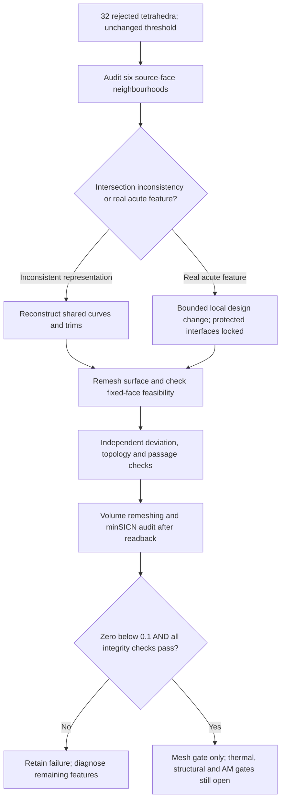

# M64 — research-backed route to zero rejected tetrahedra, 28 September 2026

## Decision

Executed follow-up: [bounded chamfer and native tip-cut trials](M64_BOUNDED_MESH_TRIALS_20260928.md).
The sampled curve-repair hypothesis is not supported; intermediate DelOptim
fails a topology witness, and bounded spherical cuts are not admitted.
The retained volume mesh remains at 32 rejected elements.

**The best-supported next experiment is bounded boundary reconstruction, then
volume remeshing — not another fixed-skin optimisation run.** Test shared-curve
repair without changing the intended solid first. Where a genuine acute feature
remains, evaluate a small, explicitly bounded local chamfer as a *design change*,
with independent geometry and topology checks. This is a candidate solution,
not a demonstrated zero-defect result.

The retained result is still **32 tetrahedra below minSICN 0.1**, out of
1,341,461. Eight retained surface triangles on source faces **141, 143, 686,
1411, 1413 and 1648** make zero impossible while that exact triangulated skin is
fixed. The [measured checkpoint](M64_FIXED_SKIN_PROGRESS_20260928.md) supplies
the hashes, algebra and numerical witnesses. These identifiers do not establish
anatomical or functional roles.

This review adds no geometry, simulation result, paid rental or release claim.
“Zero” means zero elements rejected by the unchanged mesh-quality threshold.
It does **not** mean zero physical uncertainty. The separate
[0.040 mm carrier-displacement screen](M64_G10_PHYSICSNEMO_20260926.md)
is not a geometric-deviation allowance, printer resolution or Porsche tolerance.

## Scope and primary-source review

Search cutoff: **28 September 2026**. This is a targeted review, not a claim to
have found every publication. Searches covered acute-feature tetrahedralisation,
B-Rep intersections, sliver removal, bounded geometric error, GPU distance
queries, learned mesh quality and September 2026 refinement papers. Primary
papers, author manuscripts, author repositories and publisher records were
cross-checked against our existing trials. Secondary summaries were discovery
aids, not technical evidence.

For the two leading implementation candidates, the manuscript's relevant
algorithm/limitations sections and repository source were inspected. Other
entries explicitly identify abstract-only or unverified implementation status.
No paper's benchmark success rate is a success probability for this head.

| Publication / date and source | Relevant finding and decision for this head |
|---|---|
| Diazzi et al., **Surface chamfering for robust tetrahedral meshing**, TOG/SIGGRAPH, July 2026. [Author manuscript](https://cims.nyu.edu/gcl/papers/2026-chamfering.pdf), [DOI](https://doi.org/10.1145/3811395), [DelOptim code](https://github.com/MarcoAttene/DelOptim). | **Priority experiment.** Chamfer acute constraints, then refine. The intermediate guarantee concerns triangle face angles, not minSICN or dihedral angles. The final exact-conformance stage can reintroduce poor cells. Section 5.7 describes optional sliver handling as heuristic, without a convergence proof. Our previous full-pipeline trial failed; a bounded intermediate-stage experiment is different. |
| Zhou et al., **Topology-First B-Rep Meshing**, preprint, 2 April 2026. [Full text](https://arxiv.org/html/2604.02141v1). | **Use the construction principle:** shared 3D curves, consistent stitching and CAD-entity constraints. Section 6 explicitly offers only best-effort geometry and preserves pathological input topology. It therefore cannot supply our deviation certificate or remove a real acute corner automatically. A runnable author implementation was not located in this search. |
| Wang et al., **Improving the Watertightness of Parametric Surface/Surface Intersection**, CGF; first online **27 December 2025**, not a new September 2026 result. [Publisher abstract](https://onlinelibrary.wiley.com/doi/10.1111/cgf.70298). | **Conditional geometry route.** Couple the two parametric intersection representations and minimise their mapped gap. Relevant only after measuring an actual curve/surface inconsistency; not evidence that all six current faces have one. Publisher abstract inspected; full implementation and reusable code not verified. |
| Fan et al., **GPU-accelerated Certified Hausdorff Distance Between Triangle Meshes**, SIGGRAPH 2026 journal-track work. [Author project and manuscript](https://min-tang.github.io/GCHD/), [code](https://github.com/fhp-transient/gpu-hausdorff). | **Verification accelerator, not a mesher.** Computes enclosing bounds for a directed mesh-to-mesh distance. Run both directions. Manuscript limitations warn that nearly degenerate/extreme-aspect-ratio cases may need FP64 for strict certification. Upstream documents Windows, not a demonstrated Linux build. No GPU speedup or certificate is yet established on our head. |
| Sacht and Jacobson, **Cascading upper bounds for triangle soup Pompeiu–Hausdorff distance**, SGP/CGF 2024. [Author implementation](https://github.com/leokollersacht/pompeiu_hausdorff). | **CPU reference for the new distance check.** Not new research, but the explicitly identified baseline for Fan et al. C++ and Python interfaces return lower/upper bounds. Inspect and test its precision and stopping behaviour before relying on it; no full-head run is claimed. |
| Shahsavari et al., **CORTET: Robust generation of simulation-ready cortical meshes**, July 2026 preprint, inspected v2. [Methods](https://arxiv.org/html/2607.12157v2). | CGAL/pygalmesh, Gmsh and meshtool form a staged quality pipeline; optional boundary snapping follows. **Useful workflow, not a CAD drop-in:** cortical surfaces lack our protected seats, passages and B-Rep interfaces; its quality definition is not minSICN. Methods inspected, implementation not executed. Snapping back to an incompatible boundary would recreate our problem. |
| Quiriny et al., **Taming Slivers: A Robust TFEM Framework for Reliable Computations on Degenerate Tetrahedral Meshes**, June 2026 preprint. [Full text](https://arxiv.org/html/2606.14301v1). | Changes the finite-element formulation to tolerate certain degeneracies. **Separate future cross-check, not a zero-defect fix.** Using it would not turn our 32 rejected cells into accepted cells or establish thermomechanical/LPBF validity. Its mathematical assumptions and solver scope need separate qualification. |
| Parry, Winovich and Owen, **Learning-Based Prediction of Tetrahedral Mesh Quality under Nondeterministic Meshing**, SIAM IMR, 4 June 2026. [Publisher record](https://epubs.siam.org/doi/10.1137/1.9781611979138.20). | Predicts local meshing difficulty from CAD features. **Defer model training:** we already have measured failure locations on six surfaces. Predictions could prioritise a later large design campaign, but cannot certify the generated mesh. Publisher abstract and accessible paper excerpts inspected. |
| Binninger et al., **TetWeave**, SIGGRAPH 2025. [Paper](https://arxiv.org/abs/2505.04590), [CUDA implementation](https://github.com/AlexandreBinninger/TetWeave/). | Adaptive tetrahedral representation for **surface reconstruction**. Not a guarantee of a minSICN-compliant engineering volume mesh or faithful native interfaces. **Do not replace the head with a learned/reconstructed shape** just to obtain a smoother GPU result. Paper record and author repository inspected, not run. |
| Korotov and Michaud, **Largest-dihedral-angle bisection algorithm does not preserve mesh regularity for tetrahedral partitions**, **16 September 2026**, preprint. [Full text](https://arxiv.org/html/2609.18788v1). | Gives a degenerating refinement branch despite non-extreme dihedral angles. **Reject “keep bisecting until good” as a guarantee.** This is a counterexample for a specified algorithm, not a proof that every adaptive mesher fails. The construction and scope were inspected. |
| Korotov, **On degeneration of tetrahedra under longest-edge n-section refinement**, **24 September 2026**, preprint. [Full text](https://arxiv.org/html/2609.29153v1). | Conforming refinement and shrinking cell diameters need not preserve shape regularity. **Refinement must be coupled to quality admission.** This does not establish that our existing Gmsh run follows the counterexample or that every FE solution diverges; the paper explicitly separates those claims. |
| Tong and Zhang, **Planar-faced and high-Jacobian two-refinement hexahedral templates**, **25 September 2026 v2**, preprint. [Full text](https://arxiv.org/html/2609.14729v2). | Interesting alternate element family, but not a repair of the current tetrahedra. The paper promises a GitHub release on acceptance; a runnable author package was not verified. **Reserve route only:** hex reconstruction requires new boundary, element-quality and solver checks. A zero tetrahedron count obtained by switching element type is not our requested pass. |

The selected sources distinguish published work from fresh preprints. Newness
alone is not a validation criterion. The chamfering manuscript identifies
article **148**, while the repository README says **146**; use the DOI and
pinned implementation, not the inconsistent README article number.

## What source inspection changes in the next experiment

### DelOptim is already available, but its default is not our experiment

The inspected upstream HEAD is unchanged from our previous build:
`761eaa4ac23168567e06a3ce64f2061af1ec190c`.
Its [main.cpp](https://github.com/MarcoAttene/DelOptim/blob/761eaa4ac23168567e06a3ce64f2061af1ec190c/src/main.cpp)
sets `epsilon = DBL_MAX` and `cham_safe = false`. `-a` skips enriched CDT;
`-x` requests `DR_mesh.tet`. `-e` filters small constraints; it is **not** an
absolute displacement tolerance. `-m` caps refinement, not convergence.

Therefore do not run unmodified `-a` and call the resulting shape acceptable.
A separately pinned research build must expose a finite positive chamfer bound
and record the safe/heuristic mode. Keep constraint filtering disabled. Audit
the actual intermediate writer and its interior/exterior split. Reuse our
[serialization patch](../../twins/m64-cylinder-head/source/wholebody/delmesher-tet-precision.patch)
and independent readback checks where applicable; never silently reorder mixed
cell signs or drop almost-flat cells. The existing historical runner stays
unchanged. These source facts make the alternative actionable, but **this new
build and its tests have not yet been implemented or run**.

### A distance interval is not a manufacturing certificate

Inspected revisions:

- GPU distance: `e801932675600e78480e8f4ea6cd9d5aec355166`, MIT code;
  [platform notes](https://github.com/fhp-transient/gpu-hausdorff/blob/e801932675600e78480e8f4ea6cd9d5aec355166/REPLICABILITY.md).
- CPU reference: `b67d6188e7f821967659e8a2b693bdf227da1127`, MPL-2.0 code;
  [interface](https://github.com/leokollersacht/pompeiu_hausdorff/blob/b67d6188e7f821967659e8a2b693bdf227da1127/README.md).

For reference triangulation `P` and candidate boundary `M`, compute both
directed intervals and retain `U = max(U(P→M), U(M→P))`. The normalised
upper-minus-lower gap is a **convergence tolerance**, not the maximum permitted
shape change. A small gap around a large distance is still a large deviation.
Require finite ordered bounds, completed convergence and no resource failure.

If `S` is the native reference surface, the triangle inequality gives
`H(S,M) <= H(S,P) + U`. Consequently a mesh-to-mesh result cannot close native
CAD deviation without a justified bound for `H(S,P)`, nor physical accuracy
without calibrated source data. FP32/FP64 discrepancies, translation/scale
sensitivity and floating-point enclosure must also be assessed. The GPU
[CMake configuration](https://github.com/fhp-transient/gpu-hausdorff/blob/e801932675600e78480e8f4ea6cd9d5aec355166/CMakeLists.txt)
enables `--use_fast_math`; its effect needs checking rather than treating the
word “certified” as blanket assurance for our skinny geometry.

Small Hausdorff distance alone does **not** preserve topology, wall thickness,
an air gap, boundary labels or material volume. Those remain separate checks.

## Minimal, bounded execution sequence

These are **proposed experiments**, not completed jobs. Preserve the native
master and the retained 32-defect mesh as controls.

1. **Localise and classify before changing geometry.** Reuse the
   [native-face diagnostic](../../twins/m64-cylinder-head/source/wholebody/audit_native_acute_faces.py).
   Compare the shared 3D curve with both mapped parametric curves; inspect face
   normals, adjacent solids and the earlier air-gap/thin-lip witnesses. Distinguish
   representation defects from real features. Protect functional interfaces and
   preserve outside geometry. Unknown face roles block *acceptance* of a design
   change, not a private diagnostic trial.
2. **Try reconstruction first; bounded chamfer second.** Rebuild inconsistent
   common trims without a global envelope replacement. For a genuine acute
   feature, test local perturbation ceilings **0.005, 0.010 and 0.020 provisional
   scan units**, one neighbourhood at a time. These are proposed experiment
   limits, not validated manufacturing allowances, selected radii or the
   0.040 mm stiffness target. A global DelOptim diagnostic is not automatically
   a local native-CAD repair: prove localisation and protected-interface
   preservation before adoption. Do not expand the neighbourhood silently.
3. **Reject bad surfaces before expensive volume jobs.** For each retained
   linear triangle, the existing bound is `q3 <= 3*q2/(2+q2)`; reaching
   `q3 >= 0.1` requires `q2 >= 0.06896551724`. This is necessary, not sufficient.
   Check manifoldness, self-intersections, coincident distinct vertices and
   the protected air/material witnesses. A fail here stops that candidate.
4. **Measure shape error continuously and check volume independently.** Start
   with analytic distance witnesses: identical meshes, a known offset pair,
   a thin wedge, a translated copy and an intentionally unclosed interval.
   Then compare the real local patches in both directions. Check native B-Rep
   validity, boundary roles, component/cavity topology and passages separately.
   Reconcile native volume with both tetrahedral and oriented-boundary volume
   sums. After an intentional geometry change, equality to the *old* volume
   is not required; the changed volume and its geometric-error budget must be
   recorded rather than borrowing the old fixed-skin equality test.
5. **Remesh and reuse the existing quality auditor.** Compare native-boundary
   meshing with the bounded chamfer diagnostic. Reuse
   [the mesh readback/topology functions](../../twins/m64-cylinder-head/source/wholebody/trial_meshers_2026.py),
   [interior optimiser](../../twins/m64-cylinder-head/source/wholebody/optimize_fixed_skin_sicn.py)
   and [cavity exchanges](../../twins/m64-cylinder-head/source/wholebody/flip_fixed_skin_tetrahedra.py)
   only after their input contracts are satisfied. Require zero below 0.1,
   positive Jacobians, complete boundaries, one intended material component,
   preserved passages and labels, and no duplicate-coordinate pinch. Repeat
   on a refined discretisation; do not substitute a mean-quality score.

Use existing local/native-Linux resources for patch and distance witnesses
first. Proposed limits: 120 seconds per small witness, 1,200 seconds per
candidate mesher, private incremental receipts and an explicit nonconverged
status at any cap. Profile before increasing RAM or renting CUDA. Any future
paid run remains inside the existing **USD 10 campaign ceiling**, after
checking attributed spend and the working collection/billing guard; this
review does not reset that allowance. No price or whole-head runtime is
assumed from a paper benchmark.

## Avoid repeating the rejected routes

- Interior-only changes already reduced 47 to 32; they cannot beat the fixed
  skin's measured bound. An LLM or PhysicsNeMo optimiser does not remove it.
- The earlier [full DelOptim run](M64_MESH_VOLUME_TOOLCHAIN_20260928.md)
  restored original constraints and exported a mixed-sign near-flat cell.
  Do not report that as success or repeat it unchanged.
- The earlier fTetWild result had zero low-quality tets but coincident vertices
  at air gaps/material lips. Blind welding or accepting its quality histogram
  would erase the separate topology failure.
- Broad face deletion, global voxel smoothing and a new outer shape are not
  substitutes for local editable CAD. PicoGK remains a diagnostic/candidate
  tool under the [existing evidence limits](M64_NEMO_PICOGK_CONTINUATION_20260928.md).
- Omniverse rendering, neural predictions and a passing mesh gate do not close
  heat transfer, fatigue, valve dynamics, material or printing qualification.

**Handoff:** implement and test the finite-bound intermediate experiment and
the two-direction distance witnesses first; then trial the worst neighbourhood
around face 1648. Keep the current 32-defect status until a complete accepted
mesh is actually read back and audited. The research identifies a defensible
route and its failure conditions; it does not guarantee that the proposed
perturbation budget is sufficient.

## Verification of this documentation change

The report index check passes, the strict link checker reports **zero broken
links across 570 Markdown files**, and `git diff --check` passes. Only this
report and the generated index change. The full numerical/test suite was not
rerun for this documentation-only addition; no new mesh result is claimed.
