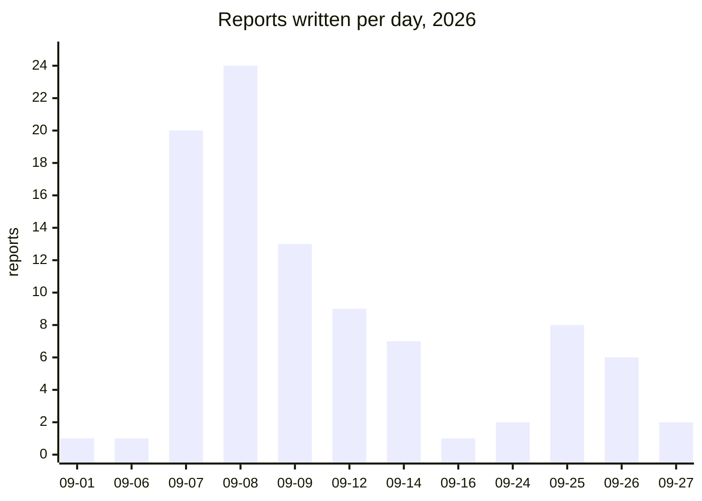

<!-- generated by scripts/render_reports_index.py - do not edit by hand -->

# Execution and audit reports

108 reports of runs, audits and checkpoints, newest first (14 undated, listed last). A report records what was run and what it found on that day; later work may have superseded it. Nothing here releases a part — see [SAFETY.md](../../SAFETY.md).

## September 27, 2026

| report | file |
|---|---|
| M64 — complete-head integration gate, 27 September 2026 | [`M64_COMPLETE_HEAD_INTEGRATION_20260927.md`](M64_COMPLETE_HEAD_INTEGRATION_20260927.md) |
| Software stack review, September 27, 2026 | [`SOFTWARE_STACK_REVIEW_20260927.md`](SOFTWARE_STACK_REVIEW_20260927.md) |

## September 26, 2026

| report | file |
|---|---|
| M64 G10 — PhysicsNeMo field trial and the 0.040 mm stiffness target | [`M64_G10_PHYSICSNEMO_20260926.md`](M64_G10_PHYSICSNEMO_20260926.md) |
| M64 G11 — bounded support redesign toward 0.040 mm | [`M64_G11_SUPPORT_STIFFNESS_20260926.md`](M64_G11_SUPPORT_STIFFNESS_20260926.md) |
| M64 G12 — central-support FEA and rejected refinements | [`M64_G12_FEA_20260926.md`](M64_G12_FEA_20260926.md) |
| M64 G12 — localized central-foot reinforcement | [`M64_G12_LOCAL_BUTTRESSES_20260926.md`](M64_G12_LOCAL_BUTTRESSES_20260926.md) |
| M64 G13 — reference repair and unchanged-foot upper spines | [`M64_G13_SUPPORT_REFERENCE_20260926.md`](M64_G13_SUPPORT_REFERENCE_20260926.md) |
| M64 G14 — targeted support stiffening | [`M64_G14_TARGETED_SUPPORTS_20260926.md`](M64_G14_TARGETED_SUPPORTS_20260926.md) |

## September 25, 2026

| report | file |
|---|---|
| M64 G3 — concordant seats and detection of lateral leaks | [`M64_G3_SEAT_CONTACT_20260925.md`](M64_G3_SEAT_CONTACT_20260925.md) |
| M64 G4 — spring pockets and outlets corrected | [`M64_G4_SPRING_LAYOUT_20260925.md`](M64_G4_SPRING_LAYOUT_20260925.md) |
| M64 G5 — articulated rockers and cams conjugate to their motion | [`M64_G5_ARTICULATED_ROCKERS_20260925.md`](M64_G5_ARTICULATED_ROCKERS_20260925.md) |
| M64 G6 — supported CAD, hot-load screens and virtual build preparation | [`M64_G6_CARRIER_THERMAL_AM_20260925.md`](M64_G6_CARRIER_THERMAL_AM_20260925.md) |
| M64 G7 — local supports and finite-air cooling | [`M64_G7_LOCAL_SUPPORTS_COOLING_20260925.md`](M64_G7_LOCAL_SUPPORTS_COOLING_20260925.md) |
| M64 G8 — isolated carrier compliance and resource pilot | [`M64_G8_CARRIER_FEA_PILOT_20260925.md`](M64_G8_CARRIER_FEA_PILOT_20260925.md) |
| M64 G8 — CPU/GPU matrix benchmark and reference audit | [`M64_G8_CPU_GPU_MATRIX_BENCHMARK_20260925.md`](M64_G8_CPU_GPU_MATRIX_BENCHMARK_20260925.md) |
| M64 G9 — reference replay and finer carrier meshes | [`M64_G9_REFERENCE_REQUALIFICATION_20260925.md`](M64_G9_REFERENCE_REQUALIFICATION_20260925.md) |

## September 24, 2026

| report | file |
|---|---|
| M64 G2 — fixing the clearance volume calculation | [`M64_G2_COMPRESSION_AUDIT_20260924.md`](M64_G2_COMPRESSION_AUDIT_20260924.md) |
| M64 G2 — candidate spark plugs and a digitally closed chamber | [`M64_G2_SPARK_PLUG_PACKAGING_20260924.md`](M64_G2_SPARK_PLUG_PACKAGING_20260924.md) |

## September 16, 2026

| report | file |
|---|---|
| M64 G2 — ports, cooling, gallery and compression ratio | [`M64_G2_HEAD_FEATURES_20260916.md`](M64_G2_HEAD_FEATURES_20260916.md) |

## September 14, 2026

| report | file |
|---|---|
| M64 — G0, critical interface contract | [`M64_G0_INTERFACE_CONTRACT_20260914.md`](M64_G0_INTERFACE_CONTRACT_20260914.md) |
| M64 — G1, 4-valve / twin-spark twins, assembly and iteration | [`M64_G1_FOUR_VALVE_SKELETON_20260914.md`](M64_G1_FOUR_VALVE_SKELETON_20260914.md) |
| M64 — G1, CadQuery parametric skeleton | [`M64_G1_PARAMETRIC_SKELETON_20260914.md`](M64_G1_PARAMETRIC_SKELETON_20260914.md) |
| M64 — interfaces measured on the 935 cylinder-head scan (level C) | [`M64_SCAN935_INTERFACES_20260914.md`](M64_SCAN935_INTERFACES_20260914.md) |
| M64 — strict check profile and volume reconciliation (09/14/2026) | [`M64_STRICT_CHECK_PROFILE_20260914.md`](M64_STRICT_CHECK_PROFILE_20260914.md) |
| M64 V1 — four-valve valvetrain: kinematics and simplified dynamics | [`M64_V1_VALVETRAIN_20260914.md`](M64_V1_VALVETRAIN_20260914.md) |
| M64 4V — valve spring selection from supplier data sheets | [`M64_VALVE_SPRING_SELECTION_20260914.md`](M64_VALVE_SPRING_SELECTION_20260914.md) |

## September 12, 2026

| report | file |
|---|---|
| M64 — CAD pilot with Qwen agents on Vast | [`M64_CAD_AGENT_PILOT_20260912.md`](M64_CAD_AGENT_PILOT_20260912.md) |
| Targeted trial of cadrille and CAD-Recode — September 12, 2026 | [`M64_CAD_SPECIALISTS_20260912.md`](M64_CAD_SPECIALISTS_20260912.md) |
| M64 — GPU research as of September 12, 2026 | [`M64_GPU_RESEARCH_20260912.md`](M64_GPU_RESEARCH_20260912.md) |
| M64 — jobs 2, 3 and 4 prepared, with no new native computation | [`M64_JOBS_234_20260912.md`](M64_JOBS_234_20260912.md) |
| M64 — scripted campaigns, 38 USD Vast budget | [`M64_LOW_TOKEN_CAMPAIGN_20260912.md`](M64_LOW_TOKEN_CAMPAIGN_20260912.md) |
| Neural Concept: application to the turbo M64 | [`M64_NEURAL_CONCEPT_20260912.md`](M64_NEURAL_CONCEPT_20260912.md) |
| M64 — PhysicsNeMo-Mesh actually run on Vast | [`M64_PHYSICSNEMO_MESH_PILOT_20260912.md`](M64_PHYSICSNEMO_MESH_PILOT_20260912.md) |
| M64 — two LPBF coupons executed and cross-checked | [`M64_QUADRATURE_EXECUTION_20260912.md`](M64_QUADRATURE_EXECUTION_20260912.md) |
| M64 turbo: research, decisions and test preparation | [`M64_RESEARCH_EXECUTION_20260912.md`](M64_RESEARCH_EXECUTION_20260912.md) |

## September 9, 2026

| report | file |
|---|---|
| M64 — targeted correction of the hexahedron/pyramid transitions | [`M64_APEX_TRANSITIONS_20260909.md`](M64_APEX_TRANSITIONS_20260909.md) |
| M64 — OpenFOAM defects localized, without modifying the outline | [`M64_DEFECT_LOCALISATION_20260909.md`](M64_DEFECT_LOCALISATION_20260909.md) |
| M64 — edge redistribution and joint remeshing | [`M64_EDGE82_JOINT_REMESH_20260909.md`](M64_EDGE82_JOINT_REMESH_20260909.md) |
| M64 — global dual conversion executed, then rejected | [`M64_GLOBAL_DUAL_REJECTION_20260909.md`](M64_GLOBAL_DUAL_REJECTION_20260909.md) |
| M64 — hybrid domain assembled; OpenFOAM check executed and refused | [`M64_HYBRID_OPENFOAM_20260909.md`](M64_HYBRID_OPENFOAM_20260909.md) |
| M64 — pairwise correction of the hybrid mesh | [`M64_HYBRID_PAIR_CORRECTION_20260909.md`](M64_HYBRID_PAIR_CORRECTION_20260909.md) |
| M64 — incomplete local size trial | [`M64_LOCAL_SIZE_TRIAL_20260909.md`](M64_LOCAL_SIZE_TRIAL_20260909.md) |
| M64 — conservative correction of mixed groups | [`M64_MIXED_CELL_CORRECTION_20260909.md`](M64_MIXED_CELL_CORRECTION_20260909.md) |
| M64 — native size field: remeshing still incomplete | [`M64_NATIVE_SIZE_TRIAL_20260909.md`](M64_NATIVE_SIZE_TRIAL_20260909.md) |
| M64 — controlled correction of a very small edge in the gas mesh | [`M64_SHORT_EDGE_CORRECTION_20260909.md`](M64_SHORT_EDGE_CORRECTION_20260909.md) |
| M64 — diagonal flips and neighboring contacts | [`M64_SURFACE_DIAGONAL_AUDIT_20260909.md`](M64_SURFACE_DIAGONAL_AUDIT_20260909.md) |
| M64 — Delaunay / MeshAdapt comparison on the port | [`M64_SURFACE_METHOD_COMPARISON_20260909.md`](M64_SURFACE_METHOD_COMPARISON_20260909.md) |
| M64 — isolated surface relocation, candidate rejected | [`M64_SURFACE_RELOCATION_20260909.md`](M64_SURFACE_RELOCATION_20260909.md) |

## September 8, 2026

| report | file |
|---|---|
| M64 700 PS — thermodynamic cross-check and limits of the inherited models | [`M64_700PS_CYCLE_MODEL_AUDIT_20260908.md`](M64_700PS_CYCLE_MODEL_AUDIT_20260908.md) |
| M64 700 PS — first computation with variable thermodynamics | [`M64_700PS_VARIABLE_THERMO_20260908.md`](M64_700PS_VARIABLE_THERMO_20260908.md) |
| M64 — intake, chamber and next useful computation | [`M64_ADMISSION_CHAMBRE_20260908.md`](M64_ADMISSION_CHAMBRE_20260908.md) |
| M64 — local tetrahedron agglomeration trial | [`M64_AGGLOMERATION_LOCALE_20260908.md`](M64_AGGLOMERATION_LOCALE_20260908.md) |
| M64 — locating the rejected mesh, before a multi-zone rebuild | [`M64_ANNULAR_MESH_LOCALISATION_20260908.md`](M64_ANNULAR_MESH_LOCALISATION_20260908.md) |
| M64 — hollowed body and intake meshing | [`M64_CORPS_ADMISSION_MAILLAGE_20260908.md`](M64_CORPS_ADMISSION_MAILLAGE_20260908.md) |
| M64 — correcting the C0 representation and repair trials | [`M64_CORRECTIONS_NATIVES_20260908.md`](M64_CORRECTIONS_NATIVES_20260908.md) |
| M64 — air volume and OpenFOAM execution | [`M64_DOMAINE_GAZ_OPENFOAM_20260908.md`](M64_DOMAINE_GAZ_OPENFOAM_20260908.md) |
| M64 — removed material and exhaust pocket walls | [`M64_EXHAUST_MATERIAL_CONTROLS_20260908.md`](M64_EXHAUST_MATERIAL_CONTROLS_20260908.md) |
| M64 — native exhaust passage: candidate kept, not validated | [`M64_EXHAUST_NATIVE_AUDIT_20260908.md`](M64_EXHAUST_NATIVE_AUDIT_20260908.md) |
| F58 — coupon with corrected Marangoni contract: incomplete run | [`M64_F58_CORRECTED_COUPON_20260908.md`](M64_F58_CORRECTED_COUPON_20260908.md) |
| M64 — controlled activation of flow in the F58 coupon | [`M64_F58_COUPLED_FLOW_20260908.md`](M64_F58_COUPLED_FLOW_20260908.md) |
| M64 — Marangoni predictor contract: native control case passed | [`M64_F58_PREDICTOR_CONTRACT_20260908.md`](M64_F58_PREDICTOR_CONTRACT_20260908.md) |
| M64 — spatial refinement of the AdditiveFOAM F58 control case | [`M64_F58_SPATIAL_REFINEMENT_20260908.md`](M64_F58_SPATIAL_REFINEMENT_20260908.md) |
| M64 — guide contacts and geometric preparation | [`M64_GEOMETRY_CHECKPOINT_20260908.md`](M64_GEOMETRY_CHECKPOINT_20260908.md) |
| M64 — defects localized, HXT trial and native correction | [`M64_LOCALISATION_ET_HXT_20260908.md`](M64_LOCALISATION_ET_HXT_20260908.md) |
| M64 — meshing the unified-partition domain | [`M64_MAILLAGE_PARTITION_UNIFIEE_20260908.md`](M64_MAILLAGE_PARTITION_UNIFIEE_20260908.md) |
| M64 — approximating the short edges: result and scope of the tolerances | [`M64_NATIVE_EDGE_APPROXIMATION_20260908.md`](M64_NATIVE_EDGE_APPROXIMATION_20260908.md) |
| M64 — Netgen recovery and OpenFOAM cross-check | [`M64_NETGEN_CONTRECONTROLE_20260908.md`](M64_NETGEN_CONTRECONTROLE_20260908.md) |
| M64 — PicoGK local junction witness, September 8, 2026 | [`M64_PICOGK_LOCAL_JUNCTION_WITNESS_20260908.md`](M64_PICOGK_LOCAL_JUNCTION_WITNESS_20260908.md) |
| M64 — remeshing the native domain with segmented continuity | [`M64_REMAILLAGE_NATIF_20260908.md`](M64_REMAILLAGE_NATIF_20260908.md) |
| M64 — one-chord remesh of the two short edges | [`M64_SHORT_EDGE_REMESH_20260908.md`](M64_SHORT_EDGE_REMESH_20260908.md) |
| M64 — local MeshAdapt remesh of four native faces | [`M64_SURFACE_MESHADAPT_20260908.md`](M64_SURFACE_MESHADAPT_20260908.md) |
| M64 — first meshed intake volume, OpenFOAM quality rejected | [`M64_VOLUME_REEL_CONTROLES_20260908.md`](M64_VOLUME_REEL_CONTROLES_20260908.md) |

## September 7, 2026

| report | file |
|---|---|
| M64 turbo 4V — state of the evidence as of September 7, 2026 | [`M64_AVANCEMENT_20260907.md`](M64_AVANCEMENT_20260907.md) |
| Local repair: displacement bound over the whole surface | [`M64_BERNSTEIN_GLOBAL_BOUND_20260907.md`](M64_BERNSTEIN_GLOBAL_BOUND_20260907.md) |
| CP1 — targeted supplement: one elevated-temperature point and expansion coefficients | [`M64_CP1_HOT_POINTS_SUPPLEMENT_20260907.md`](M64_CP1_HOT_POINTS_SUPPLEMENT_20260907.md) |
| 4V valvetrain: independent CAD sub-assembly built | [`M64_FOUR_VALVE_DISTRIBUTION_MODULE_20260907.md`](M64_FOUR_VALVE_DISTRIBUTION_MODULE_20260907.md) |
| Audit of a boundary-preserving deformation — September 7, 2026 | [`M64_IMPLICIT_BOUNDARY_BUBBLE_20260907.md`](M64_IMPLICIT_BOUNDARY_BUBBLE_20260907.md) |
| Local C2 trial: surface built, reinforcement rejected | [`M64_ISOLATED_C2_REJECTION_20260907.md`](M64_ISOLATED_C2_REJECTION_20260907.md) |
| Local Bernstein repair on reference 935 — September 7, 2026 | [`M64_LOCAL_BERNSTEIN_REPAIR_20260907.md`](M64_LOCAL_BERNSTEIN_REPAIR_20260907.md) |
| M64 — intake junction prototypes and HXT counter-trial | [`M64_LOCAL_FILLET_AND_HXT_COUNTERTRIALS_20260907.md`](M64_LOCAL_FILLET_AND_HXT_COUNTERTRIALS_20260907.md) |
| M64 — local mesh correction and blends still to be reworked | [`M64_LOCAL_MESH_AND_JUNCTION_FOLLOWUP_20260907.md`](M64_LOCAL_MESH_AND_JUNCTION_FOLLOWUP_20260907.md) |
| Real local SSH authentication — September 7, 2026 | [`M64_LOCAL_SSH_AUTH_SMOKE_20260907.md`](M64_LOCAL_SSH_AUTH_SMOKE_20260907.md) |
| Real local-reconstruction trial — September 7, 2026 | [`M64_LOCAL_TRANSITION_FILLING_20260907.md`](M64_LOCAL_TRANSITION_FILLING_20260907.md) |
| M64 — smooth surfaces, insert contacts and native mesh | [`M64_NATIVE_CAD_CONTACTS_AND_MESH_20260907.md`](M64_NATIVE_CAD_CONTACTS_AND_MESH_20260907.md) |
| M64 4V — gas passages and motion envelopes | [`M64_PORTS_AND_CONTINUOUS_MOTION_20260907.md`](M64_PORTS_AND_CONTINUOUS_MOTION_20260907.md) |
| Origin of the thin walls — scan 935 reference, September 7, 2026 | [`M64_REFERENCE_WALL_ORIGIN_20260907.md`](M64_REFERENCE_WALL_ORIGIN_20260907.md) |
| Audit of the available solid volumes — September 7, 2026 | [`M64_SOLID_MESH_AUDIT_20260907.md`](M64_SOLID_MESH_AUDIT_20260907.md) |
| TI 1570 (02/00) — access and evidence of a distinct repair | [`M64_TI1570_ACCESS_AND_REPAIR_SCOPE_20260907.md`](M64_TI1570_ACCESS_AND_REPAIR_SCOPE_20260907.md) |
| Four-valve module: seat and fit references | [`M64_VALVE_MODULE_PRIMARY_REFERENCES_20260907.md`](M64_VALVE_MODULE_PRIMARY_REFERENCES_20260907.md) |
| M64 — Vast attempt of September 7, 2026 | [`M64_VAST_EXECUTION_20260907.md`](M64_VAST_EXECUTION_20260907.md) |
| M64 — Vast loading preflight, September 7, 2026 | [`M64_VAST_LOADING_PREFLIGHT_20260907.md`](M64_VAST_LOADING_PREFLIGHT_20260907.md) |
| Vast: access restored and runtime ready — September 7, 2026 | [`M64_VAST_RUNTIME_READY_20260907.md`](M64_VAST_RUNTIME_READY_20260907.md) |

## September 6, 2026

| report | file |
|---|---|
| M64 — Vast attempts of September 6, 2026 | [`M64_VAST_EXECUTION_20260906.md`](M64_VAST_EXECUTION_20260906.md) |

## September 1, 2026

| report | file |
|---|---|
| Omniverse engine report F0 — 2026-09-01 | [`omniverse-engine-assembly-f0-2026-09-01.md`](omniverse-engine-assembly-f0-2026-09-01.md) |

## Undated

| report | file |
|---|---|
| F58 — energy balance of the AdditiveFOAM coupon | [`917_F58_COUPON_ENERGY_DIAGNOSTIC.md`](917_F58_COUPON_ENERGY_DIAGNOSTIC.md) |
| Twin-turbo M64 at 700 hp: computable target and engine research | [`M64_700CH_ENGINE_RESEARCH.md`](M64_700CH_ENGINE_RESEARCH.md) |
| Twin-turbo M64 at 700 hp — material, cooling and process campaign | [`M64_700CH_MATERIAL_COOLING_LPBF.md`](M64_700CH_MATERIAL_COOLING_LPBF.md) |
| M64 — preparing the full cylinder-head thermal analysis | [`M64_CHT_HEAD_INPUT_AUDIT.md`](M64_CHT_HEAD_INPUT_AUDIT.md) |
| M64 — CHT software preflight, not a cylinder head simulation | [`M64_CHT_RUNTIME_SMOKE.md`](M64_CHT_RUNTIME_SMOKE.md) |
| Four-pocket body — CAD audit of September 7, 2026 | [`M64_FOUR_SEAT_BODY_CAD_AUDIT.md`](M64_FOUR_SEAT_BODY_CAD_AUDIT.md) |
| M64 — material data re-read from the manufacturer PDFs | [`M64_HOT_MATERIAL_SOURCE_REVIEW.md`](M64_HOT_MATERIAL_SOURCE_REVIEW.md) |
| M64 — initial register of interfaces and sources | [`M64_INTERFACE_SOURCE_REGISTER.md`](M64_INTERFACE_SOURCE_REGISTER.md) |
| LEAP 71 integration — M64 preflight | [`M64_LEAP71_STACK.md`](M64_LEAP71_STACK.md) |
| M64 — multiphysics simulation scope | [`M64_MULTIPHYSICS_EXECUTION.md`](M64_MULTIPHYSICS_EXECUTION.md) |
| PicoGK — working on the real M64/4V body | [`M64_PICOGK_EXECUTION.md`](M64_PICOGK_EXECUTION.md) |
| Candidate surface groups for CHT preparation | [`M64_THERMAL_FACE_PROPOSALS.md`](M64_THERMAL_FACE_PROPOSALS.md) |
| M64 — bounded handling of Vast HTTP 429 | [`M64_VAST_RATE_LIMIT_DIAGNOSTIC.md`](M64_VAST_RATE_LIMIT_DIAGNOSTIC.md) |
| Vast SSH preflight — September 7, 2026 | [`M64_VAST_SSH_PREFLIGHT.md`](M64_VAST_SSH_PREFLIGHT.md) |

---

*Index generated by `scripts/render_reports_index.py`, checked by `make check`.*
