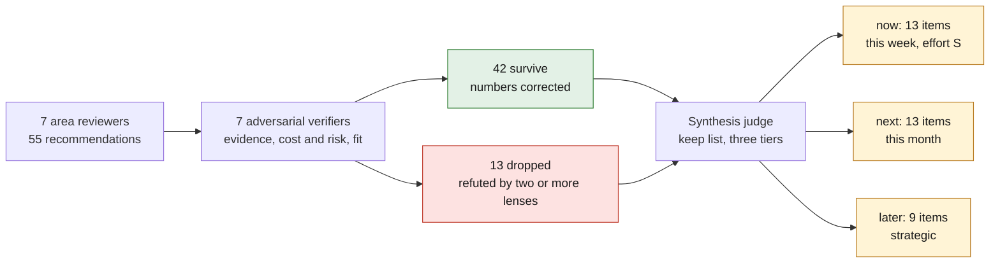
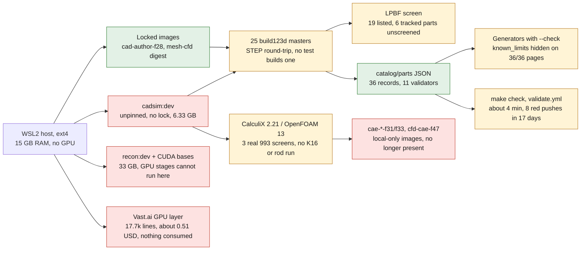

# Software stack review, September 27, 2026

This report reviews the stack that [docs/SOFTWARE_STACK.md](../SOFTWARE_STACK.md)
describes; it does not restate it. Every figure below was measured read-only on
the working tree of `feat/cooling-impeller-we43-f1` on 2026-09-27, or taken from
GitHub Actions logs and `gh api` answers of the same day. Where a reviewer's
first figure was corrected on verification, the corrected figure is used and the
correction is named. Nothing in this report is a manufacturing authorization, a
part validation or a release: it reviews software, provenance and process only.

## Verdict

What is genuinely strong is the provenance and fail-closed discipline wherever it
was designed in: the F-phase locked images (digest-pinned bases,
`--require-hashes` wheelhouses, per-recipe `.dockerignore` allow-lists, locks
that re-hash their inputs and caught the 2026-09-04 incident), the six generators
whose `--check` runs inside `make check`, the numeric registers that refuse a
number without a `source_id`, the OpenBao wrappers that keep every credential off
rented hosts, the 25 build123d masters that gate on `BRepCheck` plus a STEP
round-trip, the LPBF screen that reuses the pinned 917 kernel by `importlib`
without editing it, and evidence files that state what they do not claim. What is
over-built is the apparatus around the archived and the aspirational: 31
Dockerfiles installing OpenFOAM, Gmsh and CalculiX six to nine times in
inconsistent versions, 16 dormant 917 image workflows (four of which republished
images on 2026-09-09 from a documentation move), 33 GB of CUDA images on a
GPU-less host, and an AI/GPU launch layer of about 17.7k lines plus about 10k
test lines that has produced about 0.51 USD of compute and no output any
catalogue record consumes. What is missing sits on the active line's critical
path: every generated part page hides the record's `known_limits` (a renderer
field-name bug), part-to-source links are untyped, 36 % of evidence files have
no recorded digest, the JSON Schemas are never executed; for the K16/rod and
twin programme, no solver has ever run on the K16 or rod geometry,
`*DLOAD CENTRIF`, prestressed modal and MRF have never been exercised, every 993
CalculiX screen came from an unlocked local-only image, the `cadsim` image that
made every STEP/STL/preview is unpinned, no test builds a 993 solid, and six
tracked AM parts (including both parts on the current branch) are unscreened; for
the monocoque programme, the 6,000-case 964 corpus that is the declared surrogate
training set records no solver version and depends on a host binary that
`env.sh` cannot start. The developer loop compounds this: 13 test modules fail to
import on the host, about 90 s of every 4-minute CI run is a 1-second polling
floor in one supervisor, `main` is unprotected, and seven sessions share one
checkout.

## How the review was made

Seven area reviewers (images, CAD, simulation, AI/remote GPU, developer loop,
data model, repository and platform) each produced an inventory, strengths,
findings with evidence and recommendations. One adversarial verifier per area
then re-measured every claim and attacked every recommendation from three
lenses: **evidence** (is the premise true today), **cost and risk** (what does
it touch, what does it break, especially digest-pinned files) and **fit** (is it
the simplest change for a one-owner, evidence-first repository). A
recommendation refuted by two or more lenses was dropped; one refuted by a
single lens survived in corrected form. A synthesis judge then merged the
survivors into three tiers and a keep list.

| stage | count |
|---|---|
| recommendations proposed | 55 |
| surviving verification (at most one lens refuted) | 42 |
| dropped (two or more lenses refuted) | 13 |
| dropped items whose useful fragment was folded into a surviving item | 10 |
| tiered items after synthesis (now / next / later) | 35 (13 / 13 / 9) |
| strengths kept as they are | 19 |

The 14 working files (`stack_review_*.json`, `stack_verify_*.json`) and the
roadmap (`stack_roadmap.json`) that this report condenses are session
scratch material, not repository files; every claim below names the repository
path or command it rests on.

## The stack as it is

The diagram marks in red the pieces the review found unused, broken or
unlocked, and in amber the gaps on the active line's path. It restates only what
the sections below carry.

## Inventory

| area | what exists | size, version, count | proven by |
|---|---|---|---|
| host | WSL2 on ext4, system Python 3.12.3, uv 0.12.5 installed and unused, git 2.43.0, no `pyproject.toml`, no venv | 16 CPUs, 15 GB RAM, `nvidia-smi` absent | `/usr/bin/python3 --version`, `~/.local/bin/uv`, `importlib.util.find_spec` (no numpy, trimesh, build123d on the host) |
| containers | 31 Dockerfiles (25 in `containers/`, 4 under `containers/917-*/`, 2 under `containers/m64-leap71/`); 11 locks, 7 published and verified, 2 fail-closed with `digest: null` (`gmsh-mesh-f35`, `openfoam-engine-f35`); 16 `*-image.yml` workflows, `containers.yml` (9-image matrix), `validate.yml` | `cadsim:dev` 6.33 GB (built 2026-08-28), `mesh-cfd` 5.27 GB local, amd64 manifest 1.252 GB compressed; `recon:dev` 13.2 GB; CUDA bases 14.6 + 5.58 GB | `ls containers/*.Dockerfile`, `docker images`, `docker manifest inspect`, `gh api repos/cluster2600/porscheparts/actions/workflows` |
| CAD | 25 build123d masters under `parts/*/source/`, 36 STEP + 24 STL derived, 2 `.scad`, 0 `.FCStd`, 5 print kits with 4 PrusaSlicer 3MF | build123d 0.11.1, OCCT 7.9.3.1, cadquery 2.8.0, trimesh 5.0.0 in `cadsim` (5.1.0 in `mesh-cfd`), PrusaSlicer 2.7.2, Gmsh 4.15.2 in `cadsim` / 4.12.1 in `mesh-cfd` | `grep -l export_step parts/*/source/*.py`, `docker run --rm --entrypoint python3 3dprinting993-cadsim:dev -c 'import build123d, trimesh, cadquery, pyvista'` |
| LPBF screen | 917 kernel `twins/reference-917-engine/source/run_f50_lpbf_geometry_audit.py`, adapter `scripts/run_metal_am_geometry_screen.py`, driver `scripts/run_993_print_screens.py` | 19 parts listed: 15 screened, 3 `failed_closed`, 1 `failed_memory_cap`; 29 parts tracked by `catalog/manufacturing/am-validation-policy.json` | `docs/993/print-screen-status.json`, `parts/*/evidence/lpbf-f0/`, `twins/993-*/evidence/lpbf-*/` |
| solvers | CalculiX `ccx` 2.21 and OpenFOAM 13 in `cadsim`; OpenFOAM 13 with `snappyHexMesh` in `mesh-cfd`; Cantera 3.2.0 only in `air-oil-cycle-f34b`; OpenFOAM 14 + AATE only in two never-published recipes | 3 real 993 solver screens (CP1 piston, Ti intercooler bracket, IN625 oval tip) plus one duct smoke; 23 algebra-only `engineering-screen.json`; one benchmark folder (`outils/benchmarks/openfoam-poiseuille-f25`) | evidence JSON `solver.runtime_*` fields; `grep -rn CENTRIF --include=*.py --include=*.inp` (empty) |
| AI and remote GPU | `deploy/openbao/openbao-vastai` 6,752 lines with eleven `launch-*` operations; about 17.7k lines under `deploy/`, about 10.1k lines of offline tests; `physicsnemo-cae-cu12` 7.71 GB compressed; `simready-local-ai` 34.6 GB compressed | documented September GPU spend about 0.51 USD across four pilots; 0 trained checkpoints; 0 AI outputs consumed by a record or twin | `wc -l`, `docs/reports/M64_*_20260912.md`, `twins/reference-917-engine/physicsnemo-readiness-f52.json` (`training_authorized: false`) |
| catalogue | 36 part, 406 source, 9 twin, 4 component, 2 assembly, 3 measurement records; 7 JSON Schemas; 11 stdlib validators; 6 generators with `--check` | 891 tracked `**/evidence/**` files, 568 with a recorded digest (64 %); 35 catalogue records digest-pinned from outside `catalog/` | `scripts/validate_*.py`, `git ls-files`, a SHA-256 scan of every tracked text file |
| developer loop and CI | `Makefile` 1,459 lines, 240 targets (162 `917-*`); 336 test files, unittest only; `validate.yml` is the only CI job that runs tests | CI: 3,054 tests, 130 named skips, 'Validate repository' step about 4 min; host loader: 2,921 tests, 13 import failures; 97 validate runs in 19 days, about 700 Actions minutes per month | green run 36265641724, `gh api .../actions/runs`, `python3 -m unittest discover -s tests` |
| repository and platform | 3,489 tracked files, 241 MB tree, 80 MB pack, `.git` 156 MB with 4,192 loose objects; 690 commits, one author, first commit 2026-08-28; private on the GitHub Free plan | 10 tracked files above 5 MB (81 MB); 7 local and 73 remote branches; 17 GHCR packages anonymously pullable | `git count-objects -vH`, `git ls-files -z \| du -c --files0-from=-`, `gh api repos/cluster2600/porscheparts/branches/main/protection` (403) |

## Strengths to keep

These are kept as they are. Each line names its proof.

| keep | proof |
|---|---|
| The F-phase locked-image pattern: digest-pinned base and BuildKit frontend, `--only-binary --require-hashes` wheelhouses, `.deb` by version and sha256, `**`-first `.dockerignore` allow-lists, locks that re-hash recipe inputs, every release gate `false` | `containers/cad-author-f28.lock.json` and its siblings f15, f17, f23, f26, f34b, `physicsnemo-cae-cu12`; 154 static lock and image tests run without Docker and are what caught the 2026-09-04 rename incident |
| `917-manufacturing-f37-lpbf-audit-check` stays inside `make check` | `Makefile:190` and `1012-1017`; the latest validate log shows the four `LpbfVoxelAuditGeometryTests` skipped on the host ('trimesh absent hors image mesh-cfd'); the `docker run` in the pinned `mesh-cfd` digest is the only place they execute, and the 993 line loads the same kernel |
| `ghcr.io/cluster2600/3dprinting993-mesh-cfd@sha256:a1db60…` as the pinned evidence runtime | `Makefile:84` `VALVE_IMAGE`; `tests/test_openbao_vastai_wrapper.py` `MESH_IMAGE`; `parts/993-exh-oval-tip-in625-f0-0001/evidence/openfoam-flow-screen.json:357-358` records `runtime_image_id` and the digest |
| The 917 LPBF kernel reused without edit | `scripts/run_metal_am_geometry_screen.py` loads the kernel by `importlib` and overrides `MACHINE`, `LAYER_MM`, `machine_fit` (lines 208-213); `tests/test_917_f50_additive_print.py:143-146` asserts the kernel text |
| The build123d master pattern across the 25 parts: `engineering_screen()` importable without CAD, `is_valid` plus exact solid count, STEP export then re-import with a volume-delta gate, `step_roundtrip` block in the evidence report | `parts/993-eng-cooling-impeller-we43-f1-0001/source/cooling_impeller_f1.py:948-959`, `parts/993-eng-connecting-rod-ti64-f0-0001/source/connecting_rod.py:401-424` |
| Generated documentation round-tripped by `--check` inside `make check` | `render_parts_table`, `render_part_pages`, `render_print_screen_sections`, `render_reports_index`, `render_part_previews`, `check_doc_links --strict`, `make_help --check`; `tests/test_render_part_pages.py::test_drift_is_detected` proves the tripwire |
| Numeric registers that require a registry `source_id` | `validate_reference`, `validate_measurements`, `validate_specifications`, `validate_twin`, `validate_engine_sim_contracts`, `validate_components` (rejects a size, mass or material whose `source_id` is not in the record), `validate_assembly` (recomputes mass) |
| The OpenBao wrappers as they are: AppRole 5-minute tokens revoked after use, Vast launch payloads with `env {}` and no registry login, HF and GitHub tokens never on the instance | `tests/test_openbao_ghcr_wrapper.py:102-123`; the launcher SHA is pinned in `twins/reference-917-engine/component-factory-f42b-gpu.json` (`launcher_pin`), so it is not refactored |
| GHCR packages stay public on purpose | On 2026-09-27 anonymous HEAD on the pinned digests returns HTTP 200 for every published package; 13 image workflows gate on anonymous pull; `AGENTS.md` states GHCR is a namespace separate from the repository; every lock-pinned image was built 2026-09-01/02 under MIT (LICENSE section 7, `LICENSES.md:12-13`) |
| `twins/reference-917-engine/physicsnemo-readiness-f52.json` as the surrogate entry gate | `training_authorized: false`, `accepted_training_samples: 0`, `lock_sha256` pinned; enforced by `tests/test_917_physicsnemo_readiness_f52.py`; `.github/workflows/physicsnemo-cae-image.yml` is dispatch-only |
| `python3 -m unittest discover -s tests` on bare Python as the default test path, stdlib-only validators, `tests/_deps.py` skip-by-name | commit `2d6731c` ('make check vert sur un Python nu'); the 130 CI skips are named, not silent |
| The push-to-main trigger in `.github/workflows/validate.yml` | With no branch protection on the Free plan, the push runs were the only thing that caught the eight F46 reds; dropping it saves about 80 Actions minutes per month |
| `.github/workflows/containers.yml` untouched | `AGENTS.md` lists it as a lock recipe input; `twins/reference-917-engine/evidence/f42b-gpu-runtime-qualification.json` and `twins/m64-cylinder-head/evidence/picogk-image-qualification-20260907.json` record it; `tests/test_simready_local_ai.py` and `tests/test_openbao_github_wrapper.py` assert its text |
| No Git LFS | The 241 MB tree packs to 80 MB and clones in seconds on ext4; pointer files would break the ten tests that hash derived bytes; Free-plan overage disables LFS account-wide |
| The F46 preparation-report artifact list | `deploy/vast/f46/_f46_controller.py:954-958`, 11 paths including `deploy/openbao/openbao-vastai` and `openbao-ghcr`; the controller executes those scripts, so narrowing the set would weaken what the F46 gate attests |
| The four French display names in `render_parts_table.NOMS_AFFICHES` | The trim ring's French name is embedded in `twins/993-switch-trim-ring-f1/evidence/route-f1/*-supplier-rfq.md` and asserted by `tests/test_993_switch_trim_ring_route_f1.py` and `test_993_switch_trim_ring_turning_f1.py` |
| `docs/SOFTWARE_STACK.md`'s existing honesty | FluidX3D 'non-commercial, cross-check only' (lines 40 and 114); PicoGK 'a screening geometry generator, not a physics optimizer' (140-144); general images 'defined but do not all have an equivalent GHCR lock' (304-307); Gmsh '4.12.1 or the version pinned by the evidence' (38) |
| Fail-closed solver evidence | Every solver evidence file carries release, engine and manufacturing flags set to `false`; F49, F50 and F46 record why they failed instead of hiding it; the piston screen records runner SHA-256, STEP SHA-256, `ccx -v`, Gmsh, Python and image id |
| The 964 chassis corpus pipeline | LHS DoE, seeded, resumable, audited (`corpus_audit.py`), repaired by a two-agree rule, validation split frozen before any surrogate; 3,000 CalculiX shell cases fit this host in about 2 hours |

## Findings by area

Only findings that survived verification are listed. Severity is the
reviewer's, kept where the verifier confirmed it and lowered where the verifier
reduced it.

### Images and containers

| severity | finding | evidence |
|---|---|---|
| high | The active 993 line's print screens, part previews and the K16 OpenFOAM baseline run in the locally built, unlocked `3dprinting993-cadsim:dev`, and the print-screen evidence records no image at all | `scripts/run_993_print_screens.py:28` `IMAGE = "3dprinting993-cadsim:dev"`; `Makefile:1348-1351`; `docs/993/print-screen-status.json` has no image or digest key for any of its 19 parts; `containers/cadsim.Dockerfile` is `FROM ubuntu:24.04` with 22 unpinned apt and 16 unpinned pip packages; `make print-screens` also needs a host folder `PYLIB=<dossier shapely+rtree+networkx>` (`Makefile:1322`) |
| high | `make check` is not dependency-free: it shells into the pinned `mesh-cfd` digest for one test file, and `docs/COMPUTE_ENVIRONMENT.md:8-9` says the opposite | `make -n check \| grep docker` reaches exactly one `docker run` (`Makefile:1012-1017`); the pull took about 74 s in run 36281023694 and 68 s in run 36265641724, about 30 % of the validate step. The verifier refused the reviewer's fix (move it to a weekly schedule): the container is the only place those four geometry tests execute |
| medium | Two reproducibility tiers coexist with no stated policy: the F-phase images are fully pinned; `cadsim`, `mesh-cfd`, `recon`, `physicsml`, `simready` float base tags, leave apt unpinned and (for `cadsim`, `recon`, `physicsml`) pin no pip package | `grep ^FROM containers/*.Dockerfile`; `recon.Dockerfile:62,80` clone COLMAP and GLOMAP by mutable tag, `:147` fetches Blender without a checksum; `simready.Dockerfile:35` runs `apt-get upgrade -y` |
| medium | Heavy toolchains are duplicated in inconsistent versions | OpenFOAM in 7 recipes (openfoam13 floating in 4, openfoam14=20260724 pinned in 2), Gmsh in 9 (4.15.2 wheel, 4.12.1 deb, unpinned), `ccx` in 6, build123d in 5 plus one inherited; `physicsml.Dockerfile:41-42` states it duplicates `cadsim`'s surface; `recon` and `physicsml` have no consumer outside `Makefile` and four documentation files |
| low | Four 917 image workflows are dead-but-armed: they fire on push to `main` with path filters, and one push already republished three images | The 2026-09-09 push `403dd8a` (a docs move into `archive/917`) fired `917-component-factory-f41-vast`, `917-engine-wave-f40-vast` and `engine-cycle-f33`; the f33 run pushed `3dprinting993-engine-cycle-f33@sha256:9091a4fa…` while `Makefile:87` pins `287bd6ea…`; pinned digests were unaffected |
| low | About 33 GB of local Docker storage is CUDA content whose GPU stages cannot run on this host, and every root-context build streams a 2.4 GB context of which 2.1 GB is the untracked 964 FEA corpus | `docker images`: `recon:dev` 13.2 GB, `nvidia/cuda:12.8.1-devel-ubuntu24.04` 14.6 GB, `-runtime-` 5.58 GB; root `.dockerignore` is ten lines; the verifier lowered impact to low because CI runners never hold the corpus and the reviewer's 'cannot execute' overstated it (recon's CPU paths exist, but nothing consumes them) |
| low | Documentation disagrees on how many images exist and a few active-line references still use mutable tags | `containers/README.md:3` 'seven', `docs/COMPUTE_ENVIRONMENT.md:5` 'eight', `containers.yml` matrix 9; `docs/993/993_EMBOUT_TITANE_F1.md:113` runs `ghcr.io/cluster2600/3dprinting993-mesh-cfd` untagged; `Makefile:82` `IMAGE_TAG ?= dev`; six unlocked Dockerfiles label `org.opencontainers.image.licenses="MIT"` although the images bundle GPL OpenFOAM, CalculiX and Gmsh and AGPL PrusaSlicer. Corrected on verification: 11 Dockerfiles mention MIT, 6 bare, not 12; the 5 composite SPDX labels describe third-party tooling and are correct |

### CAD

| severity | finding | evidence |
|---|---|---|
| high | No test builds any 993 solid; the 25 masters' only regression is a human run inside the container | `grep -lE 'build_geometry\(\|build_solid\(\|export_step\|import_step' tests/test_993_*.py` returns nothing; the host has no build123d; `validate.yml` installs none, and `cadsim` is not on GHCR, so the harness must stay local |
| high | The image that produced every derived STEP/STL, preview and LPBF screen is unpinned and unlocked; screen reports record only the trimesh version, `shapely` and `rtree` come from the unrecorded host mount, build123d and OCP versions are recorded nowhere | `containers/cadsim.Dockerfile:64-82`; no `containers/cadsim.lock.json`; `parts/*/evidence/lpbf-f0/*-report.json` `software: {kernel, trimesh: 5.0.0}`; `mesh-cfd`, `scan-mesh-f17` and `m64-leap71` pin trimesh 5.1.0 |
| medium | STEP output is not byte-reproducible: 35 of 36 derived STEPs carry the wall clock in `FILE_NAME`; only `door_opener_lever.py:70-82` normalises it. The verifier added that byte stability after normalisation is itself unproven: `cad-author-f28.lock.json` records two same-image builds with different SHAs (`step_export_byte_reproducibility_claimed: false`) | `sed -n 4,6p parts/*/derived/*.step`; `grep -rn normalize_step_header parts scripts twins`; ten 993 tests plus the `twins/993-*/evidence/lpbf-*` reports pin derived bytes |
| medium | The LPBF screen's memory-cap failure is unprofiled and structurally likely to recur | The three-runner intake (3,906 triangles, 180 x 70 x 100 mm) was killed at 10 g after 151 s (returncode 137) while the valve cover (13,638 triangles, 7,334 layers) passed in 102 s; `run_f50_lpbf_geometry_audit.py:274-303` materialises every layer, `:214` calls `mesh.voxelized(pitch_mm).fill()`; the leading hypothesis is trimesh's subdivision of large planar triangles at a 1.0 mm pitch |
| medium | The four committed 3MF projects carry no slicer settings although each print README says 'supports and settings set'; no script invokes `prusa-slicer`; no PrusaSlicer version is recorded | `zipfile` listing of `parts/*/print/*.3mf`: no `Metadata/Slic3r_PE.config`; `parts/993-int-switch-blank-0001/print/README.md:40`, connecting rod `:45`, K16 pair `:46`, trim ring `:38`; `grep -rn prusa-slicer scripts parts twins Makefile` hits only `containers/smoke-test.sh:113` |
| medium | The screen list is hand-maintained and has drifted from the catalogue; the rod's tooling limitation is recorded with the same status as a geometric failure. Corrected on verification: the real gap is 6 parts, not the reviewer's 10, because piston CP1, door lever, trim ring and the Ti oval tip already have hash-linked screens under `twins/` | `run_993_print_screens.py:32-61` (19 ids) vs `am-validation-policy.json` (29 tracked ids); the six: chain case, K16 pair, exhaust valve F1, intake valve F1 (no build123d master), WE43 impeller F1 (no published EOS M 290 layer thickness), AlSi10Mg stator F1; `connecting_rod.py:401` requires exactly two solids |
| low | Six distinct tessellation pairs are in use, and the screen driver overwrites `derived/*.stl` at 0.03/0.08 regardless of what the master wrote | `grep export_stl parts/*/source/*.py`; `run_993_print_screens.py:63-71,90-96`; `fan_stator_f1.py:437` and `cooling_impeller_f1.py:944` write the same stem at 0.02/0.1 |
| low | Validity checks stop at `BRepCheck`; maximum shape tolerance (1e-7 to 5e-5 mm across the derived STEPs) is not recorded; mesh QA tools (`admesh`, `manifold3d`, `pymeshlab`) are installed and invoked by no script | `UNCERTAINTY_MEASURE_WITH_UNIT` in `parts/*/derived/*.step`; `run_metal_am_geometry_screen.py:217-221` relies on `trimesh` `process=True` alone |
| low | Documentation drift: FreeCAD is listed for review and assembly in `docs/TOOLCHAIN.md:42-43` and `parts/README.md:7`, yet no image ships it, there are 0 `.FCStd` files, and assemblies are build123d Compounds; `cold_side_concept.scad` has no export, target or test | `grep -rli freecad containers` matches one comment; `find . -name '*.FCStd'` is empty |

### Simulation

| severity | finding | evidence |
|---|---|---|
| high | Solvers are installed but have never run on the parts the K16/rod programme targets; of 38 part folders, 3 have real solver evidence | `parts/*/evidence`: only the intercooler bracket `calculix-screen.json` and the oval tip `openfoam-flow-screen.json` reference a solver; `twins/993-m64-60-piston-gallery-f0/evidence/calculix-f0`; the compressor wheel, turbine wheel, connecting rod and both cooling impellers carry algebra-only screens |
| high | Every CalculiX feature the K16 programme depends on is a first use, and no CalculiX benchmark exists | `grep -rn CENTRIF --include=*.py --include=*.inp` returns nothing; likewise `PERTURBATION`, `NLGEOM`, `CYCLIC SYMMETRY`; `twins/m64-engine-twin/source/fea_screens.py:175` writes plain `*FREQUENCY`; `outils/benchmarks` holds only `openfoam-poiseuille-f25` |
| high | Rotating-machinery CFD and CHT have never been exercised | `MRFProperties` appears nowhere in the repository; the only OpenFOAM runs on 993 geometry are a rectangular-duct smoke (`simulation/993-k16-cold-side-baseline`, status `toolchain_smoke_passed`) and a steady RANS whose pressure-drop grid gate failed (11.2 % against 10 %); `conjugate_CHT_executed: false` in F49 and F50 |
| high | The images that produced 993 CalculiX evidence are local-only, unlocked and no longer present on this host. Corrected on verification: five 993 CalculiX screens (piston, headlamp hook, door lever, intercooler bracket, 917 F37 carrier) and the F49/F50 CFD came from such images, not the reviewer's two | `runtime_image_ref` values `cae-integrated-f33:x86-verify`, `cae-integrated-f33:dev`, `cae-reference-f31:dev` ('no registry digest claimed'), `cfd-cae-f47:kali-local` (`registry_digest_verified: false`); `docker images` lists only `cadsim:dev`, `mesh-cfd` and `recon:dev` |
| medium | Two large computations ran outside any container with no solver version recorded: the 6,000-case 964 chassis corpus and the F46 Cantera cycle | `twins/964-chassis/fea/run_fea.py:93`, `verify_laminate.py:33`, `dominance_study.py:31` hard-code `/home/maxime/work/964twin/syslibs/usr/bin/ccx`; the corpus manifests hold only 16-hex script prefixes; the host binary prints 'This is Version 2.21' only with lapack and blas on `LD_LIBRARY_PATH`, so `env.sh` alone does not reproduce the run; `f46 cycle-report.json` `runtime.python_version: 3.10.11`, no image |
| medium | Mesh-convergence practice is inconsistent: the 917 F50 CFD uses three-grid GCI; every 993 screen uses a two-level 'fine vs previous < 10 %' change; the K16 programme promises GCI < 5 % with no implementation outside the hash-pinned 917 publisher | `three_grid_GCI` only in `f50-cfd-recovery-report.json`; `gci()` at `twins/reference-917-engine/source/publish_cfd_recovery_f50.py:77` |
| medium | The 35 part scripts (12,108 lines) share nothing. Corrected on verification: `E=70e9` in 8 files (reviewer said 6), Goodman inline in 5 scripts (reviewer said 6) | zero imports from `scripts/`; 23 `engineering_screen()` definitions; 3 `sha256` helpers; 23 `step_roundtrip` blocks with no toolchain version |
| medium | Fatigue, topology optimisation and crash have no tooling; no S-N data set exists as a source record | one fatigue source record exists (`src-cecchel-2022-additive-ti-connecting-rod-fatigue.json`, a paper reference); rod row C7 cites a 'FatigueData-AM2022 subset' that is not a source record; no TO driver in any Dockerfile |
| low | Post-processing is bespoke: 11 files read `.frd` and 24 write CalculiX decks (reviewer counted 14 and 26) while `ccx2paraview` and `foamlib` are installed in `cadsim` and imported by no script | `grep` across `twins/` and `parts/`; `containers/cadsim.Dockerfile` pip list |
| low | `cadsim` ships Gmsh 4.15.2 while `mesh-cfd` and the bracket and piston evidence used 4.12.1; the same STEP meshed in the two images can differ | in-image `gmsh --version`; `docs/SOFTWARE_STACK.md:38` already hedges the version |

### AI and remote GPU

The reviewer's leading finding, that private GHCR packages would break the
runtime chain, was refuted on its premise: the packages are public today and no
decision to privatise them exists anywhere in the repository. The findings below
are the ones that stood.

| severity | finding | evidence |
|---|---|---|
| high | Nothing this layer produced is consumed by a part record or a twin. Corrected on verification: the SimReady USD + OVPhysX evidence that the catalogue does cite was produced on CPU, not by a GPU rental | `grep` of `catalog/` and `docs/pieces` for `physicsnemo`, `qwen`, `vlm`, `engine-twin`, `m64-cylinder-head` returns only `known_limits` prose; `twins/993-door-opener-lever-alsi10mg-f0/evidence/simready-f0/summary.json` `device=cpu`; `twins/m64-engine-twin/session-20260915.json` `status: prepared_not_launched`; no `*.pt`, `*.ckpt`, `*.onnx` or `*.safetensors` anywhere |
| medium | Infrastructure-to-output ratio is extreme. Corrected on verification: eleven `launch-*` operations (not ten) and five engine-twin wrapper commits on 2026-09-15 (not six) | about 17.7k lines under `deploy/` and about 10.1k lines of tests behind about 0.51 USD of documented September compute (0.197 + 0.0073 + 0.082 + 0.224); `deploy/vast/research/README.md:104-107` warns that each wrapper change drifts historical fingerprints |
| medium | `simready-local-ai` (34.6 GB compressed) is the dominant failure mode: all four September 6-7 rentals died before computing, three while loading it, and the engine-twin compute role plans to pull it on every rental | `docs/reports/M64_VAST_EXECUTION_20260906.md:12-17`, `_20260907.md:4-16`; `deploy/vast/engine-twin/make_manifests.py:21-26` (`DOWNLOAD_GB compute=40`); `cad-author-f28` (250 MB) already provides the CAD stack that role needs |
| medium | The `qwen38-flash-next` engine-twin variant points at a third-party NVFP4 quantisation (183.5 GB of weights, 4.20 USD/h, gated access) never launched and recorded in no register. Corrected on verification: the image exists on GHCR (built outside this repository) and the model card declares Apache-2.0, so the case for removal is spend and non-launch, not licence | `deploy/vast/engine-twin/make_manifests.py:27-36`; `deploy/openbao/openbao-vastai:201`; 21 references in `tests/test_openbao_vastai_engine_twin.py` |
| medium | One secret does land on rented hosts: the SimReady Material Agent reads `NVIDIA_API_KEY` from `/workspace/secrets/nvidia.env`; the injection step is an unversioned operator action; `docs/COMPUTE_ENVIRONMENT.md:21` calls the local-ai variant 'API-free' while its services script refuses to start without the key | `containers/simready-nvidia-auth-check.sh:6-29`, `containers/simready-services.sh:5-24`; `twins/m64-cylinder-head/evidence/vast-m64-gpu-attempt-20260907.json` (`material_service_health_ready: true`, then `material_pipeline_failed`) |
| low | Three PhysicsNeMo versions across three images, none feeding a dataset: 2.2.1 in the locked image, 2.2.0 in `simready-local-ai`, 2.2.2 installed in a venv for the only pilot | `containers/physicsnemo-cae-cu12.lock.json`; `tests/test_simready_local_ai.py:63`; `docs/reports/M64_PHYSICSNEMO_MESH_PILOT_20260912.md:83-86` |

### Developer loop and CI

| severity | finding | evidence |
|---|---|---|
| high | The host has no reproducible Python environment; 13 test modules fail to import | host loader: 2,921 tests, 13 `_FailedTest`, all `ModuleNotFoundError: numpy` (`test_m64_g1..g7_*`, `test_m64_manual_group15`, `test_m64_physicsnemo_*`, `test_m64_spring_selection`, `test_m64_valvetrain_v1`); the only pins live inline in `validate.yml` (`numpy==2.2.6 matplotlib==3.10.8`); 14 files use `tests/_deps.py`, 9 m64 modules import numpy unguarded (the 3 `test_917_f42_*` modules already raise `SkipTest` at import) |
| high | `main` went red on the same archived gate every time. Corrected on verification: 8 push-to-main failures in 17 days (09-09 x3, 09-14, 09-15, 09-16, 09-25 x2), not the reviewer's 6 | every run ends with `make: *** [917-f46-vast-controller-check]` after `f46-controller: rapport de preparation F46 different des sources`; the report was rewritten in place about 20 times between 09-04 and 09-14 before the dated-directory convention; commit `fcd5100` had to add `twins/reference-917-engine/evidence/f46-vast-controller-20260925/` and bump the Makefile path |
| high | One test module costs 106-110 s of the 165 s unittest phase. Corrected on verification: the cost is not the `time.sleep(20)` fake (that test takes 4.57 s) but the supervisor's polling floor, `STABLE_ABSENCE_CONFIRMATIONS = 5` x `RECONCILE_POLL_SECONDS = 1` | `tests/test_run_917_component_factory_f41_cad.py` 110.46 s on the host, 106 s in green run 36265641724 (16 tests x about 4.3 s plus two longer cases); `deploy/openbao/run-917-component-factory-f41-cad:38-39`, sleeps at `:1088` and `:1153`; the supervisor's digest appears in no evidence or lock |
| medium | 27-29 test files run twice per `make check`: once by `unittest discover`, again as `python3 tests/test_917_*.py -v` inside `917-*-check` targets | 277 `__main__.` result lines in the CI log on top of the 3,054 discovered; `test_917_engine_solver_authority_f46.py` runs three times; two tests assert those literal recipe lines, so they cannot be deleted |
| medium | No lint, format or type gate. Corrected on verification: of the two `F821` hits, `author_rotating_assembly_usd_f35.py:767` is a closure false positive (`stage` is bound in the enclosing `_author_variant`), and the real one, `twins/m64-cylinder-head/source/fourvalve/tune_compression.py:157` (`import iterate as it` inside `continuation()` and `report()`, `it` used in `main()`), sits in a file whose digest is recorded by 8 M64 evidence audits | `uv tool run ruff check` (0.11.13): 2,915 findings, 854 of 868 files would be reformatted; only 150 findings are `--fix`-able without unsafe fixes |
| medium | Every PR and push runs the full serial `make check` with no concurrency cancellation | 97 validate runs in 18 days (63 PR, 34 push), mean 4.3 min, about 700 Actions minutes per month of the 2,000 on the Free plan; 11 failed runs in one afternoon on 2026-09-15; `validate.yml` has no `concurrency:` key |
| medium | No CAD-kernel, USD, mesh-QA, Cantera or solver test ever executes in CI | 130 skips: 'native OCP runtime required' 25, 'optional mesh QA runtime' 15, 'cadquery absent' 13, OpenUSD 12, OCCT 6, trimesh 4, Cantera 3; none of the 16 image workflows runs tests |
| low | Six `917-f40-*` recipes reference files that no longer exist and the help checker cannot see it | `Makefile:1111-1128`; `scripts/make_help.py` `ARCHIVEE = re.compile(r'^917-')` exempts them; `tests/test_917_f40_935_head_reference.py` and five `twins/reference-917-engine/source/*_f40.py` are gone |
| low | Hand-typed README counters drift from the generated ones. Corrected on verification: HEAD holds 35 part records (not 34), the worktree 36 | `README.md:34, 62-63, 69, 156, 351-352, 367, 467` say 34 / 18 / 401 / '2,800+' / 162; generated lines 228 and 327 say 36 / 20; `scripts/translation_status.py` has `--list` only |

### Data model and catalogue

| severity | finding | evidence |
|---|---|---|
| high | `scripts/render_part_pages.py` reads field names the schema does not define, so all 36 generated part pages hide the record's known limits and source notes | line 205 reads `validation.limitations`/`notes` (schema and all 36 records use `known_limits`); line 195 reads `sources[].note`/`access` (schema requires `notes`, 143/143 inline sources carry it); line 171 reads `titanium.fatigue_assumptions`, absent from `part.schema.json`; 36/36 `docs/pieces/*.md` print `\| limitations \| not recorded \|` (e.g. `docs/pieces/993-eng-cooling-impeller-we43-f1-0001.md:121`, record has 9 `known_limits`) |
| high | Part records cite sources by URL and free-text note, never by id. Corrected on verification: the reviewer's '88/406 sources uncited' did not reproduce and is not load-bearing | 143 inline `provenance.sources` across 36 parts, 0 with `source_id` (schema `additionalProperties: false`); 132 match a registry URL, 11 do not; 113 'See SRC-…' notes |
| medium | The seven JSON Schemas are never executed and have drifted from the validators | under jsonschema 4.10.3 `Draft202012Validator`: sources 33/406 fail, twins 1/9 (`twin-964-chassis-floor-0001`), measurements 2/3; parts 0/36, components 0/4, assemblies 0/2 pass; `tests/test_validate_*.py` assert only the `$schema` URL; `git log -- catalog/schemas` shows one commit (a directory move); `validate_sources.py:20-32` and `validate_twins.py:17-37` widen the enums in code |
| medium | `validation.evidence` is an untyped string list no validator resolves | 173 entries across parts: 4 bare `SRC-` ids, 7 empty lists; `catalog/twins/twin-993-wheel-hub-interfaces-0001.json` lists four `COMP-FUCHS-*.json` paths while the files are `comp-fuchs-*.json` (dead on a case-sensitive file system); `validate_twins.py:207` checks the array type only |
| medium | Evidence pinning is uneven while every part README promises 'pinned by SHA-256, never edited by hand'. Corrected on verification: 27 of 33 lpbf `*-manifest.json` are unpinned, not all | 568/891 tracked evidence files (64 %) have a recorded digest; `parts/993-eng-cooling-impeller-we43-f1-0001/evidence` 0/4, `parts/993-eng-carrier-0001/evidence` 0/6, `twins/964-chassis` 0/3, `twins/m64-cylinder-head` 78/189, `twins/reference-917-engine` 400/494; `render_part_pages.py:235` prints the blanket sentence |
| low | Naming conventions are enforced for parts only; one part folder has no record | 7 `catalog/sources` filenames differ from `source_id.lower()`; `twin-993-cabin-dashboard-switch-0001.json` holds `TWIN-993-CABIN-DASH-SWITCH-0001` (the folder matches the filename, so the id is what should change); `parts/993-turbocharger-k16-cold-side-prototype/` has no record |
| low | No schema versioning: `schema_version` is `const "1.0.0"` in every schema and validator, and the extensions already made shipped without a version change; 35 records can never be rewritten | all 478 catalogue JSON files carry `1.0.0`; 10 validators hard-code `!= "1.0.0"` |
| low | French prose persists inside catalogue JSON and validator output, and the translation meter scans Markdown only | `catalog/manufacturing/{am-validation-policy,pet-candidate-judgements,titanium-am-screen-inputs}.json`, `catalog/reference/*.json`, `catalog/manual/*.json` `$comment`; `scripts/translation_status.py:71` uses `git ls-files *.md` |

### Repository and platform

| severity | finding | evidence |
|---|---|---|
| high | Binary growth is unbounded: no test, hook or CI step bounds file or repository size, and the current branch stages the two largest files in the repository for two concept parts whose pages say 'not a print file'. Corrected on verification: the 'accelerating' framing (4 files in August against 157 in September) compares four days with a month and is dropped; the gate is justified by the absence of any bound | `parts/993-eng-fan-stator-alsi10mg-f1-0001/derived/fan_stator_alsi10mg_f1.stl` 11.9 MB and `parts/993-eng-cooling-impeller-we43-f1-0001/derived/cooling_impeller_we43_f1.stl` 9.6 MB, referenced by no test or twin; `grep` for a size budget in `tests/`, `scripts/`, `Makefile` finds only container-layer and job-output budgets |
| high | A proprietary repository whose scripts are pullable anonymously, under a decision recorded nowhere | anonymous `ghcr.io/token` plus `tags/list`: HTTP 200 for 17 `3dprinting993-*` packages and `qwen38-flash-next-vast`; 403 for `gmsh-mesh-f35`, `openfoam-engine-f35` (never published), `cadsim`, `recon` (private or never pushed); `cadsim` and `mesh-cfd` COPY `scripts/` and `templates/` into `/opt/3dprinting993`; no Dockerfile copies `parts/` or `catalog/` |
| high | `main` has no branch protection and no rulesets | `gh api repos/cluster2600/porscheparts/branches/main/protection` and `.../rulesets` answer 403 'Upgrade to GitHub Pro or make this repository public'; `branches/main` reports `protected: false` |
| high | Several sessions share one checkout. Corrected on verification: the reflog shows branch moves every 10-30 minutes on 2026-09-25 (not 'every few hours'), and only 9 tests (not 28) touch `work/` or the ignored corpus, all of which `mkdir` or `skipTest` by design | `git worktree list` shows one entry; `ps` shows three `claude --allow-dangerously-skip-permissions` processes plus this session; `git status`: 35 staged, 7 modified, 2 untracked (`.claude/`, `twins/993-switch-trim-ring-alsi10mg-f1/` from another session); `.claude/` is neither ignored nor tracked |
| medium | Platform automation is absent: Dependabot alerts disabled, vulnerability alerts 404, `security_and_analysis` null, `sha_pinning_required: false`; `validate.yml` and `containers.yml` pin actions by mutable tag while the 13 image workflows pin by SHA | `gh api repos/cluster2600/porscheparts/dependabot/alerts` (403 'disabled'), `.../vulnerability-alerts` (404), `.../actions/permissions`; 0 Actions secrets, 0 deploy keys, 0 webhooks, 1 collaborator |
| medium | Nine parts ship derived meshes with no generator under `source/`, three with no generator anywhere. Corrected on verification: nine, not the reviewer's eight | `993-eng-exhaust-valve-f1-0001`, `993-eng-intake-valve-f1-0001`, `993-exh-oval-tip-ti-f1-0001` have no generator at all; four others are made by `scripts/build_993_concept_f0.py` |
| low | Local `.git` is twice its packed size. Corrected on verification: there are 7 local branches (the reviewer's 80 was `git branch -a`, 7 local plus 73 remote) and none has a gone upstream | `git count-objects -vH`: 4,192 loose objects (73.8 MiB), 9 packs (79.4 MiB), 488 prune-packable; `gc.auto` unset so the 6,700 default never fired; 29 remote branches already merged into `origin/main`; one stash from 2026-09-09 holding a same-size re-export of `switch_trim_ring_f1.step` |
| low | Stale 'public' wording survives in three editable files. Corrected on verification: the catalogue entry `catalog/parts/993-eng-k16-compressor-wheel-al2139-f1-0001.json:65` `MIT-project-artifact` is not wrong (accessed 2026-09-08 under MIT), but its URL points at `blob/main`, now proprietary, so the record is internally inconsistent | `README.md:393`, `docs/TOOLCHAIN.md:110`, `docs/reports/M64_PICOGK_EXECUTION.md:356`; `parts/993-eng-carrier-0001/evidence/measurement-request.md:33` also says 'public repository' and must stay untouched (evidence tree) |

## Cross-cutting facts

These facts came out of more than one area and constrain every recommendation.

1. **Dangling revision pins already exist.** 11 of the 17 unique 40-hex commit ids cited under `twins/` and `parts/` (22 files) are not objects in this repository at all (m64 cad-specialists, 917 f34/f37/f46/f14 records); 5 are in `main`; one, `8c98ccfc` cited by `twins/reference-917-engine/evidence/f40-vast/publication.json`, lives only on the unmerged remote branch `origin/codex/917-f40-vast-image-publish`. Never prune that branch without checking cited ids.
2. **GHCR packages are public today.** Anonymous HEAD on the exact pinned digests returns HTTP 200 for all 17 published `3dprinting993-*` packages plus `qwen38-flash-next-vast`. No decision to privatise exists; the `gh` token used has no `read:packages` scope, so visibility can only be probed anonymously and 403 means private or absent.
3. **35 catalogue records are digest-pinned from outside `catalog/`**: 33 `catalog/sources`, `catalog/manual/page-checked/993-workshop-manual-group15-cylinder-head.json` and `catalog/manufacturing/machines/eos-m290.json`, by `twins/reference-917-engine/*.json`, `twins/m64-cylinder-head/evidence/*/manifest.json` and `tests/test_917_variant_authority_f43.py`. They are frozen like `evidence/**` and must keep `schema_version 1.0.0` forever. No part, twin, component, assembly, measurement or specification record is pinned.
4. **Pinning is by recorded digest, not by directory**: m64 sources 100/129 pinned, 917 sources 45/255, tests 22/338, scripts 5/49, deploy 7/28. Any directory-based exclude, hook or autofix is both too wide and too narrow; the set must be computed from the evidence and lock JSON.
5. **The `render_part_pages.py` `known_limits` bug** hides the limits of all 36 parts on every generated page (finding above); its `--check` passes because the bug is deterministic.
6. **The 2026-09-09 push `403dd8a`** (a docs move into `archive/917`) fired three push-armed 917 image workflows and republished `3dprinting993-engine-cycle-f33` as `sha256:9091a4fa…` while `Makefile:87` pins `287bd6ea…`. Pinned digests were unaffected; the workflows are dead-but-armed.
7. **`make check` needs Docker** for one pinned-image test (`917-manufacturing-f37-lpbf-audit-check`, 68-74 s pull in CI, the only place the four LPBF geometry tests execute); `docs/COMPUTE_ENVIRONMENT.md:8-9` says the opposite.
8. **The 106-110 s F41 test module** is the supervisor's 1 s x 5 reconcile polling floor in `deploy/openbao/run-917-component-factory-f41-cad` (unpinned), not the `time.sleep(20)` fake (4.57 s); 27-29 test files also run twice per `make check`.
9. **All 8 push-to-main failures in 17 days ended at `917-f46-vast-controller-check`**; `_f46_controller.py` digests shared `deploy/openbao` and `deploy/vast/simready` scripts by design.
10. **13 `test_m64_*` modules fail to import on the host** (numpy at module top); CI pins live inline in `validate.yml`; uv 0.12.5 is installed but unused.
11. **Five 993 CalculiX screens and the F49/F50 CFD came from unlocked local-only images** that no longer exist on this host; only the oval-tip OpenFOAM screen (`mesh-cfd` digest) and the m64 beam self-check are reproducible by image reference.
12. **`cadsim:dev` produced every derived STEP/STL, preview and LPBF screen** while lacking `shapely` and `rtree` (hence the host `PYLIB` mount) and shipping Gmsh 4.15.2; the `mesh-cfd` digest already carries build123d 0.11.1, trimesh 5.1.0, shapely, rtree and scikit-image (which brings networkx).
13. **35 of 36 derived STEPs embed a wall-clock `FILE_NAME`**, byte-stable regeneration is unproven, and ten 993 tests plus the `twins/993-*/evidence/lpbf-*` reports pin derived bytes.
14. **No test builds a 993 solid; `CENTRIF`, `PERTURBATION`, `NLGEOM`, `CYCLIC SYMMETRY` and `MRFProperties` appear nowhere**; `outils/benchmarks` holds only the F25 Poiseuille case.
15. **The 6,000-case 964 corpus** ran on a host-native `ccx` that `env.sh` cannot start without lapack and blas on `LD_LIBRARY_PATH`; its untracked manifests record only 16-hex script prefixes.
16. **No AI output is consumed by any record or twin**; the SimReady evidence the catalogue cites was produced on CPU; all four September 6-7 rentals died before computing, three while loading the 34.6 GB image.
17. **The repository is private on the Free plan**: branch protection and rulesets return 403, Actions minutes are billed (2,000 per month, about 700 used by validate), and no image workflow has run since the relicense, so the next one is the first billed build.
18. **568/891 evidence files (64 %) have a recorded digest**; the WE43 impeller, carrier and 964-chassis evidence folders have none, while every `parts/*/README.md` prints 'pinned by SHA-256, never edited by hand'.
19. **The two F1 parts on the current branch** (WE43 impeller, AlSi10Mg stator) are unscreened, carry the two largest files in the repository, reference `cadsim:dev` in their dossiers, and belong to another session.
20. **One real undefined-name bug** exists in active code (`tune_compression.py:157`), in a file pinned by 8 M64 evidence audits; the 917 `F821` is a closure false positive.
21. **`containers.yml` is dispatched, never edited** (lock recipe input per `AGENTS.md`, recorded by f42b and PicoGK evidence, asserted by two tests), which also rules out `sha_pinning_required` and a `github-actions` Dependabot configuration (13 of 17 workflow files are hashed lock inputs).

## Recommendations

Ids keep the reviewer's numbering; `(re-scoped)` marks an item the verifier
narrowed, and `a+b` marks items the judge merged. No item edits a file whose
SHA-256 is pinned by a lock or an evidence contract.

### Now: this week, effort S, no risk to pinned files

| id | what | why | effort | impact | caveats |
|---|---|---|---|---|---|
| data-2 | `scripts/render_part_pages.py`: line 205 read `validation.get("known_limits")` and render it as a bullet list; line 195 read `s.get("notes")`; keep line 171 and add `fatigue_assumptions` as an optional key to the titanium block of `catalog/schemas/part.schema.json`. Run `make part-pages` (`Makefile:1368`) to regenerate the 36 `docs/pieces/*.md` and 36 `parts/*/README.md`. Add to `tests/test_render_part_pages.py` an assertion that every `known_limits` string of every record appears in its page. Run `make check` | 36/36 pages print 'limitations: not recorded' while the records carry up to nine limits; the README table links to these pages | S | high | Only generated pages change. Once notes are printed, the 113 'See SRC-…' mentions become visible page text, which makes typed `source_id` (next tier) more urgent |
| dev-2 (re-scoped) | `deploy/openbao/run-917-component-factory-f41-cad:38-39`: keep `STABLE_ABSENCE_CONFIRMATIONS = 5`, read `RECONCILE_POLL_SECONDS = float(os.environ.get('F41_RECONCILE_POLL_SECONDS', '1'))`; in `tests/test_run_917_component_factory_f41_cad.py` set it to 0.05 in `setUp` via `unittest.mock.patch.dict(os.environ)`. Before editing, confirm neither file's digest is tracked: `git grep -l $(git show HEAD:<path> \| sha256sum \| cut -c1-64)` | The 106 s is 16 tests x about 4.3 s of 5 confirmations x 1 s poll, not the `sleep(20)`; the module is two thirds of the 165 s unittest phase that every PR and push pays | S | high | Edits a 917-line test and a deploy script: env plumbing only, say so in the PR. Do not remove `917-manufacturing-f37-lpbf-audit-check` from `check`; do not delete the `python3 tests/test_917_*.py -v` recipe lines (two tests assert them); leave the `time.sleep(20)` fake alone |
| dev-1 + data-1 (CI) | Add `pyproject.toml` (`requires-python = ">=3.12"`, no build backend, `[dependency-groups] dev = ["numpy==2.2.6", "matplotlib==3.10.8", "jsonschema==4.10.3"]`), `uv lock`, `.python-version` = 3.12, `make env` = `uv sync --frozen`. Guard the 13 numpy-only m64 test modules with `from _deps import require_modules; require_modules('numpy')`. `validate.yml`: `astral-sh/setup-uv` pinned by full SHA, `uv sync --frozen --only-group dev`, `uv run make check`; keep `python3 -m unittest discover` as `make test`. README Quick start: Python 3.12, `make env` | 13 import failures on the host; pins live only in CI YAML; uv 0.12.5 is installed and uv-managed environments were verified to work here | S | high | No pytest, pytest-xdist or ruff in the dev group yet. Do not touch any `917-*` recipe line (8 tests parse Makefile text). `scripts/` stay stdlib by design. The venv lands next to the checkout on ext4 |
| dev-8 + repo-7 + repo-8 (gc) | `AGENTS.md`, new section 'Sessions': the checkout `/home/maxime/3dprinting993` stays on `main` and is read-only; every session works in its own worktree (Claude Code via `EnterWorktree` / `isolation: worktree`, which lands in `<repo>/.claude/worktrees/<branch>`; manual sessions via `git worktree add ../porscheparts-<branch> -b <branch> origin/main` on ext4); run `git worktree list` and `ps` before any checkout; never checkout, stash or reset in a tree you did not create. Add `.claude/` to `.gitignore` first. Then, by the owning sessions, commit or move the 35 staged files and the untracked `twins/993-switch-trim-ring-alsi10mg-f1/`. Then, with no `.git/index.lock` and no session mid-commit: `git gc --no-prune`; delete the 29 remote branches in `git branch -r --merged origin/main`; ask the 2026-09-09 stash owner before dropping it | Three `claude` processes plus this session share one worktree; the memory note already records a near miss; worktrees share the object store | S | high | Never delete `origin/codex/917-f40-vast-image-publish` (only holder of commit `8c98ccfc` cited by F40 evidence) nor the three still-existing `codex/917-*` trigger branches until triaged. Fresh worktrees lack the ignored 2.1 GB corpus and `work/`: the 9 tests that touch them `mkdir` or `skipTest` by design. There are 7 local branches, none with a gone upstream: skip that cleanup |
| images-2 (re-scoped) | Verify in-image: `docker run --rm --entrypoint python3 <VALVE_IMAGE digest from Makefile:84> -c 'import trimesh, shapely, rtree, networkx, build123d; print(trimesh.__version__)'`. Then `scripts/run_993_print_screens.py:28` `IMAGE` = the `mesh-cfd` digest; remove the `/pylib` mount and the `Makefile:1321-1324` `PYLIB` requirement. Add `runtime_image_ref` and `runtime_image_id` (`docker inspect --format '{{.Id}}'`) to every new row of `docs/993/print-screen-status.json` and to the `software` block of every new lpbf report, as `parts/993-exh-oval-tip-in625-f0-0001/evidence/openfoam-flow-screen.json:357-358` does. Switch `part-previews` (`Makefile:1348-1351`) only if `pyvista` also imports; otherwise leave it on `cadsim:dev` until `cadsim` is pinned | The print-screen chain is the only active-line evidence chain not digest-pinned; the `mesh-cfd` digest already carries the full trimesh/shapely stack the `PYLIB` mount exists to supply, so no new image, workflow or lock is needed (the reviewer's new `print-screen-993-f1` image was refuted on fit) | S | high | Do not re-run the 15 published screens (`mesh-cfd` has trimesh 5.1.0, they recorded 5.0.0; a re-run supersedes, never edits, and `tests/test_993_print_screens_f0.py` requires the existing names). `cad-author-f28` is not a substitute (no trimesh, shapely, rtree). One part at a time, memory-capped; code 137 is the cap, not a verdict |
| repo-1 + repo-2 (staged) | `tests/test_repo_size_budget.py` (stdlib): enumerate `git ls-files -z`, fail on any tracked file above 5 MB not listed in `tests/size_allowlist.json` (seed it with the 10 current files, one-line reason each), fail if the tracked total exceeds 300 MB (241 MB today) or STL+STEP+3MF exceed 150 MB (103.5 MB today); wire it into `validate`. Write the two numbers into `CONTRIBUTING.md:39`. On `feat/cooling-impeller-we43-f1`, by its owning session: remove the two staged STLs (11.9 MB and 9.6 MB) and their references in the 8 unmerged files; keep both STEPs | No size guard exists; the two STLs are the largest files in the repository, referenced only by their own records and pages, and the parts' pages say 'concept block, not a print file'; once merged, history cannot be rewritten (5 locks bind git `source_revision`s) | S | high | Never remove an already-merged mesh: 9 tests open `derived/*.step\|stl` as `MASTER` and 11 hash files under `parts/`. The 150 MB cap leaves about three concept parts of headroom at 20 MB per part; revisit once the artefact policy (later tier) lands. Coordinate the STL removal with the branch owner |
| images-4 + repo-4 | `gh workflow disable` for exactly `917-component-factory-f41-vast-image.yml`, `917-engine-wave-f39-image.yml`, `917-engine-wave-f40-vast-image.yml`, `engine-cycle-f33-image.yml`. Write `docs/decisions/0012-image-publication-after-relicense.md`: (a) the measured visibility table (17 packages pullable; `gmsh-mesh-f35`, `openfoam-engine-f35` never published; `cadsim`, `recon` 403 to be distinguished with a `read:packages` token); (b) every lock-pinned image was built 2026-09-01/02 under MIT and stays public as a historical artefact (LICENSE section 7, `LICENSES.md:12-13`); the anonymous-pull gates and the no-credential Vast path stay; any image built after 2026-09-25 that COPYs repository scripts needs an explicit decision (none exists yet); (c) the 2026-09-09 incident; (d) the re-enable command. Add a visibility column to `docs/COMPUTE_ENVIRONMENT.md` | Four workflows are dead-but-armed and already republished three images from a documentation move; the disabled state is invisible in git, so the record is mandatory | S | high | No workflow file is edited or deleted (hashed lock inputs). Leave the 12 dispatch-only workflows and `cad-author-f28-image.yml` active. f41-vast and f40-vast locks are publication-unverified, so a future re-qualification begins with `gh workflow enable`. The 6 bare 'MIT' labels are fixed at rebuild in the next tier |
| dev-5 (concurrency) + repo-5 | `.github/workflows/validate.yml` (hashed by no lock): add `concurrency: {group: validate-${{ github.ref }}, cancel-in-progress: true}`; pin `actions/checkout`, `actions/setup-python` and `setup-uv` by full commit SHA; add a gitleaks step pinned by SHA. Keep `push: main`, no path filters, no pip cache. `gh api -X PUT repos/cluster2600/porscheparts/vulnerability-alerts`; `gh api -X PATCH repos/cluster2600/porscheparts -f delete_branch_on_merge=true`. Owner decision, recorded in the same PR: GitHub Pro (USD 4/month) is the only way to require the 'Validate catalogue' check on `main` | 11 failed runs in one afternoon show iterate-on-CI without cancellation; `validate.yml` and `containers.yml` are the only two of 17 workflows pinned by mutable tag; `main` went red 8 times in 17 days | S | medium | Do not edit `containers.yml`, and therefore do not enable `sha_pinning_required`. No `dependabot.yml` for github-actions (13 of 17 workflow files are hashed lock inputs) and no pip Dependabot against the 9 hash-pinned requirements files: alerts only. CODEOWNERS and SECURITY.md are inert with one collaborator. `branch.main.pushRemote=no_push` is a speed bump, not a guard |
| dev-7 | `Makefile`: `F46_REPORT ?= $(lastword $(sort $(wildcard twins/reference-917-engine/evidence/f46-vast-controller-*/preparation-report.json)))`; new target `917-f46-preparation-report` running `python3 deploy/vast/f46/_f46_controller.py preparation-report --output twins/reference-917-engine/evidence/f46-vast-controller-$$(date +%Y%m%d)/preparation-report.json` (the `--output` flag exists at line 1010); document in `make help` that a failing `917-f46-vast-controller-check` is repaired by running it. README: extend `scripts/render_parts_table.py` to own the hand-typed numbers at `README.md:34, 62-63, 69, 156, 351-352, 367, 467` between HTML comment markers, counting `catalog/parts` from HEAD (`git ls-files`); add `--check` to `scripts/translation_status.py` | All 8 push-to-main reds ended at the F46 gate after a French error string; the working tree already shows generated 36/20 beside hand-typed 34/18 | S | medium | Keep the F46 artifact list as is. Existing `preparation-report.json` files are never edited; new dated directories are additive. `_f46_controller.py` is itself digested by the reports: if its message changes, regenerate a dated report in the same PR |
| cad-7 (re-scoped) | `scripts/run_993_print_screens.py`: replace the 19-entry `PARTS` dict with a query over `catalog/parts/*.json` (`candidate_processes` contains LPBF/DMLS, material grade) cross-checked against `am-validation-policy.json` `tracked_part_ids`. New stdlib test `tests/test_993_print_screen_coverage.py`: every tracked id has a report under `parts/*/evidence/lpbf-f*` or `twins/993-*/evidence/lpbf-*`, or an explicit row in `docs/993/print-screen-status.json` with a reason from {`no_master_step`, `failed_closed_no_layer_thickness`, `multi_body_master`, `failed_memory_cap`, `no_orientation_fits_bare_machine_envelope`}. Write the 6 gap rows: chain case, K16 pair, exhaust valve F1, intake valve F1 (`no_master_step`); WE43 impeller F1 (`failed_closed_no_layer_thickness`, EOS publishes no WE43 process for the M 290, invent nothing); AlSi10Mg stator F1 (248 mm fits the plate: screen it under the `mesh-cfd` digest). Change the rod's reason to `multi_body_master` | The hand-maintained list drifted from the 29 tracked AM parts; six are unscreened with nothing saying so, including both parts on the current branch | S | medium | No per-body splitting (collides with `test_993_print_screens_f0`'s `next(derived.glob('*.step'))` and the surface-SHA contract). Existing reports are not regenerated. The two F1 parts are on another session's branch |
| sim-6 (re-scoped) | Add tracked `twins/964-chassis/fea/toolchain-provenance.json`: full `ccx -v` output, gmsh version, SHA-256 of `doe_corpus.py`, `run_fea.py`, `corpus_audit.py`, `corpus_repair.py`, `verify_laminate.py`, `dominance_study.py`, OMP thread count, host label, `LD_LIBRARY_PATH` used. Replace the hard-coded path in `run_fea.py:93`, `verify_laminate.py:33`, `dominance_study.py:31` with `os.environ.get('CCX_BIN', '<current path>')`; make `twins/964-chassis/source/env.sh` export the working `LD_LIBRARY_PATH`. Defer the F46 Cantera rerun; add one sentence to `docs/MONOCOQUE_964_993_CHAINE_CALCUL.md` that any future 993 0D cycle work starts inside `air-oil-cycle-f34b` | The 6,000-case corpus is the declared PhysicsNeMo training set and its manifests store no solver version; `env.sh` alone does not reproduce the run today | S | medium | Corpora stay gitignored (1.1 GB + 382 MB). `twins/964-chassis` has 0/3 evidence files pinned, so nothing breaks. Never write under `twins/reference-917-engine/evidence`. Regenerate the S6 corpus (about 2 h on 4 cores) only if a later stamped run disagrees |
| docs truth pass (images-1c, images-7d, images-5d, sim-8, repo-6, cad-6r, cad-8d, ai-4r, ai-5r, ai-6c, repo-3d) | One pass over unpinned files: `docs/COMPUTE_ENVIRONMENT.md:8-9` (make check needs Docker for one pinned-image test), `:21` (the local-ai variant is not API-free), `:122-136` (replace the `IMAGE_TAG=2026.08.28` push story with 'dispatch `containers.yml` with push=true and use the digest it prints'), `:5/11` and `containers/README.md:3` (reconcile seven/eight with the 9-entry matrix); `docs/993/993_EMBOUT_TITANE_F1.md:113` (digest form); `docs/SOFTWARE_STACK.md` (one sentence: `cadsim` ships Gmsh 4.15.2 while the bracket, piston and `mesh-cfd` evidence used 4.12.1); the K16 programme doc rows A2/M9 (`openfoam-engine-f35` and `gmsh-mesh-f35` have no published digest); `README.md:393`, `docs/TOOLCHAIN.md:110`, `docs/reports/M64_PICOGK_EXECUTION.md:356` ('public' wording); `docs/TOOLCHAIN.md:42-43` and `parts/README.md:7` (FreeCAD optional review only; STEP fidelity beyond the OCCT self-round-trip is proven only by the supplier's importer); `docs/TOOLCHAIN.md` new paragraph 'no Git LFS'; `parts/993-turbocharger-k16-cold-side-prototype/README.md` (`.scad` illustration-only); the four print READMEs ('settings set' to 'settings listed below'); `deploy/openbao/README.md` moratorium sentence (no new launch profile until an existing one has produced a consumed artefact); `docs/AI_DIGITAL_TWIN_STACK.md` one sentence naming `physicsnemo-readiness-f52.json` as the surrogate entry gate; `catalog/parts/993-eng-k16-compressor-wheel-al2139-f1-0001.json:65` keep the licence string, pin the URL to a pre-2026-09-25 commit permalink | Each is a statement a reader would act on that the verifiers showed to be false today; none lives in a pinned file | S | medium | Never touch `evidence/**`, `archive/**`, locks, or `parts/993-eng-carrier-0001/evidence/measurement-request.md:33`. Leave the 'public image' and 'anonymous' wording in `deploy/openbao/README.md`, `containers/README.physicsnemo-cae-cu12.md:102` and `deploy/vast/engine-twin/README.md:129`: it is true. The two staged pages referencing `cadsim:dev` (`docs/993/993_COOLING_IMPELLER_WE43_F1.md:171`, `993_FAN_STATOR_ALSI10MG_F1.md:125`) belong to the other session's branch. New prose in English per `docs/TRANSLATION.md` |
| images-3 | Locally: `docker image rm 3dprinting993-recon:dev nvidia/cuda:12.8.1-devel-ubuntu24.04 nvidia/cuda:12.8.1-runtime-ubuntu24.04 && docker builder prune`. In the repository: append `twins/**/fea/corpus*` and `twins/**/fea/work_*` to the root `.dockerignore` (mirrors `.gitignore:46,49`) | 33 GB of CUDA content on a 15 GB-RAM host with no GPU and no photogrammetry consumer; every root-context build ships 2.4 GB of which 2.1 GB is the untracked corpus | S | low | GPU stages 'cannot run here'; recon's CPU paths exist but nothing consumes them, and a rebuild takes hours plus the 14.6 GB base. The root `.dockerignore` is hashed by no lock; do not touch the per-recipe `<name>.Dockerfile.dockerignore` files (five are hashed lock inputs). CI runners never hold the corpus, so the context change is a local-only gain |

### Next: this month

| id | what | why | effort | impact | caveats |
|---|---|---|---|---|---|
| sim-1 + cad-2 + images-5 | Three PRs. (1) `cadsim`: `containers/cadsim.requirements.txt` with `pip-compile --generate-hashes` (build123d 0.11.1, cadquery 2.8.0, cadquery-ocp 7.9.3.1.x reconciled with pyvista 0.48.4's VTK pin, trimesh, gmsh (decide 4.15.2 or 4.12.1 consciously), meshio, manifold3d, numpy, scipy, shapely, rtree, networkx; drop `foamlib` and `ccx2paraview`, imported by no script); `containers/cadsim.Dockerfile`: `FROM ubuntu:24.04@sha256:33ceb…`, pinned BuildKit frontend, `pip install --require-hashes --only-binary=:all:`, OpenFOAM 13 `.deb` fetched by exact version against a committed sha256 list (not apt-cache at build time), a build step writing `/opt/3dprinting993/cadsim-versions.json`, OCI `licenses` NOASSERTION or an SPDX expression like `cae-aircooled-f34`'s. Dispatch `containers.yml` (image=cadsim, push=true). Write `containers/cadsim.lock.json` in the `physicsnemo-cae-cu12` lock shape and `tests/test_cadsim_lock.py` copied from `tests/test_physicsnemo_cae_image.py`. Switch `part-previews` and the two `docs/993` pages to the digest. (2) `mesh-cfd` the same way; re-point `Makefile:84` `VALVE_IMAGE` and `tests/test_openbao_vastai_wrapper.py` `MESH_IMAGE` together. (3) Retire `recon` and `physicsml`: remove their Makefile targets, mark them retired in `containers/README.md` and `docs/COMPUTE_ENVIRONMENT.md`, re-point `docs/SOFTWARE_STACK.md:304` and `docs/TURBO_DIGITAL_TWIN_PLAN.md:99` to `physicsnemo-cae-cu12`. In all three: extend `scripts/validate_am_pipeline.py` (or a new validator in `make validate`) so every new `*-screen.json` solver evidence carries a runtime block (registry digest, local image id, `ccx -v`, gmsh version, OpenFOAM build string, python version, runner SHA-256, input SHA-256s, thread count, memory cap); extend the masters' `step_roundtrip` `software` block with build123d, OCP, trimesh and shapely versions (new runs only) | Five 993 CalculiX screens and F49/F50 came from unlocked images that no longer exist; every derived STEP/STL and preview came from the unpinned `cadsim:dev`; the K16 programme routes its CalculiX steps to `cadsim`; a rule without a validator decays | M | high | `cadsim`, `mesh-cfd`, `recon`, `physicsml` Dockerfiles are hashed by no lock and read by no test; `simready*.Dockerfile` and `picogk-m64.Dockerfile` are asserted by tests, do not touch them. This is a hashed-closure lock, not an f28-grade publication lock (apt snapshot not pinned). A rebuilt `cadsim` changes the trimesh and build123d versions the August screens ran on: any re-run supersedes, never edits. Build in CI via dispatch (billed Actions minutes, the first image run since the relicense). Drop Cantera from the image |
| data-4 + dev-6 + dev-3 (re-scoped) | `scripts/pinned_digests.py`: collect every 64-hex string in tracked JSON, `.py` and `.md` under `evidence/**`, `twins/*/evidence/**`, `parts/*/evidence/**`, `components/*/evidence/**`, `twins/reference-917-engine/*.json`, `containers/*.lock.json` and `tests/`. (a) `make evidence-check` in `check`: regenerate `catalog/evidence-index.json` (path, sha256, owner record) for all 891 tracked evidence files plus the 35 digest-pinned catalogue records; fail on drift, unlisted or missing files; keep the index outside `evidence/`; make `render_part_pages.py:235` print the actual pin state per folder. (b) `scripts/check_pinned_digests.py`: for each staged, tracked, modified file, hash HEAD's version and refuse the commit if that digest is in the set (new files always pass; show the citing file); install as a one-line `.git/hooks/pre-commit` by `make env`, with the sub-second validators. (c) `make lint`: `uv tool run ruff check --select F --no-fix` restricted to diff files absent from the set; record the real `F821` (`tune_compression.py:157`) as a known defect in the M64 docs or fix it through a dated M64 evidence regeneration | Only 568/891 evidence files (64 %) have a recorded digest while every part README promises they are pinned; the 2026-09-04 ten-file incident is purely mechanical to prevent; pinning is by recorded digest, not by directory | M | high | The ledger is a regenerated tripwire, not an immutability guarantee: run scripts legitimately regenerate evidence on feature branches. The hook is bypassable with `--no-verify`; `make check` stays the gate. No pre-commit framework, no `ruff format`, no mypy, no E701/E702 ratchet. The 917 `F821` at `author_rotating_assembly_usd_f35.py:767` is a closure false positive: leave it |
| sim-2 | `outils/benchmarks/calculix-centrifugal-disk-k1/` and `calculix-prestressed-beam-k2/` mirroring the F25 Poiseuille structure (redacted contract JSON, generator, analyzer, three meshes, observed order, two repeats): a bored rotating disk under `*DLOAD CENTRIF` against the Lame hoop-stress solution, and `*STATIC,NLGEOM` followed by `*FREQUENCY,PERTURBATION` against the axial-load frequency shift. Reuse `twins/m64-engine-twin/source/fea_screens.py` helpers by `importlib`; leave the m64 self-check where it is. Run inside `cadsim` at `--memory=6g --cpus=4`; record `ccx -v`, gmsh version and the image digest (or local id until the lock lands); fail closed on a stated tolerance | `CENTRIF`, `PERTURBATION`, `NLGEOM`, `CYCLIC SYMMETRY` appear nowhere; compressor T3-T6 and turbine M6-M8 depend on them; a witness with observed order is the only way to separate a solver-usage error from a design result | M | high | `CENTRIF` semantics (load per element set, angular velocity squared) are easy to misuse: the tolerance gate must be real. The only tests touching `outils/benchmarks` assert the F25 dockerignore whitelist, not a folder count |
| sim-3 + sim-4 + sim-7 (Goodman) | `scripts/screenlib/provenance.py` (sha256 helper, STEP round-trip helper, runtime stamp) and `scripts/screenlib/numerics.py` (a copy of `gci()` from `publish_cfd_recovery_f50.py:77` with a unit test reproducing the F50 numbers; the `fea_screens.py` convergence helpers; one Goodman/Soderberg interval function labelled 'not a qualified allowable'). stdlib + numpy only, optional imports inside functions, invoked as `python -m` from the repository root. Adopt only in new scripts: K16 T1, turbine M3/M5, rod C3-C7; gate T3, M6, C5 on three-grid GCI beside the legacy two-level change | The 35 part scripts share nothing; the K16 programme promises GCI < 5 % gates whose only implementation is inside a hash-pinned 917 publisher | M | high | Never import the 917 publisher module (97 tests hash that tree): copy the function. The 27 existing scripts and their ratio-pinning tests stay untouched. Add a material-card loader only after checking whether `catalog/sources` records carry structured allowables (unverified). Skip a `ccx2paraview` wrapper |
| data-1 + data-7 | Widen `catalog/schemas/*.json` to the validators' actual sets (source: `dimensional_accuracy` `not_applicable`/`declared_with_tolerance`, `coverage.part_numbers`, generations 964/911/911_pre_964, `url` null for offline sources, `access.method` `local_copy_read`/`photograph_supplied_by_project_owner`; twin: generation-conditional `model_years`, purposes `datum_frame`/`envelope`/`repair_control`, kinds `datum`/`registration`, status `partially_satisfied`, optional `materials`, `coordinate_system` provenance keys, `validation.checks_passed`, more than two components per interface; measurement: `declared_values[].plate`, nullable `pdf_page`; part: optional `titanium.fatigue_assumptions` and `display_name`). Have `validate_sources.py:20-32` and `validate_twins.py:17-37` read their enum sets from the schema files with stdlib `json`. Add `tests/test_catalog_schemas.py` running `Draft202012Validator` over every `catalog/**/*.json`, `require_modules('jsonschema')` so it skips on a bare host. Add `catalog/schemas/CHANGELOG.md`, record the shipped extensions as 1.1.0, change `schema_version` from const to enum `['1.0.0','1.1.0']` in the schemas and the 10 validators | 33/406 sources, 1/9 twins and 2/3 measurement ledgers fail their own schema; the model changed without a version change; 35 records are digest-pinned and can never be rewritten | M | high | No record is edited (none of the 33 failing sources is pinned; widening the schema is enough). Land schema and test together. No `migrate_catalog.py`; pinned records stay at 1.0.0 indefinitely. Do not vendor jsonschema |
| data-3 + data-6 | `part.schema.json`, component, assembly: add required `source_id` (pattern `^SRC-`) to part `provenance.sources[]`, component `sources[]`, assembly `relationship_sources[]`; `scripts/validate_catalog.py` resolves it to `catalog/sources` and checks the url. Backfill from the 132 URL matches and the 113 'See SRC-…' notes; register the ~11 unmatched URLs as new source records. `validation.evidence` stays a string list, but each entry must resolve case-exactly to a repository path or a registry id; fix the four dead `COMP-FUCHS-*.json` entries in `twin-993-wheel-hub-interfaces-0001.json`. Extend `validate_sources` and `validate_twins` with `filename == id.lower()`: rename the 7 source files and change the twin id to `TWIN-993-CABIN-DASHBOARD-SWITCH-0001`. Add a check that every `parts/<folder>` with `source/` or `evidence/` has a record or is allow-listed | 0/143 inline part citations carry a `source_id`; four twin evidence links are dead; stable ids are the join key everything else relies on | M | high | Do not add `coverage.part_ids` to the 33 digest-pinned source records. Do not redefine `validation.evidence` as objects (`validate_am_pipeline.py:97-101`, `validate_twins.py:207` and `render_part_pages.fichiers()` expect strings). None of the 8 renamed files is referenced from `evidence/**`, `containers/**` or a pinned record; `check_doc_links --strict` catches inbound links |
| cad-1 | `make geometry-regress` (local only, not in `check`): for each of the 24 masters whose evidence report carries a `step_roundtrip` block, run the script with `--out`/`--report` into a temporary directory inside `cadsim`, one part at a time at `--memory=6g --cpus=4` like `part-previews`, and compare solid count, volume (within the script's own delta) and envelope (0.01 mm) against the committed report. Run the three cheap-solid checks (headlamp hook, door lever, trim ring) inside the same invocation. When masters are next regenerated for a real change, also record max shape tolerance via `ShapeAnalysis_ShapeTolerance` (reported, not gated) and read the STL tessellation pair from one shared constant | The 25 masters are the catalogue's source of truth and their only regression is a human run; six tessellation pairs are in use and the driver overwrites `derived/*.stl` regardless | M | high | `cadsim` is not on GHCR and CI installs no CAD kernel, so this cannot run in `validate.yml`. Runtime unmeasured (F1 rotors loft spline blades). Writes only to a temp dir. Time `BOPAlgo_ArgumentAnalyzer` on an F1 rotor before ever adding a self-intersection check |
| cad-4 | Rerun the three-runner intake alone (`--only`) in the container with `/usr/bin/time -v` and a `tracemalloc` wrapper to see which step peaks. If voxelisation (the leading hypothesis), override `kernel.trapped_void_screen` in `scripts/run_metal_am_geometry_screen.py` after `load_kernel()` with `voxelized(pitch, method='ray')` or a pre-subdivision cap. Only if the per-layer lists peak, rewrite `slice_build` in the adapter to stream height chunks. Record every overridden kernel function in the report's `software.kernel_overrides`. Rerun only the intake | One part is unscreened because it was killed at 10 g after 151 s while a part with 3.5x the triangles and 7,334 layers passed in 102 s; the cause is unprofiled | M | high | The 917 kernel file must stay byte-identical (`tests/test_917_f50_additive_print.py:143-146`). One job at a time, at most 10 g with nothing else running. The 15 published reports are untouched |
| cad-3 | In the container, build the door-opener lever twice and `diff` the two STEPs after `normalize_step_header`. If identical: move the function into `scripts/cadlib.py` as `write_step(shape, path)` and call it from each master only when that master is next regenerated for a real change, refreshing `media/preview.json`, the lpbf report, `print/print.json` and any `twins/993-*/evidence/lpbf-*` report in the same change. If not identical: record `step_export_byte_reproducibility: false` and rely on geometry-signature comparison from `geometry-regress` | 35 of 36 STEPs embed a wall-clock timestamp, but the f28 lock records two same-image builds with different SHAs, so the benefit is unproven until measured | S | medium | Never rewrite an existing derived STEP in place: ten 993 tests pin derived bytes |
| cad-5 | In `scripts/run_993_print_screens.py` before the kernel runs: `admesh --exact <stl>` (in `mesh-cfd` and `cadsim`) and, once the screen runs in the pinned `cadsim`, `prusa-slicer --info <stl>`; store both outputs in the screen manifest for newly screened parts only; fail closed if PrusaSlicer reports non-manifold. Calibrate the volume-delta gate on the 15 published reports before making it fail-closed; state whether numbers are pre- or post-implicit `--repair` | Watertightness rests on `trimesh` `process=True` alone; `admesh` and PrusaSlicer are installed and invoked by no script | S | medium | Never feed a `--repair`ed mesh back as the analysis surface without recording it. Published report SHAs must not change. Confirm `--info` field names on the first run |
| dev-4 (re-scoped) | `scripts/make_help.py --check`: read `$(MAKEFILE_LIST)` and fail on any recipe path matching `(scripts\|tests\|twins\|deploy)/.+\.py` that does not exist, removing the `^917-` exemption for that rule only. Mark or remove the six dead `917-f40-*` recipes at `Makefile:1111-1128` after confirming none is among the 22 targets asserted by the 8 Makefile-parsing tests. Define `917-regression:` as the 34 `917-*-check` targets and use it in `check`. Optional: a `MAKE_CHECK_SKIP_DUPLICATE_TESTS` guard around the 27-29 twice-run test files. Defer the physical split into `mk/917-archive.mk` | Six recipes point at deleted files and the checker cannot see it; 259-277 tests run twice per `make check` | S | medium | Never edit `917-*` recipe text that tests assert. Any shared `load_json`/`write_json` helper is limited to `scripts/` and `outils/` files absent from the recorded-digest set (100/129 m64 sources are pinned) |
| ai-3 + ai-2 (split) + ai-8 | `docs/decisions/0013-ai-layer-status.md` with a table (component, status, last real run, consumed by, observed cost): KEEP `openbao-vastai` and `openbao-ghcr`, the deadline guards, the research role (0.85 USD/h, produced the four literature reviews), the SimReady USD + OVPhysX CPU path; FROZEN the SimReady GPU tier, `physicsnemo-cae-cu12` + readiness-f52, engine-twin v1 and `twins/m64-engine-twin`, the CAD-agent dispatcher, the CAD-specialist harness (weights CC-BY-NC-4.0, verdict 'do not integrate'; freeze, do not delete), the Neural Concept note, the `openbao-huggingface` prototype; REMOVED the `qwen38-flash-next` `VARIANTS` in `deploy/vast/engine-twin/make_manifests.py:27-36` and `openbao-vastai:201` plus their 21 test references (reason: 183.5 GB download at 4.20 USD/h, gated access, never launched). Extend the `docs/SOFTWARE_STACK.md` status table with last-run, consumed-by and cost columns. Split: make the engine-twin compute role pull `cad-author-f28@sha256:18dbfa…` (250 MB) instead of `simready-local-ai` (34.6 GB); re-pin `twins/m64-engine-twin/session-20260915.json` and the profile; regenerate the f42b preparation manifest. Models register table in `docs/AI_DIGITAL_TWIN_STACK.md` (Qwen3-Coder-30B FP8 rev `dcaee4d` Apache-2.0; Qwen2.5-VL-7B rev `cc59489` Apache-2.0; `google/gemma-4-31b-it` via NVIDIA hosted API; cadrille/CAD-Recode CC-BY-NC-4.0 frozen) with one offline test tying `make_manifests.py` and the Dockerfile model pin to it | No record consumes any AI output; both September 6 and both September 7 rentals died loading the 34.6 GB image the compute role plans to pull on every rental; model weights are inputs the provenance rule covers | M | medium | Do not put weights in `catalog/sources` (schema change, pollutes the parts-evidence records). Any `openbao-vastai` edit stales the F46 and f42b preparation manifests: regenerate them. A GHCR size and visibility inventory needs a `read:packages` token. Image workflows on `ubuntu-latest` are now billed |
| images-7 (rule half) | In `scripts/check_doc_links.py` (already in `check` via `docs-links-check`): on `docker run` lines under `docs/993/**/*.md` and `simulation/**/README.md`, fail on `3dprinting993-[a-z0-9-]+(:[^@ ]+)?` not followed by `@sha256:`, allow-listing `simulation/993-k16-cold-side-baseline/README.md:37,47` (a historical statement). Makefile `container-push*` targets: refuse to run while `IMAGE_TAG` equals `dev` and print the pushed digest | 'Digest is the release authority' is the stated rule, yet one 993 page ran `:latest`, the deployment docs taught tag pushes, and `IMAGE_TAG ?= dev` lets local tags overwrite each other silently | S | low | Land after the print-screen digest switch and after the cooling-fan branch merges, or the check fails on its first run. Never rewrite historical prose; command lines only |

### Later: strategic

| id | what | why | effort | impact | caveats |
|---|---|---|---|---|---|
| sim-5 | MRF bring-up smoke (programme K3): run the OpenFOAM 13 `incompressibleFluid/mixerVessel2DMRF` tutorial (present in the `mesh-cfd` digest) at `--memory=6g --memory-swap=6g --cpus=4`; then one periodic K16 passage seeded from `simulation/993-k16-cold-side-baseline` using a copy of the F48/F49 case-builder pattern, `foamRun -solver incompressibleFluid` for the cold side and `-solver fluid` for the hot passage; gates: mass imbalance < 1 %, coarse/medium pair; at most 10 g, one job at a time; record the `mesh-cfd` digest and image id; publish as toolchain smoke, not a map | `MRFProperties` appears nowhere; F49/F50 showed mass balance can pass while residual and GCI gates fail | M | medium | `snappyHexMesh` on a blade passage can exceed 15 GB at the fine level; code 137 is the cap, not a verdict. The F48/F49 builders live in the hash-pinned 917 tree: copy, never edit |
| repo-2 (policy) | Generated-artefact policy in `docs/TOOLCHAIN.md:54-55` and `catalog/templates/part-record.json`: every part has an in-tree generator under `source/` or an explicit `derived_only: true` with a reason (9 parts lack `source/`, 3 lack any generator); concept-status parts commit the STEP only, an STL only when a test or twin consumes it; `print/` keeps one format per deliverable plus `print.json`; tessellation capped so a concept mesh stays under 5 MB; regeneration verified by a geometry signature (volume, bounding box, face count) rather than a sha256 rebuild. Then set the size test's mesh cap accordingly | Derived meshes are contract inputs (9 tests read them, 11 hash `parts/` files) so they must be reproducible rather than deleted; a 12 MB STL of a concept block is resolution no consumer needs | S | medium | A byte-identical rebuild is never guaranteed today (OCCT `FILE_NAME` timestamps, unpinned `cadsim`); do not promise sha256 equality. Keep every already-merged mesh a test hashes |
| sim-7 (fatigue half) | Register literature S-N cards for LPBF Ti64, AlSi10Mg, IN718 and Al2139 (and the FatigueData-AM2022 subset rod row C7 cites, if its licence allows) as `catalog/sources` records with rights blocks in the pattern of `src-cecchel-2022-additive-ti-connecting-rod-fatigue.json` (reference-only, values with citation, no copied tables). Use the single Goodman/Soderberg helper from `screenlib` in rod C7, compressor T7 and turbine M10, labelled 'not a qualified allowable'. Write into the programme doc that C9 topology optimisation stays owner-gated and deferred; do not build a TO image | Four programme steps have no fatigue tool behind them; Goodman appears inline in 5 scripts, each differently; no S-N data set exists as a source record | M | medium | Literature S-N for as-built LPBF is scattered and orientation-dependent; every card carries a source id and licence; `validate_sources` rights rules apply |
| cad-6 | One generic full-config `print.ini` per kit (never the 89 vendor bundles under `/usr/share/PrusaSlicer/profiles`); `scripts/slice_print_kit.py` running `prusa-slicer --load print.ini --export-3mf` in the pinned `cadsim` so `Metadata/Slic3r_PE.config` travels with the file, plus `--export-gcode` only to harvest time and filament numbers (G-code stays out of git), recording the PrusaSlicer version string in `print.json`; a stdlib `--check` in `make check` verifying the committed 3MF contains a `Slic3r_PE.config` matching the `.ini` | The four committed 3MFs contain only the model, no script slices, no version is recorded, and decision 0002 chose 'PrusaSlicer CLI, batch slicing' | M | medium | Depends on the `cadsim` pin. No test hashes the 3MF bytes and `print.json` does not hash them, so regenerating the four projects breaks nothing |
| dev-5 (in-image tests) + sim-8 (smoke) | `.github/workflows/in-image-tests.yml` (`workflow_dispatch` only): run the OCP, cadquery, OCCT, pxr, trimesh and Cantera-guarded modules (130 skips in CI) inside the pinned `mesh-cfd` and `simready` digests via `docker run … python3 -m unittest`, open an issue on failure; budget it against the 2,000 Free minutes (10-15 min per run). Separately, an opt-in, docker-gated, temp-dir unittest around `twins/m64-engine-twin/source/fea_screens.py` `self_check` | No CAD-kernel, USD, mesh-QA, Cantera or solver test ever executes in CI; a nightly would cost 300-450 min/month for a job with one reader | M | medium | Never write under the pinned `twins/m64-engine-twin/evidence`. Keep the 917 regression inside `make check` |
| dev-2 (d) | Audit the 34 test files that write fixed paths under `ROOT/'work'` and give each a per-test `tempfile` directory; then `uv run pytest -n auto tests` behind `make test-parallel` (pytest already collects 2,895 tests with no conftest) while `python3 -m unittest discover` stays `make test` | 325 of 334 modules take under 2 s and parallelise trivially; only the shared `work/` paths block it | M | medium | Some of those 34 tests are 917-line files that may be digest-pinned: check them against the recorded-digest set first. Add pytest and pytest-xdist to the dev group only then |
| ai-6 | When the next SimReady GPU run is planned: version the `nvidia.env` injection step (today an undocumented operator step on the Mac), inject a short-expiry per-session NVIDIA API key over the existing SSH channel into a tmpfs path, revoke it after collection, log it by name only in the receipt; either remove `containers/simready-services.sh` from the local-ai image or stop describing that variant as API-free. `tests/test_simready_local_ai.py:119` needs one assertion changed if the auth-check script is gated | It is the one place where the 'no long-lived credential on a rented host' rule is broken; the 2026-09-07 run had the key on the host and still failed at `material_pipeline_failed` | S | medium | `simready*.Dockerfile` are not lock inputs but are asserted by tests. Gating the key gates the whole Supervisor trio. No GHCR pull-token work: the packages are public |
| data-8 (salvaged) | Extend `scripts/translation_status.py` to scan string fields in `catalog/**/*.json`; translate `validate_reference.py` and `twin_coverage.py` output to English. After typed `source_id` lands: stdlib `scripts/catalog_query.py` with `sources-of <part_id>`, `parts-citing <source_id>`, `unused-sources` | The translation meter cannot see catalogue prose that `docs/TRANSLATION.md` marks as done; cross-record questions are answered today with ad-hoc scripts | S | low | No SQLite export, no MkDocs site: GitHub Pages on a private Free-plan repository is publicly reachable. The 35 pinned catalogue records keep their French `$comment` text |
| sim-6 (deferred half) | Only when a 993 0D cycle model is started: pull `air-oil-cycle-f34b` by its lock digest (about 95 MB), rerun the F46 fixture inside it, and record the digest in a new evidence file next to (never over) the archived F46 report whose runtime says Python 3.10.11 and no image | The F46 cycle is the only Cantera precedent and ran on host Python with no digest | S | low | No 993 Cantera consumer exists today; do nothing until one does. Never write under `twins/reference-917-engine/evidence` |

### Dropped

| id | why |
|---|---|
| images-1 (F37 audit out of `make check`) | The F37 docker target is the only place the four `LpbfVoxelAuditGeometryTests` execute (the host skips them), so a weekly schedule weakens the 917 regression that `make check` must keep, for about 80 s per run the private quota already absorbs; only its docs correction (`COMPUTE_ENVIRONMENT.md:8-9`) survives in the docs pass |
| images-6 (common lock schema, generic test, cosign) | A generic test gated on `schema_version >= 1.1` would fail on day one against `containers/917-component-factory-f41-vast/lock.json` (already 1.4.0 with a different shape); jsonschema is not a CI dependency; cosign keyless would write this private repository's workflow identity to the public Rekor log; only two new locks are in sight, so copy the physicsnemo lock shape and test |
| cad-8 (cadlib bundle with LFS and self-intersection) | Five unrelated workstreams in one PR; LFS pointers would break the ten byte-hashing tests and CI has no lfs checkout; `BOPAlgo` self-intersection on the F1 rotors is unmeasured; the 25-master edit is not effort S. The tessellation constant, tolerance recording, FreeCAD doc lines and `.scad` marking survive inside other items |
| ai-1 (authenticated pull for private GHCR) | Its premise is false: every pinned AI digest answers anonymous HEAD with HTTP 200 on 2026-09-27 and no privatisation decision is recorded; shipping a PAT to Vast would invert the tested `env {}` principle and stale the launcher pin for a benefit that only exists if privatisation is decided (and the CLI flag is `--docker-login`, not `--login`) |
| ai-4 (declarative-profile launcher) | New code in the security-critical 6,752-line wrapper guarded by 144 tests, every edit of which stales the F46 and f42b manifests, for a cadence of four pilots and about 0.51 USD; only the moratorium sentence survives, in the docs pass |
| ai-5 (surrogate entry contract) | The checkable contract already exists as `physicsnemo-readiness-f52.json` (`dataset_contract`, `coverage_gate`, `split_policy`, `lock_sha256`) enforced by `tests/test_917_physicsnemo_readiness_f52.py`, and `physicsnemo-cae-image.yml` is dispatch-only; a pointer sentence in `AI_DIGITAL_TWIN_STACK.md` is all that is needed |
| ai-7 (rewrite 'public image' claims) | The 'public image' and 'anonymous' statements are true today; rewriting them would make the docs false and contradict the `verified_public_runtime` attestations `openbao-ghcr` still produces; the status-table columns survive inside the AI decision item |
| dev-2 (test phase under 40 s, as written) | Its headline attribution is wrong (the `sleep(20)` test takes 4.57 s; the 106 s is the supervisor's 1 s x 5 polling floor), it removes the F37 audit from `make check`, and it deletes recipe lines two tests assert; the poll-interval override is kept as a now item, the guard-based dedupe and `pytest -n` as later items |
| dev-3 (ratcheted ruff gate with `--fix`) | The 917 `F821` is a closure false positive and the real one sits in a file pinned by 8 M64 evidence audits; `ruff check --fix` across a scope where 100/129 m64 sources are digest-pinned is the 2026-09-04 incident class, and a mass format touches 854 files; only a no-fix F lint on unpinned diff files survives |
| data-5 (dossier and twin fields on records) | `SHEETS` is the list of parts put through the LPBF screen, not a link registry; `dossiers_lies()` already links both new dossiers from their part pages; no `part_id` is a substring of another, so a `documentation.dossiers[]` field would be a second copy to keep in sync with no harm prevented |
| data-8 (SQLite export and MkDocs site) | GitHub Pages on a private Free-plan repository is publicly reachable, MkDocs adds a build dependency, and a loader refactor of six working generators is effort L for one owner plus agents who already answer with `jq`; the JSON translation scan and three canned queries survive as a later item |
| repo-3 (Git LFS pilot) | A pilot is a one-way door (the first pointer commit stays in history and cannot be un-piloted without the forbidden rewrite), Free-plan bandwidth overage disables LFS account-wide with clones degrading to pointers, and the pack already compresses 241 MB to 80 MB; 'no LFS' is recorded as a decision in the docs pass |
| repo-8 (gc, gc.auto, `make repo-maintenance`, gone-upstream cleanup) | '80 local branches' was `git branch -a` (7 local, none with a gone upstream), `gc.auto` fires on its own at 6,700, and a make target wraps a one-liner; the one-time `git gc --no-prune` and deleting the 29 merged remote branches survive inside the worktree item |

## First week

The 'now' tier in the order that avoids collisions between sessions and with
the cooling-fan branch. Each step names what it touches; none touches
`evidence/**`, `archive/**`, a lock, `containers.yml` or a `917-*` recipe line
that a test asserts.

1. **Worktree rule and hygiene** (dev-8 + repo-7 + repo-8): add `.claude/` to `.gitignore`; add the 'Sessions' section to `AGENTS.md`; owning sessions commit or move the 35 staged files on `feat/cooling-impeller-we43-f1` and `twins/993-switch-trim-ring-alsi10mg-f1/`; then `git gc --no-prune` and delete the 29 merged remote branches (`git branch -r --merged origin/main`), never `origin/codex/917-f40-vast-image-publish`.
2. **Part pages show their limits** (data-2): `scripts/render_part_pages.py:171,195,205`; `catalog/schemas/part.schema.json` (optional `titanium.fatigue_assumptions`); `make part-pages`; `tests/test_render_part_pages.py`; `make check`.
3. **F41 poll override** (dev-2 re-scoped): digest check on both files with `git grep -l $(git show HEAD:<path> | sha256sum | cut -c1-64)`; `deploy/openbao/run-917-component-factory-f41-cad:38-39`; `tests/test_run_917_component_factory_f41_cad.py` `setUp`; time the module before and after (expected 106-110 s to about 10 s).
4. **Host environment** (dev-1 + data-1 CI): `pyproject.toml`, `uv lock`, `.python-version`, `make env`; `require_modules('numpy')` at the top of the 13 `test_m64_*` modules; `.github/workflows/validate.yml` (setup-uv by full SHA, `uv sync --frozen --only-group dev`, `uv run make check`); README Quick start.
5. **CI and platform quick wins** (dev-5 concurrency + repo-5): `validate.yml` `concurrency` block, SHA pins for `actions/checkout` and `actions/setup-python`, gitleaks step by SHA; `gh api -X PUT repos/cluster2600/porscheparts/vulnerability-alerts`; `gh api -X PATCH repos/cluster2600/porscheparts -f delete_branch_on_merge=true`; record the GitHub Pro decision in the PR.
6. **F46 gate self-repairing, README counters generated** (dev-7): `Makefile` `F46_REPORT` wildcard and `917-f46-preparation-report` target; `make help` text; `scripts/render_parts_table.py` owning `README.md:34, 62-63, 69, 156, 351-352, 367, 467`; `scripts/translation_status.py --check`.
7. **Decision 0012 and the four disabled workflows** (images-4 + repo-4): `gh workflow disable` for the four push-armed `917-*`/`engine-cycle-f33` image workflows; `docs/decisions/0012-image-publication-after-relicense.md`; visibility column in `docs/COMPUTE_ENVIRONMENT.md`.
8. **Print screens in the pinned digest** (images-2 re-scoped): in-image import check on `VALVE_IMAGE`; `scripts/run_993_print_screens.py:28`; `Makefile:1321-1324` (drop `PYLIB`); `runtime_image_ref` and `runtime_image_id` on every new row of `docs/993/print-screen-status.json` and every new lpbf report; `part-previews` only if `pyvista` imports.
9. **Screen coverage from the catalogue** (cad-7 re-scoped): `scripts/run_993_print_screens.py` `PARTS` from `catalog/parts/*.json` and `am-validation-policy.json`; `tests/test_993_print_screen_coverage.py`; the six reasoned rows in `docs/993/print-screen-status.json`; the rod's `multi_body_master` reason; the stator screen runs on the cooling-fan branch, by its owner.
10. **Size budget, and the two STLs before merge** (repo-1 + repo-2 staged): `tests/test_repo_size_budget.py`, `tests/size_allowlist.json`, `CONTRIBUTING.md:39`; on `feat/cooling-impeller-we43-f1`, by its owner, remove `fan_stator_alsi10mg_f1.stl` and `cooling_impeller_we43_f1.stl` and their references in the 8 unmerged files, keep both STEPs.
11. **964 corpus provenance** (sim-6 re-scoped): `twins/964-chassis/fea/toolchain-provenance.json`; `CCX_BIN` in `run_fea.py:93`, `verify_laminate.py:33`, `dominance_study.py:31`; `twins/964-chassis/source/env.sh`; one sentence in `docs/MONOCOQUE_964_993_CHAINE_CALCUL.md`.
12. **Documentation truth pass**: the file and line list under the 'now' table; `check_doc_links --strict` and `make check` after.
13. **Local reclaim** (images-3): `docker image rm` of `recon:dev` and the two CUDA bases, `docker builder prune`; two lines appended to the root `.dockerignore`.

Every step ends with `make check` from an ext4 checkout, as `AGENTS.md`
requires. Steps 8, 9 and 10 touch the cooling-fan branch and belong to the
session that owns it.

## Open questions for the owner

1. **GitHub Pro (USD 4/month)?** It is the only way to require the 'Validate catalogue' check on `main` and adds 3,000 Actions minutes. Without it, the push-to-main run stays the only signal that `main` is green.
2. **GHCR visibility.** Confirm the stance that every image built before 2026-09-25 stays public as a historical MIT artefact, and decide what happens to the first image built after the relicense that COPYs repository scripts. A `read:packages` token is needed to distinguish 'private' from 'never pushed' for `cadsim` and `recon`.
3. **Gmsh pin for `cadsim`**: 4.15.2 (as today) or 4.12.1 to match `mesh-cfd` and the bracket and piston evidence. Either choice is a re-qualification for any re-run.
4. **The two staged STLs on `feat/cooling-impeller-we43-f1`** (21.5 MB, consumed by nothing): drop them before merge, or accept them permanently in history under the size allow-list.
5. **The 29 merged remote branches and the 2026-09-09 stash**: delete and drop, or keep. The three still-existing `codex/917-*` trigger branches need a separate triage because one unmerged `codex/*` branch holds an evidence-cited commit.
6. **The real `F821` in `tune_compression.py:157`**: fix it through a dated M64 evidence regeneration, or record it as a known defect in the M64 documentation.
7. **The dangling revision pins**: 11 evidence-cited commit ids resolve to nothing in this repository. Should the evidence contract state that a cited revision may be foreign or unpushed, or should those records be superseded by dated files that cite a reachable revision?
8. **`recon` and `physicsml` retirement**: confirm that photogrammetry and the JAX-FEM/DeepXDE image have no planned consumer before their Makefile targets go, given `docs/TURBO_DIGITAL_TWIN_PLAN.md:99` names `physicsml` as prepared.
9. **The AI layer keep/freeze/remove table** (decision 0013): confirm the freeze of the SimReady GPU tier and the removal of the `qwen38-flash-next` variant.
10. **This report's index entry**: `make reports-index` (rendered by `scripts/render_reports_index.py --check` inside `make check`) has not been run by this session, because the working tree is shared; the session that lands this file should regenerate the index in the same change.
