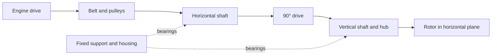

# Porsche 935 horizontal fan system

Research on 3 October 2026. Owner-confirmed objective: reverse engineer the
**complete 935 horizontal fan system**, then create a lighter improved version
with better structured blades and more useful engine air. PicoGK supplies
geometry, physical calculations characterize it and measurements validate the
twin. The [improved vertical 993 programme](../../FAN_DEVELOPMENT_PROGRAMMES.en.md)
is a separate project.

[Reconstruction plan](RECONSTRUCTION_PLAN.en.md) ·
[Sources and limits](sources.json) · [OBJ audit summary](scan-summary.json) ·
[Existing fan programme](../../../twins/993-engine-cooling-fan-system-f0/README.md)

## Documented architecture

The rotor plane is horizontal above the engine; its axis is vertical in engine
coordinates. Gunnar Racing shows installation on two 935 engines: belt driving
a horizontal shaft, then 90° drive to the vertical fan shaft. This establishes
initial architecture, not ratio, dimensions or specimen teeth.
[Workshop source](https://www.gunnarracing.com/team/lola/stage4.htm).

This functional diagram has no dimensions or presumed internal layout. Support
carries shaft/bearing loads and belongs to the mechanical reconstruction.
The airflow network must connect inlet, housing/funnel, rotor, any fixed
elements, guides, engine passages and outlets, with observed flow direction.

Design911 directly describes its reproduction as funnel and wheel for a
horizontal 935 fan. Advertised materials concern that product, not the owner's
scan or every period part. [Product sheet](https://www.design911.co.uk/p/fan-housing-with-fan-blades-porsche-935/).

## Identify variant and specimen

Porsche distinguishes historical developments. The 935/78 “Moby Dick” has
water-cooled four-valve heads and air-cooled cylinders; fan thermal scope
depends on variant. [Porsche Heritage Moments](https://newsroom.porsche.com/en/2026/history/porsche-heritage-moments-935-norbert-singer-timo-bernhard-42018.html).

Horizontal orientation is confirmed. Year, engine, factory/Kremer/team version,
part references and donor identity remain unknown. The 935 of 2019 and modern kits
do not define this geometry. 993 interfaces, blade counts and ratios are not
transferred to 935. Improved horizontal recipient engine must be fixed in its
installation contract; the vertical 993 project retains its own assembly/variants.

## OBJ files found on the Mac

Search recursively covers local/iCloud Downloads, then relevant OBJ names
indexed by Spotlight under the user directory. This does not prove absence of
unindexed or differently named files. Full paths, coordinates and projections
remain private in `work/fan-935-plan-20261003/` of the main checkout.

| File | Presence and purpose | Verified state |
|---|---|---|
| `Fan+0.5mm+back+not+lined+up+with+center.obj` | iCloud Downloads; candidate rotor | 624492 vertices; 1240465 triangles; open |
| `Fan+Drive+0.21mm.obj` | Local Downloads; candidate support/drive | 1256836 vertices; 2484656 triangles; open |
| `935+Xtreme+Cyl+head.obj` | Local Downloads; possible geometric context | Presence observed; system compatibility unqualified |
| `917+engine+case+w+cyl+0.5mm.obj` | iCloud Downloads; 917 context | Presence observed; does not define 935 engine installation |

Both main scans were reread without welding, repair or scale change. Rotor has
8611 boundary edges and 26 zero-area faces. Fan Drive has 29476 boundary edges,
200 simple cycles, one surface component, no duplicate/zero-area face or edge
incident to more than two faces. One topological component need not be one
mechanical part. Fan Drive self-intersections were not checked in this review.

Fan Drive hash matches the [existing catalogue](../../../catalog/scans/scan-fan-drive-0p21mm.json),
whose title assigns it to M64. That earlier assignment does not prove identity.
Previous boundary/non-manifold counts differ from this original-index audit;
cause is unestablished and old reports remain intact. OBJ units are undeclared;
filename suffixes do not qualify precision. See [reproducible summary](scan-summary.json).

## What scan sources establish

Wolfe separately sells [rotor](https://www.wolfeclassics.com/shop/p/porsche-935-fan-3d-scan),
[drive](https://www.wolfeclassics.com/shop/p/porsche-935-fan-drive-3d-scan),
[housing](https://www.wolfeclassics.com/shop/p/porsche-935-fan-housing-3d-scan)
and [guide](https://www.wolfeclassics.com/shop/p/porsche-935-air-guide-3d-scan).
Seller describes rotor/drive as matching; physical pairing needs verification.
Drive was removed for maintenance and scanned externally; this does not reveal
teeth, internal seats, preloads or lubrication passages automatically.

Housing is described as a rough scan. The “935 Air Guide” sheet describes a
**934** guide and offers separate upper/lower acquisitions. This contradiction
is recorded; no 934/935 equivalence is admitted. Neither of those last two files
was found in inspected scopes. No purchase or supplier contact occurred.

## Working bill of materials

IDs identify functions to document, not Porsche references or proof of particular
internal architecture.

| ID | Function/component | Coverage and required acquisition |
|---|---|---|
| `935-COOL-ROTOR` | Rotor and blades | Scan present; qualify back, axis, material and interfaces |
| `935-COOL-HUB` | Hub and rotor/shaft connection | Segment visible regions; measure seat, fastening and tolerances |
| `935-COOL-DRIVE-CASE` | Transmission support/housing | Fan Drive exterior; establish engine mounts and internal bores |
| `935-COOL-INPUT` | Input shaft and pulley | Exterior observations; identify pitch diameter, key/spline and bearings |
| `935-COOL-BELT` | Belt, pulleys and tension | Exact profile, ratio, travel/tension and parts unknown |
| `935-COOL-GEARSET` | Right-angle transmission | Internal type, geometry, materials and clearances unknown |
| `935-COOL-OUTPUT` | Vertical shaft and bearings | Candidate exterior interfaces; measure interior and axial restraint |
| `935-COOL-BEARINGS` | Bearings, retainers and seals | References, fits, preload, speed and lubrication unknown |
| `935-COOL-LUBE` | Lubrication and sealing | Establish architecture, possible oil/flow and dissipation |
| `935-COOL-INLET` | Housing/funnel and rotor clearance | Public source identified; local scan not found |
| `935-COOL-GUIDES` | Fixed elements, guides and distribution | Observe presence/type; commercial 934/935 guide ambiguous |
| `935-COOL-MOUNTS` | Mounts, stacks and engine connections | Measure datums, axes, holes, faces, load paths and seals |
| `935-COOL-COUPLING` | Flexible coupling | EB reproduction identified; specimen location, dimensions/stiffness unknown |
| `935-COOL-ALTERNATOR` | Separate alternator and engine integration | Manufacturer application documented; establish support, belt and envelope |

[Dimensions/details](DIMENSIONS_AND_DETAILS.en.md) adds FIA 645 and 1976 Appendix J
reading,993 PET dimensions and reproduction manufacturer information. The
[registry](dimensions.json) retains value scope/limits.

[Materials](MATERIALS.en.md) distinguishes workshop-reported factory 935 magnesium
drive housings, aluminium/7075 reproductions, composite ducts, Carrera/Turbo
applications and 993 replacements. These sources identify neither OBJ material.

[Additive dossier](ADDITIVE_MATERIALS.en.md) records the owner's three families:
aluminium, magnesium and titanium. Initial AlSi10Mg, WE43 and Ti64 candidates
need separate comparison per part/process for improved 993 and 935 versions.

## Executed preparation

Both scans were privately prepared, imported into native PicoGK 26.2.0 and
reexported to OBJ. Connectivity was checked in kernel and fresh export audit.
Holes remain open. Fitting only boundary contours finds no circle meeting
diagnostic thresholds; this does not mean the parts lack bores or interfaces.

[Preparation summary](preparation-summary.json) publishes only hashes, counts
and states. The [stage technical sheet](../../../twins/935-horizontal-cooling-system-f0/README.en.md)
describes executable sources and remaining evidence. Prepared geometry,
transformations and detailed reports remain private.

## Concrete next step

Interface contract is defined but dimensions remain unknown. The next batch
must establish scale, mechanical segmentation and physical coordinates for the
reference assembly. PicoGK reconstruction, calculation meshes and twin share
that assembly and geometry IDs. Older parametric 993 calculations are method
tools and give this 935 system no validated performance. Reconstructed reference
then supports new blade, lightening and drive/distribution comparisons at defined
conditions before twin integration.
