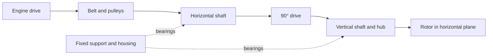

# Porsche 935 horizontal cooling system

Research of October 3, 2026. Objective confirmed by the owner: reverse
engineer **the entire 935 horizontal cooling system**,
then create an improved, lighter version of it, with better-structured
blades and more useful air on the engine. PicoGK handles the geometry,
physics calculations its characterization, and measurements the validation of the twin.
The [improved vertical 993 program](../../FAN_DEVELOPMENT_PROGRAMMES.en.md)
is a separate project.

[Reconstruction plan](RECONSTRUCTION_PLAN.en.md) ·
[Sources and limitations](sources.json) · [OBJ audit summary](scan-summary.json) ·
[Existing fan program](../../../twins/993-engine-cooling-fan-system-f0/README.md)

## Reconstruction from the scans — October 5, 2026

The [executed campaign](IMPLEMENTATION.md) fits observed cylindrical surfaces
and the sections of nine blade regions. It provides PicoGK
lofts, three resolutions, an editable FreeCAD/STEP CAD model and private
deviation maps. The complete rotor, the registration of the back and the mechanism remain open.
The former visual proxies are excluded from this reconstruction.
The [bench protocol](BENCH_PROTOCOL.md) prepares the future physical validation.

## Documented architecture

The rotor plane is horizontal above the engine; its axis is vertical in the
engine reference frame. Gunnar Racing, which shows the installation on two 935
engines, describes a belt driving a horizontal shaft, then a 90° right-angle drive
to the vertical fan shaft. This observation gives a starting
architecture; it gives neither the ratio, nor the dimensions, nor the gear teeth of the scanned
specimen. [Workshop source](https://www.gunnarracing.com/team/lola/stage4.htm).

This diagram is functional, without dimensions and without any presumed internal layout.
The support carries the loads of the shafts and bearings; it is part of the
mechanical system to reconstruct. The airflow network will have to connect inlet,
housing/inlet funnel, rotor, any stationary elements, guides, engine passages and
outlets, with the flow direction established by observation.

Design911 directly describes its reproduction product as an inlet funnel and
an impeller for a 935 horizontal fan. The advertised materials concern
this commercial product, not the owner's scan nor all period
parts. [Product page](https://www.design911.co.uk/p/fan-housing-with-fan-blades-porsche-935/).

## A variant and a specimen to identify

Porsche distinguishes several historical evolutions. The 935/78 "Moby Dick"
has water-cooled four-valve cylinder heads and air-cooled
cylinders. The thermal scope of the fan therefore depends on the
variant. [Porsche Heritage Moments](https://newsroom.porsche.com/en/2026/history/porsche-heritage-moments-935-norbert-singer-timo-bernhard-42018.html).

The horizontal orientation is the confirmed need. Year, engine, factory/Kremer/team
version, reference of each part and identity of the donor remain
to be established. The 2019 935 and modern kits are not used to define this
geometry. The 993 interfaces, blade counts and ratios are not
transferred to the 935. The engine receiving the improved horizontal version remains
to be fixed in its installation contract; the vertical 993 project keeps its
own assembly and its variants.

## OBJ files found on the Mac

The search recursively covers local Downloads and iCloud Downloads, then
the relevant OBJ names indexed by Spotlight under the user folder.
This scope does not prove the absence of a file that is not indexed or is named differently.
Full paths, coordinates and projections stay in the private
folder `work/fan-935-plan-20261003/` of the main checkout.

| File | Presence and relevance | Verified state |
|---|---|---|
| `Fan+0.5mm+back+not+lined+up+with+center.obj` | iCloud Downloads; candidate rotor | 624,492 vertices; 1,240,465 triangles; open |
| `Fan+Drive+0.21mm.obj` | local Downloads; candidate support/drive assembly | 1,256,836 vertices; 2,484,656 triangles; open |
| `935+Xtreme+Cyl+head.obj` | local Downloads; possible geometric context | Presence noted; no qualification of compatibility with the system |
| `917+engine+case+w+cyl+0.5mm.obj` | iCloud Downloads; 917 context | Presence noted; does not define the 935 engine mounting |

The two main scans were re-read without welding, repair or change of
scale. The rotor retains 8,611 boundary edges and 26 zero-area faces.
The Fan Drive retains 29,476 boundary edges, 200 simple loops, one surface
component, no duplicate/zero faces and no edge incident to more than two faces.
One topological component does not mean a single mechanical part.
The self-intersections of the Fan Drive were not checked in this pass.

The hash of the Fan Drive matches the
[existing catalogue](../../../catalog/scans/scan-fan-drive-0p21mm.json), whose
title assigns it to the M64. This earlier attribution does not prove its identity. The former
boundary/non-manifold counts differ from the new audit of the original indices;
the cause is not established. The former reports remain intact. The units
are not declared in the OBJ files. The owner confirmed that the suffixes
denote the declared acquisition precisions, without defining the units
of the coordinates or the machining tolerances. See the
[reproducible historical summary](scan-summary.json), kept without rewriting.

## What the scan sources establish

Wolfe sells separately the [rotor](https://www.wolfeclassics.com/shop/p/porsche-935-fan-3d-scan),
[drive](https://www.wolfeclassics.com/shop/p/porsche-935-fan-drive-3d-scan),
[housing](https://www.wolfeclassics.com/shop/p/porsche-935-fan-housing-3d-scan)
and [guide](https://www.wolfeclassics.com/shop/p/porsche-935-air-guide-3d-scan).
The seller presents the rotor as matched to the drive; their physical
pairing remains to be verified. It describes the drive as removed for service and
scanned externally. This does not automatically reveal the gear teeth,
internal bearing seats, preloads or lubrication passages.

The housing is described as a rough scan. The listing titled "935 Air Guide"
describes a **934** guide and offers separate top/bottom acquisitions.
This contradiction is recorded; no 934/935 equivalence is accepted.
These last two files were not found within the inspected scopes.
No purchase or supplier contact was made.

## Working bill of materials

The identifiers below denote functions to document. They are
neither Porsche part numbers nor evidence of any particular internal architecture.

| ID | Function/component | Current coverage and acquisition needed |
|---|---|---|
| `935-COOL-ROTOR` | Rotor and blades | Scan present; back, axis, material and interfaces to qualify |
| `935-COOL-HUB` | Hub and rotor/shaft connection | Visible regions to segment; bearing seat, fastening and tolerances to measure |
| `935-COOL-DRIVE-CASE` | Transmission support/housing | Exterior of the Fan Drive; engine mounts and internal bores to establish |
| `935-COOL-INPUT` | Input shaft and pulley | External observations; pitch diameter, key/spline and bearings to identify |
| `935-COOL-BELT` | Belt, pulleys and tension | Profile, actual ratio, travel/tension and exact parts unknown |
| `935-COOL-GEARSET` | Right-angle transmission | Type, geometry, materials and internal clearances unknown |
| `935-COOL-OUTPUT` | Vertical shaft and bearings | Candidate external interfaces; interior and axial load support to measure |
| `935-COOL-BEARINGS` | Bearings, retainers and seals | Part numbers, fits, preload, speed and lubrication unknown |
| `935-COOL-LUBE` | Lubrication and sealing | Architecture, any flow/oil and heat dissipation to establish |
| `935-COOL-INLET` | Housing/inlet funnel and rotor clearance | Public source located; local scan not found |
| `935-COOL-GUIDES` | Stationary elements, guides and distribution | Presence/type to confirm; commercial 934/935 guide ambiguous |
| `935-COOL-MOUNTS` | Mounts, stack-ups and engine connections | Datums, axes, holes, faces, load path and seals to record |
| `935-COOL-COUPLING` | Flexible coupling | EB reproduction identified; location, dimensions and stiffness of the specimen unknown |
| `935-COOL-ALTERNATOR` | Separate alternator and engine integration | Application documented by manufacturers; bracket, belt and packaging to establish |

The [transcription of dimensions and details](DIMENSIONS_AND_DETAILS.en.md) adds the
reading of FIA form 645 and the 1976 Appendix J, the PET 993 dimensions and the
information from reproduction manufacturers. The [register](dimensions.json)
keeps each value with its scope and limitations.

The [materials transcription](MATERIALS.en.md) distinguishes factory 935 drive housings
in magnesium reported by the workshop, aluminum and 7075 reproductions,
composite ducts, as well as the Carrera/Turbo applications and the 993
spares. These sources do not constitute a material identification of the two OBJ files.

The [additive manufacturing dossier](ADDITIVE_MATERIALS.en.md) records the
three families chosen by the owner: aluminum, magnesium and titanium.
The first candidates are AlSi10Mg, WE43 and Ti64, to be compared separately
for each part and process of the improved 993 and 935 versions.

## Preparation executed

The two scans were prepared privately and imported into the native
PicoGK 26.2.0 kernel, then re-exported as OBJ. Connectivity was verified in the
kernel and by a new audit of the exports. The holes remain open. A
fit check on the boundary contours alone finds no circle
meeting the diagnostic thresholds; this does not mean that the parts
lack bores or interfaces.

The [preparation summary](preparation-summary.json) publishes only the
digests, counts and states. The [technical record for this step](../../../twins/935-horizontal-cooling-system-f0/README.en.md)
describes the executable sources and the evidence still to be established. The
prepared geometries, transformations and detailed reports remain private.

## Concrete next steps

The interface contract is now defined; its dimensions remain unknown.
The next work package must establish scale, mechanical segmentation and physical reference
frames to build the reference assembly. The PicoGK reconstruction, the
calculation meshes and the twin will use this same assembly and common geometry
identifiers. The former parametric 993 calculations remain method
tools; they bring no validated performance to this 935 system.
The reconstructed reference will then make it possible to compare the new blades,
the weight reduction and the transmission/distribution improvements under defined operating
conditions, before their integration into the twin.
