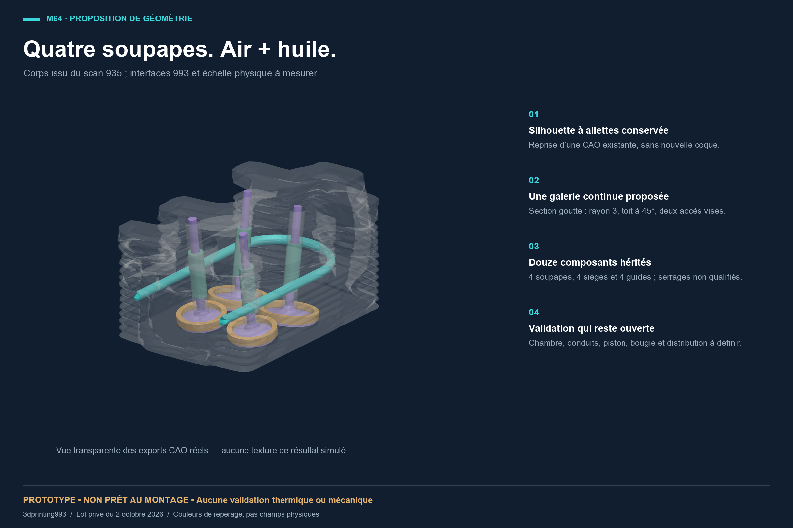
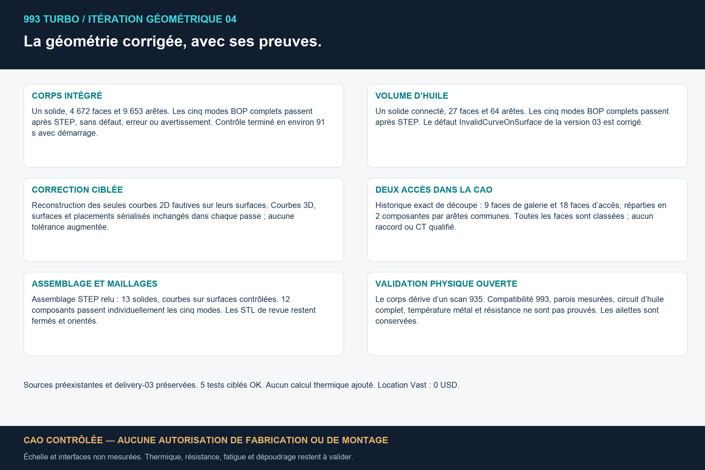
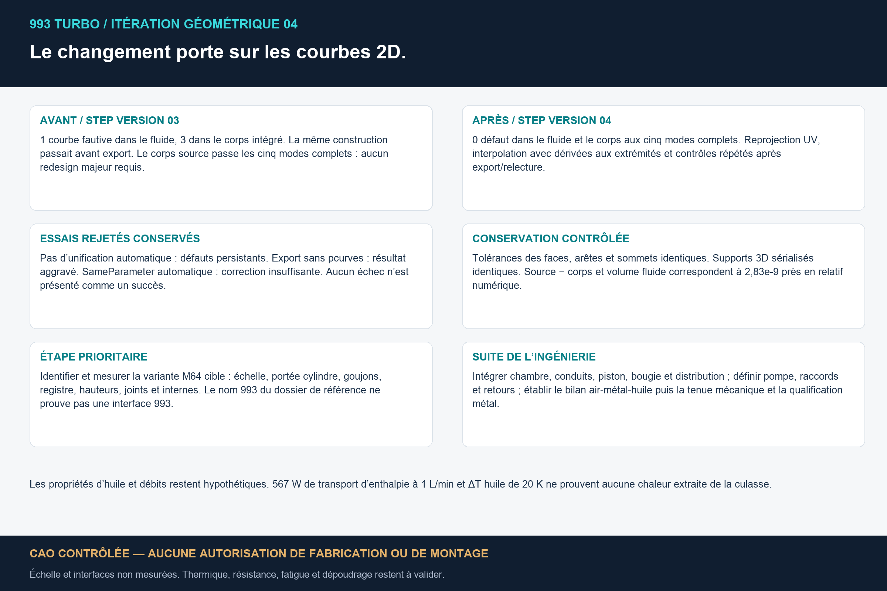
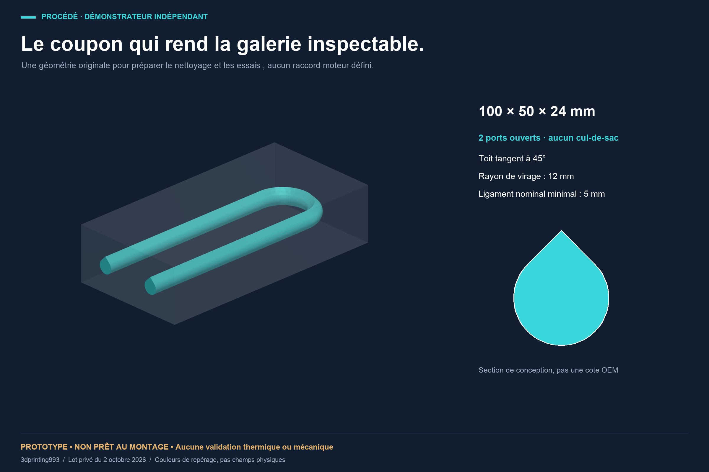
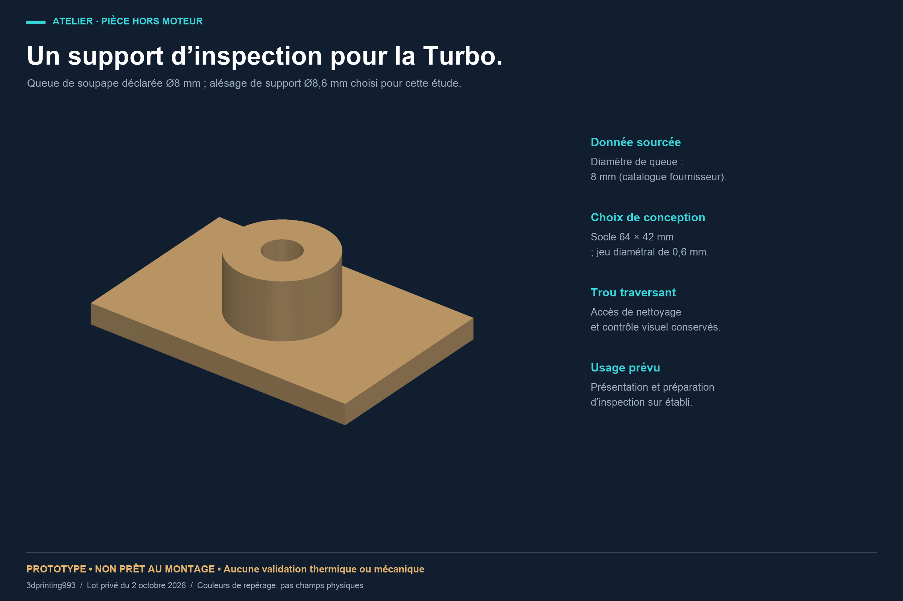
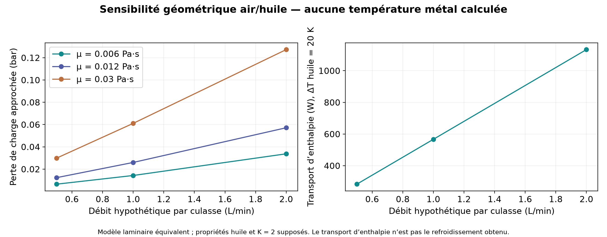

# Culasse 4 soupapes : étude air + huile pour la 993

Une proposition de galerie d’huile dans une CAO de culasse à quatre soupapes,
avec ses ailettes conservées, un assemblage de revue et deux prototypes
originaux d’atelier. Les modèles présentés sont ceux de l’itération corrigée du
2 octobre 2026. **Aucune pièce n’a été fabriquée, montée ou validée sur moteur.**



Le corps provient d’une reconstruction issue du scan Wolfe Classics 935 ;
les quatre soupapes, quatre sièges et quatre guides existaient déjà dans le
travail antérieur. Cette étude ajoute une galerie continue et corrige des
défauts de courbes sur surfaces après export STEP. **Une culasse 935 ne prouve
pas une interface 993 : l’échelle physique et les interfaces M64 restent à
mesurer.** Le nom du dossier ou le nombre de soupapes ne démontre pas cette
compatibilité.

## Fichiers de revue

Les STEP sont les fichiers CAO prioritaires. Les STL servent à la visualisation
et portent le suffixe `concept-only`. Sur GitHub, ouvrir un fichier permet
d’utiliser son bouton de téléchargement.

| Modèle | CAO | Maillage de revue |
|---|---|---|
| Corps à ailettes avec galerie proposée | [STEP, 15,4 Mo](cad/head-4v-air-oil-proposal.step) | [STL, 4,2 Mo](cad/head-4v-air-oil-proposal-concept-only.stl) |
| Assemblage de revue : corps + 12 composants | [STEP, 15,6 Mo](cad/head-4v-air-oil-assembly.step) | composants de contexte dans [cad/](cad/) |
| Volume fluide connecté dans le corps | [STEP](cad/head-fluid-domain.step) | [STL](cad/head-fluid-domain-concept-only.stl) |
| Outil de conception de la galerie en U | [STEP](cad/head-oil-tool.step) | [STL](cad/head-oil-tool-concept-only.stl) |
| Coupon original de galerie | [STEP](cad/oil-gallery-coupon.step) | [STL](cad/oil-gallery-coupon-concept-only.stl) |
| Volume fluide du coupon | [STEP](cad/coupon-fluid-domain.step) | [STL](cad/coupon-fluid-domain-concept-only.stl) |
| Support original de présentation de soupape | [STEP](cad/turbo-valve-inspection-stand.step) | [STL](cad/turbo-valve-inspection-stand-concept-only.stl) |

[Rapport illustré, 6 pages, 1,3 Mo](993-air-oil-review.pdf) ·
[Prototypes d’atelier, PDF](original-workshop-prototypes.pdf) ·
[Prototypes d’atelier, ZIP](original-workshop-prototypes.zip) ·
[Manifeste et empreintes SHA-256](delivery-manifest.json)

Les planches ont été produites lors de la préparation privée du lot ; leurs
mentions de « lot privé » décrivent cette préparation. La publication de cette
sélection a ensuite été explicitement autorisée. Les images représentent les
exports réels ; leurs couleurs identifient des composants, sans champ thermique
ou mécanique simulé.

## Ce qui a été contrôlé



| Objet ou contrôle | Résultat observé | Preuve |
|---|---|---|
| Corps corrigé après STEP | 1 solide, 4 672 faces, 9 653 arêtes ; cinq modes BOP sans défaut, erreur ni avertissement | [rapport natif du corps](checks/body-native-BOP.json) |
| Fluide corrigé après STEP | 1 solide connecté, 27 faces, 64 arêtes ; cinq modes BOP sans défaut, erreur ni avertissement | [rapport natif du fluide](checks/fluid-native-BOP.json) |
| Assemblage après STEP | 13 solides ; contrôle `CurveOnSurfaceMode` réussi | [rapport d’assemblage](checks/assembly-curve-check.json) |
| Composants hérités | 12 contrôles individuels à cinq modes réussis | [rapports des composants](checks/component-native-checks.json) |
| Accès du fluide dans la CAO | 9 faces de galerie et 18 faces d’accès, réparties en 2 groupes connectés ; 27 faces classées | [historique topologique](checks/opening-topology-check.json) |
| Conservation numérique du volume | volume retiré ≈ volume fluide ; écart relatif 2,83 × 10⁻⁹ | [vérification du lot](checks/verification.json) |
| Coupon et support | BRep valides avant/après STEP et contrôles BOP réussis | [contrôles complémentaires](checks/additional-checks.json) |
| STL individuels publiés | fermés et orientés ; sans arête ouverte ou non-manifold ni triangle nul après fusion des seules coordonnées identiques | [vérification du lot](checks/verification.json) |

Les cinq modes sont `SelfInterMode`, `SmallEdgeMode`, `RebuildFaceMode`,
`ContinuityMode` et `CurveOnSurfaceMode`. Les rapports natifs sont liés aux
SHA-256 des STEP livrés. L’auto-intersection du composé d’assemblage n’a pas été
testée : ses composants de contexte peuvent être en contact. Les
auto-intersections continues des STL n’ont pas été testées.

Une validité du noyau CAO établit la cohérence géométrique vérifiée, sans
certifier la pièce physique, sa précision, sa résistance ou son montage.

### Correction des courbes sur surfaces



La version STEP précédente présentait trois défauts `InvalidCurveOnSurface`
dans le corps et un dans le fluide. Les seules courbes 2D concernées ont été
reprojetées sur leurs surfaces et interpolées avec les dérivées aux extrémités.
Les tolérances des faces, arêtes et sommets sont restées identiques ; les
sections sérialisées de placements, courbes 3D et surfaces ont conservé leurs
empreintes dans chaque passe. Le fluide a demandé deux passes.

La preuve conserve les [diagnostics antérieurs du corps](checks/previous-body-curve-diagnostic.json)
et du [fluide](checks/previous-fluid-curve-diagnostic.json), ainsi que les
rapports de [correction du corps](checks/body-repair.json), de
[première passe fluide](checks/fluid-repair-first.json) et de
[seconde passe fluide](checks/fluid-repair-second.json).
Les anciens STEP et les géométries d’expériences rejetées sont exclus de cette
sélection. Les contrôles finaux portent sur les nouveaux STEP publiés.

## Deux prototypes indépendants pour l’atelier



Le coupon mesure **100 × 50 × 24 mm**. Sa galerie a un rayon de conception de
3 mm, un toit tangent à 45°, un virage de rayon 12 mm et deux accès ouverts.
Le ligament nominal minimal est de 5 mm. Ces choix préparent des essais de
nettoyage, d’inspection et de procédé ; le dépoudrage et la qualité interne LPBF
ne sont pas démontrés. Aucun matériau ni paramétrage machine n’est qualifié.



Le support a un socle **64 × 42 mm**, une hauteur de **19 mm** et un passage de
**8,6 mm**, choisi à partir d’une queue nominale documentaire de 8 mm et d’un
jeu diamétral de conception de 0,6 mm. La référence est la
[fiche Partworks archivée au catalogue](../../../catalog/sources/src-partworks-993-exhaust-valve-dimensions.json).
Il s’agit d’un support d’établi ; ni sa précision ni son ajustement sur une
soupape réelle ne sont validés. Ces deux formes originales ne contiennent pas
de géométrie issue du scan de culasse.

## Ce que le calcul hydraulique signifie



À **1 L/min**, avec une viscosité dynamique supposée de **0,012 Pa·s**, le
modèle donne environ **0,026 bar** de perte de charge et **567 W de capacité de
transport d’enthalpie** pour une élévation d’huile supposée de **20 K**.
Le modèle emploie `64/Re`, la section goutte et son diamètre hydraulique, une
longueur d’outil de 397,38 mm et un coefficient de pertes singulières supposé
de 2. Cette longueur inclut la partie de l’outil extérieure au corps.

Ce calcul de sensibilité utilise une approximation circulaire équivalente.
Il ne donne **aucune chaleur effectivement extraite de la culasse, aucune
température métal et aucune marge thermique**. L’huile réelle, les températures,
la pompe, les raccords, les branches et le circuit de retour restent à définir.
Les hypothèses et neuf cas sont dans [verification.json](checks/verification.json).

## Limites physiques et étapes prioritaires

Le millimètre du corps reste l’hypothèse **1 unité de scan = 1 mm**, sans
mesure de confirmation. Le contrôle de paroi a échantillonné 1 863 points avec
un minimum de 3,318 unités de scan, en excluant la zone d’accès `y < -70`.
Il ne certifie pas une épaisseur minimale continue ni une résistance à chaud.
Les deux accès sont établis pour la CAO reconstruite ; ils ne prouvent pas un
raccord étanche ou une galerie mesurée dans une culasse réelle.

1. Identifier la variante M64 cible et mesurer son échelle, sa portée de
   cylindre, ses goujons, son registre, ses hauteurs et ses interfaces de joints.
2. Intégrer chambre, conduits, bougie, piston et distribution ; contrôler les
   dégagements et les interfaces avant de figer une géométrie.
3. Définir alimentation, raccords, étanchéité et retour d’huile ; établir le
   bilan combustion–métal–air–huile et les conditions limites mesurées.
4. Définir et qualifier alliage, procédé métal, orientation, nettoyage,
   traitement thermique, usinage, inspection, fatigue et plan d’essais avec une
   revue professionnelle.

Le travail PicoGK déjà présent dans le projet est un travail distinct. Ce lot
utilise build123d/OpenCascade pour la CAO et PyVista/VTK pour les rendus ; aucun
nouveau calcul PicoGK, CFD, thermique ou structural n’est revendiqué ici.
Le statut du [catalogue des pièces](../../../catalog/parts/) reste inchangé.

## Provenance, droits et reproduction

Le [registre Wolfe Classics](../../../catalog/sources/src-wolfe-classics-935-billet-cylinder-head-scan.json)
attribue le scan à son vendeur, consigne la réutilisation ouverte confirmée par
le propriétaire et précise que le texte ou l’identifiant exact de licence reste
à archiver. Le propriétaire a explicitement autorisé cette publication des
dérivés générés, rendus, rapport et code le 2 octobre 2026. **Le scan OBJ brut
reste privé et hors Git.** Cet accord ne crée pas de licence supplémentaire du
vendeur. Le [complément de provenance daté](../../research/wolfe-classics-935-billet-cylinder-head-scan.md#complément-de-provenance--publication-autorisée-le-2-octobre-2026)
documente le remplacement limité de la consigne antérieure ; la fiche source
figée par le contrat d’ingénierie conserve son empreinte. Les droits du projet
sont ceux de la [licence actuelle](LICENSE) ;
les anciennes mentions MIT des paquets locaux ne s’appliquent pas à cette
publication. La consultation publique ne vaut pas autorisation de fabriquer,
de réutiliser ou de redistribuer.

Le code et les paramètres des prototypes se trouvent dans [source/](source/).
Dans un environnement déjà équipé de build123d 0.11.1, NumPy, trimesh et rtree,
depuis ce dossier :

```sh
python3 -B -m unittest discover -s source -p test_geometry.py -v
python3 -B source/build.py --original-only --project-root . --output replay-new
python3 -B verify_delivery.py
```

`--original-only` ne lit aucune géométrie de culasse. La reconstruction complète
du corps nécessite les deux CAO sources privées dont les empreintes figurent
dans les paramètres ; elles ne sont pas ajoutées à ce lot. `build.py` construit
la galerie et les booléens, puis la correction et les contrôles après STEP
doivent être effectués séparément. Le code de correction est dans [repair/](repair/).
Pour contrôler à nouveau les fichiers publics, dans le même environnement :

```sh
python3 -B repair/bounded_check.py cad/head-4v-air-oil-proposal.step audit-body-new --timeout 420
python3 -B repair/bounded_check.py cad/head-fluid-domain.step audit-fluid-new --timeout 60
```

Chaque sortie doit être neuve. Les cinq tests de conception ont réussi lors de
la préparation ; les résultats physiques restent tous non validés. Le
manifeste lie les fichiers publics à leurs empreintes. Les SHA de code de
production présents dans les rapports désignent le lot privé d’origine ; le
script public de construction et ses paramètres ont seulement des adaptations
de documentation et de chemins. Aucun résultat géométrique n’a été régénéré
pour cette publication.
