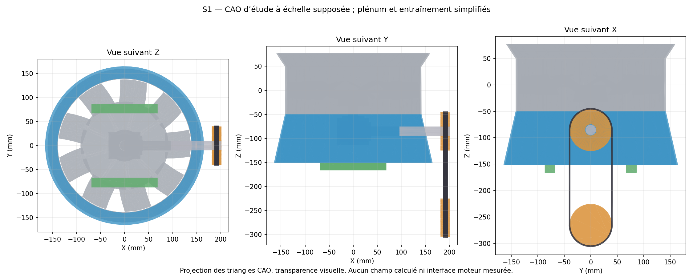

# S1 assembly and V2 manufacturing preparation

The S1 study assembly and V2 stock with allowances are now editable and checked
as geometry. Functional manufacturing remains blocked by physical interfaces
and process qualification. 935/993 identity, the 275 mm scale and nine blades
remain unverified. This dossier extends existing calculations; no improvement
in flow, service life or fit is inferred from these new envelopes.

[**S1 STEP assembly**](results/assembly/S1/S1-assembly.step) ·
[CAD checks](results/assembly/S1/geometry-report.json) ·
[Editable parameters](parameters/assembly-study-S1.json) ·
[Conditional bill of materials](results/assembly/S1-review-packet.json) ·
[Stock STEP with allowances](results/lpbf/V2-stock-scenario/V2-stock-scenario.step) ·
[S1 OpenUSD](omniverse/S1-layout.usda)



## What was drawn and what remains to be measured

Original V2 geometry is imported without moving or modifying its solids.
The new plenum is an open conical shell: depth 101.75 mm, upper radius
141.90 mm, lower radius 165 mm and nominal thickness 2.5 mm, all chosen for
the study. A central 60.5 mm exclusion is reserved symbolically for the
right-angle drive; no measured central tube or cylinder-head passage is
claimed. The 12 mm-radius side passage avoids the shaft envelope. The BRep
check finds no volumetric intersection between this shell and the original
V2 assembly.

Two pulleys are represented by their 80 mm pitch-diameter envelopes, 180 mm
center distance and 20 mm width. The input shaft has an envelope extension;
the belt follows the pitch path of equal pulleys. Two 20×15 mm bars represent
support stocks. These positions define a packaging variant; they are not axes,
holes, seating surfaces or attachments measured on an engine. Teeth, belt
profiles, bearings, retention, passage sealing, the distribution collector and
cylinder-head connections remain to be defined. Right-angle-drive envelopes
are not manufacturable gears.

The seven groups contain 19 solids. Every BRep is valid and has positive volume
after STEP export/reimport. The conical shell has a relative volume difference
of approximately 6.17×10⁻⁷; the representation bound retained for S1 is 10⁻⁶,
distinct from historical checks and without manufacturing-tolerance authority.
No actual-engine packaging, rubbing, fastening or loaded-transmission check
is closed.

The [independent contract](parameters/assembly-interface-contract.json) defines
nine interfaces, 52 features to fill in and the load paths:
rotor→shaft→bearings→housing→support→engine;
engine drive→belt→pulley→shaft→bearings→right-angle drive→rotor;
housing/plenum→supports→engine. The
[blank measurement sheet](results/assembly/S1-interface-measurement-sheet.csv)
requires values, units, uncertainty, instrument/calibration, datums, reference,
evidence and review. The exact catalogue variant, manufacturing limits and
service-entry review are also missing: 55 open items. CAD output does not
provide its own measurement evidence. The
[admission check](source/assembly_interface_gate.py) rejects functional
promotion incompatible with this contract.

## Conditional drive and plenum sizing

For the chosen scenario, 5 Nm at 6000 rpm represent 3.142 kW. An 80 mm pulley
gives 25.13 m/s belt speed and a 125 N tension difference. With 200 N pretension
per span, simplified tensions become 262.5 / 137.5 N and the radial load for
equal pulleys is 400 N. These formulas ignore stiffness, dynamic tension,
losses, excitation, effective angle and manufacturer data: no belt, bearing
or shaft model is selected. The ideal ratio is 1 and the open-belt pitch length
is 611.33 mm; commercial length and tensioner remain to be selected after
measurement.

The assumed available bottom annular area is 0.07049 m². The unconverged
point D2 flow of 1.156 m³/s would give 16.40 m/s through this area. This
continuity calculation predicts neither distribution to the cylinder heads,
pressure losses nor plenum efficiency. The six cooling flows and installed-path
resistances remain to be established. S1 is not the D2 CFD domain: its shell
has not yet been meshed or simulated.

## Rotor stock and LPBF scenario

The [original V2](V2-rotor.step) rotor retains its assumed final geometry.
The [study stock](results/lpbf/V2-stock-scenario/V2-stock-scenario.step) adds
0.5 mm radially at the bore and 0.5 mm at each hub face. Other surfaces remain
identical. The stock bore becomes 26.5 mm for an assumed final 27.5 mm bore;
no physical fit is established. The stock forms one valid connected solid,
verified after STEP reimport.

Volume increases from 265377.43 to 269123.98 mm³; the allowance represents
3746.55 mm³. At the indicative 2700 kg/m³ density, mass increases from 0.7165
to 0.7266 kg. Neither this density nor the 0.5 mm are approved properties or
allowances for an AlSi10Mg lot. Earlier R0/V5 manufacturing distortions do not
justify these stocks and do not automatically transfer to V2.

The [tessellated stock screening](results/lpbf/V2-stock-orientation-screen.json)
compares six orientations, without actual supports or a laser recipe. Flat
stock measures approximately 274.20×274.98×53.17 mm. With 10 mm clearance per
side it does not fit the conservative 250×250×300 mm scenario; it nominally
fits the reference BLT 400/450×300×400 mm envelopes. Edgewise with diagonal
rotation, its box is 212.77×215.22×274.98 mm: it fits all three scenarios with
the chosen clearance. The geometric layer count at 50 µm increases from 1064
to 5500. This is neither a manufacturing time nor a qualified thickness.
STL volume differs from BRep by 0.189 %; this is a representation check.
Support-column proxies may overlap and are not printable support geometry.

Machine variants remain references. The exact S400 version, usable volume,
material/lot, treatment and recipe require confirmation; see the
[manufacturing review and its primary sources](MANUFACTURING_REVIEW.md).
The 12 earlier elastic simulations evaluate an assumed contraction with
idealized supports; they do not simulate melting, thermal history, plasticity,
laser scanning or porosity. No new V2 process solver was executed for this
dossier.

## Proposed route for technical review

| Step | Required input and evidence | State |
| --- | --- | --- |
| Definition | Exact variant, measured interfaces, datums and toleranced drawing; flow, speed and fatigue needs | Missing |
| Material/process | AlSi10Mg lot and final condition, qualified machine/recipe, directional and temperature-dependent properties | Candidates, unqualified |
| Preparation | Revised stock, supports/plate, contact zones and removal access, orientation, representative witnesses | Study stock and screening available |
| Calibration | Distortion and material specimens, independent build for process-model validation | No physical data |
| Build | Signed machine file, atmosphere and parameter logs, material/build traceability | No manufacturing authorized |
| Treatment/cutting | Approved sequence, furnace record, measurements before/after release, accessible removal | To be defined with the workshop |
| Machining | Bore/faces located in approved datums, access and clamping, deburring without critical root reduction | Study stocks and access only |
| Inspection | Dimensions/runout, CT or qualified method, defects/surface, material and coupons; engineer-defined limits | No physical acceptance |
| Balancing/service | Correction plans, prestressed modal/gyroscopic analysis, fatigue, contained rotation tests and professional review | Plan to approve, no actual test |

The plenum and support stocks have possible conventional routes; the drive
requires a mechanical definition and suitable components. The
[bill of materials](results/assembly/S1-review-packet.json) leaves unknown
quantities, masses and suppliers at `null`, rather than converting visual
envelopes into order references.

## OpenUSD and reproduction

The [S1 asset](omniverse/S1-layout.usda) separates the 19 solids under their
groups, in meters, with +Z axis and no deformation. Colors identify visual
roles. It links parameters, interface contract, CAD, CFD diagnosis and this
dossier. All STL-derived coordinates are checked against their float32 storage.
The [OpenUSD checks](omniverse/S1-layout-validation.json) cover composition,
topology, units and material bindings; the Sdr shader rule remains blocked by
resources missing from the available runtime. No GPU, Omniverse RTX, qualified
SimReady or validated physical twin is claimed. The
[NVIDIA CAD→SimReady workflow](https://github.com/NVIDIA/skills/tree/main/skills/omniverse-cad-to-simready)
requires a GPU/Content Agents chain unavailable here; it was not installed.

With the CAD and OpenUSD libraries already present, from this directory,
in new private directories:

```sh
"$CAD_PYTHON" source/build_assembly_study.py . "$PRIVATE_FAN_WORKSPACE/S1"
"$CAD_PYTHON" source/prepare_v2_manufacturing_stock.py . "$PRIVATE_FAN_WORKSPACE/V2-stock"
python3 source/screen_v2_stock.py "$PRIVATE_FAN_WORKSPACE/V2-stock" "$PRIVATE_FAN_WORKSPACE/V2-stock-screen.json"
```

The [OpenUSD/render exporter](source/export_s1_layout.py) requires the USD
runtime; [review-packet generation](source/build_s1_review_packet.py) requires
only published reports. None of these tools launches a solver, installs
software or contacts a workshop.
[D3 diagnosis and independent compute budget](D3_ESTABLISHMENT_DIAGNOSTIC.en.md).
