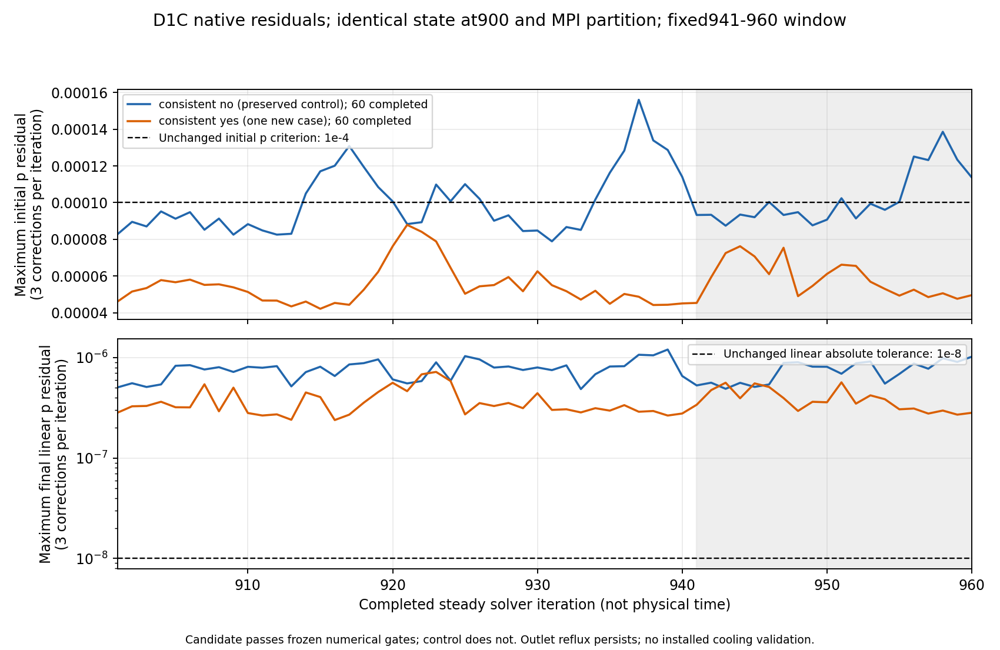

# D1C: completed trial, limited numerical admission

One 60-iteration branch was authorized after Kali2 reservations were released.
It restarts the same V2/900 state and 80 MPI partition files as the preserved
D1 control. The only numerical change is `SIMPLE.consistent no` → `yes`.
No mesh, physical condition, scheme, relaxation, tolerance or admission
criterion is changed.

[Result and native windows](results/cfd/D1C-bounded-result.json) ·
[Original summary at 960](results/cfd/D1C-960-flow-summary.json) ·
[Compared fields and backflow](results/cfd/D1C-matched960-field-differences.json) ·
[Port balance](results/cfd/D1C-960-energy-and-port-analysis.json) ·
[Preservation](results/runtime/D1C-native-archive-verification.json).

## Identical measurements and criteria

All iterations 901–960 finish, without a partial tail. Each native table
contains **61 measurements, including state 900**, or 60 new measurements.
The three prospective windows 901–920 / 921–940 / 941–960 have twenty consecutive
samples; the last is the admission window. Each of the five final
U/p/k/omega/nut fields contains 453 496 finite cells.

| Measurement over 941–960 | D1 control consistent no | D1C consistent yes |
| --- | ---: | ---: |
| Maximum initial p residual | 1.386159985×10⁻⁴ | 7.622277815×10⁻⁵ |
| Mean outlet flow, m³/s | 1.15229935155 | 1.152299802885 |
| Mean power, W | 2429.758222624 | 2429.768471103 |
| Flow CV | 2.77178×10⁻⁷ | 3.30038×10⁻⁷ |
| Torque CV | 3.04282×10⁻⁵ | 2.59172×10⁻⁵ |
| Maximum port imbalance | 1.44516×10⁻⁵ | 1.43770×10⁻⁵ |

The initial p maximum decreases by **45.0116 %**. The candidate passes every
original criterion: p ≤10⁻⁴, U ≤10⁻⁵, k/ω ≤10⁻⁴, imbalance ≤0.5 %, flow CV ≤1 %,
torque CV ≤2 %, direction and complete finite fields. It satisfies the
prospective rule “p decrease ≥30 % and all gates”: this supports **numerical
sensitivity to coupling**, without identifying a physical cause. The D1
control remains unadmitted on p. Missing R0 measurements are not restored and
no historical fine pair is retroactively admitted.

Mean flow changes by +0.00003917 % and power by +0.00042179 %. These differences
prove no cooling or efficiency gain. Steady iterations represent neither
physical time, rotor frequency nor independent statistical realizations.

## Backflow and local fields: explicit limits

At 960, gross backflow remains **0.123990213 m³/s**, or **10.76024 %** of net
flow. It concerns the same 1 572 faces out of 4 542 and **35.15382 %** of outlet
area, practically as in the control. Residual improvement did not resolve the
possible influence of this nearby outlet or provide measured engine resistance.

Field comparison at 960 gives a volume-weighted p RMS difference of
0.544038 Pa but a local maximum of **317.669 Pa**; ΔU RMS is 0.0624630 m/s.
Stable integrated flow/torque therefore does not guarantee local-field
insensitivity. These differences are neither cellular algebraic residuals
nor experimental uncertainty. Mesh independence, wall layers and installed
interfaces/conditions remain unqualified.

Maximum absolute Mach remains 0.3766 under screening assumptions:
compressible sensitivity is still required. Flux-weighted outlet total
pressure is 1569.57 Pa. The port-energy/power ratio 0.7444 is not qualified
efficiency. Pressure torque is recovered with relative error 4.68×10⁻¹² and
wall velocity Ω×r at 7.05×10⁻⁹ m/s; these identities verify output reading,
not physical validation.

## Budget and closure

Current preflight: Kali2 amd64, 12 logical CPU, 11 353 784 320 available memory
bytes, no active flow container. Actual limits are 4 CPU, cpuset 0/2/4/5,
5 GiB RAM and memory+swap, no networking, UID/GID 1000, dropped capabilities
and read-only sources/baseline/capsule. Pre-existing services remain identical.

Solver 117.18 s, reconstruction 4.97 s, native audit 2.63 s; including
preparation, archiving and verification, **128.169 s total**, below the overall
300 s ceiling. The owned container was released at **18:25:36 UTC on
October 4, 2026**. No second branch, additional phase, restart or extension.

The private archive of final fields, logs, systems and receipts contains
25 verified members, 47 464 242 bytes, SHA-256
`916c4b4e2a23c22e112763f58a9592896ee28e8f7e05ae8cb608e73c776fbfad`.
The three native tables are preserved and retrieved separately: their hashes
match the original native summary included in the archive. Transfer and every
member are verified. Scan, complete fields and tables remain private;
published reports are sanitized.

The [used configurations](parameters/D1C-executed-configurations/) and
[capsule manifest](parameters/D1C-executed-capsule-manifest.json) are preserved.
Frozen protocols' `not_launched` indicators describe their preparation before
launch; they do not replace the execution receipt. The
[prospective protocol](parameters/D1-coupling-proposed-protocol.json) remains
preserved without rewriting after the result became known.

Reproduce the package and analyses from private native inputs:

~~~sh
python source/prepare_d1c_capsule.py . work/D1C-capsule
python source/analyze_d1c_result.py PRIVATE_D1C_INPUTS . work/D1C-result.json
OPENBLAS_NUM_THREADS=1 OMP_NUM_THREADS=1 python source/compare_d1c_native_fields.py PRIVATE_D1_CONTROL_FIELDS PRIVATE_D1C_INPUTS work/D1C-field-differences.json
OPENBLAS_NUM_THREADS=1 OMP_NUM_THREADS=1 python source/analyze_flow_balance.py PRIVATE_D1C_CASE work/D1C-port-analysis.json --time 960
python source/verify_study.py
~~~

These commands launch no solver. Reproducing the calculation with
`launch_d1c.py` requires a new coordinated window and private 900/partition
sources; it is not launched automatically.
