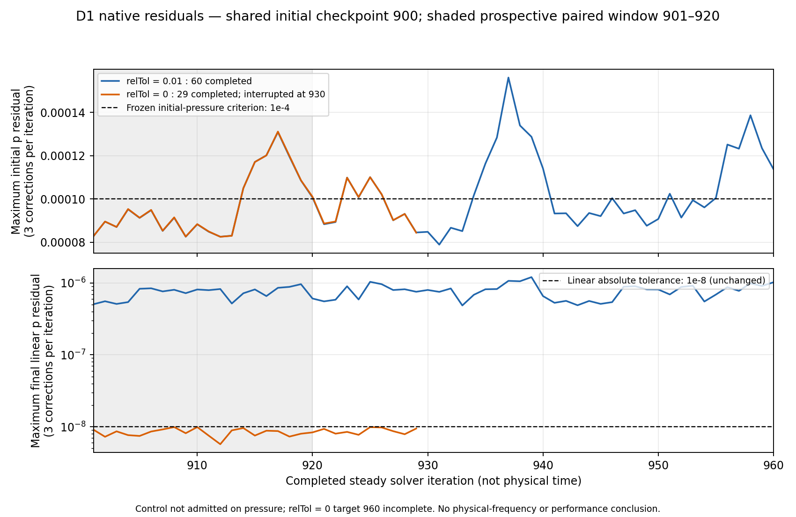

# D1 exécuté et arrêté dans le budget initial

Le diagnostic a reçu une fenêtre Kali2 explicite après libération du pilote Ti.
Il ne produit pas une comparaison complète à 960 : le témoin termine, la branche
stricte est interrompue. Aucun résultat n'est admis et aucun solveur n'est relancé
après la limite. [Rapport natif](results/cfd/D1-bounded-result.json) ·
[Résidus réellement calculés](results/cfd/D1-residuals.png) ·
[Empreintes des entrées](results/cfd/D1-diagnostic-input-manifest.json).

## Exécution et mesures exactes

La première préparation s'arrête en 8,24 s avant tout solveur : la copie des
répertoires de processeurs déréférençait leurs liens `900/uniform`, créant quatre
fichiers supplémentaires dans une branche. La garde stricte de partition a
rejeté la différence. Le correctif conserve ces liens (`symlinks=True`) ; aucune
physique, condition, tolérance, maille, champ initial ou itération n'est ajoutée.
Le [code préparé initialement](source/run_d1_in_container_setup_v1.py) et son
[manifeste initial](parameters/D1-prepared-pair-manifest-setup-v1.json) restent
conservés. La partition corrigée est identique avant les deux solveurs.

La réparation, le diagnostic de préparation et les deux solveurs restent dans
la même limite initiale de dix minutes : l'enveloppe externe est recalculée à
202 s restantes, puis arrête le seul conteneur D1. Le ledger natif mesure
**590,318 s depuis le lancement initial**, sans dépassement de 600 s. La première
préparation avait calculé zéro itération d'écoulement.

| Branche | Itérations terminées | Mesures par table, état initial compris | Nouvelles mesures | Fenêtre finale 941–960 | Champs finaux960 | Statut |
| --- | ---: | ---: | ---: | --- | --- | --- |
| relTol 0,01 | 60, 901–960 | 61 | 60 | vingt mesures vérifiées | reconstruits, cinq champs complets de 453496 cellules | non admis : pression |
| relTol 0 | 29, 901–929 | 30 | 29 | absente | absents ; seul le restart 900 existe | incomplet, non évalué pour admission |

L'itération 930 est entrée mais ne termine que deux corrections p sur trois ;
elle n'a ni mesure de débit/couple complète ni `ExecutionTime`. Elle est exclue
des statistiques et du rendu. Les seuils originaux restent inchangés. Le
[témoin à 960](results/cfd/D1-control-960-flow-summary.json) passe les critères U,
turbulence, masse, stabilité, direction et champs finis, mais son résidu initial
p maximal des vingt dernières itérations est 1,38616×10⁻⁴ contre 10⁻⁴. Débit moyen
1,15229935 m³/s, puissance 2429,758 W ; ces valeurs ne constituent pas une
performance admise.

## Différence de convergence sur la fenêtre prospective commune

Seule la première fenêtre prévue 901–920 dispose de vingt mesures complètes
pour les deux branches. La fenêtre 921–940 stricte est incomplète ; la fenêtre
941–960 stricte est absente. Elles ne sont pas remplacées par une fenêtre
choisie après le calcul.

| Mesure 901–920 | relTol 0,01 | relTol 0 |
| --- | ---: | ---: |
| Résidu initial p maximal | 1,30859×10⁻⁴ | 1,31086×10⁻⁴ |
| Résidu final linéaire p maximal | 9,60328×10⁻⁷ | 9,90354×10⁻⁹ |
| Itérations linéaires p moyennes, somme des trois corrections | 11,20 | 29,95 |
| Débit moyen, m³/s | 1,152299245 | 1,152299252 |
| Puissance moyenne, W | 2429,7772 | 2429,7775 |

Le résidu final linéaire diminue d'un facteur 96,97 et le coût en itérations
linéaires augmente d'un facteur 2,674. Le maximum du résidu initial varie de
seulement +0,174 % et reste au-dessus du seuil. Les courbes initiales se
superposent presque sur les vingt-neuf itérations strictes disponibles.
Cela affaiblit l'explication d'un arrêt linéaire seul comme cause du dépassement,
sur cette fenêtre. Le couplage non linéaire, le maillage/sillage et l'effet de
sortie restent à départager. Aucun phénomène oscillatoire physique, intervalle
de confiance, classement de variante ou rendement amélioré n'est établi.
La cible 960 stricte incomplète interdit une conclusion appariée finale.

## Preuves préservées et ressources libérées

Le conteneur observé respecte 4 CPU, cpuset 0/2/4/5, RAM et mémoire+swap de 5 GiB,
réseau absent, UID 1000, capabilities supprimées et sources montées en lecture
seule. Il n'est plus actif ; à 17:07:52 UTC seuls les deux services préexistants
restent présents. Aucune installation, location ou modification de service.

L'archive privée rapatriée préserve les deux tentatives, journaux, mesures,
protocoles, preuves de partition et le checkpoint 960 du témoin : 63 fichiers,
47047995 octets compressés, SHA-256
`362c82e93a3ed2ae27532f1c7aaa62115b8c02e49146f900caba2fbf1c411dc2`.
Les membres et le transfert sont vérifiés ; le checkpoint 900 et le maillage
sont déjà conservés dans l'archive native initiale. Les vingt petites entrées
utilisées par l'analyse correspondent aux empreintes de cette archive.
L'archivage post-calcul a pris 1,72 s, borné à 1 CPU/1 GiB ; il ne relance aucun
solveur. Les champs/logs complets restent privés. La [preuve d'archive](results/runtime/D1-native-archive-verification.json)
atteste cette conservation sans publier les sorties complètes.

L'admission historique R0 fine reste retirée ; D1 ne fournit pas ses mesures
manquantes. Une comparaison finale stricte nécessiterait une nouvelle fenêtre
explicitement coordonnée : aucune reprise ni extension n'est lancée. Les
interfaces physiques et scénarios de refroidissement installés restent aussi
à établir.

L’[analyse locale des champs conservés et le prochain essai proposé](D1_NEXT_DIAGNOSTIC.md)
complètent ce résultat sans nouvelle exécution. Les [sous-systèmes installés](SUBSYSTEM_PARAMETERS.md)
restent symboliques et sans dimensions mesurées.
