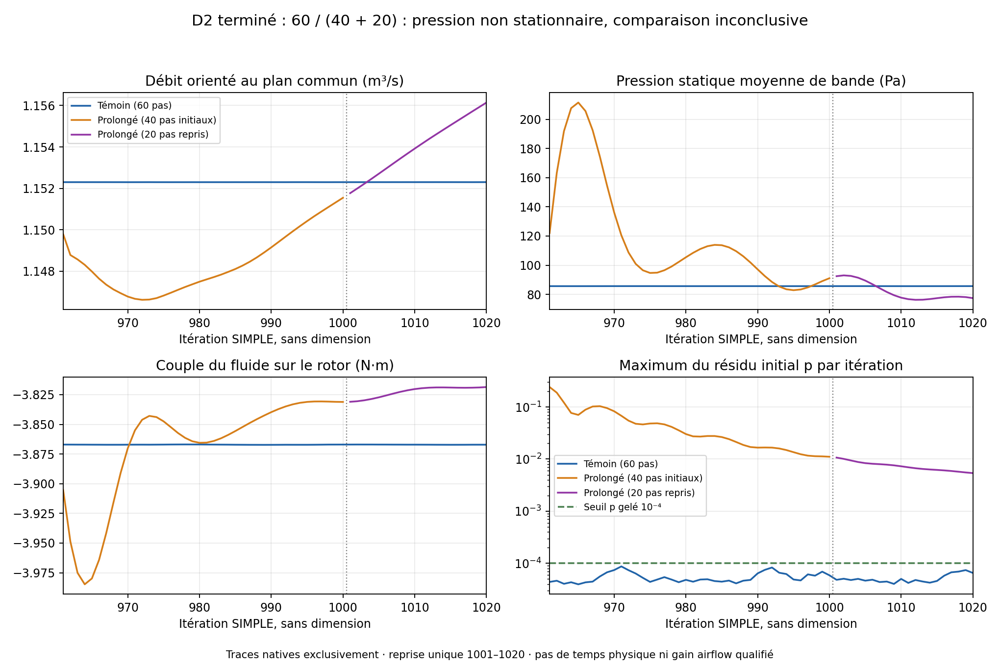

# D2 completed at 1020: comparison still inconclusive

The single authorized restart completed **1001–1020** from the verified native
1000 checkpoint, without rerunning the control. The extended branch therefore
totals **40 + 20 complete iterations**; the control retains its original
60 iterations. Geometry, partitions, MRF, boundary conditions, numerics and
criteria remain unchanged. **Pressure still fails numerical and steadiness
criteria.** The batch is closed, resources released, with no 1040 continuation.

[Back to study](README.en.md) · [Home](../../README.md) ·
[Initial D2 batch, preserved evidence](D2_EXECUTION.en.md) ·
[1000→1020 preparation and protocol](D2_COMPLETION_PREPARATION.en.md)

## Execution and resources

The [native preflight](results/runtime/D2-supervisor-native-input-verification.json)
checks 96 files in the prepared copy, 16 capsule files, 12 reused native inputs
and common selections. A first supervisor entry stopped before container
creation: the Python import had added a cache to the verified capsule. The
final capsule and `python3 -B` start correct this point; no solver had launched.
The initial transfer containing auxiliary macOS files was also rejected before
launch. These preparations modify no CFD state.

The [execution receipt](results/runtime/D2-completion-execution-receipt.json)
contains exactly three commands, all completed with exit code 0:

| Native command | Measured time | Phase ceiling |
|---|---:|---:|
| One `foamRun -parallel`, four ranks, 1001–1020 | 67.007 s | 110 s |
| `reconstructPar -time 1000,1020` | 12.875 s | 25 s |
| Final check and analysis of both windows/domains | 16.724 s | 30 s |

The [supervisor](source/launch_d2_completion.py) and
[single-branch runner](source/run_d2_completion.py) use one monotonic deadline
for admission, copy, solver, reconstruction, analysis, archiving and release.
**Actually measured overall time: 110.505 s under 240 s**,
[sanitized native evidence](results/runtime/D2-completion-launcher-receipt-sanitized.json).
Actual CPU capped at 4, a cpuset of four distinct physical cores,
**5 GiB** RAM+swap, no networking, and read-only sources/preparation/control/selections.
Admission: 11 294 654 464 available bytes, 12 logical CPU, load 1.369.
Peak child RSS 460 348 KiB: this value is not an aggregate measurement.

The container was released on October 4, 2026 at **21:26:53 UTC**.
The [independent confirmation at 21:31:28 UTC](results/runtime/D2-completion-release-confirmation.json)
observes its absence and unchanged pre-existing services. No third-party
service was stopped, persistent access added, installation, rental or spending
performed. No Mac/Kali2 reservation is maintained.

## Checkpoint and window validation

The [native 1020 certificate](results/runtime/D2-completion-native1020-verification.json)
verifies 32 files: `p/U/k/omega/nut/phi/Uf` and `uniform/time` on four ranks,
correct cardinalities, finite values and consistent 1020 indices/times.
Reconstructed serial fields each cover 680 596 cells. The log contains exactly
twenty complete steps 1001–1020 and `End`; every final table has the twenty
required consecutive measurements. The window is no longer missing.

The [final native summary](results/cfd/D2-extended1020-flow-summary.json) remains
**unadmitted**:

| Original criterion over 1001–1020 | Measurement | Limit | State |
|---|---:|---:|---|
| Maximum initial p residual | 0.0106874 | 0.0001 | Reject |
| Maximum initial residual of a U component | 0.00184464 | 0.00001 | Reject |
| Maximum initial k residual | 0.00443590 | 0.0001 | Reject |
| Maximum initial ω residual | 0.000003672 | 0.0001 | Pass |
| Maximum flow imbalance | 0.0000340581 | 0.005 | Pass |
| Boundary-flow CV | 0.00115817 | 0.01 | Pass |
| Torque CV | 0.00115130 | 0.02 | Pass |

Finite fields, finite measurements and the declared flow direction pass.
The reused control retains its ten original criteria and seven admitted
additional checks. The extended branch still fails four of the seven
steadiness checks:

| Additional check | Measurement | Limit |
|---|---:|---:|
| Common-pressure standard deviation, 1001–1020 window | **6.1701 Pa** | 2 Pa |
| Pressure-mean difference, 981–1000 / 1001–1020 | **15.5991 Pa** | 2 Pa |
| Core volumetric pressure RMS, 1000→1020 | **10.3471 Pa** | 1 Pa |
| Core volumetric velocity RMS, 1000→1020 | **0.381724 m/s** | 0.1 m/s |

P99/max of local core variations: 30.170 / 195.111 Pa and 1.337 / 60.557 m/s.
Fixed-zone variations and local differences between domains appear in the
[complete analysis](results/cfd/D2-completed-pair-analysis.json).
These indicators remain variations of steady SIMPLE iterations, without
physical time; they do not demonstrate an actual engine oscillation.

## Descriptive comparison, without admission

Over twenty native measurements 1001–1020:

| Common observable | Reused control | Completed extension |
|---|---:|---:|
| Oriented flow at common plane | 1.152300435 m³/s | 1.153996582 m³/s |
| Band-mean static pressure | 85.647426 Pa | 82.145799 Pa |
| Fluid torque on rotor | −3.867106500 N·m | −3.822585586 N·m |
| Rotor mechanical power, assumed 6000 rpm | 2429.7747 W | 2401.8014 W |

Symmetric differences: flow 0.14698 %, torque/power 1.15127 %, pressure
3.501627 Pa against a descriptive 5 Pa band. **All four descriptive bands
pass, but their numerical and steadiness prerequisites fail.** Status remains
`inconclusive_domain_comparison`; no steady physical domain sensitivity,
general independence or airflow improvement is established. Band pressure is
not a pressure rise between ports.

At 1020, gross backflow: control 0.123976 m³/s; extension at the common plane
0.107130 m³/s; extension at the distant boundary 0.125093 m³/s. Backflow persists
at the moved boundary. Core-field RMS differences between domains are
38.6723 Pa and 1.49356 m/s; these unadmitted snapshots do not qualify a steady
domain effect. Final maximum local velocity is 128.760 m/s, or estimated Mach
0.3754 with 343 m/s: this incompressible MRF model does not qualify compressibility.

[Render provenance](results/cfd/D2-completed-native-traces.json): only
measurements and residuals from the control's 60 steps, initial extension's
40 steps and 20 restarted steps. No extrapolation or invented image.
The 1000/1001 separation is visible and axes carry units.

## Preservation and reproduction

The [transferred and verified private archive](results/runtime/D2-completion-native-archive-verification.json)
contains **181 files**, 352 214 760 compressed bytes, SHA256
`5b2591992c93d92781f871fb6f69a86befb991938ae9807d0af83ecad67c3c6f`.
Every member is verified natively and after transfer. Native partition fields
1000 and 1020, meshes, separate logs, tables and the exact capsule are retained;
raw scan is not included. No raw native field, mesh or table is published in
the repository.

The [composed analysis](results/cfd/D2-completion-comparison-provenance.json)
explicitly declares 40 + 20 steps. Original logs remain separate; the old
log's incomplete 1001 block is not a complete step. Only three derived table
views assemble native rows, checking the duplicated 1000 measurement and both
source SHAs. They are not presented as one native log. The control is reused
without a solver.

The [actually executed capsule](parameters/D2-completion-executed-capsule-manifest.json)
is retained with its exact sources and configurations. `make fan-program-check`
verifies identities, native evidence and qualification limits. Software tests
cover the single branch, 240 s/4 CPU/5 GiB limits, isolation before solver,
termination of only the owned container, timeout without restart, unqualified
partial archiving and startup without Python cache. One test explicitly refuses
promotion when descriptive bands pass but pressure remains unsteady.

**Final 1020 stop respected.** 935/993 identity, scan units, installed dimensions
and interfaces, compressible model, walls, materials, fatigue, qualified LPBF
process simulation and validated NVIDIA physical twin remain open under the
other documented stages. No present result authorizes manufacturing or service.
