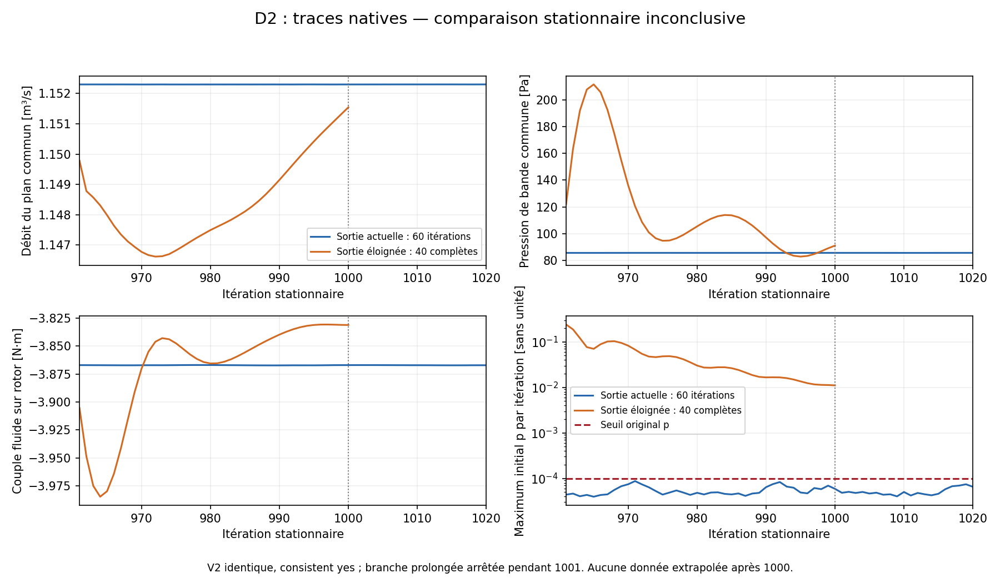

# D2 : sortie prolongée, lot clos et comparaison inconclusive

**Témoin terminé ; sortie prolongée partielle ; ressources libérées.** Le
[protocole préparé](OUTLET_SENSITIVITY_PREPARATION.md) a été conservé : même rotor
V2, `SIMPLE.consistent yes`, extension 275 mm vers −Z, 50 couches uniformes de
5,5 mm, aucune augmentation de distance ou d'itérations après observation.
La [comparaison auditée](results/cfd/D2-partial-pair-analysis.json) refuse une
admission stationnaire de la paire. Aucun gain airflow, indépendance au domaine,
champ local qualifié ou validation installée n'est établi.

## Ce qui a effectivement été exécuté

Les cinq tests géométriques préalables passent : connectivité/volumes du cœur,
volume prismatique ajouté, flux, orientation, zones écrites et correspondances
des champs. Le contrôle des tables vectorielles natives et le refus d'une
fenêtre partielle portent ensuite la suite à sept tests, avec refus explicite d’une admission
partielle ou d’un champ manquant.

Le [mesher](source/append_outlet_prisms.py) ajoute 227 100 prismes : total
680 596 cellules contre 453 496. Le rotor, ses faces, les points et identifiants
du cœur, ses voisins et son appartenance MRF sont conservés. Volume ajouté
0,016591727271 m³, égal à aire de sortie × longueur ; minimum ajouté
4,37078e−8 m³. Écart maximal de volume dans le cœur : 6,35275e−22 m³.
Les [preuves de préparation](results/cfd/D2-mesh-preparation.json) relient les
hashes des maillages, des champs initiaux et des sélections privées.

**Les deux maillages passent les contrôles standard et étendus indépendants,
zéro échec, seuils inchangés** :
[témoin](results/cfd/D2-current-independent-mesh-gate.json) et
[prolongé](results/cfd/D2-extended-independent-mesh-gate.json).
Les [observables à 960](results/cfd/D2-seed-observables-verification.json),
calculées sans nouvelle itération, reproduisent les trois pressions de zones et
le débit orienté d'origine à la précision d'écriture. La syntaxe du fragment
functionObjects a été corrigée avant lancement : Foundation13 utilise
`faceZone` et `cellZone`, plutôt que `regionType/name`.

Une première préparation s'est arrêtée **avant toute itération CFD** : la valeur
`dataFile` de la décomposition manuelle exigeait une chaîne entre guillemets.
Ce [premier essai](results/runtime/D2-first-execution-receipt.json), sa capsule
et son archive sont conservés. La correction de syntaxe et l'en-tête
`faceZoneList` ont été gelés dans une deuxième capsule. Le timer original n'a
pas été réinitialisé. L'affectation manuelle est conforme au
[code Foundation13](https://raw.githubusercontent.com/OpenFOAM/OpenFOAM-13/master/src/parallel/decompose/decompositionMethods/manual/manual.C).

La partition originale du cœur sur quatre rangs est vérifiée exactement dans
les deux cas. Les colonnes appartiennent au rang propriétaire de leur ancienne
face de sortie. Les [comptes prolongés](results/cfd/D2-extended-partition-verification.json)
sont 122 709 / 167 115 / 208 232 / 182 540 cellules : cette conservation induit
un déséquilibre de charge, sans redistribution du cœur.

Le [runner](source/run_d2_in_container.py) exécute ensuite deux branches
séquentielles depuis le même état privé `consistent yes/960` :

| Cas | Itérations complètes | Tables natives avec état 960 | État final |
|---|---:|---:|---|
| Sortie actuelle | 60, 961–1020 | 61 lignes par table | `End`, champs complets, reconstruction 980/1000/1020 |
| Sortie prolongée | 40, 961–1000 | 41 lignes par table | 1001 commencée puis interrompue ; aucun `End` ni champ 1020 |

Le témoin coûte 118,731 s de solveur. La branche prolongée dispose réellement
de **159 s**, jusqu'à la réserve de clôture de la date limite originale ;
elle s'arrête proprement avec code timeout 124 après 160,030 s, signal/arrêt
compris. La limite de 300 s était un maximum, subordonné au timer global.
Aucune itération manquante n'est extrapolée ou ajoutée.

## Critères de stationnarité et écarts communs

Le [résumé témoin1020](results/cfd/D2-current1020-flow-summary.json) passe les
**dix critères originaux** ; la fenêtre 1001–1020 contient vingt mesures
consécutives. Ses **sept contrôles supplémentaires** passent aussi : débit et
pression de bande, différences entre fenêtres, RMS des champs 1000→1020.
La RMS volumique Δp vaut 0,28765 Pa, ΔU 0,04178 m/s. Cependant les maxima locaux
atteignent 122,284 Pa et 48,196 m/s : le passage des critères globaux ne
qualifie toujours pas les champs locaux.

La branche prolongée manque entièrement la fenêtre requise 1001–1020 et ses
champs finaux. À 981–1000, son résidu initial p maximal vaut **0,0277275** contre
le seuil 0,0001 ; U atteint 0,00409826 contre 0,00001, k 0,00797796 contre
0,0001. La pression de bande a un écart-type **11,795 Pa** contre 2 Pa, et sa
moyenne évolue de 138,957 à 97,745 Pa entre les deux fenêtres disponibles.
Elle reste numériquement non admise et non stationnaire selon les contrôles
prévus. Les résidus normalisés sur des domaines différents ne mesurent pas
un effet physique de domaine.

La seule comparaison appariée de vingt mesures disponible, **981–1000**, est
**descriptive** :

| Grandeur dans la zone commune | Sortie actuelle | Sortie prolongée | Écart |
|---|---:|---:|---:|
| Débit moyen orienté [m³/s] | 1,152299531 | 1,149390387 | −0,25246 % relatif symétrique |
| Couple moyen fluide sur rotor [N·m] | −3,867153957 | −3,842874987 | 0,62783 % en valeur absolue |
| Pression statique moyenne volumique [Pa] | 85,644954 | 97,744930 | +12,099976 Pa |

La puissance suit la même variation relative que le couple au régime fixe.
La pression est celle des **mêmes 5 825 cellules**, pas une élévation entre
ports. L'écart de pression dépasse la bande de screening 5 Pa ; toutefois les
prérequis de stationnarité de la paire échouent. Les gates de comparaison du
domaine **ne sont donc pas évalués comme une admission**.

Les champs réellement sauvegardés à 1000 montrent une RMS commune Δp
38,337 Pa et ΔU 1,284 m/s, maximum Δp 514,162 Pa. Ces différences décrivent
un état itératif non convergé ; elles ne donnent pas un effet stationnaire
qualifié de la sortie ni une incertitude expérimentale.

Le [script](source/plot_d2_native_trace.py) et ses
[hashes de provenance](results/cfd/D2-native-traces.json) conservent tous les
points réellement complets. L'axe représente des itérations stationnaires,
sans fréquence ou durée physique ; aucune courbe prolongée après 1000.

## Reflux réellement conservé à 1000

Les champs MPI1000 prolongés sont relus par leurs identifiants globaux,
sans solveur ou `reconstructPar` supplémentaire. Les cinq champs couvrent
680 596 cellules, chacune exactement une fois. Les 4 542 faces du plan commun
sont couvertes une fois et leur phi retrouve la somme native du functionObject.

| Emplacement à l'état sauvegardé 1000 | Débit net [m³/s] | Reflux brut [m³/s] | Reflux / net |
|---|---:|---:|---:|
| Témoin, plan de sortie actuel | 1,152299642 | 0,123988412 | 10,7601 % |
| Prolongé, même plan devenu interne | 1,151545816 | 0,104273570 | 9,0551 % |
| Prolongé, frontière éloignée | 1,151530127 | 0,129404559 | 11,2376 % |

Le déplacement n'a pas éliminé le reflux dans l'état disponible. Ce seul
prolongement, partiel, ne prouve ni distance suffisante ni indépendance au
domaine. Le buffer à section constante avec côtés `slip` conserve confinement
et mélange ; il ne représente pas un plénum moteur mesuré.

## Clôture, conservation et reproduction

Limites vérifiées : **4 CPU, RAM + swap 5 GiB, réseau absent, sources privées en
lecture seule**. [Temps global natif](results/runtime/D2-native-archive-verification.json)
**627,669 s**, première préparation, correction sous timer original,
reprises, arrêt, audit et archivage inclus, sous 720 s. Le conteneur est libéré
à **20:09:21 UTC** ; les [services préexistants sont inchangés](results/runtime/D2-release-confirmation.json).
Aucun nouveau calcul, installation, accès persistant ou modification de service.

Archive finale privée : 99 membres vérifiés, 189 782 229 octets ; archive du
premier essai également transférée et vérifiée. Les tableaux complets, maillages
et champs restent privés. Le launcher exclut les répliques `processor*` de son
archive ; les champs1000 prolongés et leurs correspondances ont donc été
récupérés **séparément après libération** comme simple conservation des fichiers,
sans nouvelle phase native. Le [certificat complémentaire](results/runtime/D2-partial1000-preservation-verification.json)
couvre 44 fichiers privés vérifiés. Leur assemblage par identifiants sert au
diagnostic1000 ; il ne reconstitue pas le checkpoint1020 absent.

Les [capsules exactes](parameters/D2-executed-capsule-manifest.json) et
[première préparation](parameters/D2-first-preparation-capsule-manifest.json)
sont conservées avec configs et sources gelées. L'analyse complète de la paire
n'a jamais été atteinte ; la lecture des tables vectorielles de forces a ensuite
été corrigée et testée dans le helper courant, sans modifier la capsule exécutée.
L'analyse du lot partiel utilise [un script distinct](source/analyze_d2_partial_result.py).

Vérification sans solveur : `make fan-program-check`. Reproduction des
statistiques/figures : mêmes scripts avec archives natives privées extraites.
Le launcher exige une coordination explicite ; il ne doit pas être relancé
avec la date limite originale expirée. **Aucune continuation n'est autorisée
ou engagée par ce rapport.** Une éventuelle nouvelle étude exigerait un budget
et un protocole définis avant calcul. Identité 935/993, interfaces installées,
compressibilité, parois, fatigue et validation physique restent ouvertes.
