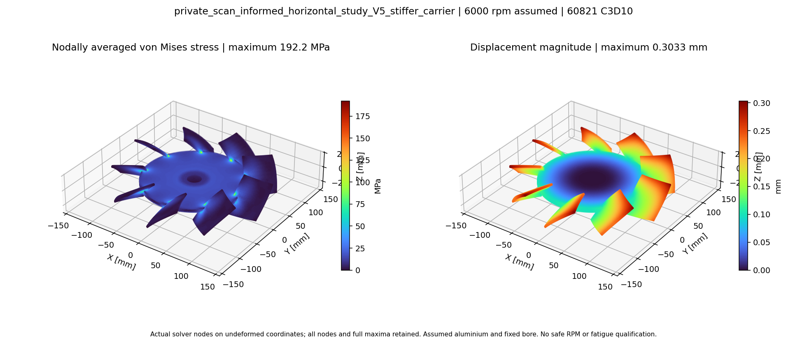
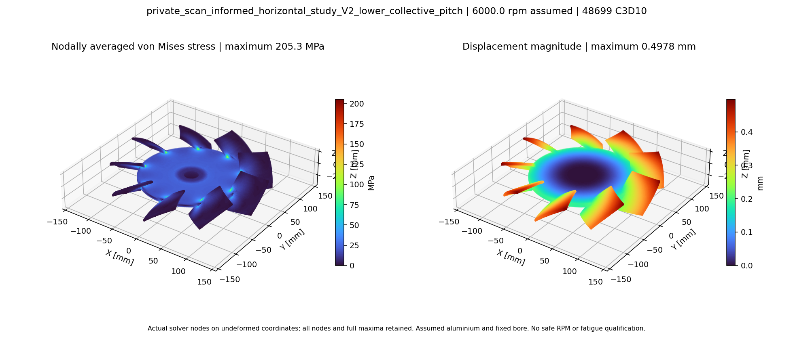
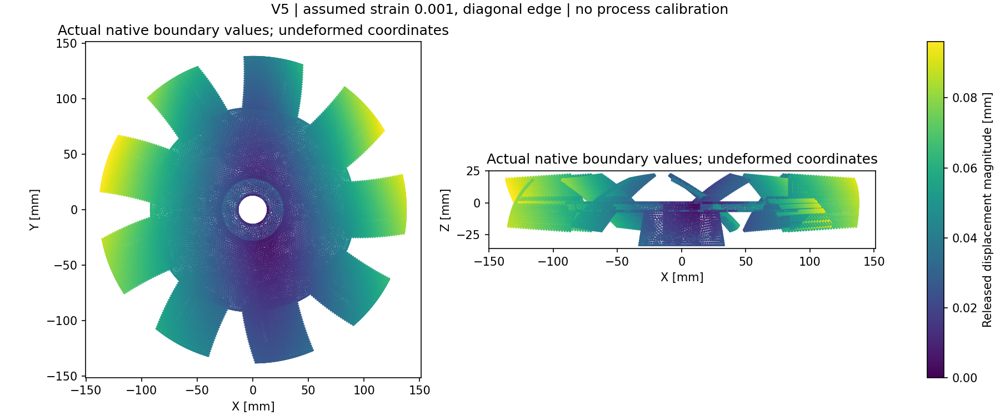

# Études du ventilateur horizontal : état et reproduction

[Accueil](../../README.md) · [CAD et rendus](README.md) ·
[Paramètres R0](parameters/R0.json) · [Paramètres V5](parameters/V5.json) ·
[Comparaison mécanique](results/mechanics/mechanical-two-grid-comparison.csv) ·
[Screening LPBF](results/lpbf/lpbf-screen.json) · [Scène OpenUSD](omniverse/studies.usda)

Ces études reprennent les travaux existants : [PR103](https://github.com/cluster2600/porscheparts/pull/103),
[PR105](https://github.com/cluster2600/porscheparts/pull/105),
[programme 993](../../twins/993-engine-cooling-fan-system-f0/README.md),
[PR121](https://github.com/cluster2600/porscheparts/pull/121),
[diagnostic CFD PR123](https://github.com/cluster2600/porscheparts/pull/123) et
[références du système horizontal PR126](https://github.com/cluster2600/porscheparts/pull/126).
Les géométries et résultats des anciennes études restent distincts de R0/V5.
La culasse de PR106 constitue un autre projet.

## Identité, provenance et hypothèses

Le scan a été retrouvé dans les téléchargements iCloud du propriétaire et conservé
localement. Son identité historique, son unité et une éventuelle équivalence
935/993 ne sont pas démontrées. Le brut présente des ouvertures et intersections ;
il n'est ni le domaine CFD ni une pièce prête à fabriquer. Sa disponibilité privée
ne constitue pas une licence publique. Les autorisations expresses du propriétaire
du 4 octobre 2026 couvrent les reconstructions, rendus, scripts, paramètres et
rapports de calcul nettoyés ; le scan brut reste exclu. Aucun droit de réutilisation
supplémentaire n'est accordé par ces autorisations.

R0 est une reconstruction analytique originale, guidée par des proportions relatives
du scan. Les 275 mm, neuf pales, profils, calages, épaisseurs, jeu froid de 1,1 mm,
axes, alésage et interfaces sont des hypothèses. Le repère +Z est l'axe de rotation,
+X celui de l'entrée du renvoi d'angle. Les huit composants ont des BRep valides
avec contrôle de volume après relecture STEP ; le rotor est un solide connecté.
L'assemblage contient neuf solides, car les deux enveloppes de pignons restent
séparées. Aucune denture, portée de roulement, étanchéité ou tolérance n'est définie.

V5 modifie seulement le voile porteur : épaisseur +30 %, volume du rotor +12,76 %.
Les identifiants historiques des calculs commencent par `private_scan_informed` ;
ils sont conservés pour tracer les preuves. Aucun fichier du scan n'est embarqué.

## Rotation et modes propres

CalculiX 2.23, Gmsh 4.15.2, tétraèdres quadratiques C3D10, permutation Gmsh/CalculiX
vérifiée sur les coordonnées de référence. Matériau hypothétique : E = 70 GPa,
ν = 0,33, ρ = 2700 kg/m³ ; unités mm–N–s–tonne. Toutes les translations des nœuds
du seul alésage hypothétique sont fixées ; rotation de 6000 tr/min. Les douze modes
sont calculés sans précontrainte de rotation. Les huit jobs se terminent normalement.

| Cas | C3D10 | Déplacement max (mm) | Extension radiale max (mm) | Premier mode (Hz) | Pic nodal von Mises (MPa) |
|---|---:|---:|---:|---:|---:|
| R0, taille 4,5 mm | 30825 | 0,5043 | 0,2276 | 377,79 | 189,25 |
| R0, taille 3,6 mm | 51796 | 0,5100 | 0,2307 | 376,00 | 225,93 |
| V5, taille 4,5 mm | 31443 | 0,2982 | 0,1568 | 511,38 | 182,39 |
| V5, taille 3,6 mm | 60821 | 0,3033 | 0,1599 | 507,97 | 192,17 |

Les déplacements et le premier mode varient de moins de 2 % entre ces deux
maillages, sans constituer une convergence complète ni une corrélation physique.
Le gain global V5 se retrouve sur les deux maillages : déplacement max environ
−40,5 % et premier mode environ +35,1 % sur le maillage fin. Les contraintes ne sont
pas indépendantes du maillage : pic R0 +19,38 % et pic V5 +5,36 % entre les deux tailles.
Les pics sont au départ des pales, r ≈ 83,897 mm, et non à l'alésage fixé r = 13,75 mm.
La jonction analytique sans congé mesuré rend ces pics sensibles au maillage.
Aucun classement en fatigue, régime sûr ou jeu chaud minimum n'en découle.

Les rapports conservent les maxima bruts et les empreintes des fichiers solveur.
Les journaux rotation/modal sont publiés avec des fins de lignes LF et sans
espaces finaux ; les empreintes avant/après de cette seule normalisation sont
[enregistrées](results/runtime/text-normalization.json). Les empreintes des
rapports solveur restent celles des originaux archivés. les champs complets et entrées
volumineuses restent dans une archive privée vérifiée, sans scan incorporé.
Le budget d’incertitude mécanique est un instantané initial ; son champ CFD
historique à 22 cellules est remplacé, pour l’état courant, par les rapports CFD
et le présent état de validation.
Le percentile est pondéré par les nœuds, pas par le volume. Les images représentent
les champs nodaux réellement calculés, aux positions non déformées, sans écrêtage.
Précontrainte tournante, gyroscopie, roulements/contact, température et charges
aérodynamiques ne sont pas inclus.




V2 est maintenant également calculé sous les mêmes hypothèses, avec le mailleur
structural original : 33219 puis 48699 C3D10, Jacobien Gauss4 positif et volume
recoupé au CAD. Les [six résultats R0/V5/V2](results/mechanics/three-variant-comparison.json)
conservent les deux grilles. V2 donne Umax 0,493745 / 0,497753 mm, extension radiale
0,213118 / 0,215046 mm et premier mode 377,033 / 375,642 Hz. Entre ces deux
grilles : +0,81 % pour Umax, +0,90 % pour l'extension et −0,37 % pour f1 ; pic
nodal 202,942 / 205,291 MPa (+1,16 %), sans preuve de convergence locale.
À la grille fine, par rapport à R0 : masse −0,10 %, déplacement −2,39 %, f1
−0,096 %. Le [rendu](results/mechanics/V2-fields.png) utilise tous les vrais nœuds,
les maxima complets et les coordonnées non déformées ; il ne représente aucun
état de rupture ni une validation d'alliage.



## Aérodynamique et admission CFD

Le modèle scalaire à éléments de pale est un screening : ses polaires sont supposées
et écrêtées sur 100 % des sections R0/V1/V2. Il ne permet pas de classer le calage
42° contre 36°. La sensibilité du débit scalaire à ±11 % d'échelle atteint environ
−14,9 % / +15,5 %. Une amélioration de débit n'est pas démontrée.

Le domaine fluide reconstruit directement avec OCC conserve le même rotor et
la même enveloppe intérieure de carter. Le meilleur maillage initial passait le
contrôle standard mais échouait au contrôle étendu : 22 déterminants de cellules
inférieurs à 0,001. La formule indépendante reproduit exactement les 22 identifiants.
Les essais d'unions convexes échouent en présence de petites concavités locales ;
aucune union partielle n'a été appliquée. Le raffinement des voisinages diagnostiqués,
répété par la symétrie exacte des neuf pales, résout le défaut sans modifier le CAD
ni les seuils : 148373 cellules, minimum 0,00232225, non-orthogonalité maximale
72,903°, skewness maximale 0,9801. Les deux contrôles indépendants passent.
Le volume discret conserve un écart de l'ordre de 0,025 % au volume CAD ; cette
mesure n'établit pas la fidélité métrologique à une pièce réelle.

Le [protocole figé](parameters/reference-flow-protocol.json) définit avant solveur
la référence 6000 tr/min : air ρ = 1,2 kg/m³, ν = 1,5×10⁻⁵ m²/s, entrée supérieure
à pression totale nulle, sortie inférieure à pression statique nulle, MRF +Z,
écoulement attendu −Z. SST stationnaire incompressible et convection premier ordre.
Résidus, bilan de masse, stabilité du débit et du couple doivent tous passer.
Les couches de paroi, l'indépendance aérodynamique au maillage et le moteur installé
restent absents. Le premier pilot à 200 itérations termine normalement mais échoue
aux résidus figés ; ses mesures ne sont pas une performance admise. La continuation
séparée à 600 itérations conserve exactement les conditions et seuils et passe
tous les critères figés : débit sortant moyen 1,23587 m³/s, couple sur le rotor
−5,25296 N·m, puissance mécanique correspondante 3300,53 W. Ces valeurs sont des
sorties conditionnelles du modèle isolé ; aucune amélioration n’est prouvée. Le
Mach local maximal calculé atteint environ 0,383 : la sensibilité à la compressibilité
doit être vérifiée, en plus de la résolution de paroi et de l’indépendance au maillage.
Les [rapports 200](results/cfd/reference-flow-200-summary-complete-fields.json) et
[600 itérations](results/cfd/reference-flow-600-summary-complete-fields.json)
conservent les critères, les champs contrôlés et les empreintes des mesures.

La variante [V2 à 36°](V2-assembly.step) conserve les autres paramètres R0
([paramètres exacts](parameters/V2.json)). Ses deux premiers essais échouaient au
contrôle étendu : 36 cellules / 22 faces, puis 51 cellules / 15 faces. Ils restent
conservés comme échecs. Le diagnostic mesure neuf arêtes de 0,176 mm, contre
1,278 mm minimum pour R0. Le CAD n'a pas été réparé : une tentative de healing
modifiait le volume et a été écartée. La résolution locale de ces petites arêtes,
avec taille minimale explicitement réduite, permet au maillage V2 de passer les
deux contrôles inchangés : 223300 cellules, déterminant minimal 0,0021815,
non-orthogonalité maximale 72,411°. Les [rapports](results/cfd/V2-common-h7-mesh-report.json)
et [gate](results/cfd/V2-common-h7-independent-mesh-gate.json) tracent ce rétablissement.

À 600 itérations, [V2 passe les critères figés](results/cfd/V2-common-h7-flow-summary.json) :
débit 1,14659 m³/s, couple −3,83969 N·m et puissance 2412,55 W.
R0 a ensuite été recalculé avec les mêmes champs de taille spatiaux et la même
limite minimale de 0,015 mm : 262047 cellules, les deux gates passent et
[600 itérations admises](results/cfd/R0-common-h7-flow-summary.json), débit
1,23472 m³/s et puissance 3303,89 W. Cela établit une comparaison sous les mêmes
conditions de pression et règles de maillage, pas une indépendance au maillage.
V2 réduit simultanément débit et puissance ; le rapport débit/puissance est un
indicateur de screening, pas un rendement ni la preuve d'un meilleur refroidissement
sur moteur. La grille commune plus fine réduit la taille générale de 7 à 5,6 mm. Son premier
maillage R0 (476657 cellules) échoue au contrôle étendu : trois cellules au pied
pale/voile et quatre faces d'interpolation insuffisante. Leurs positions et leurs
neuf images de symétrie servent à la [recette locale complémentaire](parameters/common-grid-refinement-fine-repair1.json),
sans changer le CAD ni les seuils. Le [R0 raffiné](results/cfd/R0-common-h5p6-independent-mesh-gate.json)
compte 594940 cellules ; les deux gates passent. Un premier lot de 300 itérations
atteint sa limite interne de 570 s avant son checkpoint et reste un échec archivé.
Quatre lots prévus de 150 itérations, chacun borné à 600 s, donnent les checkpoints
150/300/450/600 ; le premier temps de chaque reprise est vérifié (1/151/301/451).
L'[audit de cadence des mesures natives](results/cfd/measurement-cadence-audit.json)
retire l'admission historique R0 fine à 600 et à 750. Une substitution globale de
`writeInterval` avait changé de 1 à 150 la cadence des trois fonctions de débit
et de force, en même temps que celle des checkpoints. Le résumeur acceptait
silencieusement deux lignes comme une fenêtre de vingt. Les 39 tables des
13 cas correspondent exactement aux empreintes originales : aucune perte ni
réécriture de ces tables n'est constatée. Seuls les deux cas communs disposent
des mesures consécutives exigées ; les onze phases fines sont insuffisamment
échantillonnées. Les résidus de pression et les champs complets restent
exploitables séparément. Les anciens résumés restent inchangés pour l'audit,
mais leur statut d'admission fine et leurs étiquettes « dernière fenêtre » sont
supplantés par cet audit et la [comparaison corrigée](results/cfd/matched-grid-comparison.json).

V2 fine à [600](results/cfd/V2-fine-150steps-phase600-summary.json), puis à
[750](results/cfd/V2-fine-continuation750-summary.json), dépasse encore le seuil
de pression : 1,2306×10⁻⁴ et 1,2442×10⁻⁴ contre 10⁻⁴. La sensibilité appariée
réduit la relaxation de 0,25 à 0,15 sans changer les critères, le maillage ni la
physique. [V2 à 900](results/cfd/V2-fine-pressure015-900-summary.json) échoue
encore sur la pression (maximum 1,5667×10⁻⁴). [R0 à 750](results/cfd/R0-fine-pressure015-750-summary.json)
a des résidus conformes, mais son admission est retirée faute de fenêtre de
mesures. Aucun classement fin ni écart fin/commun n'est retenu.

| Cas | Cellules | Admission / itération finale | Q moyen des 20 dernières itérations, m³/s | P d'entrée moyen, W | Δpt final aux ports, Pa | Rapport énergétique final aux ports, non qualifié |
| --- | ---: | --- | ---: | ---: | ---: | ---: |
| R0, grille commune 7 mm | 262047 | admis / 600 | 1,234720 | 3303,895 | 1960,672 | 0,732745 |
| V2, grille commune 7 mm | 223300 | admis / 600 | 1,146586 | 2412,549 | 1541,226 | 0,732475 |
| R0, grille fine 5,6 mm, relaxation 0,15 | 594940 | **admission retirée** / 750 | indisponible | indisponible | 1998,375 | 0,740207 |
| V2, grille fine 5,6 mm, relaxation 0,15 | 453496 | **non admis** / 900 | indisponible | indisponible | 1569,574 | 0,744361 |

Les valeurs finales des champs fins sont des instantanés, distincts de moyennes
ou d'une admission : R0 Q = 1,230172 m³/s et P = 3321,160 W ; V2 Q et P sont
tracés dans la comparaison corrigée. La [comparaison historique](results/cfd/matched-grid-comparison-sampling-v1-historical.json)
est conservée comme document supplanté, sans valeur d'admission actuelle.

Sur la paire commune admise, V2 réduit Q de 7,14 %, P de 26,98 % et Δpt de
21,39 %. Q/P augmente de 27,17 %, mais le rapport d'énergie aux ports varie de
−0,037 % relatif : ce n'est pas une démonstration d'efficacité supérieure. Les
conditions décrivent un ventilateur isolé à pressions de jauge nulles imposées,
sans courbe de résistance moteur. Aucun compromis définitif de refroidissement
installé ni indépendance au maillage n'est établi.

Le [diagnostic de pression et protocole suivant](PRESSURE_FOLLOWUP.md) prépare
une discrimination numérique bornée, puis des points Q–Δp–P à objectif commun.
Ces prochains lots ne sont pas lancés ; ils attendent une fenêtre Kali2 coordonnée.


Le bilan reconstruit indépendamment le couple de pression depuis les surfaces et
vérifie la vitesse des parois du rotor contre Ω × r. La référence à 6000 tr/min
correspond à Ω = 628,319 rad/s, vitesse de bout de pale 86,394 m/s et Mach de bout
0,252 avec la célérité supposée 343 m/s. Les Mach locaux absolu et relatif au rotor
sont également analysés : le Mach de bout seul ne qualifie pas l'incompressibilité.
Le [bilan R0 recoupé](results/cfd/R0-common-h7-balance-v4.json) conserve les pressions
et flux réellement exportés. La pression totale d'entrée est nulle en jauge, la
pression statique de sortie est nulle ; la pression totale sortante est calculée
et comporte de l'énergie cinétique axiale et du swirl. Δpt utilise la moyenne
pondérée par le flux signé aux ports ; l'énergie y est intégrée à partir des
champs finaux ; seuls les Q/P moyens des cas communs utilisent une fenêtre
complète de vingt mesures. Les moyennes fines sont indisponibles.
Un retour d'écoulement
local à la sortie est présent et doit être distingué du débit net.

La reconstruction du flux absolu sur le carter stationnaire donne environ
1,3 à 3,6×10⁻¹² m³/s (arrondi numérique) ; les flux relatifs MRF ne sont pas
des fuites. Le retour brut de sortie vaut 0,1268 / 0,1318 m³/s pour V2/R0
communs, distinct des débits nets. Le produit couple × Ω confirme la puissance
d'entrée, mais le bilan mécanique
simplifié reste non fermé. Le transfert visqueux/turbulent moyen calculé ne
comprend pas une fermeture qualifiée des transports turbulents, travaux et
pertes numériques. Son rapport d'énergie aux ports ne sera pas présenté comme
rendement physique. Le défaut de fermeture après ce transfert reste de
25,29 % / 25,57 % de la puissance pour V2/R0 communs, et 23,53 % pour R0 fin.
Le flux `phi` aux faces dans la zone MRF est relatif au repère
tournant ; la reconstruction du flux absolu distingue ce terme d'une fuite sur
une paroi stationnaire. Les fortes vitesses locales motivent une sensibilité à la
compressibilité. Le calcul isentropique utilisé pour cadrer cette hypothèse est
un screening idéal, pas une correction de densité simulée :
[NASA, relations isentropiques](https://www.grc.nasa.gov/www/k-12/airplane/isentrop.html).

## Fabrication additive

Le [screening géométrique](results/lpbf/lpbf-screen.json) utilise le vrai STL du rotor
R0. Scénario explicite : poudre AlSi10Mg hypothétique, machine LPBF non sélectionnée,
enveloppe supposée 250 × 250 × 300 mm, marges de 10 mm par côté, couches de 50 µm,
critère de surplomb 45°. Parmi dix poses, seule la pose verticale avec azimut 45°
rentre dans cette enveloppe avec marges. Les sections de 1105 couches de la pose
horizontale sont calculées ; l'intégration diffère du volume STL de 0,111 %.
Le proxy de supports additionne des colonnes verticales avec recouvrements possibles.
Ce n'est ni un support généré, ni un chemin laser, ni une simulation thermo-mécanique.

Une comparaison mécanique de retrait et débridage est maintenant exécutée sur
**R0 et V5**, distincte des anciennes études sur une autre géométrie. Les
[12 cas](results/lpbf/manufacturing-comparison.json) réutilisent les C3D10 vérifiés
et l'élasticité générique E = 70 GPa, ν = 0,33. Le champ de contraction est
`ε* = −a(0,5 + 0,5s²)(I − 0,7nnᵀ)` ; amplitude `a`, hauteur normalisée `s` et
normale de construction `n` sont explicitement supposées. CalculiX initialise le
stockage de déformation initiale puis utilise `INITIAL STRAIN INCREASE` ; aucune
loi de plasticité dépendante de T ni déformation inhérente calibrée n'est inventée.
Les attaches sont des nœuds de surface les plus bas par maille de raster,
complètement fixés : proxy de colonnes rigides, sans solides de support ni contact
thermique. Le second état libère ces attaches et conserve six contraintes de
jauge pour enlever les mouvements rigides.

| Variante / scénario, amplitude 0,001 | Déplacement libéré max (mm) | Incrément max au débridage (mm) | Déformation max après retrait du mouvement rigide (mm) |
|---|---:|---:|---:|
| R0, diagonal sur chant, raster 5 mm, taille 4,5 mm | 0,096015 | 0,196200 | 0,093672 |
| V5, mêmes conditions | 0,096054 | 0,180054 | 0,093714 |
| R0, à plat, construction +Z, raster 5 mm | 0,214339 | 0,209967 | 0,130655 |
| V5, mêmes conditions | 0,211377 | 0,207043 | 0,129899 |
| R0, diagonal sur chant, taille 3,6 mm | 0,098434 | 0,190741 | 0,093502 |
| V5, mêmes conditions | 0,098447 | 0,175210 | 0,093656 |

Le benchmark analytique natif de contraction uniforme passe. Le contrôle à
amplitude nulle donne exactement déplacement et contrainte nuls ; doubler
l'amplitude reproduit les déplacements à environ 1,6×10⁻⁶ relatif. Le changement
de raster 5 → 10 mm augmente l'incrément au débridage mais laisse le dernier état
élastique inchangé : le champ prescrit est indépendant du parcours process, et
le modèle ne simule pas l'évolution plastique/thermique imposée par les supports.
C'est une limite de la méthode, pas une validation d'une stratégie de supports.

Les maxima après retrait du mouvement rigide varient de 0,18 % (R0) et 0,06 %
(V5) sur le maillage plus fin, tandis que les RMS nodaux varient de 5,27 % et
7,38 %. Les attaches passent de 518 à 521 nœuds : cette sensibilité combine
maillage et échantillonnage du proxy, sans démontrer une indépendance complète.
Le déplacement libéré final est presque identique R0/V5 ; V5 réduit l'incrément
au débridage d'environ 8,23 % dans le scénario de référence. Les pics élastiques
attachés de 720/661 MPa se concentrent aux attaches ponctuelles et ne constituent
ni contrainte process physique ni admissible de fabrication.




La revue de qualification est préparée en anglais dans le
[dossier fabricant BLT](MANUFACTURING_REVIEW.md). BLT à Xi'an est la cible de
revue communiquée par le coordinateur ; aucune machine, matière, condition,
recette ou prestation n'est automatiquement sélectionnée. Le cas AlSi10Mg/S400
commercial documente une capacité, pas ce rotor. Aucune calibration thermique,
activation de couche, trajectoire laser, porosité ou microstructure n'est simulée.
La fabrication reste **non validée** : données atelier, dessins/tolérances,
calibration, mesures dimensionnelles, NDT/CT, coupons, traitement et essais
physiques sont nécessaires. Fabricabilité/acceptation fabricant et qualification
en service d'un rotor sont deux décisions distinctes. Aucune commande n'est passée.

## OpenUSD et Omniverse

[Scène comparative](omniverse/studies.usda), [R0](omniverse/R0.usda),
[V5](omniverse/V5.usda). Les coordonnées proviennent des vraies tessellations CAD,
sans coupe visuelle : huit meshes par modèle, axes +Z/+X, `metersPerUnit = 0.001`,
matériau visuel aluminium `UsdPreviewSurface`, empreintes et liens aux paramètres
et résultats. La scène écarte les deux configurations uniquement pour la comparaison.

Parsing, composition, topologie fermée, unités et binding des matériaux sont
vérifiés dans OpenUSD 25.11 ; 24 validateurs génériques exécutés sans finding.
La règle Sdr shader est bloquée par l'absence de `shaderDefs.usda` dans le runtime
USD déjà disponible et reste explicitement non validée. Aucun runtime GPU NVIDIA,
rendu RTX, qualification SimReady ou corrélation de jumeau physique n'est établi.
L'asset ne résout aucune équation ; les calculs externes restent liés séparément.

La [scène de débridage](omniverse/manufacturing-studies.usda) contient les vraies
frontières C3D10 libérées : 40480/41060 nœuds, subdivision des faces quadratiques
en triangles linéaires ; chaque arête a deux orientations opposées, aires positives
et écart de volume au CAD de 0,0021 % / 0,0014 %
([R0](results/lpbf/R0-native-boundary-verification.json),
[V5](results/lpbf/V5-native-boundary-verification.json)). Unités mètres, +Z,
déformation à l'échelle 1, identifiants
des nœuds et vecteurs de déplacement conservés. Toutes les coordonnées sont
[recoupées en texte](results/lpbf/field-export-authored-coordinate-verification.json) avec les champs
natifs ; erreur décimale maximale d'environ 5×10⁻⁸ mm. Le contrôle indépendant de
toutes les valeurs réellement chargées en `point3f` par OpenUSD mesure au maximum
7,63×10⁻⁶ mm ([R0](results/lpbf/R0-USD-field-coordinate-verification.json),
[V5](results/lpbf/V5-USD-field-coordinate-verification.json)). Cette borne de
représentation numérique ne constitue aucune tolérance de fabrication. Les
[contrôles de composition](omniverse/manufacturing-scene-validation.json) passent
avec la même réserve shader Sdr. Aucun jumeau process ou SimReady validé n'en découle.

## Commandes reproductibles

Utiliser les outils déjà disponibles : build123d 0.13 / OCP 8, Gmsh 4.15.2,
CalculiX 2.23, NumPy et Matplotlib, Foundation OpenFOAM 13, OpenUSD 25.11.
Les sorties doivent être neuves. Les timestamps STEP et dépendances peuvent changer
les empreintes à la régénération ; contrôler volumes, topology et paramètres en plus
des hashes. Les versions originales des mailleurs sont conservées pour reproduire
les empreintes des rapports : `build_analytical_mesh_original.py` (65df79b8) et
`build_analytical_mesh_netgen_original.py` (09acff31).

Depuis ce dossier :

```sh
python source/verify_study.py
python source/build_analytical_system.py parameters/R0.json work/R0
python source/build_analytical_system.py parameters/V5.json work/V5
python source/render_analytical_system.py work/R0 work/R0.png --display-label 'R0 horizontal fan reconstruction study'
python source/build_analytical_mesh_original.py work/R0 work/R0-h3p6 --mode structural --size-mm 3.6 --rpm 6000
(cd work/R0-h3p6 && ccx rotation && ccx modal)
python source/summarize_analytical_fem.py work/R0-h3p6 work/R0-h3p6/summary.json
python source/render_analytical_fem.py work/R0-h3p6/summary.json work/R0-h3p6/fields.png
python source/screen_analytical_variants.py parameters/R0.json work/scalar-screen.json
python source/screen_lpbf_geometry.py work/R0 work/lpbf
python source/build_openusd_asset.py work/R0 work/R0.usda --label R0
python source/validate_openusd_asset.py omniverse/studies.usda work/USD-validation.json
python source/build_analytical_mesh.py work/R0 work/fluid --mode fluid --size-mm 7 --netgen --local-refinement parameters/targeted-refinement-symmetric.json
python source/prepare_analytical_cfd.py work/fluid work/CFD parameters/R0.json
```

Le gate et le runner OpenFOAM attendent le cas monté dans `/case`, sous l'image
existante `ghcr.io/cluster2600/3dprinting993-mesh-cfd@sha256:a1db60cbf61bbcca52c171e50cab01ed0b6ec860b227e7c5fc50f7b809659b4f`.
Exécuter d'abord `source/run_analytical_cfd_gate.sh`, copier le protocole figé dans
le cas sous `reference-protocol.json`, puis `source/run_reference_pilot.sh`.
Le gate échoue fermé dès qu'un contrôle échoue. Un résultat de mesh seul ne vaut
pas résultat de flow. Le runner borné limite chaque job isolé : affinité, nice,
mémoire et délai ; aucun service ou processus tiers n'est modifié.

Les commandes historiques ci-dessous décrivent les phases fines insuffisamment
échantillonnées. Les helpers corrigés séparent désormais checkpoints et télémétrie ;
le résumeur refuse une fenêtre incomplète. Ils ne sont pas une autorisation de
prolonger automatiquement V2. Pour une reproduction, placer les sources dans un répertoire de calcul neuf
sur le runtime Linux déjà disponible, avec les dossiers CAD nommés dans les
recettes (`private-R0-v3`, `private-V2`) et les recettes JSON à sa racine. Les
noms désignent les études analytiques ; aucun scan n'est requis. Les scripts
appellent le runner borné et refusent un autre conteneur de cette étude actif.
`gate-local.sh` est une copie exacte de `source/run_analytical_cfd_gate.sh` ; le
runner MPI exige `run_parallel_pilot.sh` à la racine. Vérifier localement les
quatre cœurs physiques indiqués par `lscpu` avant de réutiliser le CPU set.

```sh
# Dans ce répertoire de calcul neuf ; image Foundation déjà présente.
python run_matched_cfd.py R0-common-h5p6-repair1 private-R0-v3 common-grid-refinement-fine-repair1.json --size-mm 5.6 --minimum-size-mm 0.01 --mesh-only
python run_existing_grid_sensitivity.py cfd-R0-common-h5p6-repair1 R0-fine-150steps --protocol-template V2-common-h7-protocol.json
python run_matched_cfd.py V2-common-h5p6-repair1 private-V2 common-grid-refinement-fine-repair1.json --size-mm 5.6 --minimum-size-mm 0.01 --mesh-only
python run_existing_grid_sensitivity.py cfd-V2-common-h5p6-repair1 V2-fine-150steps --protocol-template V2-common-h7-protocol.json
python continue_admitted_mesh_flow.py cfd-V2-fine-150steps-phase600 V2-fine-continuation750
python continue_admitted_mesh_flow.py cfd-R0-fine-150steps-phase600 R0-fine-pressure015-750 --pressure-relaxation .15
python continue_admitted_mesh_flow.py cfd-V2-fine-continuation750 V2-fine-pressure015-900 --pressure-relaxation .15
```

Les scripts de scénarios utilisent les maillages mécaniques R0/V5 existants
`mesh-R0-h4p5`, `mesh-R0-h3p6`, `mesh-V5-h4p5`, `mesh-V5-h3p6` et le benchmark
`unit-eigenstrain.inp`. Les résultats déjà présents sont recoupés avant reprise ;
les jobs terminés ne sont pas relancés. Les dossiers de sorties neufs servent à
une reproduction indépendante.

```sh
python build_manufacturing_scenarios.py
python run_manufacturing_cases.py
python compare_manufacturing.py . manufacturing-comparison.json
python verify_native_benchmark.py manufacturing-analytic-benchmark native-verified.json
python export_manufacturing_bundle.py manufacturing-R0-diagonal-edge R0-manufacturing-native.npz
```

Depuis le dossier publié, avec NumPy/Matplotlib pour l'export et la bibliothèque
OpenUSD 25.11 existante pour ses validateurs (les sorties `work/` sont neuves) :

```sh
python source/render_manufacturing_fields.py results/lpbf/R0-manufacturing-native.npz work/R0-manufacturing-release.usda work/R0-manufacturing-release.png --label R0
python source/create_native_coordinate_reference.py results/lpbf/R0-manufacturing-native.npz work/R0-native-reference.json
python source/verify_usd_field_coordinates.py omniverse/R0-manufacturing-release.usda work/R0-native-reference.json work/R0-coordinate-check.json
python source/validate_openusd_asset.py omniverse/R0-manufacturing-release.usda work/R0-field-validation.json --expected-meshes 1 --meters-per-unit 1
python source/compare_matched_flow.py . work/matched-grid-comparison.json
python source/compare_mechanical_studies.py . work/three-variant-comparison.json
```

## Données manquantes pour une pièce et un jumeau validés

Identité et échelle indépendantes du spécimen ; datums, interfaces et tolérances
mesurés ; congés réels, matériau/état et roulements ; régimes et transitoires,
températures et courbes ventilateur/système ; plan d'essais professionnel.
Pour LPBF : scénario qualifié et calibration process. Pour Omniverse : runtime
adapté et validation du profil, puis données de corrélation physique.
Les statuts du catalogue restent inchangés : aucune pièce n'est libérée.

## Vérifications du dépôt

La CI GitHub a exécuté `make check` avec succès sur le premier commit CAD
2a9dba8cb3d06a3b2208c60a848dbe5f2a63899d. Les contrôles locaux sur Linux ont
rencontré les incompatibilités documentées dans le
[rapport runtime](results/runtime/repository-checks.json). Ils ne sont pas annoncés
verts. La CI du commit final fait autorité pour le logiciel du dépôt, sans valider
la physique. Les contrôles spécialisés ci-dessus concernent uniquement leurs
artefacts et hypothèses. La PR129 a été fusionnée par le coordinateur sur main
`8283155cb2b1275b0bf3e22d4d7459d4ac76b059` ; les présents compléments sont
isolés sur une nouvelle branche de revue. Aucun merge automatique de cette
nouvelle branche n'est demandé.
Voir la [matrice de preuves logicielle](SOFTWARE_CHAIN.md). Les [preuves natives privées](results/runtime/native-archive-verification.json)
regroupent 1197 fichiers (2,08 Go compressés), chaque membre vérifié par SHA-256
sur le runtime ; le transfert local possède exactement la même taille et empreinte.
Le scan brut et les répliques de champs MPI sont exclus ; les champs reconstruits
faisant autorité, entrées, historiques et reçus sont conservés. L'archive reste
privée ; seul son reçu assaini est publié. Tous les jobs de cette livraison sont
terminés ; aucun autre processus ou service n'a été arrêté ou modifié.
