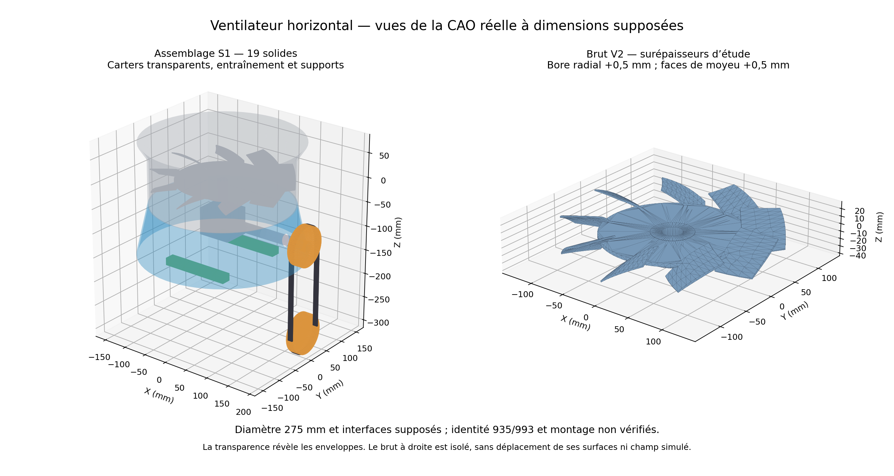

# Horizontal fan reconstruction studies

[Editable R0 STEP](R0-assembly.step) · [R0 render](R0-render.png) ·
[**S1 assembly, V2 stock and manufacturing preparation**](ASSEMBLY_MANUFACTURING_S1.en.md) ·
[**Actual S1 CAD and V2 stock view**](S1_DELIVERY.en.md) ·
[**Exact D3 supervisor prepared and tested, without launch**](D3_SUPERVISOR_PREPARATION.en.md) ·
[D2 establishment diagnosis and prepared D3 pair](D3_ESTABLISHMENT_DIAGNOSTIC.en.md) ·
[Editable V2 STEP](V2-assembly.step) · [Computed V2 fields](results/mechanics/V2-fields.png) ·
[Editable V5 STEP](V5-assembly.step) · [V5 render](V5-render.png) ·
[Engineering, reproduction and validations](ENGINEERING.en.md) ·
[Manufacturing qualification review](MANUFACTURING_REVIEW.md) ·
[Software chain evidence](SOFTWARE_CHAIN.en.md) ·
[Pressure diagnosis and next batches not launched](PRESSURE_FOLLOWUP.en.md) ·
[Exact D1 preparation and unmeasured subsystems](D1_PREPARATION.en.md) ·
[Bounded D1 execution and incomplete result](D1_EXECUTION.en.md) ·
[D1C completed, numerical gates and persistent backflow](D1C_EXECUTION.en.md) ·
[D2 closed: control 60, extended outlet 40, inconclusive comparison](D2_EXECUTION.en.md) ·
[D2 completed at 1020: pressure unadmitted, inconclusive comparison](D2_COMPLETION_EXECUTION.en.md) ·
[20-step restart preparation and verified 1000 checkpoint](D2_COMPLETION_PREPARATION.en.md) ·
[Historical D2 preparation and frozen criteria](OUTLET_SENSITIVITY_PREPARATION.en.md) ·
[Local analysis after D1 and single proposed trial](D1_NEXT_DIAGNOSTIC.en.md) ·
[Subsystems and symbolic variables](SUBSYSTEM_PARAMETERS.en.md) ·
[Repository home](../../README.md)

Analytical reconstructions informed by the private scan, published with the
project owner's explicit authorization on October 4, 2026. The STEP assemblies
contain the rotor, housing and simplified right-angle-drive envelopes; the
renders show the same geometry with a purely visual section. The 275 mm
diameter and nine blades are assumed. Scale, profiles, pitch, clearances,
materials and interfaces remain assumptions. V5 increases the assumed web
thickness by 30 % relative to R0; V2 changes only the root pitch from 42° to 36°.
Units: mm; rotor axis: +Z; primary transmission axis: +X. Teeth, bearings, seals
and tolerances remain to be defined. Historical identity and 935/993 equivalence
are not established. No dimensional, fit, safe-speed, fatigue or manufacturing
qualification is claimed. No separate reuse license for the scan-informed
assets has been established.

**CFD correction:** the [native-table audit](results/cfd/measurement-cadence-audit.json)
withdraws fine R0 admission and the fine-grid means presented as twenty
measurements. Historical reports are retained; the
[corrected comparison](results/cfd/matched-grid-comparison.json) provides the
current state. The common-grid pair remains numerically admitted.
The D1 control remains unadmitted on p and its strict branch remains incomplete.
**D1C**, a single `consistent yes` branch, completes its 60 iterations and passes
the original criteria, with a 45.01 % decrease in the initial maximum p.
Outlet backflow and local-field sensitivity persist; no improvement in
installed cooling is demonstrated.
**D2** retains the core and validates both meshes; the control completes 60
iterations, while the extended branch completes only 40 under the original
global timer. The steady outlet comparison remains inconclusive; resources
were released.
The [single 1001–1020 restart is completed](D2_COMPLETION_EXECUTION.en.md), in
110.505 s overall. The extended branch totals 40 + 20 steps but still fails
pressure steadiness and p/U/turbulence residual criteria. The comparison
remains inconclusive, fields and logs are preserved, there is no automatic
1040 continuation, and resources were released.
The [lightweight archive diagnosis](D3_ESTABLISHMENT_DIAGNOSTIC.en.md) documents
continuing establishment and the cost of a transient calculation. Two
discriminating 20-step restarts are prepared, without launch; their global
360 s budget requires coordination. The
[D3 supervisor](D3_SUPERVISOR_PREPARATION.en.md) is now frozen and checked by
19 tests without a solver and an independent verification of private copies,
without new native execution. In parallel,
[S1](ASSEMBLY_MANUFACTURING_S1.en.md) delivers the plenum, drive and supports as
editable envelopes, V2 stock and the independent sheet of physical interfaces
still missing.

