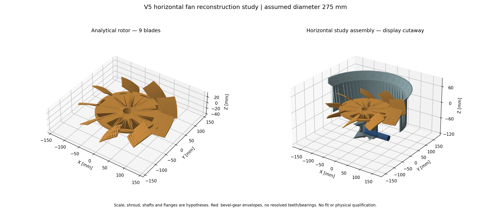

# Études de reconstruction du ventilateur horizontal

[STEP R0 éditable](R0-assembly.step) · [Rendu R0](R0-render.png) ·
[STEP V2 éditable](V2-assembly.step) · [Champs calculés V2](results/mechanics/V2-fields.png) ·
[STEP V5 éditable](V5-assembly.step) · [Rendu V5](V5-render.png) ·
[Ingénierie, reproduction et validations](ENGINEERING.md) ·
[Revue de qualification de fabrication](MANUFACTURING_REVIEW.md) ·
[Preuves de la chaîne logicielle](SOFTWARE_CHAIN.md) ·
[Diagnostic de pression et prochains lots non lancés](PRESSURE_FOLLOWUP.md) ·
[Préparation exacte D1 et sous-systèmes non mesurés](D1_PREPARATION.md) ·
[Exécution D1 bornée et résultat incomplet](D1_EXECUTION.md) ·
[D1C terminé, gates numériques et reflux persistant](D1C_EXECUTION.md) ·
[D2 clos : témoin60, sortie prolongée 40, comparaison inconclusive](D2_EXECUTION.md) ·
[D2 : checkpoint1000 vérifié et complétion20 pas non lancée](D2_COMPLETION_PREPARATION.md) ·
[Préparation historique D2 et critères gelés](OUTLET_SENSITIVITY_PREPARATION.md) ·
[Analyse locale après D1 et essai unique proposé](D1_NEXT_DIAGNOSTIC.md) ·
[Sous-systèmes et variables symboliques](SUBSYSTEM_PARAMETERS.md) ·
[Accueil du dépôt](../../README.md)

Reconstructions analytiques informées par le scan privé, publiées avec
l'autorisation explicite du propriétaire du projet le 4 octobre 2026. Les
assemblages STEP contiennent le rotor, le carter et des enveloppes simplifiées
du renvoi d'angle ; les rendus montrent la même géométrie avec une coupe
uniquement visuelle. Le diamètre 275 mm et les neuf pales sont supposés.
Échelle, profils, pitch, jeux, matériaux et interfaces restent des hypothèses.
V5 augmente de 30 % l'épaisseur supposée du voile par rapport à R0 ; V2 change
seulement le pitch racine de 42° à 36°. Unités : mm ; axe du rotor : +Z ; axe
primaire de transmission : +X. Dentures, roulements, joints et tolérances restent
à définir. L'identité historique et l'équivalence 935/993 ne sont pas établies.
Aucune qualification dimensionnelle, de montage, de régime sûr, de fatigue ou
de fabrication n'est revendiquée. Aucune licence distincte de réutilisation des
assets informés par le scan n'a été établie.

**Correction CFD :** l'[audit des tables natives](results/cfd/measurement-cadence-audit.json)
retire l'admission fine R0 et les moyennes fines présentées comme vingt mesures.
Les rapports historiques sont conservés ; la [comparaison corrigée](results/cfd/matched-grid-comparison.json)
fournit l'état actuel. La paire sur grille commune reste admise numériquement.
Le témoin D1 reste non admis sur p et sa branche stricte reste incomplète.
**D1C**, une seule branche `consistent yes`, termine ses 60 itérations et
passe les critères originaux, avec une baisse de 45,01 % du maximum initial p.
Le reflux de sortie et la sensibilité des champs locaux persistent ; aucune
amélioration du refroidissement installé n’est démontrée.
**D2** conserve le cœur et valide les deux maillages ; le témoin termine 60
itérations, la branche prolongée 40 seulement sous le timer global original.
La comparaison stationnaire de sortie reste inconclusive ; ressources libérées.
Les checkpoints natifs980 et1000 sont vérifiés ; une reprise unique1001–1020
est [préparée, sans lancement ni réservation](D2_COMPLETION_PREPARATION.md).

