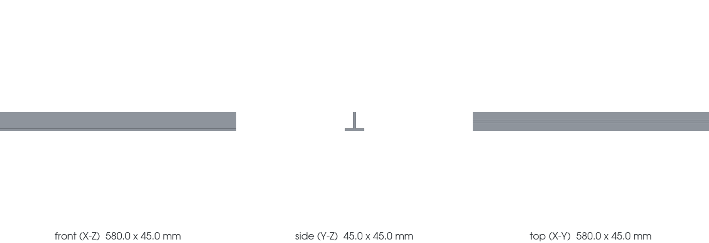

<!-- generated by scripts/render_part_pages.py - do not edit by hand -->

# Turbo engine carrier (Motortraeger)

**`993-ENG-CARRIER-0001`** · Porsche 993 · 1994–1998

  

CAD view of the concept geometry — bounding box 580.0 × 45.0 × 45.0 mm. Not a photograph, not a manufactured part, not evidence of fit or function.

> [!WARNING]
> **Safety-critical** — failure could cause loss of control, fire or injury. Published only after formal engineering review. No part in this repository is released — read [SAFETY.md](../../SAFETY.md).

## What it is

Cross member carrying the 993 Turbo powertrain, part number 993 115 021 53. The PET catalogue places it in illustrated group 109-00 "Engine suspension Turbo", position 17: the Turbo application is established, not inferred. Structural part carrying the engine mass and its dynamic loads into the body shell.

## What it does on the car

Supports the powertrain and transmits its loads to the body shell

## At a glance

| | |
|---|---|
| Porsche part numbers | 993 115 021 53 |
| variants | `993_Turbo` |
| candidate material | unknown grade |
| preferred process | CNC |
| safety class | `safety_critical` |
| validation status | `concept` |
| geometry | estimated, master build123d |

## Where it stands

```mermaid
flowchart LR
    L0["concept"]
    L1["dimensionally_reviewed"]
    L2["prototype_fitted"]
    L3["functionally_tested"]
    L4["engineering_reviewed"]
    L5["released"]
    L0 --> L1 --> L2 --> L3 --> L4 --> L5
    classDef here fill:#fff4d6,stroke:#b7791f,color:#1a1a1a,stroke-width:3px;
    classDef done fill:#e3f1e6,stroke:#2e7d32,color:#1a1a1a;
    classDef todo fill:#f4f4f4,stroke:#9e9e9e,color:#6b6b6b;
    classDef stop fill:#fde2e1,stroke:#c0392b,color:#1a1a1a;
    class L0 here
    class L1 todo
    class L2 todo
    class L3 todo
    class L4 todo
    class L5 todo
```

*Validation ladder of `catalog/schemas/part.schema.json`; this record is at `concept`.*

## Views

*Orthographic views of the same CAD, with its bounding dimensions.*

## What's in this folder

| folder | what it holds | files |
|---|---|---|
| `derived/` | CAD exports generated from the source (STEP for CAD tools, STL for meshing) | [`derived/engine_carrier_concept_f0.step`](derived/engine_carrier_concept_f0.step) |
| `evidence/` | screens, reports and manifests — **pinned by SHA-256, never edited by hand** | [`evidence/concept-f0.json`](evidence/concept-f0.json), [`evidence/load-cases.md`](evidence/load-cases.md), [`evidence/material-options.md`](evidence/material-options.md), [`evidence/measurement-plan.md`](evidence/measurement-plan.md), [`evidence/measurement-request.md`](evidence/measurement-request.md), [`evidence/public-data-study.md`](evidence/public-data-study.md) |
| `media/` | product views rendered from the CAD by `scripts/render_part_previews.py` | [`media/preview.json`](media/preview.json), [`media/preview.png`](media/preview.png), [`media/views.png`](media/views.png) |
| `source/` | parametric source — the editable master that generates the geometry | [`source/material_tradeoff.py`](source/material_tradeoff.py) |

## Read more

- **Full description page**, with sources and evidence: [docs/pieces/993-eng-carrier-0001.md](../../docs/pieces/993-eng-carrier-0001.md)
- **Catalogue record** (source of truth): [`catalog/parts/993-eng-carrier-0001.json`](../../catalog/parts/993-eng-carrier-0001.json)
- **Safety rules**: [SAFETY.md](../../SAFETY.md)

---

*This page is generated from the catalogue record by `scripts/render_part_pages.py` and checked by `make check`. Edit the record, not this page.*
