<!-- generated by scripts/render_part_pages.py - do not edit by hand -->

# Turbo engine carrier (Motortraeger)

**`993-ENG-CARRIER-0001`** · Porsche 993 · 1994–1998

  

> [!CAUTION]
> **Not ready to print, and not a copy of the original part.** The model shown here is a
> concept block for studying the part in software:
> - validation status `concept`: nothing has been checked against a real part;
> - geometry `estimated`: its dimensions are estimated design variables, not measured on the original part;
> - safety class `safety_critical`;
> - no part in this repository is released — read [SAFETY.md](../../SAFETY.md).

<table><tr>
<td width="50%" valign="top">
<b>Original part</b>  
The original part is documented — pictures, catalogue entries or published data — on these pages. They are copyrighted, so they are linked here, not copied:  
↗ <a href="https://www.porsche.com/australia/accessoriesandservice/classic/originalpartscatalogue/">Porsche Classic Genuine Parts Catalogue - 911 (993)</a> 
↗ <a href="https://teile.com/de/porsche-ersatzteile-onlineshop/modell-911-993/2/Motor-Kuehlung/109-Motoraufhaengung/5/109-00-Motoraufhaengung/Motortraeger/1503">teile.com - Motortraeger 911 993, group 109-00 Motoraufhaengung</a> 
↗ <a href="https://www.rennline.com/tubular-engine-carrier-sku-m19/">Rennline - tubular engine carrier for 964/993 non turbo</a> 
↗ <a href="https://www.elferspot.com/en/magazine/porsche-993-portrait/">Elferspot - Porsche 993 portrait, facts and specifications</a> 
</td>
<td width="50%" valign="top" align="center">
<b>This repository's concept model</b>  
 
Concept CAD block, 580.0 × 45.0 × 45.0 mm — <b>not</b> the original part, not a print file, not evidence of fit.
</td>
</tr></table>

> [!WARNING]
> **Safety-critical** — failure could cause loss of control, fire or injury. Published only after formal engineering review.

## What it is

Cross member carrying the 993 Turbo powertrain, part number 993 115 021 53. The PET catalogue places it in illustrated group 109-00 "Engine suspension Turbo", position 17: the Turbo application is established, not inferred. Structural part carrying the engine mass and its dynamic loads into the body shell.

## What it does on the car

Supports the powertrain and transmits its loads to the body shell

## At a glance

| | |
|---|---|
| Porsche part numbers | 993 115 021 53 |
| variants | `993_Turbo` |
| candidate material | unknown grade |
| candidate process | CNC |
| safety class | `safety_critical` |
| validation status | `concept` |
| geometry | estimated, master build123d |

## Where it stands

```mermaid
flowchart LR
    L0["concept"]
    L1["dimensionally_reviewed"]
    L2["prototype_fitted"]
    L3["functionally_tested"]
    L4["engineering_reviewed"]
    L5["released"]
    L0 --> L1 --> L2 --> L3 --> L4 --> L5
    classDef here fill:#fff4d6,stroke:#b7791f,color:#1a1a1a,stroke-width:3px;
    classDef done fill:#e3f1e6,stroke:#2e7d32,color:#1a1a1a;
    classDef todo fill:#f4f4f4,stroke:#9e9e9e,color:#6b6b6b;
    classDef stop fill:#fde2e1,stroke:#c0392b,color:#1a1a1a;
    class L0 here
    class L1 todo
    class L2 todo
    class L3 todo
    class L4 todo
    class L5 todo
```

*Validation ladder of `catalog/schemas/part.schema.json`; this record is at `concept`.*

## Views

*Orthographic views of the same concept CAD, with its bounding dimensions — not drawings of the original part.*

## What's in this folder

| folder | what it holds | files |
|---|---|---|
| `derived/` | CAD exports generated from the source (STEP for CAD tools, STL for meshing) | [`derived/engine_carrier_concept_f0.step`](derived/engine_carrier_concept_f0.step), [`derived/qwen-concept-f1/carrier-concept.stl`](derived/qwen-concept-f1/carrier-concept.stl), [`derived/qwen-concept-f1/carrier-concept.usdc`](derived/qwen-concept-f1/carrier-concept.usdc), [`derived/qwen-concept-f1/checks.json`](derived/qwen-concept-f1/checks.json) |
| `evidence/` | screens, reports and manifests — **pinned by SHA-256, never edited by hand** | [`evidence/concept-f0.json`](evidence/concept-f0.json), [`evidence/load-cases.md`](evidence/load-cases.md), [`evidence/material-options.md`](evidence/material-options.md), [`evidence/measurement-plan.md`](evidence/measurement-plan.md), [`evidence/measurement-request.md`](evidence/measurement-request.md), [`evidence/public-data-study.md`](evidence/public-data-study.md) |
| `media/` | concept-model views rendered from the CAD by `scripts/render_part_previews.py` — not pictures of the original | [`media/preview.json`](media/preview.json), [`media/preview.png`](media/preview.png), [`media/views.png`](media/views.png) |
| `source/` | parametric source — the editable master that generates the geometry | [`source/material_tradeoff.py`](source/material_tradeoff.py), [`source/qwen-concept-f1/Carrier.csproj`](source/qwen-concept-f1/Carrier.csproj), [`source/qwen-concept-f1/Program.cs`](source/qwen-concept-f1/Program.cs), [`source/qwen-concept-f1/export.py`](source/qwen-concept-f1/export.py), [`source/qwen-concept-f1/infer.py`](source/qwen-concept-f1/infer.py), [`source/qwen-concept-f1/inference.json`](source/qwen-concept-f1/inference.json) |

## Read more

- **Full description page**, with sources and evidence: [docs/pieces/993-eng-carrier-0001.md](../../docs/pieces/993-eng-carrier-0001.md)
- **Catalogue record** (source of truth): [`catalog/parts/993-eng-carrier-0001.json`](../../catalog/parts/993-eng-carrier-0001.json)
- **Safety rules**: [SAFETY.md](../../SAFETY.md)

---

*This page is generated from the catalogue record by `scripts/render_part_pages.py` and checked by `make check`. Edit the record, not this page.*
