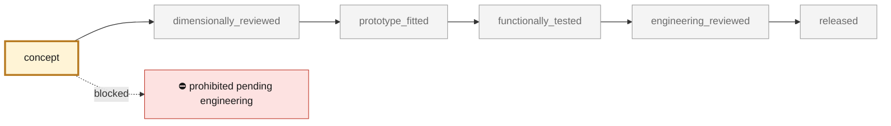
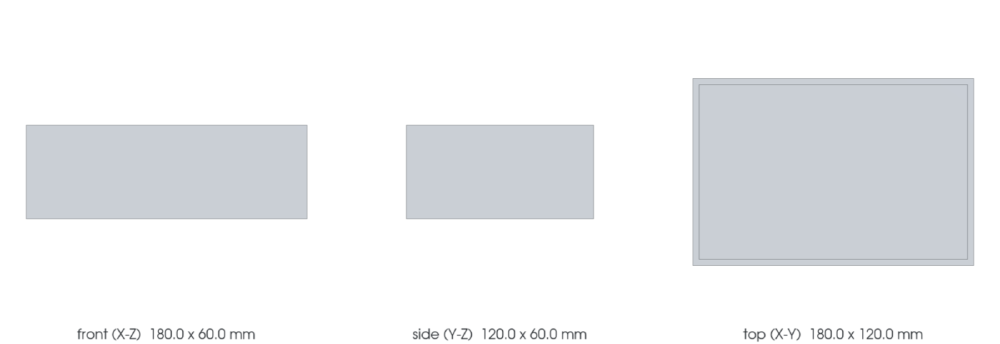

<!-- generated by scripts/render_part_pages.py - do not edit by hand -->

# 993 timing chain case and its lids

**`993-ENG-CHAIN-CASE-0001`** · Porsche 993 · 1994–1998

  

CAD view of the concept geometry — bounding box 180.0 × 120.0 × 60.0 mm. Not a photograph, not a manufactured part, not evidence of fit or function.

> [!CAUTION]
> **Prohibited pending engineering** — risk, or insufficient data. Never published as a released part. No part in this repository is released — read [SAFETY.md](../../SAFETY.md).

## What it is

Investigation target: the chain case from factory plate 103-05, its three lids, its oil bridges and its tensioner. The record establishes identity and material reasoning; it is neither a replacement geometry nor a manufacturing authorization. Selected because the factory catalogue triage makes it a serious consolidation case — and because the titanium grid rejects it three times.

## What it does on the car

Documentary investigation and process comparison; no manufacturing, no fitting, no start-up

## At a glance

| | |
|---|---|
| Porsche part numbers | 993 105 093 05, 964 105 094 04, 993 105 022 01, 964 105 107 01, 964 105 108 01, 993 107 087 51, 993 107 088 52, 993 107 088 00 |
| variants | `993_all_models_to_confirm_by_variant` |
| candidate material | unidentified |
| preferred process | undecided |
| safety class | `prohibited_pending_engineering` |
| validation status | `concept` |
| geometry | estimated, master build123d |

## Where it stands

*Validation ladder of `catalog/schemas/part.schema.json`; this record is at `concept`.*

## Views

*Orthographic views of the same CAD, with its bounding dimensions.*

## What's in this folder

| folder | what it holds | files |
|---|---|---|
| `derived/` | CAD exports generated from the source (STEP for CAD tools, STL for meshing) | [`derived/chain_case_concept_f0.step`](derived/chain_case_concept_f0.step) |
| `evidence/` | screens, reports and manifests — **pinned by SHA-256, never edited by hand** | [`evidence/concept-f0.json`](evidence/concept-f0.json) |
| `media/` | product views rendered from the CAD by `scripts/render_part_previews.py` | [`media/preview.json`](media/preview.json), [`media/preview.png`](media/preview.png), [`media/views.png`](media/views.png) |

## Read more

- **Full description page**, with sources and evidence: [docs/pieces/993-eng-chain-case-0001.md](../../docs/pieces/993-eng-chain-case-0001.md)
- **Catalogue record** (source of truth): [`catalog/parts/993-eng-chain-case-0001.json`](../../catalog/parts/993-eng-chain-case-0001.json)
- **Safety rules**: [SAFETY.md](../../SAFETY.md)

---

*This page is generated from the catalogue record by `scripts/render_part_pages.py` and checked by `make check`. Edit the record, not this page.*
