<!-- generated by scripts/render_part_pages.py - do not edit by hand -->

# Left chain case lid 964 105 107 01, Ti-6Al-4V variant

**`993-ENG-CHAIN-CASE-LID-TI-F0-0001`** · Porsche 993 · 1994–1998

  

> [!NOTE]
> **Functional** — loaded part whose failure can immobilize or damage the vehicle. Published only after documented functional testing. No part in this repository is released — read [SAFETY.md](../../SAFETY.md).

## What it is

Bolted, oil-tight left lid of the chain case, factory plate 103-05 position 15, paired with gasket 964 105 181 01. Remanufacture in machined Ti-6Al-4V explicitly requested. The original part is **cast magnesium**, whose failure mode is corrosion of the sealing faces: that is where titanium brings something, not on mass. Against magnesium, titanium is 2.45 times denser and loses both plate-bending trade-offs, strength included. One serious obstacle remains: the titanium/magnesium galvanic couple is the least favorable in the grid.

## What it does on the car

Parametric screening and measurement preparation; no manufacturing or fitting authorized before a specimen is measured

## At a glance

| | |
|---|---|
| Porsche part numbers | 964 105 107 01, 964 105 181 01 |
| variants | `993_split_by_variant_to_confirm` |
| candidate material | Ti-6Al-4V Grade 5, plate — deliberate choice |
| preferred process | CNC |
| safety class | `functional` |
| validation status | `concept` |
| geometry | estimated, master none |

## Where it stands

```mermaid
flowchart LR
    L0["concept"]
    L1["dimensionally_reviewed"]
    L2["prototype_fitted"]
    L3["functionally_tested"]
    L4["engineering_reviewed"]
    L5["released"]
    L0 --> L1 --> L2 --> L3 --> L4 --> L5
    classDef here fill:#fff4d6,stroke:#b7791f,color:#1a1a1a,stroke-width:3px;
    classDef done fill:#e3f1e6,stroke:#2e7d32,color:#1a1a1a;
    classDef todo fill:#f4f4f4,stroke:#9e9e9e,color:#6b6b6b;
    classDef stop fill:#fde2e1,stroke:#c0392b,color:#1a1a1a;
    class L0 here
    class L1 todo
    class L2 todo
    class L3 todo
    class L4 todo
    class L5 todo
```

*Validation ladder of `catalog/schemas/part.schema.json`; this record is at `concept`.*

## What's in this folder

| folder | what it holds | files |
|---|---|---|
| `evidence/` | screens, reports and manifests — **pinned by SHA-256, never edited by hand** | [`evidence/parametric-screen.json`](evidence/parametric-screen.json) |
| `source/` | parametric source — the editable master that generates the geometry | [`source/chain_case_lid_screen.py`](source/chain_case_lid_screen.py) |

## Read more

- **Full description page**, with sources and evidence: [docs/pieces/993-eng-chain-case-lid-ti-f0-0001.md](../../docs/pieces/993-eng-chain-case-lid-ti-f0-0001.md)
- **Catalogue record** (source of truth): [`catalog/parts/993-eng-chain-case-lid-ti-f0-0001.json`](../../catalog/parts/993-eng-chain-case-lid-ti-f0-0001.json)
- **Design dossier**: [993_COUVERCLE_CARTER_CHAINE_TI](../../docs/993/993_COUVERCLE_CARTER_CHAINE_TI.md)
- **Safety rules**: [SAFETY.md](../../SAFETY.md)

---

*This page is generated from the catalogue record by `scripts/render_part_pages.py` and checked by `make check`. Edit the record, not this page.*
