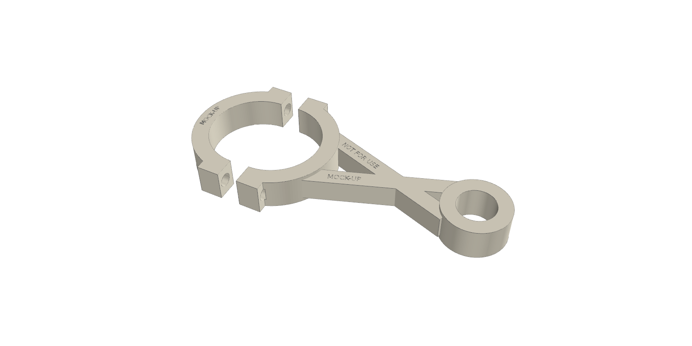
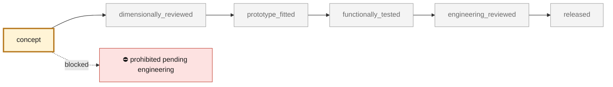

<!-- generated by scripts/render_part_pages.py - do not edit by hand -->

# 993/993 Turbo connecting rod, Ti64 F0 topology concept

**`993-ENG-CONNECTING-ROD-TI64-F0-0001`** · Porsche 993 · 1993–1998

  

> [!WARNING]
> **A 1:1 display mock-up is printable — never for use.** [`print/`](print/README.md): the design, unchanged except for MOCK-UP / NOT FOR USE engraved in it, sliced in 4h 57m 5s (51.22 cm³). The part itself stays prohibited ([decision 0011](../../docs/decisions/0011-printable-display-mockups-of-prohibited-parts.md)).

> [!CAUTION]
> **Prohibited, not validated, and not a copy of the original.** The mock-up is a display piece; the model shown here is a
> design whose fit has not been checked against the car:
> - validation status `concept`: nothing has been checked against a real part;
> - geometry `mixed`: its dimensions are partly sourced, partly assumed, not measured on the original part;
> - safety class `prohibited_pending_engineering`;
> - no part in this repository is released — read [SAFETY.md](../../SAFETY.md).

<table><tr>
<td width="50%" valign="top">
<b>Original part</b>  
The original part is documented — pictures, catalogue entries or published data — on these pages. They are copyrighted, so they are linked here, not copied:  
↗ <a href="https://www.tzr-motorsport.de/993-230-580-1270F">TZR Motorsport - manufacturer dimensions of the PAUTER 993/993 Turbo connecting rod</a> 
↗ <a href="https://porschefanatics.com/engine/993/">PorscheFanatics - titanium connecting rods for the 993 engine</a> 
↗ <a href="https://www.elferclassic.de/technik/techdaten/993-turbo-95-98-techdat.php">elferclassic - 993 Turbo technical data</a> 
</td>
<td width="50%" valign="top" align="center">
<b>What you can print: a display mock-up</b>  
 
1:1 display mock-up with MOCK-UP / NOT FOR USE engraved in it. <b>Never</b> for an engine; not the original part.
</td>
</tr></table>

> [!CAUTION]
> **Prohibited pending engineering** — risk, or insufficient data. Never published as a released part.

## What it is

Independent two-open-flange concept to screen an LPBF Ti-6Al-4V connecting rod. The key dimensions come from a PAUTER/TZR record; outer diameters, flanges, cap split and bolt passages remain F0 assumptions with no commercial surface reused.

## What it does on the car

CAD, DfAM, mass, synthetic loads, nominal stresses and buckling screening only; no manufacturing, installation or engine start-up authorized

## At a glance

| | |
|---|---|
| Porsche part numbers | not recorded |
| variants | 993, `993_Turbo`, `M64_60_research` |
| candidate material | Ti-6Al-4V Grade 5 LPBF for screening |
| candidate process | LPBF |
| safety class | `prohibited_pending_engineering` |
| validation status | `concept` |
| geometry | mixed, master build123d |

## Where it stands

*Validation ladder of `catalog/schemas/part.schema.json`; this record is at `concept`.*

## Views

*Orthographic views of the same concept CAD, with its bounding dimensions — not drawings of the original part.*

## Screens and evidence images

*`print/mockup.png` — a screening output, not a validation.*

## What's in this folder

| folder | what it holds | files |
|---|---|---|
| `derived/` | CAD exports generated from the source (STEP for CAD tools, STL for meshing) | [`derived/connecting_rod_ti64_f0-picogk.json`](derived/connecting_rod_ti64_f0-picogk.json), [`derived/connecting_rod_ti64_f0-picogk.stl`](derived/connecting_rod_ti64_f0-picogk.stl), [`derived/connecting_rod_ti64_f0.step`](derived/connecting_rod_ti64_f0.step), [`derived/connecting_rod_ti64_f0.stl`](derived/connecting_rod_ti64_f0.stl) |
| `evidence/` | screens, reports and manifests — **pinned by SHA-256, never edited by hand** | [`evidence/engineering-screen.json`](evidence/engineering-screen.json) |
| `media/` | concept-model views rendered from the CAD by `scripts/render_part_previews.py` — not pictures of the original | [`media/preview.json`](media/preview.json), [`media/preview.png`](media/preview.png), [`media/views.png`](media/views.png) |
| `print/` | **ready-to-print files**: 3MF project, STL and instructions | [`print/connecting_rod_f0_mockup.3mf`](print/connecting_rod_f0_mockup.3mf), [`print/connecting_rod_f0_mockup.step`](print/connecting_rod_f0_mockup.step), [`print/connecting_rod_f0_mockup.stl`](print/connecting_rod_f0_mockup.stl), [`print/mockup.png`](print/mockup.png), [`print/print.json`](print/print.json) |
| `source/` | parametric source — the editable master that generates the geometry | [`source/connecting_rod.py`](source/connecting_rod.py), [`source/export_mockup.py`](source/export_mockup.py), [`source/picogk.json`](source/picogk.json), [`source/render_mockup.py`](source/render_mockup.py) |

## Read more

- **Full description page**, with sources and evidence: [docs/pieces/993-eng-connecting-rod-ti64-f0-0001.md](../../docs/pieces/993-eng-connecting-rod-ti64-f0-0001.md)
- **Catalogue record** (source of truth): [`catalog/parts/993-eng-connecting-rod-ti64-f0-0001.json`](../../catalog/parts/993-eng-connecting-rod-ti64-f0-0001.json)
- **Design dossier**: [993_K16_ROD_IMPROVEMENT_PROGRAMME](../../docs/993/993_K16_ROD_IMPROVEMENT_PROGRAMME.md)
- **Safety rules**: [SAFETY.md](../../SAFETY.md)

---

*This page is generated from the catalogue record by `scripts/render_part_pages.py` and checked by `make check`. Edit the record, not this page.*
