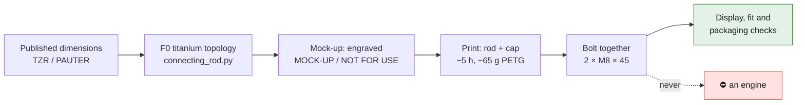

# Print it: connecting rod F0, 1:1 display and fit mock-up

*The mock-up as it lies on the build plate: rod and cap side by side, "MOCK-UP"
and "NOT FOR USE" engraved 0.6 mm deep on the struts and the cap.*

> [!CAUTION]
> **Display and fit mock-up only — never for an engine.** The connecting rod is
> `prohibited_pending_engineering` (SAFETY.md). A polymer rod would fail at the
> first turn of a crankshaft, and even the titanium design has not been through
> an engineering review. The warning is engraved in the part itself, so the
> printed object cannot be taken for a real rod ([decision 0011](../../../docs/decisions/0011-printable-display-mockups-of-prohibited-parts.md)).

This is the most complex part the repository designed that you can hold: the
F0 Ti-6Al-4V topology rod, printed at 1:1 from its unchanged master, with a
split cap that bolts back on.

| dimension | value | where it comes from |
|---|---|---|
| center distance | 127.0 mm | published by TZR/PAUTER for the 993 rod |
| big-end bore | 58.0 mm (published housing 58.01) | TZR/PAUTER |
| small-end bore | 23.02 mm (published pin 23.01) | TZR/PAUTER |
| big-end / small-end width | 18.75 / 19.58 mm | TZR/PAUTER |
| truss topology, 78 mm big end, bolt lugs | — | **the repository's own F0 design**; no PAUTER shape is reproduced |

## Files

| file | use |
|---|---|
| [`connecting_rod_f0_mockup.3mf`](connecting_rod_f0_mockup.3mf) | **open this** in PrusaSlicer: rod and cap placed, supports and settings set |
| [`connecting_rod_f0_mockup.stl`](connecting_rod_f0_mockup.stl) | both bodies, for any slicer |
| [`connecting_rod_f0_mockup.step`](connecting_rod_f0_mockup.step) | the engraved mock-up as CAD |
| [`print.json`](print.json) | provenance: master file and its SHA-256, engraving, slicing result |

Regenerate with `source/export_mockup.py`, render with `source/render_mockup.py`
(cadsim image).

## Settings

Sliced with PrusaSlicer on a generic 0.4 mm nozzle: **4 h 57 min, 51.2 cm³**
(≈ 65 g of PETG).

| setting | value | why |
|---|---|---|
| material | PETG or PLA (it is a display piece) | |
| layer height | 0.2 mm | |
| perimeters | 4 | stiff struts |
| infill | 30 % | |
| supports | **auto, build plate only** | the small end (19.58 mm) is thicker than the big end (18.75) and the struts (14), so the rod lies on its small end and the rest sits 0.4–2.8 mm up on supports |
| brim | 3 mm | long, thin part |
| temperatures | PETG 240–245 °C, bed 80 °C | |

## Assemble

Two **M8 × 45** bolts and nuts, through the 8.4 mm holes in the lugs: 30 mm of
lug plus the 0.4 mm split gap of the design. Snug only — it is plastic.

## What this is, and is not

- It **is** the repository's F0 design, 1:1: useful to see and hold the
  topology, to check packaging around a crank or in a display, and to compare
  with the steel rod.
- It is **not** a connecting rod. It is not the titanium part, it has no
  bearing shells, and its design has not been reviewed. The record stays
  `prohibited_pending_engineering` and `concept`.
