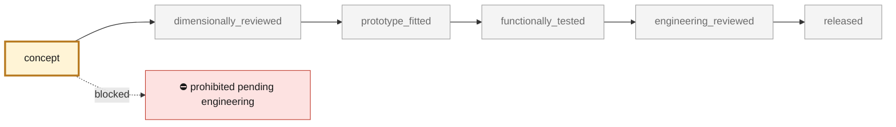

<!-- generated by scripts/render_part_pages.py - do not edit by hand -->

# Engine cooling fan impeller, rotating AlSi10Mg concept F0

**`993-ENG-COOLING-IMPELLER-ALSI10MG-F0-0001`** · Porsche 993 · 1994–1998

  

CAD view of the concept geometry — bounding box 280.0 × 280.0 × 30.0 mm. Not a photograph, not a manufactured part, not evidence of fit or function.

> [!CAUTION]
> **Prohibited pending engineering** — risk, or insufficient data. Never published as a released part. No part in this repository is released — read [SAFETY.md](../../SAFETY.md).

## What it is

Independent concept of a one-piece impeller combining hub, twelve swept blades and a peripheral ring. PorscheFanatics and resellers establish part number 964 106 015 31, a commercial envelope, two consistent masses and an aluminum claim, but no functional geometry. The assembly test explicitly rejects the interference with the previous F0 housing.

## What it does on the car

F0 screening of open CAD, DfAM value, mass, overspeed, centrifugal stress, modal, target flow, thermal and compatibility with the F0 housing; no manufacture, rotation, installation or start-up authorized

## At a glance

| | |
|---|---|
| Porsche part numbers | 96410601531 |
| variants | `993_Carrera_fitment_to_confirm`, `964_shared_component` |
| candidate material | EOS Aluminium AlSi10Mg T6 for comparison |
| preferred process | undecided |
| safety class | `prohibited_pending_engineering` |
| validation status | `concept` |
| geometry | mixed, master build123d |

## Where it stands

*Validation ladder of `catalog/schemas/part.schema.json`; this record is at `concept`.*

## Views

*Orthographic views of the same CAD, with its bounding dimensions.*

## What's in this folder

| folder | what it holds | files |
|---|---|---|
| `derived/` | CAD exports generated from the source (STEP for CAD tools, STL for meshing) | [`derived/cooling_impeller_alsi10mg_f0.step`](derived/cooling_impeller_alsi10mg_f0.step), [`derived/cooling_impeller_alsi10mg_f0.stl`](derived/cooling_impeller_alsi10mg_f0.stl) |
| `evidence/` | screens, reports and manifests — **pinned by SHA-256, never edited by hand** | [`evidence/engineering-screen.json`](evidence/engineering-screen.json) |
| `media/` | product views rendered from the CAD by `scripts/render_part_previews.py` | [`media/preview.json`](media/preview.json), [`media/preview.png`](media/preview.png), [`media/views.png`](media/views.png) |
| `source/` | parametric source — the editable master that generates the geometry | [`source/cooling_impeller.py`](source/cooling_impeller.py) |

## Read more

- **Full description page**, with sources and evidence: [docs/pieces/993-eng-cooling-impeller-alsi10mg-f0-0001.md](../../docs/pieces/993-eng-cooling-impeller-alsi10mg-f0-0001.md)
- **Catalogue record** (source of truth): [`catalog/parts/993-eng-cooling-impeller-alsi10mg-f0-0001.json`](../../catalog/parts/993-eng-cooling-impeller-alsi10mg-f0-0001.json)
- **Design dossier**: [993_COOLING_IMPELLER_ALSI10MG_F0](../../docs/993/993_COOLING_IMPELLER_ALSI10MG_F0.md)
- **Design dossier**: [993_ENGINE_COOLING_FAN_SYSTEM_F0](../../docs/993/993_ENGINE_COOLING_FAN_SYSTEM_F0.md)
- **Digital twin record**: [`twin-993-engine-cooling-fan-system-f0.json`](../../catalog/twins/twin-993-engine-cooling-fan-system-f0.json) — see [twins/README.md](../../twins/README.md)
- **Safety rules**: [SAFETY.md](../../SAFETY.md)

---

*This page is generated from the catalogue record by `scripts/render_part_pages.py` and checked by `make check`. Edit the record, not this page.*
