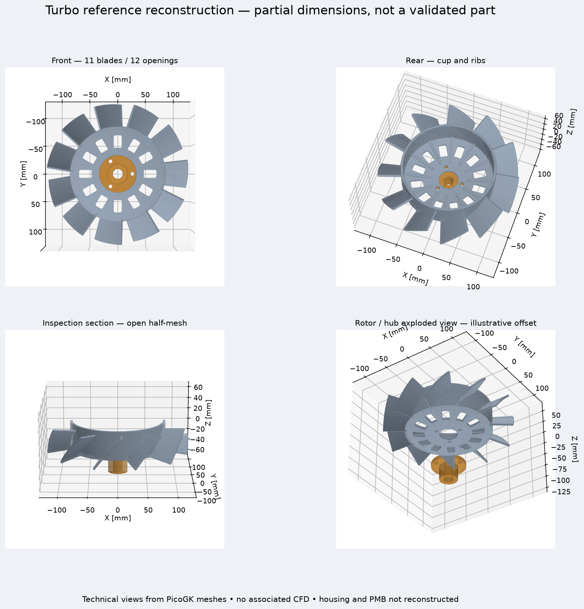
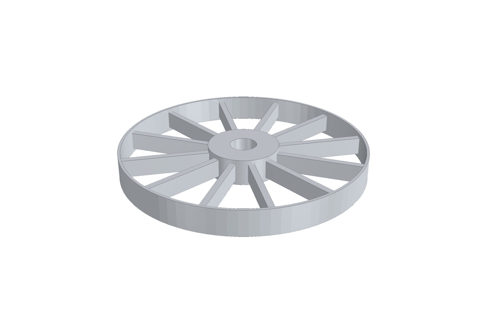
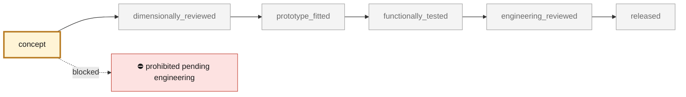
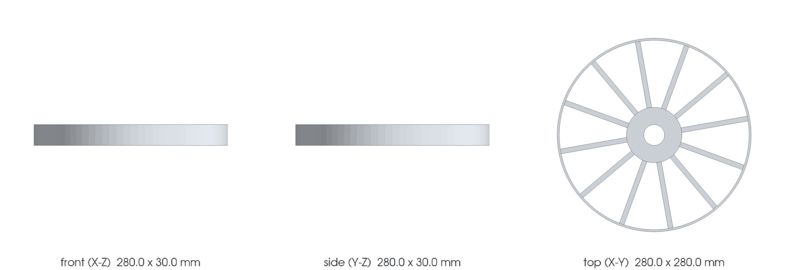

<!-- generated by scripts/render_part_pages.py - do not edit by hand -->

# 993 engine cooling fan — archived Carrera F0 concept

**`993-ENG-COOLING-IMPELLER-ALSI10MG-F0-0001`** · Porsche 993 · 1994–1998

  

## The project has been rebuilt

**The F0 model below is archived.** The new study targets the Turbo M64.60 assembly and PMB 240 A alternator; it does not turn this Carrera record into a validated Turbo part.

[Project presentation on PorscheFanatics](https://porschefanatics.com/projects/993-turbo-fan/) · [Reconstruction dossier (French)](../../twins/993-engine-cooling-fan-system-f0/REFERENCE_REBUILD.md) · [OpenUSD model](../../twins/993-engine-cooling-fan-system-f0/results/reference/reference.usdz)

*New PicoGK geometry: 11 blades, 12 openings, a ribbed cup and separate hub. Meshes checked; dimensions partial, hub compatibility disputed, housing and PMB still to be reconstructed. No validated airflow or engine fitment.*

## Archived Carrera F0 concept

> [!CAUTION]
> **Not ready to print, and not a copy of the original part.** The model shown here is a
> concept block for studying the part in software:
> - validation status `concept`: nothing has been checked against a real part;
> - geometry `mixed`: its dimensions are partly sourced, partly assumed, not measured on the original part;
> - safety class `prohibited_pending_engineering`;
> - no part in this repository is released — read [SAFETY.md](../../SAFETY.md).

<table><tr>
<td width="50%" valign="top">
<b>Original part</b>  
The original part is documented — pictures, catalogue entries or published data — on these pages. They are copyrighted, so they are linked here, not copied:  
↗ <a href="https://porschefanatics.com/parts/c/cooling/">PorscheFanatics - 964/993 engine cooling fan impeller</a> 
↗ <a href="https://www.fvd.net/de-ch/shop/laufrad-964-89-94-993-94-98-96410601531~p252655">FVD Brombacher - 964/993 impeller 964 106 015 31</a> 
↗ <a href="https://www.boutiqueporschepoitiers.fr/produit/96410601531-turbine-de-refroidissement-moteur-porsche/">Centre Service Porsche Poitiers - impeller 964 106 015 31</a> 
↗ <a href="https://partworks.de/Original-fan-wheel-for-Porsche-964-993-Carrera-96410601531">Partworks - 964/993 impeller declared as aluminum</a> 
</td>
<td width="50%" valign="top" align="center">
<b>This repository's concept model</b>  
 
Concept CAD block, 280.0 × 280.0 × 30.0 mm — <b>not</b> the original part, not a print file, not evidence of fit.
</td>
</tr></table>

> [!CAUTION]
> **Prohibited pending engineering** — risk, or insufficient data. Never published as a released part.

## What it is

This folder preserves the exploratory Carrera F0 concept: twelve swept blades, a simplified hub and a peripheral ring. Its synthetic 280 mm geometry does not reproduce the Porsche rotor, and integration with the F0 housing fails. It is no longer the baseline for the current design. The separate reconstruction dated 28 September 2026 studies the 993 Turbo M64.60: an eleven-blade 96410601522 rotor, ventilated cup, ribs and separate hub, targeting a PMB / Classic Retrofit 240 A alternator. This reconstruction remains partial: its interfaces, airflow, material and mechanical integrity are not validated.

## What it does on the car

F0 screening of open CAD, DfAM value, mass, overspeed, centrifugal stress, modal, target flow, thermal and compatibility with the F0 housing; no manufacture, rotation, installation or start-up authorized

## At a glance

| | |
|---|---|
| Porsche part numbers | 96410601531 |
| variants | `993_Carrera_fitment_to_confirm`, `964_shared_component` |
| candidate material | EOS Aluminium AlSi10Mg T6 for comparison |
| candidate process | undecided |
| safety class | `prohibited_pending_engineering` |
| validation status | `concept` |
| geometry | mixed, master build123d |

## Where it stands

*Validation ladder of `catalog/schemas/part.schema.json`; this record is at `concept`.*

## Views

*Orthographic views of the same concept CAD, with its bounding dimensions — not drawings of the original part.*

## What's in this folder

| folder | what it holds | files |
|---|---|---|
| `derived/` | CAD exports generated from the source (STEP for CAD tools, STL for meshing) | [`derived/cooling_impeller_alsi10mg_f0.step`](derived/cooling_impeller_alsi10mg_f0.step), [`derived/cooling_impeller_alsi10mg_f0.stl`](derived/cooling_impeller_alsi10mg_f0.stl) |
| `evidence/` | screens, reports and manifests — **pinned by SHA-256, never edited by hand** | [`evidence/engineering-screen.json`](evidence/engineering-screen.json) |
| `media/` | concept-model views rendered from the CAD by `scripts/render_part_previews.py` — not pictures of the original | [`media/preview.json`](media/preview.json), [`media/preview.png`](media/preview.png), [`media/views.png`](media/views.png) |
| `source/` | parametric source — the editable master that generates the geometry | [`source/cooling_impeller.py`](source/cooling_impeller.py) |

## Read more

- **Full description page**, with sources and evidence: [docs/pieces/993-eng-cooling-impeller-alsi10mg-f0-0001.md](../../docs/pieces/993-eng-cooling-impeller-alsi10mg-f0-0001.md)
- **Catalogue record** (source of truth): [`catalog/parts/993-eng-cooling-impeller-alsi10mg-f0-0001.json`](../../catalog/parts/993-eng-cooling-impeller-alsi10mg-f0-0001.json)
- **Design dossier**: [993_COOLING_IMPELLER_ALSI10MG_F0](../../docs/993/993_COOLING_IMPELLER_ALSI10MG_F0.md)
- **Design dossier**: [993_ENGINE_COOLING_FAN_SYSTEM_F0](../../docs/993/993_ENGINE_COOLING_FAN_SYSTEM_F0.md)
- **Digital twin record**: [`twin-993-engine-cooling-fan-system-f0.json`](../../catalog/twins/twin-993-engine-cooling-fan-system-f0.json) — see [twins/README.md](../../twins/README.md)
- **Safety rules**: [SAFETY.md](../../SAFETY.md)

---

*This page is generated from the catalogue record by `scripts/render_part_pages.py` and checked by `make check`. Edit the record, not this page.*
