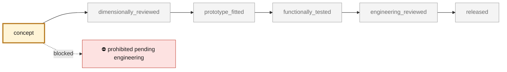

<!-- generated by scripts/render_part_pages.py - do not edit by hand -->

# Engine cooling fan impeller, high-flow shrouded WE43 magnesium concept F1

**`993-ENG-COOLING-IMPELLER-WE43-F1-0001`** · Porsche 993 · 1994–1998

  

> [!CAUTION]
> **Not ready to print, and not a copy of the original part.** The model shown here is a
> concept block for studying the part in software:
> - validation status `concept`: nothing has been checked against a real part;
> - geometry `estimated`: its dimensions are estimated design variables, not measured on the original part;
> - safety class `prohibited_pending_engineering`;
> - no part in this repository is released — read [SAFETY.md](../../SAFETY.md).

<table><tr>
<td width="50%" valign="top">
<b>Original part</b>  
The original part is documented — pictures, catalogue entries or published data — on these pages. They are copyrighted, so they are linked here, not copied:  
↗ <a href="https://porschefanatics.com/parts/c/cooling/">PorscheFanatics - 964/993 engine cooling fan impeller</a> 
↗ <a href="https://impact.ornl.gov/en/publications/additive-manufacturing-of-dense-we43-mg-alloy-by-laser-powder-bed/">Additive manufacturing of dense WE43 Mg alloy by laser powder bed fusion (Hyer et al., 2020)</a> 
↗ <a href="https://www.azom.com/article.aspx?ArticleID=9279">AZoM - Magnesium Elektron WE43 alloy properties</a> 
↗ <a href="https://www.apworks.de/scalmalloy">APWORKS - Scalmalloy</a> 
</td>
<td width="50%" valign="top" align="center">
<b>This repository's concept model</b>  
 
Concept CAD block, 248.0 × 248.0 × 30.0 mm — <b>not</b> the original part, not a print file, not evidence of fit.
</td>
</tr></table>

> [!CAUTION]
> **Prohibited pending engineering** — risk, or insufficient data. Never published as a released part.

## What it is

High-flow iteration of the F0 impeller. It replaces F0's twelve flat radial paddles with eleven twisted, cambered airfoil blades designed from velocity triangles, ties their tips to a rotating shroud with a two-tooth labyrinth, carries their roots on a 120 mm thin-walled cup hub, shrinks to 248 mm so it clears the F0 housing's 252 mm throat and fits the EOS M 290 plate, and moves to LPBF WE43 magnesium. A one-dimensional blade-element model with radial equilibrium, on the synthetic F0 engine resistance, estimates about 19 % more flow than a conventional reference rotor at the same speed. This is a model estimate on synthetic inputs, not a measurement and not a comparison with the original Porsche part.

## What it does on the car

F1 design study: airfoil blade design, one-dimensional fan-curve simulation against the synthetic engine resistance, lighter-alloy comparison and F0 housing fit; no manufacture, rotation, installation or start-up authorized

## At a glance

| | |
|---|---|
| Porsche part numbers | 96410601531 |
| variants | `993_Carrera_fitment_to_confirm`, `964_shared_component` |
| candidate material | WE43 LPBF, solutionized and aged, for comparison |
| candidate process | LPBF |
| safety class | `prohibited_pending_engineering` |
| validation status | `concept` |
| geometry | estimated, master build123d |

## Where it stands

*Validation ladder of `catalog/schemas/part.schema.json`; this record is at `concept`.*

## Views

*Orthographic views of the same concept CAD, with its bounding dimensions — not drawings of the original part.*

## Screens and evidence images

*`evidence/fan-curves.png` — a screening output, not a validation.*

*`evidence/flat-fan-sizing-f2.png` — a screening output, not a validation.*

## What's in this folder

| folder | what it holds | files |
|---|---|---|
| `derived/` | CAD exports generated from the source (STEP for CAD tools, STL for meshing) | [`derived/cooling_impeller_we43_f1.step`](derived/cooling_impeller_we43_f1.step), [`derived/cooling_impeller_we43_f1.stl`](derived/cooling_impeller_we43_f1.stl) |
| `evidence/` | screens, reports and manifests — **pinned by SHA-256, never edited by hand** | [`evidence/engineering-screen.json`](evidence/engineering-screen.json), [`evidence/fan-curves.png`](evidence/fan-curves.png), [`evidence/flat-fan-sizing-f2.json`](evidence/flat-fan-sizing-f2.json), [`evidence/flat-fan-sizing-f2.png`](evidence/flat-fan-sizing-f2.png) |
| `media/` | concept-model views rendered from the CAD by `scripts/render_part_previews.py` — not pictures of the original | [`media/preview.json`](media/preview.json), [`media/preview.png`](media/preview.png), [`media/views.png`](media/views.png) |
| `source/` | parametric source — the editable master that generates the geometry | [`source/cooling_impeller_f1.py`](source/cooling_impeller_f1.py), [`source/flat_fan_sizing_f2.py`](source/flat_fan_sizing_f2.py) |

## Read more

- **Full description page**, with sources and evidence: [docs/pieces/993-eng-cooling-impeller-we43-f1-0001.md](../../docs/pieces/993-eng-cooling-impeller-we43-f1-0001.md)
- **Catalogue record** (source of truth): [`catalog/parts/993-eng-cooling-impeller-we43-f1-0001.json`](../../catalog/parts/993-eng-cooling-impeller-we43-f1-0001.json)
- **Design dossier**: [993_COOLING_IMPELLER_WE43_F1](../../docs/993/993_COOLING_IMPELLER_WE43_F1.md)
- **Design dossier**: [993_FAN_STATOR_ALSI10MG_F1](../../docs/993/993_FAN_STATOR_ALSI10MG_F1.md)
- **Design dossier**: [993_FLAT_FAN_SIZING_F2](../../docs/993/993_FLAT_FAN_SIZING_F2.md)
- **Design dossier**: [993_K16_ROD_IMPROVEMENT_PROGRAMME](../../docs/993/993_K16_ROD_IMPROVEMENT_PROGRAMME.md)
- **Safety rules**: [SAFETY.md](../../SAFETY.md)

---

*This page is generated from the catalogue record by `scripts/render_part_pages.py` and checked by `make check`. Edit the record, not this page.*
