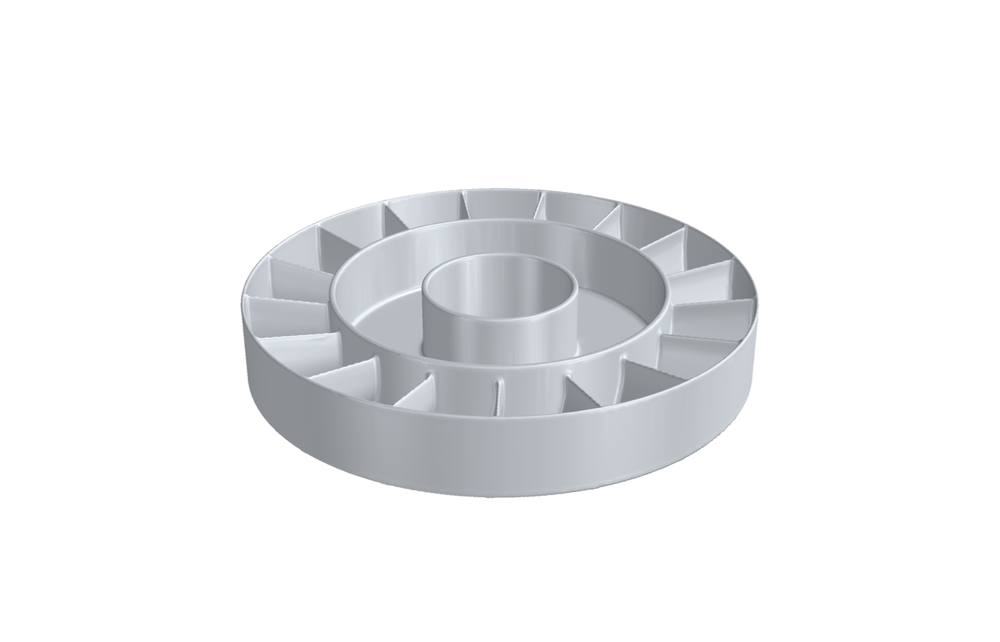
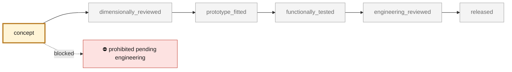
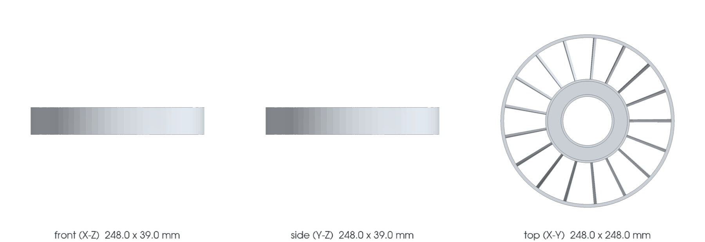

<!-- generated by scripts/render_part_pages.py - do not edit by hand -->

# Engine cooling fan guide-vane ring (stator), AlSi10Mg concept F1

**`993-ENG-FAN-STATOR-ALSI10MG-F1-0001`** · Porsche 993 · 1994–1998

  

> [!CAUTION]
> **Not ready to print, and not a copy of the original part.** The model shown here is a
> concept block for studying the part in software:
> - validation status `concept`: nothing has been checked against a real part;
> - geometry `estimated`: its dimensions are estimated design variables, not measured on the original part;
> - safety class `prohibited_pending_engineering`;
> - no part in this repository is released — read [SAFETY.md](../../SAFETY.md).

<table><tr>
<td width="50%" valign="top">
<b>Original part</b>  
<i>No public picture of the original part is recorded yet.</i>
</td>
<td width="50%" valign="top" align="center">
<b>This repository's concept model</b>  
 
Concept CAD block, 248.0 × 248.0 × 40.0 mm — <b>not</b> the original part, not a print file, not evidence of fit.
</td>
</tr></table>

> [!CAUTION]
> **Prohibited pending engineering** — risk, or insufficient data. Never published as a released part.

## What it is

Fixed ring of seventeen cambered guide vanes placed 15 mm behind the F1 WE43 impeller, in the same 165/245 mm annulus. The vanes turn the rotor's exit swirl back into pressure. Their angles are designed station by station from the F1 rotor's exit flow, and the vane count is the smallest that keeps the blade-pass interaction tone cut off in the duct. A one-dimensional model on the duty inferred from the rebuild of the original rotor estimates +5.3 % flow over the F1 rotor alone on 6 % less power, and about +10 % over the rebuild rotor on equal power. These are model estimates on visual hypotheses, not measurements.

## What it does on the car

F1 design study: guide-vane design from the F1 rotor exit flow, rotor-stator tone screen, vane modal and aero-load screens, printable envelope; no manufacture, installation or start-up authorized

## At a glance

| | |
|---|---|
| Porsche part numbers | not recorded |
| variants | `993_Carrera_fitment_to_confirm`, `964_shared_component` |
| candidate material | EOS Aluminium AlSi10Mg T6 for comparison |
| candidate process | LPBF |
| safety class | `prohibited_pending_engineering` |
| validation status | `concept` |
| geometry | estimated, master build123d |

## Where it stands

*Validation ladder of `catalog/schemas/part.schema.json`; this record is at `concept`.*

## Views

*Orthographic views of the same concept CAD, with its bounding dimensions — not drawings of the original part.*

## Screens and evidence images

*`evidence/lpbf-f0/993-eng-fan-stator-alsi10mg-f1-0001-lpbf-geometry-screen.png` — a screening output, not a validation.*

## What's in this folder

| folder | what it holds | files |
|---|---|---|
| `derived/` | CAD exports generated from the source (STEP for CAD tools, STL for meshing) | [`derived/fan_stator_alsi10mg_f1.step`](derived/fan_stator_alsi10mg_f1.step), [`derived/fan_stator_alsi10mg_f1.stl`](derived/fan_stator_alsi10mg_f1.stl) |
| `evidence/` | screens, reports and manifests — **pinned by SHA-256, never edited by hand** | [`evidence/engineering-screen.json`](evidence/engineering-screen.json), [`evidence/lpbf-f0/993-eng-fan-stator-alsi10mg-f1-0001-layer-metrics.csv`](evidence/lpbf-f0/993-eng-fan-stator-alsi10mg-f1-0001-layer-metrics.csv), [`evidence/lpbf-f0/993-eng-fan-stator-alsi10mg-f1-0001-lpbf-geometry-manifest.json`](evidence/lpbf-f0/993-eng-fan-stator-alsi10mg-f1-0001-lpbf-geometry-manifest.json), [`evidence/lpbf-f0/993-eng-fan-stator-alsi10mg-f1-0001-lpbf-geometry-report.json`](evidence/lpbf-f0/993-eng-fan-stator-alsi10mg-f1-0001-lpbf-geometry-report.json), [`evidence/lpbf-f0/993-eng-fan-stator-alsi10mg-f1-0001-lpbf-geometry-screen.png`](evidence/lpbf-f0/993-eng-fan-stator-alsi10mg-f1-0001-lpbf-geometry-screen.png) |
| `media/` | concept-model views rendered from the CAD by `scripts/render_part_previews.py` — not pictures of the original | [`media/preview.json`](media/preview.json), [`media/preview.png`](media/preview.png), [`media/views.png`](media/views.png) |
| `source/` | parametric source — the editable master that generates the geometry | [`source/fan_stator_f1.py`](source/fan_stator_f1.py) |

## Read more

- **Full description page**, with sources and evidence: [docs/pieces/993-eng-fan-stator-alsi10mg-f1-0001.md](../../docs/pieces/993-eng-fan-stator-alsi10mg-f1-0001.md)
- **Catalogue record** (source of truth): [`catalog/parts/993-eng-fan-stator-alsi10mg-f1-0001.json`](../../catalog/parts/993-eng-fan-stator-alsi10mg-f1-0001.json)
- **Design dossier**: [993_FAN_STATOR_ALSI10MG_F1](../../docs/993/993_FAN_STATOR_ALSI10MG_F1.md)
- **Design dossier**: [993_K16_ROD_IMPROVEMENT_PROGRAMME](../../docs/993/993_K16_ROD_IMPROVEMENT_PROGRAMME.md)
- **Safety rules**: [SAFETY.md](../../SAFETY.md)

---

*This page is generated from the catalogue record by `scripts/render_part_pages.py` and checked by `make check`. Edit the record, not this page.*
