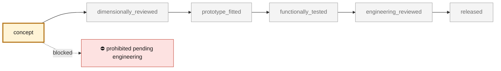

<!-- generated by scripts/render_part_pages.py - do not edit by hand -->

# 993 intake valve - F1 proxy and titanium variant

**`993-ENG-INTAKE-VALVE-F1-0001`** · Porsche 993 · 1994–1998

  

> [!CAUTION]
> **Not ready to print, and not a copy of the original part.** The model shown here is a
> concept block for studying the part in software:
> - validation status `concept`: nothing has been checked against a real part;
> - geometry `estimated`: its dimensions are estimated design variables, not measured on the original part;
> - safety class `prohibited_pending_engineering`;
> - no part in this repository is released — read [SAFETY.md](../../SAFETY.md).

<table><tr>
<td width="50%" valign="top">
<b>Original part</b>  
The original part is documented — pictures, catalogue entries or published data — on these pages. They are copyrighted, so they are linked here, not copied:  
↗ <a href="https://www.fvd.net/de/shop/einlassventil-49mm-993-94-95-turbo-95-98-m64-05-06-07-08-60-nicht-natrium-gekuehlt-99310540902eq1-99310540902~p306501">FVD - Declared 993 intake valve dimensions</a> 
</td>
<td width="50%" valign="top" align="center">
<b>This repository's concept model</b>  
 
Concept CAD block, 49.0 × 49.0 × 109.0 mm — <b>not</b> the original part, not a print file, not evidence of fit.
</td>
</tr></table>

> [!CAUTION]
> **Prohibited pending engineering** — risk, or insufficient data. Never published as a released part.

## What it is

Non-functional parametric proxy for comparing the envelope and mass of a 993 intake valve with a 49 mm head and 8 mm stem, with a Ti-6Al-4V variant explicitly limited to simulation.

## What it does on the car

Mass simulation, collision preparation and envelope check only

## At a glance

| | |
|---|---|
| Porsche part numbers | 99310540902 |
| variants | `993_C2`, `993_C4`, `993_Turbo` |
| candidate material | Ti-6Al-4V Grade 5 |
| candidate process | DMLS |
| safety class | `prohibited_pending_engineering` |
| validation status | `concept` |
| geometry | estimated, master build123d |

## Where it stands

*Validation ladder of `catalog/schemas/part.schema.json`; this record is at `concept`.*

## Views

*Orthographic views of the same concept CAD, with its bounding dimensions — not drawings of the original part.*

## What's in this folder

| folder | what it holds | files |
|---|---|---|
| `derived/` | CAD exports generated from the source (STEP for CAD tools, STL for meshing) | [`derived/993-intake-49-f1.step`](derived/993-intake-49-f1.step) |
| `media/` | concept-model views rendered from the CAD by `scripts/render_part_previews.py` — not pictures of the original | [`media/preview.json`](media/preview.json), [`media/preview.png`](media/preview.png), [`media/views.png`](media/views.png) |

## Read more

- **Full description page**, with sources and evidence: [docs/pieces/993-eng-intake-valve-f1-0001.md](../../docs/pieces/993-eng-intake-valve-f1-0001.md)
- **Catalogue record** (source of truth): [`catalog/parts/993-eng-intake-valve-f1-0001.json`](../../catalog/parts/993-eng-intake-valve-f1-0001.json)
- **Safety rules**: [SAFETY.md](../../SAFETY.md)

---

*This page is generated from the catalogue record by `scripts/render_part_pages.py` and checked by `make check`. Edit the record, not this page.*
