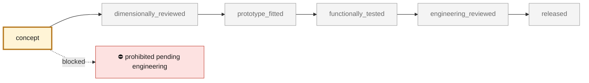

<!-- generated by scripts/render_part_pages.py - do not edit by hand -->

# K16 compressor wheel, Al2139 AM F1 iteration

**`993-ENG-K16-COMPRESSOR-WHEEL-AL2139-F1-0001`** · Porsche 993 · 1995–1998

  

> [!CAUTION]
> **Not ready to print, and not a copy of the original part.** The model shown here is a
> concept block for studying the part in software:
> - validation status `concept`: nothing has been checked against a real part;
> - geometry `mixed`: its dimensions are partly sourced, partly assumed, not measured on the original part;
> - safety class `prohibited_pending_engineering`;
> - no part in this repository is released — read [SAFETY.md](../../SAFETY.md).

<table><tr>
<td width="50%" valign="top">
<b>Original part</b>  
The original part is documented — pictures, catalogue entries or published data — on these pages. They are copyrighted, so they are linked here, not copied:  
↗ <a href="https://www.invasionautoproducts.com/94pocark16tu.html">Invasion Auto Products - declared internal data of the right-hand 993 Turbo K16</a> 
↗ <a href="https://porschefanatics.com/engine/993/">PorscheFanatics - context of 993 turbochargers and wheels</a> 
↗ <a href="https://github.com/cluster2600/porscheparts/blob/main/docs/993_K16_COMPRESSOR_WHEEL_ALSI10MG_F0.md">Project AlSi10Mg K16 wheel F0</a> 
↗ <a href="https://www.turbomaster.info/eng/turbocharger-map.php">TurboMaster - principles for reading a compressor map</a> 
</td>
<td width="50%" valign="top" align="center">
<b>This repository's concept model</b>  
 
Concept CAD block, 60.5 × 60.5 × 18.0 mm — <b>not</b> the original part, not a print file, not evidence of fit.
</td>
</tr></table>

> [!CAUTION]
> **Prohibited pending engineering** — risk, or insufficient data. Never published as a released part.

## What it is

Iteration of the rejected AlSi10Mg F0, with Al2139 AM and blades of variable root-to-tip thickness. The 40.6/60.5 mm diameters and the 6+6 blade count remain the only published geometric facts; the F1 passes three ambient algebraic screens without becoming a functional wheel.

## What it does on the car

F0-F1 loop for material and thickness choice, CAD, thermodynamics, rotating disk, centrifugal tension, overspeed, expansion and imbalance; no manufacturing, rotation, installation or start-up authorized

## At a glance

| | |
|---|---|
| Porsche part numbers | not recorded |
| variants | `993_Turbo`, `K16_right_research`, `M64_60_research` |
| candidate material | EOS Aluminium Al2139 AM, M290 60 µm, heat-treated condition, for comparison |
| candidate process | LPBF |
| safety class | `prohibited_pending_engineering` |
| validation status | `concept` |
| geometry | mixed, master build123d |

## Where it stands

*Validation ladder of `catalog/schemas/part.schema.json`; this record is at `concept`.*

## Views

*Orthographic views of the same concept CAD, with its bounding dimensions — not drawings of the original part.*

## Screens and evidence images

*`evidence/lpbf-f0/993-eng-k16-compressor-wheel-al2139-f1-0001-lpbf-geometry-screen.png` — a screening output, not a validation.*

## What's in this folder

| folder | what it holds | files |
|---|---|---|
| `derived/` | CAD exports generated from the source (STEP for CAD tools, STL for meshing) | [`derived/compressor_wheel_al2139_f1.step`](derived/compressor_wheel_al2139_f1.step), [`derived/compressor_wheel_al2139_f1.stl`](derived/compressor_wheel_al2139_f1.stl) |
| `evidence/` | screens, reports and manifests — **pinned by SHA-256, never edited by hand** | [`evidence/engineering-screen.json`](evidence/engineering-screen.json), [`evidence/lpbf-f0/993-eng-k16-compressor-wheel-al2139-f1-0001-layer-metrics.csv`](evidence/lpbf-f0/993-eng-k16-compressor-wheel-al2139-f1-0001-layer-metrics.csv), [`evidence/lpbf-f0/993-eng-k16-compressor-wheel-al2139-f1-0001-lpbf-geometry-manifest.json`](evidence/lpbf-f0/993-eng-k16-compressor-wheel-al2139-f1-0001-lpbf-geometry-manifest.json), [`evidence/lpbf-f0/993-eng-k16-compressor-wheel-al2139-f1-0001-lpbf-geometry-report.json`](evidence/lpbf-f0/993-eng-k16-compressor-wheel-al2139-f1-0001-lpbf-geometry-report.json), [`evidence/lpbf-f0/993-eng-k16-compressor-wheel-al2139-f1-0001-lpbf-geometry-screen.png`](evidence/lpbf-f0/993-eng-k16-compressor-wheel-al2139-f1-0001-lpbf-geometry-screen.png) |
| `media/` | concept-model views rendered from the CAD by `scripts/render_part_previews.py` — not pictures of the original | [`media/preview.json`](media/preview.json), [`media/preview.png`](media/preview.png), [`media/views.png`](media/views.png) |
| `source/` | parametric source — the editable master that generates the geometry | [`source/compressor_wheel_f1.py`](source/compressor_wheel_f1.py) |

## Read more

- **Full description page**, with sources and evidence: [docs/pieces/993-eng-k16-compressor-wheel-al2139-f1-0001.md](../../docs/pieces/993-eng-k16-compressor-wheel-al2139-f1-0001.md)
- **Catalogue record** (source of truth): [`catalog/parts/993-eng-k16-compressor-wheel-al2139-f1-0001.json`](../../catalog/parts/993-eng-k16-compressor-wheel-al2139-f1-0001.json)
- **Design dossier**: [993_K16_COMPRESSOR_WHEEL_AL2139_F1](../../docs/993/993_K16_COMPRESSOR_WHEEL_AL2139_F1.md)
- **Safety rules**: [SAFETY.md](../../SAFETY.md)

---

*This page is generated from the catalogue record by `scripts/render_part_pages.py` and checked by `make check`. Edit the record, not this page.*
