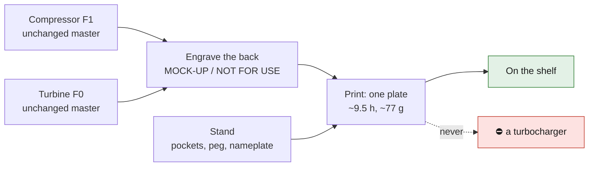

# Print it: K16 wheel pair on a display stand

*The two wheels seated on their stand: compressor (Al2139 F1 design) left,
turbine (IN718 F0 design) right.*

> [!CAUTION]
> **Display mock-ups only — never in a turbocharger.** Both wheels are
> `prohibited_pending_engineering` (SAFETY.md): the dossiers' synthetic
> operating point is 103,464 rpm, and neither design has been through an
> engineering review. A polymer copy would burst far below any such speed. **MOCK-UP / NOT FOR USE** is
> engraved into the back of each wheel and on the stand
> ([decision 0011](../../../docs/decisions/0011-printable-display-mockups-of-prohibited-parts.md)).

The wheels are the repository's own designs, printed at 1:1 from their
unchanged masters; only the engraving is added. The stand is a new display
piece designed for them: a pocket for each wheel's back, a peg in the
compressor's 6 mm bore, and an engraved nameplate.

| piece | from | size | print time | filament |
|---|---|---|---|---|
| compressor wheel | [`993-ENG-K16-COMPRESSOR-WHEEL-AL2139-F1-0001`](../README.md), unchanged master | Ø60.5 × 18 mm | 2 h 06 | 10.4 cm³ |
| turbine wheel | [`993-ENG-K16-TURBINE-WHEEL-IN718-F0-0001`](../../993-eng-k16-turbine-wheel-in718-f0-0001/README.md), unchanged master | Ø55 × 20 mm | 1 h 45 | 10.0 cm³ |
| stand | new display design | 150 × 95 × 8 mm | 5 h 35 | 39.8 cm³ |
| **everything on one plate** | | | **9 h 29** | **60.3 cm³ ≈ 77 g PETG** |

## Files

| file | use |
|---|---|
| [`k16_display_pair_plate.3mf`](k16_display_pair_plate.3mf) | **open this** in PrusaSlicer: stand and both wheels placed, supports and settings set |
| [`k16_display_pair_plate.stl`](k16_display_pair_plate.stl) · [`.step`](k16_display_pair_plate.step) | the same plate for any slicer, and as CAD |
| [`k16_compressor_wheel_mockup.stl`](k16_compressor_wheel_mockup.stl) | the compressor wheel alone |
| [`../../993-eng-k16-turbine-wheel-in718-f0-0001/print/k16_turbine_wheel_mockup.stl`](../../993-eng-k16-turbine-wheel-in718-f0-0001/print/k16_turbine_wheel_mockup.stl) | the turbine wheel alone |
| [`k16_display_stand.stl`](k16_display_stand.stl) | the stand alone |
| [`print.json`](print.json) | provenance: masters and their SHA-256, engraving, slicing |

Regenerate with `source/k16_display_pair.py`, render with
`source/render_k16_display.py` (cadsim image).

## Settings

| setting | value | why |
|---|---|---|
| material | PETG or PLA; silver for the compressor, bronze or grey for the turbine, black for the stand | it is a display |
| orientation | **as placed**: wheels on their backs, blades up; stand flat | the engraving is on the bed side |
| layer height | 0.15 mm (first 0.2 mm) | clean blade edges |
| perimeters / infill | 3 / 15 % | the stand does not need more |
| supports | **auto, build plate only** | the turbine's blade rim overhangs its back hub by 3 mm |

## What this is, and is not

- It **is** the repository's two K16 wheel designs, 1:1, side by side — the
  aluminum-alloy compressor and the nickel-superalloy turbine of the same
  turbocharger.
- It is **not** a turbocharger part, not the BorgWarner geometry, and not a
  validated design. Both records stay `prohibited_pending_engineering` and
  `concept`.
