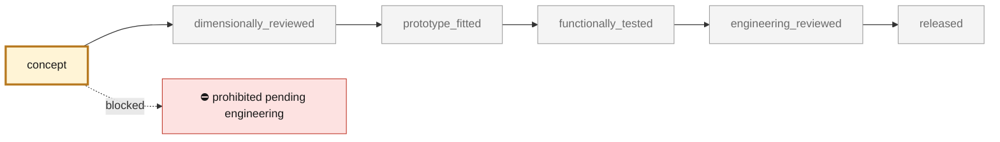
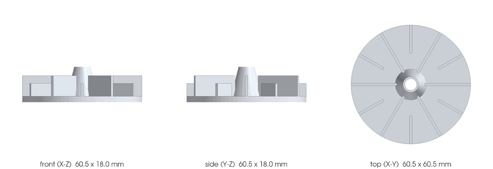
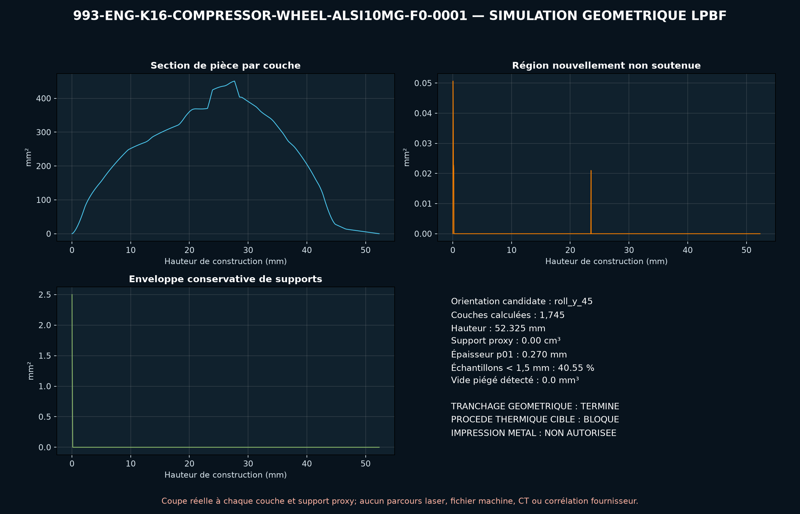

<!-- generated by scripts/render_part_pages.py - do not edit by hand -->

# 993 K16 compressor wheel, F0 AlSi10Mg LPBF concept

**`993-ENG-K16-COMPRESSOR-WHEEL-ALSI10MG-F0-0001`** · Porsche 993 · 1995–1998

  

CAD view of the concept geometry — bounding box 60.5 × 60.5 × 18.0 mm. Not a photograph, not a manufactured part, not evidence of fit or function.

> [!CAUTION]
> **Prohibited pending engineering** — risk, or insufficient data. Never published as a released part. No part in this repository is released — read [SAFETY.md](../../SAFETY.md).

## What it is

Independent concept of an AlSi10Mg compressor wheel with six main blades and six straight splitters. Only the inducer/exducer diameters, the 6+6 count and the supplier part numbers are published; the hub, the bore and all aerodynamic surfaces remain F0 hypotheses.

## What it does on the car

CAD, DfAM, continuity, compressor thermodynamics, rotating disk, blade tension, expansion, imbalance and energy screening; no manufacturing, rotation, installation or start-up authorized

## At a glance

| | |
|---|---|
| Porsche part numbers | not recorded |
| variants | `993_Turbo`, `K16_right_research`, `M64_60_research` |
| candidate material | EOS AlSi10Mg, screening |
| preferred process | LPBF |
| safety class | `prohibited_pending_engineering` |
| validation status | `concept` |
| geometry | mixed, master build123d |

## Where it stands

*Validation ladder of `catalog/schemas/part.schema.json`; this record is at `concept`.*

## Views

*Orthographic views of the same CAD, with its bounding dimensions.*

## Screens and evidence images

*`evidence/lpbf-f0/993-eng-k16-compressor-wheel-alsi10mg-f0-0001-lpbf-geometry-screen.png` — a screening output, not a validation.*

## What's in this folder

| folder | what it holds | files |
|---|---|---|
| `derived/` | CAD exports generated from the source (STEP for CAD tools, STL for meshing) | [`derived/compressor_wheel_alsi10mg_f0.step`](derived/compressor_wheel_alsi10mg_f0.step), [`derived/compressor_wheel_alsi10mg_f0.stl`](derived/compressor_wheel_alsi10mg_f0.stl) |
| `evidence/` | screens, reports and manifests — **pinned by SHA-256, never edited by hand** | [`evidence/engineering-screen.json`](evidence/engineering-screen.json), [`evidence/lpbf-f0/993-eng-k16-compressor-wheel-alsi10mg-f0-0001-layer-metrics.csv`](evidence/lpbf-f0/993-eng-k16-compressor-wheel-alsi10mg-f0-0001-layer-metrics.csv), [`evidence/lpbf-f0/993-eng-k16-compressor-wheel-alsi10mg-f0-0001-lpbf-geometry-manifest.json`](evidence/lpbf-f0/993-eng-k16-compressor-wheel-alsi10mg-f0-0001-lpbf-geometry-manifest.json), [`evidence/lpbf-f0/993-eng-k16-compressor-wheel-alsi10mg-f0-0001-lpbf-geometry-report.json`](evidence/lpbf-f0/993-eng-k16-compressor-wheel-alsi10mg-f0-0001-lpbf-geometry-report.json), [`evidence/lpbf-f0/993-eng-k16-compressor-wheel-alsi10mg-f0-0001-lpbf-geometry-screen.png`](evidence/lpbf-f0/993-eng-k16-compressor-wheel-alsi10mg-f0-0001-lpbf-geometry-screen.png) |
| `media/` | product views rendered from the CAD by `scripts/render_part_previews.py` | [`media/preview.json`](media/preview.json), [`media/preview.png`](media/preview.png), [`media/views.png`](media/views.png) |
| `source/` | parametric source — the editable master that generates the geometry | [`source/compressor_wheel.py`](source/compressor_wheel.py) |

## Read more

- **Full description page**, with sources and evidence: [docs/pieces/993-eng-k16-compressor-wheel-alsi10mg-f0-0001.md](../../docs/pieces/993-eng-k16-compressor-wheel-alsi10mg-f0-0001.md)
- **Catalogue record** (source of truth): [`catalog/parts/993-eng-k16-compressor-wheel-alsi10mg-f0-0001.json`](../../catalog/parts/993-eng-k16-compressor-wheel-alsi10mg-f0-0001.json)
- **Design dossier**: [993_K16_COMPRESSOR_WHEEL_ALSI10MG_F0](../../docs/993/993_K16_COMPRESSOR_WHEEL_ALSI10MG_F0.md)
- **Safety rules**: [SAFETY.md](../../SAFETY.md)

---

*This page is generated from the catalogue record by `scripts/render_part_pages.py` and checked by `make check`. Edit the record, not this page.*
