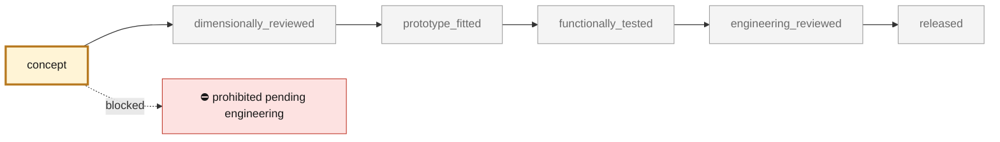

<!-- generated by scripts/render_part_pages.py - do not edit by hand -->

# K16 turbine wheel, IN718 F0 concept

**`993-ENG-K16-TURBINE-WHEEL-IN718-F0-0001`** · Porsche 993 · 1995–1998

  

CAD view of the concept geometry — bounding box 55.0 × 55.0 × 20.0 mm. Not a photograph, not a manufactured part, not evidence of fit or function.

> [!CAUTION]
> **Prohibited pending engineering** — risk, or insufficient data. Never published as a released part. No part in this repository is released — read [SAFETY.md](../../SAFETY.md).

## What it is

Clean-sheet concept of a twelve-blade K16 hot rotor to screen the value and limits of an IN718 LPBF route. The diameters, blade count and part reference come from supplier catalogues; all profiles and interfaces remain hypothetical.

## What it does on the car

F0 screening of CAD, rotation, overspeed, thermal, turbine power, expansion, imbalance and cycles; no manufacturing, rotation, installation or engine start authorized

## At a glance

| | |
|---|---|
| Porsche part numbers | not recorded |
| variants | `993_Turbo` |
| candidate material | EOS NickelAlloy IN718 API, M290 40 µm, heat treated for comparison |
| preferred process | undecided |
| safety class | `prohibited_pending_engineering` |
| validation status | `concept` |
| geometry | mixed, master build123d |

## Where it stands

*Validation ladder of `catalog/schemas/part.schema.json`; this record is at `concept`.*

## Views

*Orthographic views of the same CAD, with its bounding dimensions.*

## Screens and evidence images

*`evidence/lpbf-f0/993-eng-k16-turbine-wheel-in718-f0-0001-lpbf-geometry-screen.png` — a screening output, not a validation.*

## What's in this folder

| folder | what it holds | files |
|---|---|---|
| `derived/` | CAD exports generated from the source (STEP for CAD tools, STL for meshing) | [`derived/turbine_wheel_in718_f0.step`](derived/turbine_wheel_in718_f0.step), [`derived/turbine_wheel_in718_f0.stl`](derived/turbine_wheel_in718_f0.stl) |
| `evidence/` | screens, reports and manifests — **pinned by SHA-256, never edited by hand** | [`evidence/engineering-screen.json`](evidence/engineering-screen.json), [`evidence/lpbf-f0/993-eng-k16-turbine-wheel-in718-f0-0001-layer-metrics.csv`](evidence/lpbf-f0/993-eng-k16-turbine-wheel-in718-f0-0001-layer-metrics.csv), [`evidence/lpbf-f0/993-eng-k16-turbine-wheel-in718-f0-0001-lpbf-geometry-manifest.json`](evidence/lpbf-f0/993-eng-k16-turbine-wheel-in718-f0-0001-lpbf-geometry-manifest.json), [`evidence/lpbf-f0/993-eng-k16-turbine-wheel-in718-f0-0001-lpbf-geometry-report.json`](evidence/lpbf-f0/993-eng-k16-turbine-wheel-in718-f0-0001-lpbf-geometry-report.json), [`evidence/lpbf-f0/993-eng-k16-turbine-wheel-in718-f0-0001-lpbf-geometry-screen.png`](evidence/lpbf-f0/993-eng-k16-turbine-wheel-in718-f0-0001-lpbf-geometry-screen.png) |
| `media/` | product views rendered from the CAD by `scripts/render_part_previews.py` | [`media/preview.json`](media/preview.json), [`media/preview.png`](media/preview.png), [`media/views.png`](media/views.png) |
| `source/` | parametric source — the editable master that generates the geometry | [`source/turbine_wheel.py`](source/turbine_wheel.py) |

## Read more

- **Full description page**, with sources and evidence: [docs/pieces/993-eng-k16-turbine-wheel-in718-f0-0001.md](../../docs/pieces/993-eng-k16-turbine-wheel-in718-f0-0001.md)
- **Catalogue record** (source of truth): [`catalog/parts/993-eng-k16-turbine-wheel-in718-f0-0001.json`](../../catalog/parts/993-eng-k16-turbine-wheel-in718-f0-0001.json)
- **Design dossier**: [993_K16_TURBINE_WHEEL_IN718_F0](../../docs/993/993_K16_TURBINE_WHEEL_IN718_F0.md)
- **Safety rules**: [SAFETY.md](../../SAFETY.md)

---

*This page is generated from the catalogue record by `scripts/render_part_pages.py` and checked by `make check`. Edit the record, not this page.*
